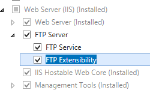
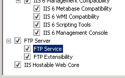
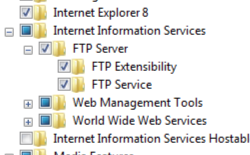

FTP Data Channel Security &lt;dataChannelSecurity&gt;
====================

## Overview

The File Transfer Protocol (FTP) supports a feature that is called server-to-server or third-party transfers. In this scenario, an FTP client connects and authenticates to two servers, and then instructs one server to send data and instructs another server to receive data. This mode of operation is not secure because the two servers cannot authenticate each another.

By default, the FTP 7 service enforces that the data and control channel for a session must have a matching client address. This is accomplished by setting both the `matchClientAddressForPort` and `matchClientAddressForPasv` attributes of the `<dataChannelSecurity>` element to **true**; this default configuration prevents third-party transfers and should not be modified.

> [!NOTE]
> The `<dataChannelSecurity>` element allows administrators to disable enforcement of matching client IP addresses for the control and data channel. However, it is **NOT** recommended to make changes to default settings. If the matching policy is not enforced, malicious clients may be able to hijack data channels and access information that is transferred over the data channel.

## Compatibility

| Version | Notes |
| --- | --- |
| IIS 10.0 | The `<dataChannelSecurity>` element was not modified in IIS 10.0. |
| IIS 8.5 | The `<dataChannelSecurity>` element was not modified in IIS 8.5. |
| IIS 8.0 | The `<dataChannelSecurity>` element was not modified in IIS 8.0. |
| IIS 7.5 | The `<dataChannelSecurity>` element of the `<security>` element ships as a feature of IIS 7.5. |
| IIS 7.0 | The `<dataChannelSecurity>` element of the `<security>` element was introduced in FTP 7.0, which was a separate download for IIS 7.0. |
| IIS 6.0 | N/A |

> [!NOTE]
> The FTP 7.0 and FTP 7.5 services shipped out-of-band for IIS 7.0, which required downloading and installing the modules from the following URL:

> [https://www.iis.net/expand/FTP](https://www.iis.net/downloads/microsoft/ftp)

With Windows 7 and Windows Server 2008 R2, the FTP 7.5 service ships as a feature for IIS 7.5, so downloading the FTP service is no longer necessary.

## Setup

To support FTP publishing for your Web server, you must install the FTP service. To do so, use the following steps.

### Windows Server 2012 or Windows Server 2012 R2

1. On the taskbar, click **Server Manager**.
2. In **Server Manager**, click the **Manage** menu, and then click **Add Roles and Features**.
3. In the **Add Roles and Features** wizard, click **Next**. Select the installation type and click **Next**. Select the destination server and click **Next**.
4. On the **Server Roles** page, expand **Web Server (IIS)**, and then select **FTP Server**.  
  
    > [!NOTE]
    > To support ASP.Membership authentication or IIS Manager authentication for the FTP service, you will need to select     **FTP Extensibility** , in addition to     **FTP Service** .  
     .
5. Click **Next**, and then on the **Select features** page, click **Next** again.
6. On the **Confirm installation selections** page, click **Install**.
7. On the **Results** page, click **Close**.

### Windows 8 or Windows 8.1

1. On the **Start** screen, move the pointer all the way to the lower left corner, right-click the **Start** button, and then click **Control Panel**.
2. In **Control Panel**, click **Programs and Features**, and then click **Turn Windows features on or off**.
3. Expand **Internet Information Services**, and then select **FTP Server**.   
  
    > [!NOTE]
    > To support ASP.Membership authentication or IIS Manager authentication for the FTP service, you will also need to select     **FTP Extensibility** .   
    
4. Click **OK**.
5. Click **Close**.

### Windows Server 2008 R2

1. On the taskbar, click **Start**, point to **Administrative Tools**, and then click **Server Manager**.
2. In the **Server Manager** hierarchy pane, expand **Roles**, and then click **Web Server (IIS)**.
3. In the **Web Server (IIS)** pane, scroll to the **Role Services** section, and then click **Add Role Services**.
4. On the **Select Role Services** page of the **Add Role Services Wizard**, expand **FTP Server**.
5. Select **FTP Service**.  
  
    > [!NOTE]
    > To support ASP.Membership authentication or IIS Manager authentication for the FTP service, you will also need to select     **FTP Extensibility** .  
    
6. Click **Next**.
7. On the **Confirm Installation Selections** page, click **Install**.
8. On the **Results** page, click **Close**.

### Windows 7

1. On the taskbar, click **Start**, and then click **Control Panel**.
2. In **Control Panel**, click **Programs and Features**, and then click **Turn Windows Features on or off**.
3. Expand **Internet Information Services**, and then **FTP Server**.
4. Select **FTP Service**.  
  
    > [!NOTE]
    > To support ASP.Membership authentication or IIS Manager authentication for the FTP service, you will also need to select     **FTP Extensibility** .   
    
5. Click **OK**.

### Windows Server 2008 or Windows Vista

1. Download the installation package from the following URL: 

    - [https://www.iis.net/expand/FTP](https://www.iis.net/downloads/microsoft/ftp)
- Follow the instructions in the following walkthrough to install the FTP service: 

    - [Installing and Troubleshooting FTP 7](https://go.microsoft.com/fwlink/?LinkId=88547)

## How To

The `<dataChannelSecurity>` section of the configuration should not be modified; therefore, no examples are available.

## Configuration

### Attributes

| Attribute | Description |
| --- | --- |
| `matchClientAddressForPort` | Optional **Boolean** attribute.  Specifies whether to match the client's IP address on PORT/EPRT commands.  The default value is `true`. |
| `matchClientAddressForPasv` | Optional **Boolean** attribute.  Specifies whether to match the client's IP address on PASV/EPSV commands.  The default value is `true`. |

### Child Elements

None.

### Configuration Sample

The `<dataChannelSecurity>` section of the configuration should not be modified; therefore, no examples are available.

## Sample Code

The `<dataChannelSecurity>` section of the configuration should not be modified; therefore, no examples are available.