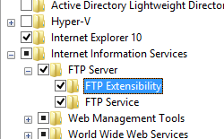
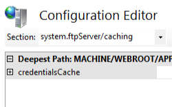

FTP Caching &lt;caching&gt;
====================

## Overview

The `<caching>` element specifies the credential settings for the FTP service.

The FTP service caches user credentials for performance reasons, thereby decreasing the time that is required to authenticate clients and reducing the overhead that is associated with looking up user credentials in the security store that is in use. For example, when using FTP Basic authentication, user credentials are stored in the local accounts database on the server where the FTP service is running, or on a domain controller. If you are using .NET membership credentials, the user accounts are stored in a database. If the domain accounts or membership database are stored on a remote computer, then credential caching will help offset the time that is necessary to validate accounts. On an FTP server with a large number of account logins, this can substantially increase performance.

When your security requirements dictate that credentials must be flushed immediately, you can configure credential caching to suit your environment. For example, if you change a password after you have successfully logged in to your FTP site, your old credentials may be cached for the duration of the cache time-out. In a network topology where this is likely to occur with regularity, you might want to decrease the cache time-out or disable caching.

Credential caching is enabled by default for FTP 7.0, FTP 7.5, and FTP 8.0. Credentials are cached for 15 minutes. The lifetime for credentials in the cache is specified by the `flushInterval` attribute, and credentials can be flushed manually by restarting the FTP service.

## Compatibility

| Version | Notes |
| --- | --- |
| IIS 10.0 | The `<caching>` element was not modified in IIS 10.0. |
| IIS 8.5 | The `<caching>` element was not modified in IIS 8.5. |
| IIS 8.0 | The `<caching>` element was not modified in IIS 8.0. |
| IIS 7.5 | The `<caching>` element of the `<system.ftpServer>` element ships as a feature of IIS 7.5. |
| IIS 7.0 | The `<caching>` element of the `<system.ftpServer>` element was introduced in FTP 7.0, which was a separate download for IIS 7.0. |
| IIS 6.0 | N/A |

> [!NOTE]
> The FTP 7.0 and FTP 7.5 services shipped out-of-band for IIS 7.0, which required downloading and installing the modules from the following URL:

> [https://www.iis.net/expand/FTP](https://www.iis.net/downloads/microsoft/ftp)

With Windows 7 and Windows Server 2008 R2, the FTP 7.5 service ships as a feature for IIS 7.5, so downloading the FTP service is no longer necessary.

## Setup

To support FTP publishing for your Web server, you must install the FTP service. To do so, use the following steps.

### Windows Server 2012 or Windows Server 2012 R2

1. On the taskbar, click **Server Manager**.
2. In **Server Manager**, click the **Manage** menu, and then click **Add Roles and Features**.
3. In the **Add Roles and Features** wizard, click **Next**. Select the installation type and click **Next**. Select the destination server and click **Next**.
4. On the **Server Roles** page, expand **Web Server (IIS)**, and then select **FTP Server**.  
  
    > [!NOTE]
    > To support ASP.Membership authentication or IIS Manager authentication for the FTP service, you will need to select     **FTP Extensibility** , in addition to     **FTP Service** .  
     .
5. Click **Next**, and then on the **Select features** page, click **Next** again.
6. On the **Confirm installation selections** page, click **Install**.
7. On the **Results** page, click **Close**.

### Windows 8 or Windows 8.1

1. On the **Start** screen, move the pointer all the way to the lower left corner, right-click the **Start** button, and then click **Control Panel**.
2. In **Control Panel**, click **Programs and Features**, and then click **Turn Windows features on or off**.
3. Expand **Internet Information Services**, and then select **FTP Server**.   
  
    > [!NOTE]
    > To support ASP.Membership authentication or IIS Manager authentication for the FTP service, you will also need to select     **FTP Extensibility** .   
    
4. Click **OK**.
5. Click **Close**.

### Windows Server 2008 R2

1. On the taskbar, click **Start**, point to **Administrative Tools**, and then click **Server Manager**.
2. In the **Server Manager** hierarchy pane, expand **Roles**, and then click **Web Server (IIS)**.
3. In the **Web Server (IIS)** pane, scroll to the **Role Services** section, and then click **Add Role Services**.
4. On the **Select Role Services** page of the **Add Role Services Wizard**, expand **FTP Server**.
5. Select **FTP Service**.  
  
    > [!NOTE]
    > To support ASP.Membership authentication or IIS Manager authentication for the FTP service, you will also need to select     **FTP Extensibility** .  
    
6. Click **Next**.
7. On the **Confirm Installation Selections** page, click **Install**.
8. On the **Results** page, click **Close**.

### Windows 7

1. On the taskbar, click **Start**, and then click **Control Panel**.
2. In **Control Panel**, click **Programs and Features**, and then click **Turn Windows Features on or off**.
3. Expand **Internet Information Services**, and then **FTP Server**.
4. Select **FTP Service**.  
  
    > [!NOTE]
    > To support ASP.Membership authentication or IIS Manager authentication for the FTP service, you will also need to select     **FTP Extensibility** .   
    
5. Click **OK**.

### Windows Server 2008 or Windows Vista

1. Download the installation package from the following URL: 

    - [https://www.iis.net/expand/FTP](https://www.iis.net/downloads/microsoft/ftp)
- Follow the instructions in the following walkthrough to install the FTP service: 

    - [Installing and Troubleshooting FTP 7](https://go.microsoft.com/fwlink/?LinkId=88547)
 

## How To

### How to configure the FTP credential cache settings

**Note for IIS 7.0 users**: Some of the steps in this section may require that you install the Microsoft Administration Pack for IIS 7.0, which includes the IIS Configuration Editor. To install the Microsoft Administration Pack for IIS 7.0, see the following URL:

- [https://www.iis.net/expand/AdministrationPack](https://www.iis.net/downloads/microsoft/administration-pack)

> [!NOTE]
> There is no direct user interface that lets you configure the `<hostNameSupport>` element, therefore the following steps will use the IIS Configuration Editor feature.

1. Open **Internet Information Services (IIS) Manager**: 

    - If you are using Windows Server 2012 or Windows Server 2012 R2: 

        - On the taskbar, click **Server Manager**, click **Tools**, and then click **Internet Information Services (IIS) Manager**.
    - If you are using Windows 8 or Windows 8.1: 

        - Hold down the **Windows** key, press the letter **X**, and then click **Control Panel**.
        - Click **Administrative Tools**, and then double-click **Internet Information Services (IIS) Manager**.
    - If you are using Windows Server 2008 or Windows Server 2008 R2: 

        - On the taskbar, click **Start**, point to **Administrative Tools**, and then click **Internet Information Services (IIS) Manager**.
    - If you are using Windows Vista or Windows 7: 

        - On the taskbar, click **Start**, and then click **Control Panel**.
        - Double-click **Administrative Tools**, and then double-click **Internet Information Services (IIS) Manager**.
2. In the **Connections** pane, click the server name.
3. In the **Home** pane, double-click the **Configuration Editor** feature.
4. In the **Section** drop-down menu, expand **sytem.ftpServer**, and then click **caching**.  
    
5. Expand **credentialsCache** in the list view.
6. Choose **True** or **False** in the drop-down list for the **enabled** attribute.
7. Enter the number of seconds for the flush interval for the **flushInterval** attribute.
8. In the **Actions** pane, click **Apply**.

> [!NOTE]
> This section contains information about how to modify your IIS settings by using the IIS Configuration Editor. Incorrectly editing your IIS configuration settings can severely damage your IIS installation. Therefore, make sure that you follow these steps carefully. For added security, you should back up your IIS configuration settings before you use the IIS Configuration Editor to make any modifications. For more information about how to back up your IIS configuration settings and how to use the IIS Configuration Editor, see the following topics:

- **How to Back Up an IIS 7 Configuration**  
    [https://technet.microsoft.com/en-us/library/dd819406.aspx](https://technet.microsoft.com/en-us/library/dd819406.aspx)
- **Configuration Editor Page**  
    [https://technet.microsoft.com/en-us/library/dd569081.aspx](https://technet.microsoft.com/en-us/library/dd569081.aspx)
 

## Configuration

The `<caching>` element is configured at the global level in ApplicationHost.config.

### Attributes

None.

### Child Elements

| Element | Description |
| --- | --- |
| [`credentialsCache`](credentialscache.md) | Optional element.  Specifies the credential cache settings for the FTP service. |

### Configuration Sample

The following configuration example enables FTP credential caching for a server, and sets the credential timeout to 300 seconds (five minutes.)

[!code-xml[Main](index/samples/sample1.xml)]

## Sample Code

The following examples enable FTP credential caching for a server, and set the credential timeout to 300 seconds (five minutes.)

### AppCmd.exe

[!code-console[Main](index/samples/sample2.cmd)]

> [!NOTE]
> You must be sure to set the **commit** parameter to `apphost` when you use AppCmd.exe to configure these settings. This commits the configuration settings to the appropriate location section in the ApplicationHost.config file.

### C#

[!code-csharp[Main](index/samples/sample3.cs)]

### VB.NET

[!code-vb[Main](index/samples/sample4.vb)]

### JavaScript

[!code-javascript[Main](index/samples/sample5.js)]

### VBScript

[!code-vb[Main](index/samples/sample6.vb)]