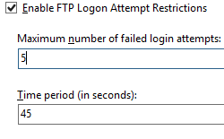

System FTP Authentication &lt;authentication&gt;
====================

## Overview

The `<authentication>` element enabes you to configure the user accounts that can access the sites on a server. Use authentication in combination with authorization to secure access to content on your server. Authentication confirms the identity of a user, while authorization determines which resources users can or cannot access.  
  
IIS defines one type of authentication rule, Deny rules. Deny rules let you define the user accounts or user groups that cannot access the sites on a server.

## Compatibility

| Version | Notes |
| --- | --- |
| IIS 10.0 | The `<authentication>` element was not modified in IIS 10.0. |
| IIS 8.5 | The `<authentication>` element was not modified in IIS 8.5. |
| IIS 8.0 | The `<authentication>` element was introduced in IIS 8.0. |
| IIS 7.5 | N/A |
| IIS 7.0 | N/A |
| IIS 6.0 | N/A |

## Setup

To support denying access through authentication on your FTP server, you must install the FTP Service role service.

### Windows Server 2012

1. Press the **Windows logo key**, and then click **Server Manager**.
2. In **Server Manager**, click **Manage** and then click **Add Roles and Features**.
3. In the **Add Roles and Features** wizard: 

    - On the **Before You Begin** page, click **Next**.
    - On the **Installation Type** page, select the installation type, and then click **Next**.
    - On the **Server Selection** page, select the appropriate server, and then click **Next**.
    - On the **Server Roles** page, ensure that **Web Server (IIS)** is selected, and then expand it.
    - Expand **FTP Server**, then select both **FTP Service** and **FTP Extensibility**, and then click **Next**.
    - On the **Features** page, click **Next**.
    - On the **Confirm Installation Selections** page, click **Install**.
    - On the **Results** page, click **Close**.

### Windows 8

1. Open the Windows Control Panel.
2. In the Windows Control Panel, open **Programs and Features**.
3. In **Programs and Features**, click **Turn Windows features on or off**.
4. In the **Windows Features** dialog box, expand **Internet Information Services**, and then expand **FTP Server**.
5. Under **FTP Server**, select **FTP Service** and **FTP Extensibility**, and then click **OK**.

## How To

### How to deny access to the FTP server based upon the logon failure rate

1. Open **Internet Information Services (IIS) Manager**: 

    - If you are using Windows Server 2012 or later: 

        - On the taskbar, click **Server Manager**, click **Tools**, and then click **Internet Information Services (IIS) Manager**.
    - If you are using Windows 8 or later: 

        - Hold down the **Windows** key, press the letter **X**, and then click **Control Panel**.
        - Click **Administrative Tools**, and then double-click **Internet Information Services (IIS) Manager**.
2. In the **Connections** pane, select the server.
3. In the **Home** pane, double-click the **FTP Logon Attempt Restrictions** feature.  
  
    
4. In the **FTP Logon Attempt Restrictions** dialog box, click **Enable** to enable the restrictions, and then enter the maximum number of failures and the time frame in which those failures will prompt access to the FTP service to be denied.
5. Click **Write to the log only** to log that the condition has been met, but not to block logon attempts.
6. Click **Apply** in the **Actions** pane.

## Configuration

The `<authentication>` element is configured at the server level. 

### Attributes

None.

### Child Elements

| Element | Description |
| --- | --- |
| [`denyByFailure`](denybyfailure.md) | Optional element.  Configures the FTP service to deny access based upon the failure rate. |

### Configuration Sample

The following sample configures a `<denyByFailure>` element.

[!code-xml[Main](index/samples/sample1.xml)]

## Sample Code

The following code samples configure denying access to the FTP server based upon the logon failure rate.

### AppCmd.exe

[!code-console[Main](index/samples/sample2.cmd)]

> [!NOTE]
> You must be sure to set the **commit** parameter to `apphost` when using AppCmd.exe to configure these settings. This commits the configuration settings to the appropriate location section in the ApplicationHost.config file.
  

### C#

[!code-csharp[Main](index/samples/sample3.cs)]
  

### VB.NET

[!code-vb[Main](index/samples/sample4.vb)]
  

### JavaScript

[!code-javascript[Main](index/samples/sample5.js)]
  

### VBScript

[!code-vb[Main](index/samples/sample6.vb)]
  

### PowerShell

[!code-powershell[Main](index/samples/sample7.ps1)]