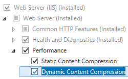
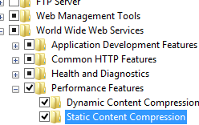
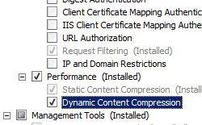
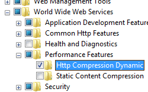
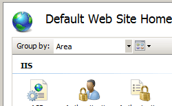
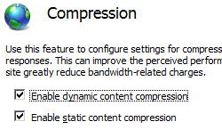
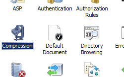
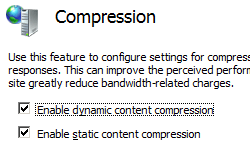
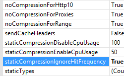

HTTP Compression &lt;httpCompression&gt;
====================

## Overview

The `<httpCompression>` element specifies the HTTP compression settings for Internet Information Services (IIS) 7. HTTP compression can provide faster transmission times between IIS and client browsers that can accept compressed files.

> [!NOTE]
> An HTTP client must initiate communication for compressed content by sending the appropriate HTTP Accept-encoding header. If a client is not capable of HTTP compression, it will not pass that header and IIS 7 will always return uncompressed content.

There are two different types of compression that IIS 7 uses:

- **Static Compression**: 

    IIS 7 caches compressed static content in the path that is specified by the **directory** attribute, which increases compression performance by eliminating the need to recompress content that has already been compressed. After IIS 7 has compressed a file, subsequent requests are given the compressed copy of the file from the cache directory.

    The **staticCompressionEnableCpuUsage** and **staticCompressionDisableCpuUsage** attributes specify when IIS 7 will compress static files based on CPU usage.

    You should use static compression with files that do not typically change, such as HTML files (\*.html, \*.htm), text files (\*.txt), Microsoft Office documents (\*.doc, \*.xls, \*.ppt), etc. The size of these files can be reduced through compression, which reduces download times for client requests and reduces bandwidth on the server.

    > [!NOTE]
    > Image files such as \*.jpg and \*.png files are also static files, but typically they do not benefit from HTTP compression because these image files are already compressed.
- **Dynamic Compression**: 

    Unlike static compression, IIS 7 performs dynamic compression each time a client requests the content, but the compressed version is not cached to disk. This change is made because of the primary difference between static and dynamic content. Static content does not change. However, dynamic content is typically content that is created by an application and therefore changes often, such as Active Server Pages (ASP) or ASP.NET content. Since dynamic content should change often, IIS 7 does not cache it.

    The **dynamicCompressionEnableCpuUsage** and **dynamicCompressionDisableCpuUsage** attributes specify when IIS 7 will compress dynamic files based on CPU usage.

IIS 7 supports two different industry-standard compression schemes:

- **Deflate** - this form of compression is documented in [Requests For Comment (RFC) specification 1951](http://www.ietf.org/rfc/rfc1951.txt).
- **GZIP** (GNU zip) - this form of compression is documented in [Requests For Comment (RFC) specification 1952](http://www.ietf.org/rfc/rfc1952.txt).

Each of these two compression schemes can be enabled using the `<schemes>` element of the `<httpCompression>` element.

> [!NOTE]
> While the `<httpCompression>` element specifies the HTTP compression settings for Internet Information Services (IIS) 7, the [&lt;urlCompression&gt;](../urlcompression.md) element specifies whether compression is enabled for a URL namespace.

## Compatibility

| Version | Notes |
| --- | --- |
| IIS 10.0 | The `<httpCompression>` element was not modified in IIS 10.0. |
| IIS 8.5 | The `staticCompressionIgnoreHitFrequency` attribute was added in IIS 8.5. |
| IIS 8.0 | The `<httpCompression>` element was not modified in IIS 8.0. |
| IIS 7.5 | In IIS 7.5, the default value for the `minFileSizeForComp` attribute has been changed, and the `dynamicCompressionBufferLimit` attribute was added. |
| IIS 7.0 | The `<httpCompression>` element was introduced in IIS 7.0. |
| IIS 6.0 | The `<httpCompression>` element replaces the following IIS 6.0 metabase properties: <ul> <li><strong>HcCacheControlHeader</strong></li> <li><strong>HcCompressionDirectory</strong></li> <li><strong>HcDoDiskSpaceLimiting</strong></li> <li><strong>HcExpiresHeader</strong></li> <li><strong>HcMaxDiskSpaceUsage</strong></li> <li><strong>HcMinFileSizeForComp</strong></li> <li><strong>HcNoCompressionForHttp10</strong></li> <li><strong>HcNoCompressionForProxies</strong></li> <li><strong>HcNoCompressionForRange</strong></li> <li><strong>HcSendCacheHeaders</strong> </li></ul> |

## Setup

HTTP compression is usually available on the default installation of IIS 7 and later. However, only static compression is installed by default. To install static or dynamic compression, use the following steps.

### Windows Server 2012 or Windows Server 2012 R2

1. On the taskbar, click **Server Manager**.
2. In **Server Manager**, click the **Manage** menu, and then click **Add Roles and Features**.
3. In the **Add Roles and Features** wizard, click **Next**. Select the installation type and click **Next**. Select the destination server and click **Next**.
4. On the **Server Roles** page, expand **Web Server (IIS)**, expand **Web Server**, expand **Performance**, and then select **Static Content Compression** and/or **Dynamic Content Compression**. Click **Next**.  
     .
5. On the **Select features** page, click **Next**.
6. On the **Confirm installation selections** page, click **Install**.
7. On the **Results** page, click **Close**.

### Windows 8 or Windows 8.1

1. On the **Start** screen, move the pointer all the way to the lower left corner, right-click the **Start** button, and then click **Control Panel**.
2. In **Control Panel**, click **Programs and Features**, and then click **Turn Windows features on or off**.
3. Expand **Internet Information Services**, expand **World Wide Web Services**, expand **Performance Features**, and then select **Dynamic Content Compression** and/or **Static Content Compression**.  
    
4. Click **OK**.
5. Click **Close**.

### Windows Server 2008 or Windows Server 2008 R2

1. On the taskbar, click **Start**, point to **Administrative Tools**, and then click **Server Manager**.
2. In the **Server Manager** hierarchy pane, expand **Roles**, and then click **Web Server (IIS)**.
3. In the **Web Server (IIS)** pane, scroll to the **Role Services** section, and then click **Add Role Services**.
4. On the **Select Role Services** page of the **Add Role Services Wizard**, select **Dynamic** **Content Compression** if you want to install dynamic compression and **Static Content Compression** if you want to install static compression, and then click **Next**.  
    
5. On the **Confirm Installation Selections** page, click **Install**.
6. On the **Results** page, click **Close**.

### Windows Vista or Windows 7

1. On the taskbar, click **Start**, and then click **Control Panel**.
2. In **Control Panel**, click **Programs and Features**, and then click **Turn Windows Features on or off**.
3. Expand **Internet Information Services**, then **World Wide Web Services**, then **Performance Features**.
4. Select **Http Compression Dynamic** if you want to install dynamic compression and **Static Content Compression** if you want to install static compression.   
    
5. Click **OK**.
 

## How To

### How to enable or disable static and dynamic compression for a site or application

1. Open **Internet Information Services (IIS) Manager**: 

    - If you are using Windows Server 2012 or Windows Server 2012 R2: 

        - On the taskbar, click **Server Manager**, click **Tools**, and then click **Internet Information Services (IIS) Manager**.
    - If you are using Windows 8 or Windows 8.1: 

        - Hold down the **Windows** key, press the letter **X**, and then click **Control Panel**.
        - Click **Administrative Tools**, and then double-click **Internet Information Services (IIS) Manager**.
    - If you are using Windows Server 2008 or Windows Server 2008 R2: 

        - On the taskbar, click **Start**, point to **Administrative Tools**, and then click **Internet Information Services (IIS) Manager**.
    - If you are using Windows Vista or Windows 7: 

        - On the taskbar, click **Start**, and then click **Control Panel**.
        - Double-click **Administrative Tools**, and then double-click **Internet Information Services (IIS) Manager**.
2. In the **Connections** pane, go to the connection, site, application, or directory for which you want to enable compression.
3. In the **Home** pane, double-click **Compression**.  
    
4. In the **Compression** pane, check the boxes to enable static or dynamic compression, or remove the check marks to disable static or dynamic compression.  
    
5. Once you have completed the above steps, click **Apply** in the **Actions** pane.

### How to enable or disable static and dynamic compression for a server

1. Open **Internet Information Services (IIS) Manager**: 

    - If you are using Windows Server 2012 or Windows Server 2012 R2: 

        - On the taskbar, click **Server Manager**, click **Tools**, and then click **Internet Information Services (IIS) Manager**.
    - If you are using Windows 8 or Windows 8.1: 

        - Hold down the **Windows** key, press the letter **X**, and then click **Control Panel**.
        - Click **Administrative Tools**, and then double-click **Internet Information Services (IIS) Manager**.
    - If you are using Windows Server 2008 or Windows Server 2008 R2: 

        - On the taskbar, click **Start**, point to **Administrative Tools**, and then click **Internet Information Services (IIS) Manager**.
    - If you are using Windows Vista or Windows 7: 

        - On the taskbar, click **Start**, and then click **Control Panel**.
        - Double-click **Administrative Tools**, and then double-click **Internet Information Services (IIS) Manager**.
2. In the **Connections** pane, highlight the name of your server.
3. In the server's **Home** pane, double-click **Compression**.  
    
4. In the **Compression** pane, check the boxes to enable static or dynamic compression, or remove the check marks to disable static or dynamic compression.  
    
5. Once you have completed the above steps, click **Apply** in the **Actions** pane.

### How to configure staticCompressionIgnoreHitFrequency

1. Open **Internet Information Services (IIS) Manager**: 

    - If you are using Windows Server 2012 R2: 

        - On the taskbar, click **Server Manager**, click **Tools**, and then click **Internet Information Services (IIS) Manager**.
    - If you are using Windows 8.1: 

        - Hold down the **Windows** key, press the letter **X**, and then click **Control Panel**.
        - Click **Administrative Tools**, and then double-click **Internet Information Services (IIS) Manager**.
2. In the **Connections** pane, select the server, and then double-click **Configuration Editor**.
3. In the **Configuration Editor**, for the section, select **system.webServer**, and then select **httpCompression**.
4. For **staticCompressionIgnoreHitFrequency**, enter `True` to disable the behavior that a static file is compressed only if it is hit a certain number of times within a time period, or enter `False` to enable the behavior.  
    
5. In the **Actions** pane, click **Apply**.
 

## Configuration

### Attributes

| Attribute | Description |
| --- | --- |
| `cacheControlHeader` | Optional string attribute.   Specifies the directive that IIS adds to the Cache-Control header that overrides the HTTP Expires header. This attribute ensures that older clients and proxy servers do not attempt to cache compressed files. To enable this setting, you must set the **sendCacheHeaders** attribute to **true**. The WWW service must be restarted before changes to this property take effect.   The default value is `max-age=86400`. |
| `directory` | Optional string attribute.   Specifies the directory where compressed versions of static files are temporarily stored and cached.   **Note:** In IIS 6.0, the default directory path for IIS temporary compressed files was %*windir*%\IIS Temporary Compressed Files.  The default value is `%SystemDrive%\inetpub\temp\IIS Temporary Compressed Files`. |
| `doDiskSpaceLimiting` | Optional Boolean attribute.   Specifies whether a limit exists for the amount of disk space that all compressed files, which are stored in the compression directory specified by the directory attribute, can occupy.   The default value is `true`. |
| `dynamicCompressionBufferLimit` | Optional uint attribute.  Specifies the maximum amount of dynamically compressed data that IIS will buffer before flushing the buffer to a client. This decreases the amount of memory that is necessary to perform dynamic compression.  **Note:** This attribute was added in IIS 7.5.  The default value is `65536`. |
| `dynamicCompressionDisableCpuUsage` | Optional uint attribute.  Specifies the percentage of CPU utilization at which dynamic compression will be disabled.  **Note:** This attribute acts as an upper CPU limit at which dynamic compression is turned off. When CPU utilization falls below the value specified in the **dynamicCompressionEnableCpuUsage** attribute, dynamic compression will be re-enabled.  The default value is `90`. |
| `dynamicCompressionEnableCpuUsage` | Optional uint attribute.   Specifies the percentage of CPU utilization below which dynamic compression will be enabled. The value must be between 0 and 100. Average CPU utilization is calculated every 30 seconds.   **Note:** This attribute acts as a lower CPU limit below which dynamic compression is turned on. When CPU utilization rises above the value specified in the **dynamicCompressionDisableCpuUsage** attribute, dynamic compression will be disabled.  The default value is `50`. |
| `expiresHeader` | Optional string attribute.   Specifies the content of the HTTP Expires header that is sent with all requested compressed files, together with the Cache-Control header specified in the **cacheControlHeader** attribute. This combination of headers ensures that older clients and proxy servers do not try to cache compressed files. To enable this setting, you must set the **sendCacheHeaders** attribute to **true**. The World Wide Web Publishing Service (WWW service) must be restarted before changes to this property take effect.   The default value is `Wed, 01 Jan 1997 12:00:00 GMT`. |
| `maxDiskSpaceUsage` | Optional uint attribute.   Specifies the number of megabytes of disk space that compressed files can occupy in the compression directory. When the space used by compressed files exceeds 90 percent of the value in this attribute, IIS deletes the least recently used files until a 90-percent usage level is reached.  **Note:** In IIS 6.0, this limit was expressed in bytes; in IIS 7, it is expressed in megabytes. In IIS 7 the limit is applied per application pool.  The default value is `100`. |
| `minFileSizeForComp` | Optional uint attribute.   Specifies the minimum number of kilobytes a file must contain in order to use on-demand compression.   The default value for IIS 7.5 is `2700`; for IIS 7.0 the default value was `256`. |
| `noCompressionForHttp10` | Optional Boolean attribute.   Specifies whether compression is disabled for requests that contain an HTTP 1.0 version number.  **Note:** Some HTTP 1.0 clients do not handle the caching of compressed objects correctly. You can use this setting to avoid returning a compressed file to a client that cannot decompress it.  The default value is `true`. |
| `noCompressionForProxies` | Optional Boolean attribute.   Specifies whether the HTTP 1.1 response is disabled for compression requests that come through proxy servers.  **Note:** Some HTTP proxy servers do not handle the caching of compressed objects correctly. You can use this setting to avoid returning a compressed file to a proxy server that cannot decompress it.  The default value is `true`. |
| `noCompressionForRange` | Optional Boolean attribute.   Specifies whether compression is disabled for HTTP requests that include the Range header.  **Note:** Some clients cannot handle range requests correctly. You can use this setting to avoid returning a compressed file to a client that cannot decompress it.  The default value is `true`. |
| `sendCacheHeaders` | Optional Boolean attribute.   Specifies whether the headers configured in **cacheControlHeader** and **expiresHeader** are sent with each compressed response.   The default value is `false`. |
| `staticCompressionDisableCpuUsage` | Optional uint attribute.   Specifies the percentage of CPU utilization at which static compression is disabled. The value must be between 0 and 100. Average CPU utilization is calculated every 30 seconds.  **Note:** This property acts as an upper CPU limit at which static compression is turned off. When CPU utilization falls below the value specified in the **staticCompressionEnableCpuUsage** attribute, static compression will be reenabled.  The default value is `100`. |
| `staticCompressionEnableCpuUsage` | Optional uint attribute.   Specifies the percentage of CPU utilization at which static compression is enabled. The value must be between 0 and 100. Average CPU utilization is calculated every 30 seconds.  **Note:** This property acts as a lower CPU limit below which static compression is turned on. When CPU utilization rises above the value specified in the **staticCompressionDisableCpuUsage** attribute, static compression will be disabled.  The default value is `50`. |
| `staticCompressionIgnoreHitFrequency` | Optional Boolean attribute.   If **True**, disables the behavior that a static file is compressed only if it is hit a certain number of times within a time period. You may encounter circumstances In which you want static content always to be compressed to lower bandwidth usage. For example, you may want to always compress static content when a system employs a load balancer with edge caching between a Web server and the requester, causing an uncompressed file to be cached at the edge server because subsequent requests would not reach the Web server.  If the behavior is not disabled, a hit rate of greater than or equal to two hits in 10 seconds will result in compression of the static content. A lesser hit rate would result in the content not being compressed.  The default value is `False`. |

### Child Elements

| Element | Description |
| --- | --- |
| [`scheme`](scheme.md) | Optional element.   Specifies the compression scheme (Gzip or Deflate) IIS uses to compress client requests. |
| [`dynamicTypes`](dynamictypes/index.md) | Optional element.   Specifies configuration settings for dynamic compression. |
| [`staticTypes`](statictypes/index.md) | Optional element.   Specifies configuration settings for static compression. |

### Configuration Sample

The following default `<httpCompression>` element is configured in the ApplicationHost.config file in IIS 7. This configuration section inherits the default configuration settings unless you use the `<clear>` element.

[!code-xml[Main](index/samples/sample1.xml)]

## Sample Code

The following code samples will add the MIME types for Office 2003 documents to the list of dynamic compression types.  
  
> [!NOTE]
> Office 2007 documents use built-in compression, so they do not need to be compressed by IIS.

### AppCmd.exe

[!code-console[Main](index/samples/sample2.cmd)]

> [!NOTE]
> You must be sure to set the **commit** parameter to `apphost` when you use AppCmd.exe to configure these settings. This commits the configuration settings to the appropriate location section in the ApplicationHost.config file.

### C#

[!code-csharp[Main](index/samples/sample3.cs)]

### VB.NET

[!code-vb[Main](index/samples/sample4.vb)]

### JavaScript

[!code-javascript[Main](index/samples/sample5.js)]

### VBScript

[!code-vb[Main](index/samples/sample6.vb)]

The following code samples will add the MIME types for Office 2003 documents to the list of static compression types.  
  
 (> [!NOTE]
> Office 2007 documents use built-in compression, so they do not need to be compressed by IIS.)

### AppCmd.exe

[!code-console[Main](index/samples/sample7.cmd)]

> [!NOTE]
> You must be sure to set the **commit** parameter to `apphost` when you use AppCmd.exe to configure these settings. This commits the configuration settings to the appropriate location section in the ApplicationHost.config file.

### C#

[!code-csharp[Main](index/samples/sample8.cs)]

### VB.NET

[!code-vb[Main](index/samples/sample9.vb)]

### JavaScript

[!code-javascript[Main](index/samples/sample10.js)]

### VBScript

[!code-vb[Main](index/samples/sample11.vb)]
