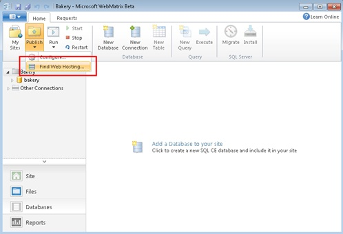
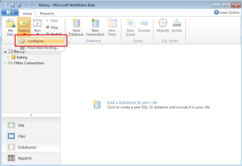
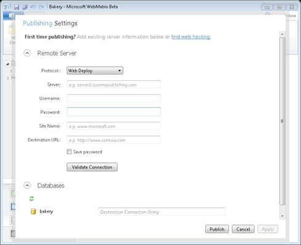
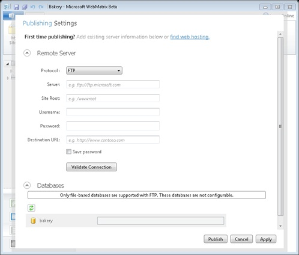
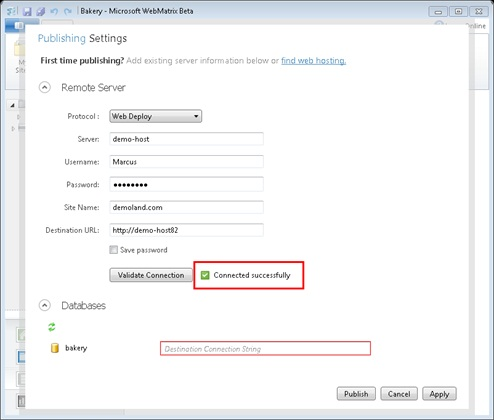
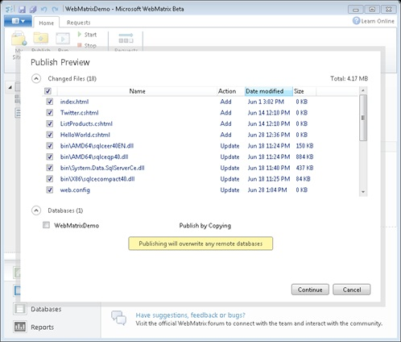
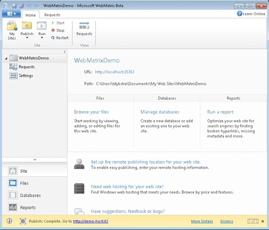
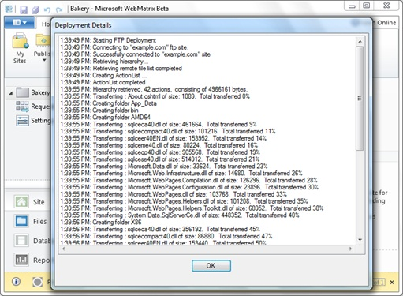

Publish Your Website
====================
by [Tom Dykstra](https://github.com/tdykstra)

[This is preliminary documentation and is subject to change.]

## Introduction

After you create a website, you typically publish the site to a web hosting provider where others can use it. Publishing a website involves the following tasks:

- Setting up an account with a web hosting provider.
- Configuring WebMatrix Beta for publishing. This includes entering settings for your web hosting account and deciding how to publish the database (if your site has one).
- Clicking the **Publish** button. WebMatrix Beta shows you the changes it plans to make on the remote server, you approve the changes, and then it publishes the site.

WebMatrix publishes the website by copying files to a remote server, and it can optionally deploy one or more databases to the hosting site.

## Hosting Providers

When you publish your website, you copy files from your computer to a web server that's maintained by a hosting company. There are dozens of hosting companies, each offering hosting plans that have different features and pricing.

WebMatrix Beta lets you select a hosting provider right in the tool. These hosting providers all support the Web Deploy process that automates most of the publishing process. However, you don't have to use one of these hosting companies. If you select a different company, you can still publish from within WebMatrix, but you might need to transfer files using FTP, which is a slightly more manual process. FTP also lets you publish SQL Server Compact databases, but not databases that use SQL Server or SQL Server Express.

Among the publishing options is SSL, which stands for *secure sockets layer*. (SSL is what you're using if you access a Web site using `https://` instead of `http://`.) SSL encrypts the information going between the browser and server, and is a good idea for pages that involve private information like passwords and credit-card numbers. Setting up SSL requires extra steps like purchasing and configuring a certificate that's used for encryption. We don't cover those steps here, so we also won't provide any information about how to configure SSL during publishing.

## Databases

If you're using SQL Server Compact as your database, the data is stored in an .sdf file. When you publish the database, WebMatrix copies not only the .sdf file but also the database program itself to the web server. This ensures that the published site will work even if SQL Server Compact isn't already installed on the web server.

If you're using a SQL Server or MySQL database, WebMatrix publishes the database by creating scripts that run in a database that has been created for you by your hosting provider. These scripts create database tables and insert data into them in order to replicate the structure and data that you have in the database on your computer.

If you're using a SQL Server Compact database and want to publish to a SQL Server database, you must migrate the data to SQL Server before publishing. For instructions, see [How to Migrate a Database to SQL Server](https://go.microsoft.com/fwlink/?LinkId=195270). You might want to do this to take advantage of SQL Server features such as stored procedures and its additional capabilities, such as handling more than 256 concurrent connections or creating databases larger than 4 gigabytes.

## Setting Up a Web Hosting Account

To set up web hosting, you must find a web hosting provider and set up an account.

1. In the **Home** tab, click the arrow below **Publish**, and then click **Find Web Hosting**.  
      
 The **Find Web Hosting** web page lists hosting providers.  
    
2. Select one of the hosting providers and click **Learn More**.
3. Follow the directions provided by the hosting provider's site to set up a new account.  
  
 Support for a SQL Server database might be an option that costs extra. If you plan to publish a SQL Server Compact database (.sdf file), you don't need this option.

After your account is set up, the hosting provider typically sends you an email message that contains information you'll need in order to publish your website. For example:

- *Server*: webmatrix01.contoso.com
- *User Name*: user123
- *Password*: *password*
- *Site Name*: user123.webmatrix01.contoso.com
- *Destination URL:* http://user123.webmatrix01.contoso.com

If your hosting account includes a SQL Server database, you'll also get information that you will need to publish your database, which will typically look like this:

> **Your database connection string is**: Password=*password*;User ID=*username*;Initial Catalog=username.hostingcompany;Data Source=sql1.hostingcompany.com

At the hosting company, your site will be associated with an *application pool* (often just called an *app pool*). The application pool specifies which version of the .NET Framework your site will run under: version 2.0 or 4. Typically, the hosting provider tells you what the default value is and how to change it. (Some providers may provide separate sites for each .NET Framework version instead.) Most of the applications that you can download from the Web Gallery require that you publish to a .NET Framework 2.0 application pool. If you create a new ASP.NET Web pages application such as those built from the Site from Template option, you must publish to a .NET Framework 4 application pool. If you publish using Web Deploy to a site at the hosting provider that has an application pool setting inappropriate for the site you are publishing, the publishing process will fail. If so, correct the application pool setting and republish. If you publish using FTP and the application pool setting is inappropriate, publishing will succeed, but your site will not work correctly. In that case, correct the application pool setting; you do not have to republish.

Configuring WebMatrix Beta for Publishing

1. Open the website in WebMatrix.
2. On the **Home** tab, click the arrow below **Publish**, and then click **Configure**.

    

    The **Publishing Settings** dialog box is displayed.

    
3. If you selected a hosting provider through WebMatrix Beta, you can leave **Protocol** set to **Web Deploy**. If you're using a hosting provider that doesn't support Web Deploy, or if you want to publish using FTP instead of Web Deploy, change the **Protocol** to **FTP**.
4. If you are using Web Deploy, enter the information you received from the hosting provider in the text boxes: 

    | Option | What to enter |
    | --- | --- |
    | Server | Enter the "Service URL" or "Server Name" provided by the hosting company, like this: server1.lucernepublishing.com If the Service URL includes the prefix "https://" and the suffix ":8172/msdeploy.axd", you can leave out the prefix and suffix. |
    | User Name/Password | Enter the credentials that the hosting provider provided for your account. (If you also signed up for a database for your account, the database might have a different username and password, so be sure that you use the right ones). |
    | Site Name | Enter the "Site" or "Site/Application" value from the hosting company, like this: user123.server1.lucernepublishing.com |
    | Destination URL | Enter the URL that people will use to browse your site over the internet, like this: contoso.com -or- contoso.com/blog |
5. If you want to use FTP instead of Web Deploy, select **FTP**. Some of the fields you have to enter are different:  
    
6. If you are using FTP: 

    1. Enter the **Server**, **User name**, **Password**, and **Destination URL** as described above for Web Deploy.
    2. In the **Site path** box, enter the value identified by the hosting company as the "Site Root," such as /wwwroot. This field is optional.
7. If you want to upload only the files that have changed locally, select **Upload locally changed files**.
8. If you don't want to enter the password every time you publish, select the **Save password** check box.
9. Click **Validate Connection** to verify that WebMatrix Beta is able to connect to the hosting provider. WebMatrix Beta displays the results to the right of the button.  
      
 If the connection test fails, double-check that you entered the information correctly. If you did but validation continues to display an error, contact the hosting provider for help.
10. If your website uses a full SQL Server or SQL Server Express database (that is, not a SQL Server Compact database), enter the connection string that was sent to you by the hosting provider.  
 If the SQL Server database doesn't appear in the dialog box, make sure it has a connection string in the Web.config file. For more information, see     *About Connection Strings* later in this document.
11. If a SQL Server Compact database does not appear in this dialog box, make sure that the .sdf file is in the App\_Data folder.

## Publishing

You can now start the publishing process. Before WebMatrix Beta makes any changes at the hosting company's web server, it tells you what it plans to do. You can then review the plan and modify it if necessary. Then, when you're ready, you tell WebMatrix Beta to go ahead and publish.

1. In the **Publishing Settings** dialog box, click **Publish**. The **Publish Preview** dialog box appears.  
    
2. Review the list of files and databases and make changes if necessary. For example, you might want to clear check boxes under **Changed Files** to exclude some files. Or, if this is the first time you're publishing the site, you might want to select check boxes under **Databases** to publish databases. (Check boxes are selected by default in the **Files** section and cleared by default in the **Databases** section.) 

    > [!IMPORTANT]
    > If you're publishing a database and the database already exists in at the hosting provider's site, whatever is in that database will be overwritten.
3. Click **Continue**.

    WebMatrix Beta publishes the website, showing status messages in the navigation bar at the bottom of the screen. The publishing process is done in the background, which means you can continue to work in WebMatrix Beta while it is publishing.

    

    You can click **More Details** in the notification bar to see a detailed log of the publishing activity.

    

    To verify that publishing was successful, browse to the site.

    If you published a database, make sure you try any pages that display data from the database.

    > [!NOTE]
    > If your site has a Web.config file, the copy on the hosting provider's web server might look slightly different. For example, if you published a SQL Server database, it will have the hosting provider's connection string value so that the published site will use the database at the hosting provider.

## About Connection Strings

If you're using a SQL Server (not SQL Server Compact) database, your site has to have a Web.config file with a connection string that tells the site how to connect to the database. To set up publishing, you enter the connection string for the destination database in the **Publishing Settings** dialog box. When you publish to a hosting company, the company provides you this string. If you want to publish to another server on your own network, you have to create the string yourself. (And in that case you also have to know the site and application name as they appear in **IIS Manager**, and enter this as the **Site Name** in the **Publishing Settings** dialog box.)

The following example shows a connection string in a Web.config file for a SQL Server Express database named CohoWinery.mdf. The .mdf file is located in the App\_Data folder.

[!code-xml[Main](publish-your-website/samples/sample1.xml)]

The following example shows a connection string for a full SQL Server database named CohoWinery that is on a server named "Server01", using integrated Windows authentication. The connection string for the database named SmallBakery shows how to use SQL Server authentication (that is, how to specify a user name and password).

[!code-xml[Main](publish-your-website/samples/sample2.xml)]
