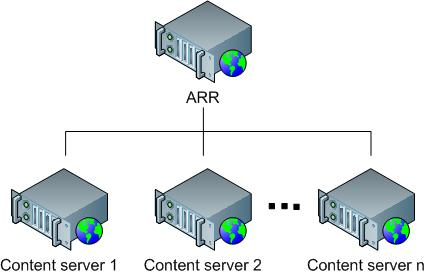
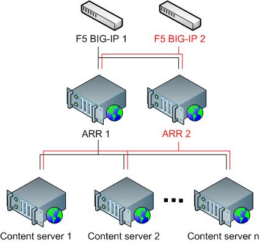
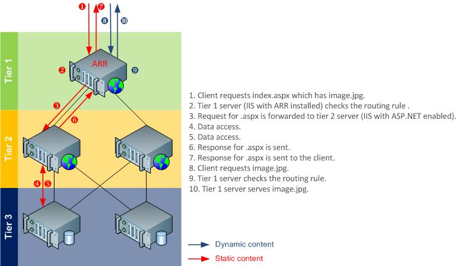
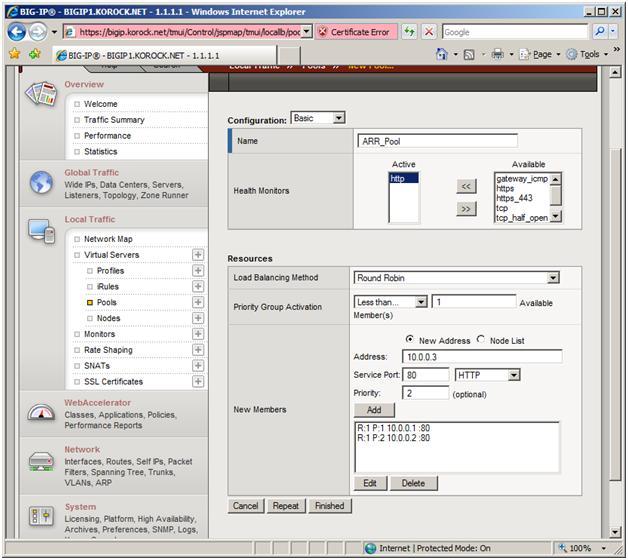
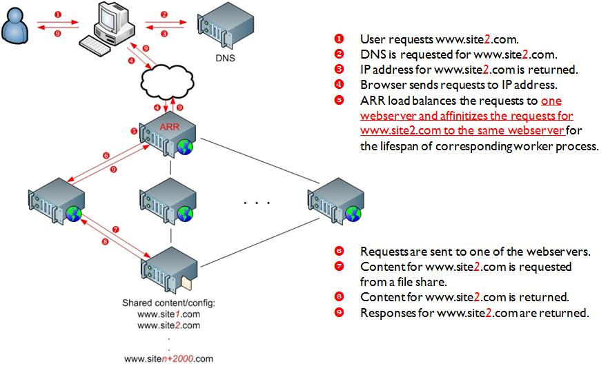
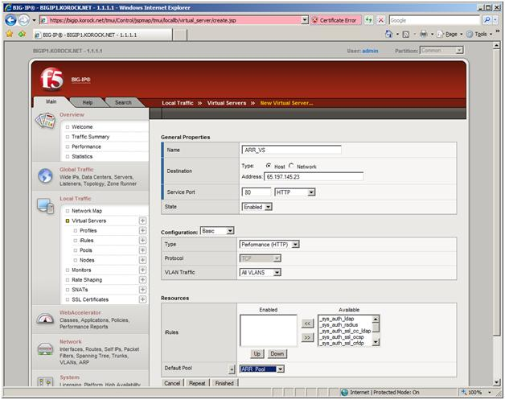
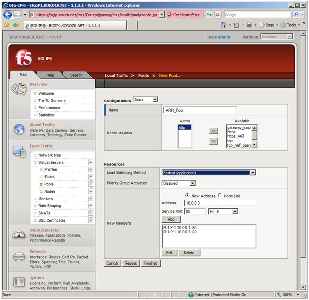

Achieving High Availability and Scalability - ARR and Hardware Load Balancer
====================
by Won Yoo

**Achieving High Availability and Scalability:**  
**Microsoft Application Request Routing (ARR) for IIS 7.0 and above and Hardware Load Balancer.**

| Microsoft Corporation | **F5** |
| --- | --- |
| Author: Won Yoo | Author: Ryan Korock |
| Published: November 13, 2008 |  |

## Abstract

This document provides prescriptive guidance about how Application Request Routing (ARR) can be used with a hardware load balancer to achieve high availability and scalability. F5 BIG-IP load balancer is used in this document to illustrate the working relationship between ARR and the hardware load balancers.

## Overview

Microsoft Application Request Routing (ARR) for IIS 7.0 and above is a proxy-based routing module that forwards HTTP requests to content servers based on HTTP headers, server variables, and load balance algorithms. A typical ARR deployment is illustrated in the diagram below:

While ARR provides high availability and scalability for the content servers, the overall deployment is not highly available or scalable because:

- ARR is the single point of failure.
- The scalability of the content servers is limited by the maximum capacity of one ARR server.

In order to overcome these challenges, administrators may consider using multiple ARR servers with hardware load balancers, such as F5 BIG-IP. ARR can be deployed in active/passive mode to only achieve high availability or in active/active mode to achieve both high availability and scalability. This whitepaper describes how ARR and F5 BIG-IP can be deployed together to enable the core ARR scenarios while achieving overall high availability and scalability.

## Use of Application Request Routing and F5 BIG-IP

ARR is built as a module on top of IIS and is designed to make the routing decisions at layer 7 (application). More accurately, ARR relies on another IIS module, [URL Rewrite](../url-rewrite-module/using-the-url-rewrite-module.md), to inspect the incoming HTTP request headers and server variables to make the routing decisions. Given this design, administrators could write intelligent routing rules based on the application level information, such as:

- Host name (HTTP\_HOST): Route traffic to different content servers based on host name.
- Requested resource (URL): Based on file extensions, determine whether the requested resources are for static content or dynamic content and route the requests accordingly.
- Client information (HTTP\_USER\_AGENT): Based on the browser type and version, route the requests to appropriate content servers.
- Custom headers (Set as a cookie by applications): Route traffic based on cookie information set by applications, such as user preference or user ID.

Above are just some of the examples. For a complete list of HTTP headers and server variables, refer to [Appendix A](achieving-high-availability-and-scalability-arr-and-hardware-load-balancer.md#appendix_a).

F5 Big-IP's layer 3 and layer 4 functionality compliments ARR's strength in making routing decisions based on layer 7, such as HTTP headers and server variables. At the same time, ARR does not provide fault tolerant deployment features for itself and must rely on other complementary technologies and solutions to achieve high availability for the ARR tier, as shown below:

## Scenario 1: HTTP-based routing and load balancing

The HTTP-based routing and load balancing scenario enables a 3-tier deployment architecture that involves: 

- Tier 1 (Web): Provides dual purposes of processing static content and routing and load balancing the remaining dynamic requests to tier 2 servers.
- Tier 2 (Application): Processes dynamic content that relies on business logic.
- Tier 3 (Data): Stores data.

The following diagram illustrates the 3-tier deployment:

Although the above example shows a routing rule that differentiates the static content from the dynamic content, another common scenario is to differentiate presentation requests from Web service requests. 

### Option 1: Active/Passive

In Active/Passive mode, typically there are two ARR servers in which one server processes the requests while the other server stands by as a failover server. As noted above, while this configuration achieves high availability by removing the single point of failure, it is not a scale out solution since the aggregate capacity of the content servers is limited by the maximum capacity of one ARR server.

In this setup, since two ARR servers are configured the same way, a shared configuration is used. The F5 BIG-IP is configured so that it routes all requests to the active ARR server and only routes requests to the passive ARR server when necessary.

With the exception of the host name affinity feature in ARR, there is no runtime state information that must be shared between the two ARR servers. Therefore, for this scenario, no special configuration is needed on either the ARR servers nor the F5 BIG-IP. Even if you use the server affinity feature in ARR, the affinitized state information will be made available to the passive server through a cookie in the request header when F5 BIG-IP routes the requests to the formerly passive but now active server.

This scenario is fully supported in the ARR Version 1 release.

#### ARR configuration

**Step 1: Enable shared configuration on two ARR servers.**

- Follow the steps in [this](../../manage/managing-your-configuration-settings/shared-configuration_264.md) document to set up shared configuration in IIS.

**Step 2: Configure 3-tier deployment architecture using ARR.**

- Follow the steps in [this](configure-3-tier-deployment-architecture-using-application-request-routing.md) document to configure ARR in 3-tier deployment architecture.
- At a high level, the above document describes: 

    - How to make static content available on the ARR server.
    - How to write URL rewrite rules for static content so that they are served directly from the ARR server.
    - How to write URL rewrite rules for dynamic content so that they are forwarded to the application servers.

#### F5 BIG-IP configuration

In this scenario, you will create a virtual server that load balances to a pool of two (or more) ARR servers. The load balancing method you select should send all traffic to the primary ARR server until it becomes unavailable. At that point, the BIG-IP LTM should send all traffic to the secondary ARR server.   
  
**Step 1: Configure the pool of ARR servers.**  

- In the Local Traffic section, click Pools. Then click the Create button to create a pool.
- Any unique name will work for the pool; the example uses ARR\_Pool.
- For the Health Monitor, you can use a custom HTTP monitor or the default HTTP monitor.
- You can leave the Load Balancing Method set to Round Robin. In this scenario, since there is only an active and passive ARR server, load balancing is not used.
- Be sure to enable Priority Group Activation. This configures the BIG-IP to send traffic to the server(s) with the highest priority value. When those server(s) are unavailable, the BIG-IP sends traffic to the ARR server with the next highest priority value.
- In this scenario, the ARR server at 10.0.0.1 has a priority value of 1, and 10.0.0.2 has a priority value of 2. All traffic will be sent to 10.0.0.2 until it goes down, and then traffic will be sent to 10.0.0.1.

**Step 2: Configure the pool of ARR servers.**

- In the Local Traffic section, click Virtual Servers. Then click the Create button to create a virtual server.
- Any unique name will work for the virtual server; the example uses ARR\_VS.
- For the Destination, you can use the IP address to which users will point their browsers. In this specific example, we use 65.197.145.23. For the Service Port, we use ‘80'.
- For the Virtual Server Type section, you have several options. Since you depend on ARR to route, you can select Performance HTTP, which is designed for the best performance.
- For the Default Pool, select the pool that you created in Step 1.

- At this point, you should be able to connect to this Virtual Server, which will be sent to the appropriate ARR server.

### Option 2: Active/Active

In Active/Active mode, you can have two or more ARR servers. This configuration achieves both high availability and scalability, unlike the Active/Pass mode, which achieves only high availability. As noted previously, since multiple ARR servers are configured the same way, a shared configuration is used. The F5 BIG-IP is configured to load balance incoming requests to all available and healthy ARR servers, which in turn forwards requests to the content servers. Regardless of whether the server affinity feature is used on the F5 BIG-IP or not, no special configuration is needed on the ARR servers. For one, the ARR servers use one shared configuration so that they are configured the same way. Secondly, since ARR uses a client cookie to store the server affinity information for its own use, this information is available per request and therefore available across the ARR servers. This scenario is fully supported in the ARR Version 1 release. 

#### ARR configuration

The ARR configuration for Active/Active is identical to that of Active/Passive. The main difference is how F5 is configured.

**Step 1: Enable shared configuration on two ARR servers.**

- Follow the steps in [this](../../manage/managing-your-configuration-settings/shared-configuration_264.md) document to set up shared configuration in IIS.

**Step 2: Configure 3-tier deployment architecture using ARR.**

- Follow the steps in [this](configure-3-tier-deployment-architecture-using-application-request-routing.md) document to configure ARR in 3-tier deployment architecture.
- At a high level, the above document describes: 

    - How to make static content available on the ARR server.
    - How to write URL rewrite rules for static content so that they are served directly from the ARR server.
    - How to write URL rewrite rules for dynamic content so that they are forwarded to the application servers.

#### F5 BIG-IP configuration

In this scenario, all available ARR servers are considered active and candidates for load balanced traffic. Use the BIG-IP LTM to determine health and performance of the ARR front ends, and direct traffic to the best performing ones.  
  
**Step 1: Configure the pool of ARR servers.**  

- In the Local Traffic section, click Pools. Then click the Create button to create a pool.
- Any unique name will work for the pool; the examples uses ARR\_Pool. - For the Health Monitor, you can use a custom HTTP monitor or the default HTTP monitor. - Since you have multiple ARR servers to which to distribute traffic, you will want to select a load balancing method that best suits your needs. Assuming all of the ARR servers have similar hardware characteristics, a dynamic load balancing method, such as fastest, observed, or predictive, will give you performance-based distribution.

**Step 2: Configure the virtual server.**

- In the Local Traffic section, click Virtual Servers. Then click the Create button to create a virtual server.
- Any unique name will work for the virtual server; the example uses ARR\_VS. - For the Destination, you can use the IP address to which users will point their browsers. In this specific example, we use 65.197.145.23. For Service Port, we use ‘80'. - For the Virtual Server Type section, you have several options. Since you depend on ARR to route, you can select Performance HTTP, which is designed for the best performance. - For the Default Pool, select the pool that you created in Step 1.

## Scenario 2: Shared hosting using host name affinity

This scenario utilizes the host name affinity feature in ARR to enable a shared hosting deployment to:

- Reduce the manual management and maintenance involved with traditional shared hosting deployment.
- Maximize the existing server resources while ensuring that all server resources are evenly utilized.
- Easily scale out the environment.
- Create business opportunities to sell additional capacity.

For more information about shared hosting and ARR, refer to [this](../planning-for-arr/overview-of-shared-hosting-deployment-using-application-request-routing-20.md) document.

The following diagram illustrates the shared hosting environment using ARR: 

### Option 1: Active/Passive

As noted previously, in Active/Passive mode, typically there are two ARR servers in which one server processes the requests while the other server stands by as a failover server. While this configuration achieves high availability by removing the single point of failure, it is not a scale out solution since the aggregate capacity of the content servers is limited by the maximum capacity of one ARR server.

In this setup, since two ARR servers are configured the same way, a shared configuration is used. The F5 BIG-IP is configured to route all requests to the active ARR server and only route requests to the passive ARR server when necessary.

The host name affinity feature in ARR affinitizes the requests to a particular server (or a group of servers in RC) based on the host name. The runtime state information of affinitized mapping between the host names and the content servers is stored in memory within an instance of an ARR server. In the ARR Version 1 release, ARR leverages Microsoft External Cache for IIS to share and maintain this runtime state between multiple ARR servers. More information about this scenario is available in [this](using-multiple-instances-of-application-request-routing-arr-servers.md) document.

This scenario is fully supported in the ARR Version 1 release. 

#### ARR configuration

**Step 1: Enable shared configuration on two ARR servers.**

- Follow the steps in [this](../../manage/managing-your-configuration-settings/shared-configuration_264.md) document to set up shared configuration in IIS.

**Step 2: Configure 3-tier deployment architecture using ARR.**

- Follow the steps in [this](configure-3-tier-deployment-architecture-using-application-request-routing.md) document to configure ARR in 3-tier deployment architecture.
- At a high level, the above document describes: 

    - How to make static content available on the ARR server.
    - How to write URL rewrite rules for static content so that they are served directly from the ARR server.
    - How to write URL rewrite rules for dynamic content so that they are forwarded to the application servers.

**Step 3: Enable and configure External Cache.**

- Follow the steps in [this](using-multiple-instances-of-application-request-routing-arr-servers.md) document to enable and configure External Cache to be used with ARR.

#### F5 BIG-IP configuration

In this scenario, you will create a virtual server that load balances to a pool of two (or more) ARR servers. The load balancing method you select should send all traffic to the primary ARR server until it becomes unavailable. At that point, the BIG-IP LTM should send all traffic to the secondary ARR server.  
  
**Step 1: Configure the pool of ARR servers.**  

- In the Local Traffic section, click Pools. Then click the Create button to create a pool.
- Any unique name will work for the pool; the example uses ARR\_Pool. - For the Health Monitor, you can use a custom HTTP monitor or the default HTTP monitor. - You can leave the Load Balancing Method set to Round Robin. In this scenario, since there is only an active and passive ARR server, load balancing is not used. - Be sure to enable Priority Group Activation. This configures the BIG-IP to send traffic to the server(s) with the highest priority value. When those server(s) are unavailable, the BIG-IP sends traffic to the ARR server with the next highest priority value. - In this scenario, the ARR server at 10.0.0.1 has a priority value of 1, and 10.0.0.2 has a priority value of 2. All traffic will be sent to 10.0.0.2 until it goes down, and then traffic will be sent to 10.0.0.1.

**Step 2: Configure the virtual server.**

- In the Local Traffic section, click Virtual Servers. Then click the Create button to create a virtual server.
- Any unique name will work for the virtual server; the example uses ARR\_VS. - For the Destination, you can use the IP address to which users will point their browsers. In this case, we use. For Service Port, we use ‘80'. - For the Virtual Server Type section, you have several options. Since you depend on ARR to route, you can select Performance HTTP, which is designed for the best performance. - For the Default Pool, select the pool that you created in Step 1.

- At this point, you should be able to connect to this Virtual Server, which will be sent to the appropriate ARR server.

### Option 2: Active/Active in ARR

In Active/Active mode, you can have two or more ARR servers. This configuration achieves both high availability and scalability, unlike the Active/Pass mode, which achieves only high availability. Since multiple ARR servers are configured the same way, a shared configuration is used. The F5 BIG-IP is configured to load balance incoming requests to all available and healthy ARR servers, which in turn forwards requests to the content servers. 

As noted previously, the runtime state information of affinitized mapping between the host names and the content servers is stored in memory within an instance of an ARR server. In order to share this information among multiple ARR servers, Microsoft External Cache for IIS is used. For more information about External Cache, refer to [this](using-multiple-instances-of-application-request-routing-arr-servers.md) document.

#### ARR configuration

The ARR configuration for Active/Active is identical to that of Active/Passive. The main difference is how F5 is configured. 

**Step 1: Enable shared configuration on two ARR servers.**

- Follow the steps in [this](../../manage/managing-your-configuration-settings/shared-configuration_264.md) document to set up shared configuration in IIS.

**Step 2: Configure 3-tier deployment architecture using ARR.**

- Follow the steps in [this](configure-3-tier-deployment-architecture-using-application-request-routing.md) document to configure ARR in 3-tier deployment architecture.
- At a high level, the above document describes: 

    - How to make static content available on the ARR server.
    - How to write URL rewrite rules for static content so that they are served directly from the ARR server.
    - How to write URL rewrite rules for dynamic content so that they are forwarded to the application servers.

**Step 3: Enable and configure External Cache.**

- Follow the steps in [this](using-multiple-instances-of-application-request-routing-arr-servers.md) document to enable and configure External Cache to be used with ARR.

#### F5 BIG-IP configuration

In this scenario, all available ARR servers are considered active and candidates for load balanced traffic. Use the BIG-IP LTM to determine health and performance of the ARR front ends, and direct traffic to the best performing ones.

**Step 1: Configure the pool of ARR servers.**  

- In the Local Traffic section, click Pools. Then click the Create button to create a pool.
- Any unique name will work for the pool; the example uses ARR\_Pool. - For the Health Monitor, you can use a custom HTTP monitor or the default HTTP monitor. - Since you have multiple ARR servers to which to distribute traffic, you will want to select a load balancing method that best suits your needs. Assuming all of the ARR servers have similar hardware characteristics, a dynamic load balancing method, such as fastest, observed, or predictive, will give you performance-based distribution.

**Step 2: Configure the virtual server.**  

- In the Local Traffic section, click Virtual Servers. Then click the Create button to create a virtual server.
- Any unique name will work for the virtual server; the example uses ARR\_VS. - For the Destination, you can use the IP address to which users will point their browsers. In this case, we use. For Service Port, we use ‘80'. - For the Virtual Server Type section, you have several options. Since you depend on ARR to route, you can select Performance HTTP, which is designed for the best performance. - For the Default Pool, select the pool that you created in Step 1.

## Summary

In this whitepaper, two main ARR scenarios were reviewed to achieve high availability and scalability by deploying multiple ARR servers and using F5 BIG-IP.

## Appendix

### Appendix A: All available HTTP headers and server variables for writing routing decision rules.

| ALL\_HTTP | ALL\_RAW | APPL\_MD\_PATH |
| --- | --- | --- |
| APPL\_PHYSICAL\_PATH | CERT\_COOKIE | CERT\_FLAGS |
| CERT\_ISSUER | CERT\_KEYSIZE | CERT\_SECRETKEYSIZE |
| CERT\_SERIALNUMBER | CERT\_SERVER\_ISSUER | CERT\_SERVER\_SUBJECT |
| CERT\_SUBJECT | CONTENT\_LENGTH | CONTENT\_TYPE |
| DOCUMENT\_ROOT | GATEWAY\_INTERFACE | HTTP\_ACCEPT |
| HTTP\_ACCEPT\_ENCODING | HTTP\_ACCEPT\_LANGUAGE | HTTP\_CONNECTION |
| HTTP\_CONTENT\_LENGTH | HTTP\_HOST | HTTP\_IF\_MODIFIED\_SINCE |
| HTTP\_IF\_NONE\_MATCH | HTTP\_REFERER | HTTP\_UA\_CPU |
| HTTP\_USER\_AGENT | HTTPS | HTTPS\_KEYSIZE |
| HTTPS\_SECRETKEYSIZE | HTTPS\_SERVER\_ISSUER | HTTPS\_SERVER\_SUBJECT |
| INSTANCE\_ID | INSTANCE\_META\_PATH | LOCAL\_ADDR |
| PATH\_INFO | PATH\_TRANSLATED | QUERY\_STRING |
| REMOTE\_ADDR | REMOTE\_HOST | REMOTE\_PORT |
| REMOTE\_USER | REQUEST\_FILENAME | REQUEST\_METHOD |
| REQUEST\_URI | SCRIPT\_FILENAME | SCRIPT\_NAME |
| SERVER\_ADDR | SERVER\_NAME | SERVER\_PORT |
| SERVER\_PORT\_SECURE | SERVER\_PROTOCOL | SERVER\_SOFTWARE |
| URL |  |  |