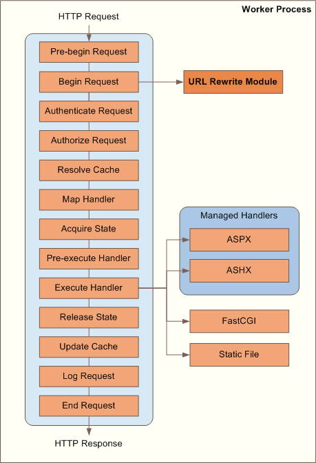
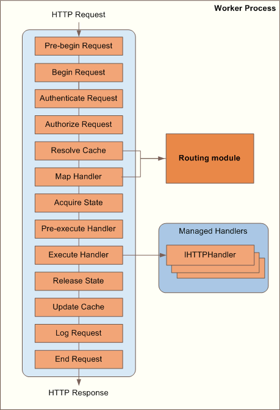

IIS URL Rewriting and ASP.NET Routing
====================
by [Ruslan Yakushev](https://github.com/ruslany)

With the release of the [URL Rewrite Module for IIS](using-the-url-rewrite-module.md) and the inclusion of ASP.NET routing into the .NET Framework 4, there have been a lot of questions from ASP.NET developers about how these two features relate to each other and when you should use one or the other. This document describes the differences between these two technologies and provides guidance for Web developers about when to use IIS URL rewriting and when to use ASP.NET routing.

From a high-level perspective, it seems like these technologies provide very similar functionality--both allow your Web applications to have user-friendly and search-engine-friendly URLs. However, there are fundamental differences between these two technologies that are important to understand to make the right decision about what to use for your Web application. To help you understand those differences, we will first explain how IIS URL rewriting and ASP.NET routing work.

## IIS URL Rewriting

The basic idea of URL rewriting is not a new concept. It was introduced in the Apache Web server about a decade ago. Since then it has proven to be a very useful tool for Web server administrators and Web developers. Many popular applications that are hosted on Apache now rely on URL rewriting to enable support for "clean" URLs.

The concept of URL rewriting is simple. When a client sends a request to the Web server for a particular URL, the URL rewriting module analyzes the requested URL and changes it to a different URL on the same server. The URL rewriting module runs early in the request-processing pipeline, modifying the requested URL before the Web server decides which handler to use to process the request. The handler, which is chosen based on the rewritten URL, processes the request and generates a response that is sent back to the Web browser. The requesting client never sees the rewritten URL; as far as the client is concerned, it has received a response from the original URL.

In terms of the IIS architecture, this process is represented by the following diagram:

The URL Rewrite module is a native code module that plugs into the request-processing pipeline at the Pre-begin Request or Begin Request stages, and then evaluates the requested URL path by using a set of rewrite rules. Each rewrite rule analyzes the URL path and, if all the rule conditions are met, changes the original path to a new path. After all the rules have been evaluated, the URL Rewrite module produces a final URL path that is used for the request through the remainder of the IIS pipeline processing. This means that the handler selection in the IIS pipeline is made based on the rewritten URL that is produced by the URL Rewrite module.

## ASP.NET Routing

ASP.NET routing is a request-dispatching mechanism that lets developers associate a certain URL with a handler that can process requests made to that URL. This association is done by registering the "routes" that define which handler to invoke for a particular URL path. When a request is made to a Web server ASP.NET routing looks up the requested URL path in the list of registered routes. If the route is found, the corresponding handler for that route is invoked to process that request.

In terms of IIS and ASP.NET architecture, this process is represented by the following diagram:

ASP.NET routing is implemented as a managed-code module that plugs into the IIS request-processing pipeline at the Resolve Cache stage (PostResolveRequestCache event) and at the Map Handler stage (PostMapRequestHandler event). ASP.NET routing is configured to run for all requests made to the Web application.

During the PostResolveRequestCache event, the module looks through a routing table (a collection of route objects) for a route that matches the requested URL path. If a match is found, the module obtains a reference to the handler that corresponds to that route and saves the reference as part of the current HTTP context. A handler can be any .NET Framework object that implements the System.Web.IHttpHandler interface. If no route is found, the module does not do anything, and the URL falls through and is processed normally (typically by matching it to a file on disk).

During the PostMapRequestHandler event, the module checks if the HTTP context contains any information about a handler. If it does, ASP.NET routing uses the information to set the Handler property of the current HTTP context. This ensures that during the Execute Handler stage, IIS will execute the handler that was selected by the routing module. If that information is not set, then the module does not do anything and the URL falls through to let IIS make a handler selection.

## Differences Between IIS URL Rewriting and ASP.NET Routing

Based on the above explanation, there are the following main conceptual differences between IIS URL rewriting and ASP.NET routing:

1. URL rewriting is used to manipulate URL paths before the request is handled by the Web server. The URL rewriting module does not know which handler will eventually process the rewritten URL. In addition, the actual request handler might not know that the URL has been rewritten.
2. ASP.NET routing is used to dispatch a request to a handler based on the requested URL path. As opposed to URL rewriting, the routing module knows about the handlers and selects the handler that should generate a response for the requested URL. You can think of ASP.NET routing as an advanced handler-mapping mechanism.

In addition to these conceptual differences, there are the following functional differences between IIS URL rewriting and ASP.NET routing:

1. The IIS URL Rewrite module can be used with any type of Web application, which includes ASP.NET, PHP, ASP, and static files. ASP.NET routing can be used only with .NET Framework-based Web applications.
2. The IIS URL Rewrite module works the same way regardless of whether integrated or classic IIS pipeline mode is used for the application pool. For ASP.NET routing, it is preferable to use integrated pipeline mode. ASP.NET routing can work in classic mode, but in that case the application URLs must include file name extensions or the application must be configured to use "\*" handler mapping in IIS.
3. The IIS URL Rewrite module can make rewriting decisions based on domain names, HTTP headers, and server variables. By default, ASP.NET routing works only with URL paths and with the HTTP-Method header.
4. In addition to rewriting, the URL Rewrite module can perform HTTP redirection, issue custom status codes, and abort requests. ASP.NET routing does not perform these tasks.
5. The URL Rewrite module is not extensible in its current version. ASP.NET routing is fully extensible and customizable.

## Which Option Should You Use?

What does all this information mean if you need to choose a technology to enable clean URLs for your Web applications? In this section, we explain how to make this choice.

If your Web application is built by using anything except ASP.NET, use the IIS URL Rewrite module. Otherwise, the rules are:

1. If you are developing a new ASP.NET Web application that uses either [ASP.NET MVC](https://weblogs.asp.net/scottgu/archive/2007/10/14/asp-net-mvc-framework.aspx) or [ASP.NET Dynamic Data](https://weblogs.asp.net/scottgu/archive/2007/12/14/new-asp-net-dynamic-data-support.aspx) technologies, use ASP.NET routing. Your application will benefit from native support for clean URLs, including generation of clean URLs for the links in your Web pages. Note that ASP.NET routing does not support standard Web Forms applications yet, although there are plans to support it in the future.
2. If you already have a legacy ASP.NET Web application and do not want to change it, use the URL Rewrite module. The URL Rewrite module lets you translate search engine-friendly URLs into a format that your application currently uses. Also, it lets you create redirect rules that can be used to redirect search engine crawlers to clean URLs.

In practice, however, the choice does not have to be either/or. The technologies can be used together and can complement each other. In the following sections, we outline some scenarios where you can use ASP.NET routing and IIS URL rewriting together.

Enforcing canonical URLs for your application.   
You should force the use of http://www.mysite.com/home/about instead of http://mysite.com/Home/About. When a Web client requests a URL that does not conform to the format that you want, the client is redirected to a canonical URL. In this scenario, you can use the URL Rewrite module to enforce canonical URLs and perform redirection, and use ASP.NET routing to select a handler that would process the requested URL path.

The following example shows a URL rewrite rule that you can use for this scenario:

[!code-xml[Main](iis-url-rewriting-and-aspnet-routing/samples/sample1.xml)]

Serving static content from a different site or server.   
Your Web application is deployed on multiple servers in such a way that dynamic Web content is located on one site or server and all static content is on a different site or server. You can use the URL Rewrite module together with the [IIS Application Request Routing module](../planning-for-arr/using-the-application-request-routing-module.md) to forward all requests for static files to a different server, while serving all requests for dynamic Web pages from the current server. This way, ASP.NET routing is used only for dynamic Web content and does not evaluate any URLs for static content.

The following example shows a URL rewrite rule that you can use for this scenario:

[!code-xml[Main](iis-url-rewriting-and-aspnet-routing/samples/sample2.xml)]

**Static content management**.   
When your static files or folders are moved to a new location, you can still support old URLs for backward compatibility reasons. In fact, you might not want Web site visitors to know that the files or folders have been moved. In that case you can use URL Rewrite module to rewrite paths for static files, while all the URLs to your dynamic ASP.NET Web pages are handled by the routing module.

The following example shows a URL rewrite rule that you can use for this scenario:

[!code-xml[Main](iis-url-rewriting-and-aspnet-routing/samples/sample3.xml)]

**Request blocking**.   
The URL Rewrite module can be used to block certain requests based on various criteria. For example, you can prevent certain site crawlers from accessing specific URL paths on your Web site. That way, forbidden requests will not even get to the ASP.NET router, thus reducing the load on your Web server.

The following example shows a URL rewrite rule that you can use to block unwanted site crawlers. Note that the requests are blocked for a particular URL path based on either the user-agent HTTP header or based on the client's IP address:

[!code-xml[Main](iis-url-rewriting-and-aspnet-routing/samples/sample4.xml)]

## Future Directions

Even though IIS URL rewriting and ASP.NET routing have some functional overlap, they address scenarios that are unique to each technology. Because of that, these two technologies will continue to exist and evolve as independent components in IIS, with the potential for tighter integration between them. For example, ASP.NET routing can leverage some of the rich tools that are provided with the URL Rewrite module. The URL Rewrite module can be better integrated with ASP.NET in terms of providing extensibility for customizing URL rewriting logic.

## Conclusion

Either IIS URL rewriting or ASP.NET routing can be used to implement URL manipulation scenarios for your Web application. ASP.NET routing is a solution that is optimized for ASP.NET, thus it may be preferable for Web developers who design their ASP.NET applications from the ground up and want to have a clean URL structure. IIS URL rewriting is a generic URL manipulation mechanism that addresses a multitude of scenarios. In particular, it can be used by Web developers as well as Web server/site administrators to enable clean URLs for existing Web applications without modifying the application code.

## Related documents

- [URL Rewrite Module documentation and tutorials](using-the-url-rewrite-module.md)
- [ASP.NET routing documentation](https://msdn.microsoft.com/library/cc668201.aspx)
- [ASP.NET MVC](https://www.asp.net/mvc/)
- [ASP.NET Dynamic Data](https://www.asp.net/DynamicData/)