Services Implementation
====================
by [Walter Oliver](https://github.com/walterov)

## Overview

From an implementation standpoint, the solution follows recommended patterns and practices for building Web Services using the Windows Communication Foundation (WCF) as described in the Web Service Software Factory guidance.

Additional information can be found at the following sites:

- [https://msdn.microsoft.com/library/ms735119.aspx](https://msdn.microsoft.com/library/ms735119.aspx)
- [http://www.codeplex.com/servicefactory](http://www.codeplex.com/servicefactory)

In the following sections, we describe each subsystem implementation in detail.

- [Subsystems](setting-up-components.md#Subsystems)
- [Web Subsystem](setting-up-components.md#Web)
- [FTP Subsystem](setting-up-components.md#FTP)
- [Content Storage Subsystem](setting-up-components.md#Content)
- [User Account Subsystem](setting-up-components.md#User)
- [SQL Subsystem](setting-up-components.md#SQL)
- [Hosting the Sample Services](setting-up-components.md#Hosting)
- [Security Role Provider](setting-up-components.md#Security)

## Subsystems

The implementation of each subsystem, such as web, ftp, and SQL, etc., is split into three projects:

- DataContracts
- ServiceContracts
- ServiceContract implementation, as illustrated in the following diagram.

[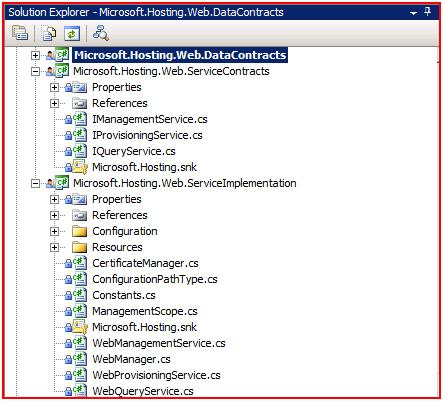](setting-up-components/_static/image1.jpg)

Due to the fact that there is a certain commonly shared functionality among all subsystems, such as exception management, all those components are grouped into a separate project, which is Microsoft.Hosting.Management. Furthermore, all subsystems share the same FaultContracts for consistent exception handling across all WCF services as illustrated in the above architecture diagram.

## Web Subsystem

IIS 7.0 introduces a new configuration system at the core of all the new administration-related features. The configuration system is based on distributed, clear-text, XML files that hold the configuration settings for the entire web server platform, including IIS, ASP.NET and other components, such as FTP, and may optionally be set at the content directories together with the web content.

Different levels of the configuration hierarchy may be delegated by the machine administrator to other users, such as the site administrator or the application developer.

Secure defaults and out-of-the-box lockdown limit write-access to configuration settings to the machine administrator only; however, sophisticated and granular locking features enable safe unlocking and delegation of management of specific configuration settings to more users, for their scope of the web namespace.

The system is backward compatible at two levels: the API level, with previous versions of IIS; and, the XML level, with previous versions of the .NET framework.

### Schema

At its core, the configuration system is driven off of a declarative schema. The configuration schema spans multiple files, which reside in a well-known location: windows\system32\inetsrv\config\schema\.

Those schema files define the various configurations/settings controlling web server behaviors, sites, and applications, and other entities.

The data contracts defined in web subsystem are derived from those schema files. The following fragment of IIS\_schema.xml shows the definition of ProcessModel:

[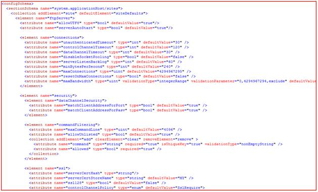](setting-up-components/_static/image5.jpg)

The following code snippet shows the corresponding DataContract for ProcessModel:

[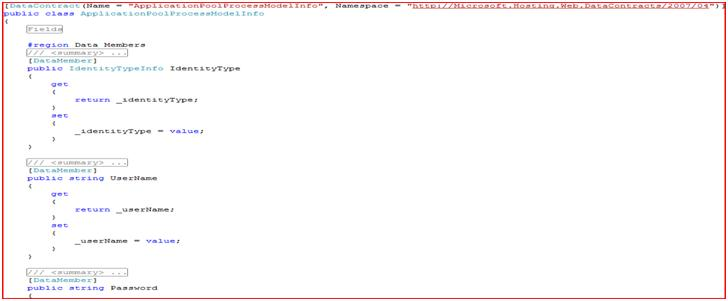](setting-up-components/_static/image9.jpg)

Refer to actual code for complete source code.

As described in previous articles, all service operations are grouped into three categories:

- Provisioning
- Management
- Query

Following this pattern, all web subsystem related service operations are defined by the following three service contracts:

- IProvisioningService
- IManagementService
- IQueryService

The following code snippets show the actual definitions for those three service contracts respectably:

[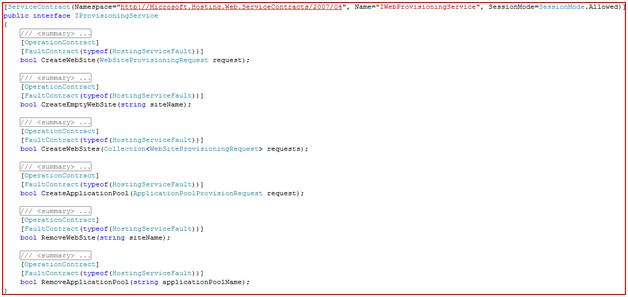](setting-up-components/_static/image13.jpg)

[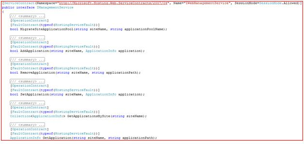](setting-up-components/_static/image17.jpg)

[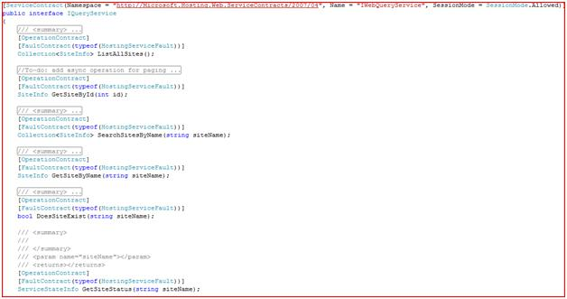](setting-up-components/_static/image21.jpg)

All service implementations are contained in the service implementation project, as illustrated in the following Visual Studio screen shot:

[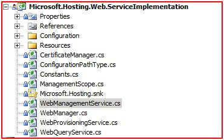](setting-up-components/_static/image25.jpg)

Due to the fact that certain operations overlap among these three services, all actual implementations are handled by the WebManager class as static methods, which leverages the managed APIs that come with IIS.

Beside Web related operations, there is CertificateManager class handling of all certificate-related operations. Windows Server® 2008 introduced new APIs for managing certificates, and those platform APIs are not exposed as managed code. CertificateManager uses p/invoke to wrap those APIs as managed APIs.

The service implementation project also contains some configuration related classes to enable the services to use settings defined in the configuration (i.e. web.config, app.config, etc).

As IIS 7.0 contains a large number of settings, not all service operations have been implemented as this point. We will continue to add more operations when time permits. However, by following the existing implementation, it is fairly easy to extend for more functionality, if needed by other users.

## FTP Subsystem

Microsoft has created a new FTP service, completely rewritten for Windows Server® 2008. This new FTP service incorporates many new features that enable web authors to publish content better than before, and offers web administrators more security and deployment options. Refer to related documentations for details about newly introduced FTP services.

### Schema and Diagrams

The back end configuration system for FTP service in Windows Server 2008 is based on the system architecture as IIS service. All FTP related settings are defined in the FTP\_Schema.xml file under windows\system32\inetsrv\config\. The following diagram shows a fragment of the schema file:

[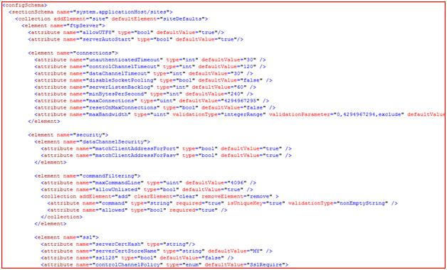](setting-up-components/_static/image29.jpg)

The implementation of the FTP subsystem follows the same design pattern as the web subsystem described above. It is illustrated in the following screen shot.

[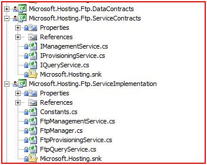](setting-up-components/_static/image33.jpg)

Since FTP service is an extension of the IIS service from a configuration perspective, the same managed APIs - Microsoft.Web.Administration - are used throughout the implementation. The FTPManager class contains all actual implementations of the service operations, and it depends on WebManager class described above to reuse some of the functionality.

## Content Storage Subsystem

The Content Storage subsystem provides a set of services for managing content on the Windows file system, such as creating a directory, setting directory/file permissions, and managing disk quota.

### Diagrams

The following diagrams show the same design pattern used for implementing services for content storage. Certainly, different file systems could be implemented following the same design pattern.

The actual implementation of the content storage service is in the class ContentStorageManager in the Microsoft.Hosting.Management component, since those functions can be shared by other services.

[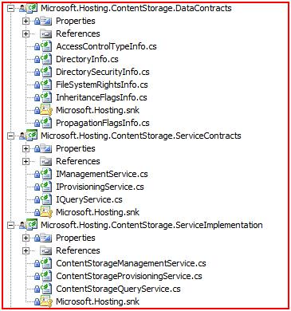](setting-up-components/_static/image37.jpg)

[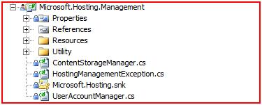](setting-up-components/_static/image41.jpg)

## User Account Subsystem

The User Account subsystem implements the common functions for creating local Windows user accounts, Active Directory users, OU and groups.

### Diagram Pattern

It follows the same design pattern as other subsystems. It consists of DataContracts, ServiceContracts, and ServiceImplementation. All service operations implementations are contained in the UserAccountManager class in Microsoft.Hosting.Component project.

[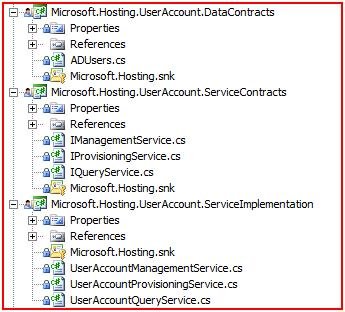](setting-up-components/_static/image45.jpg)

## SQL Subsystem

The SQL subsystem implements a set of operations for managing Microsoft SQL Server® 2005 related services, such as create database, backup/restore database, and so forth. It leverages the Microsoft SQL Server SMO (SQL Management Objects) for providing all functionality. To enable compiling and running the service, Microsoft SQL Server client components are required. You can implement similar service operations for different database products, such as Oracle and MySQL.

### Implementation Diagram

The implementation follows the same design pattern: it contains the DataContracts, ServiceContracts, and ServiceImplementation as illustrated below.

[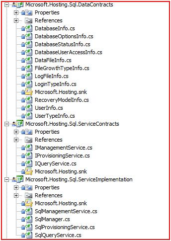](setting-up-components/_static/image49.jpg)

## Hosting the Sample Services

Two different hosting solutions have been implemented: IIS based hosting, and Windows Service based hosting.

### Options

Implement your own preferred hosting options by following WCF documentations for how to implement WCF Hosting:

- [Hosting in Internet Information Services](https://msdn.microsoft.com/library/ms734710.aspx)

Or

- [Hosting in a Windows Service Application](https://msdn.microsoft.com/library/ms734781.aspx)

More options are available at [WCF Hosting](https://msdn.microsoft.com/library/ms729846.aspx).

The following figure shows the two hosting solutions within Visual Studio.

[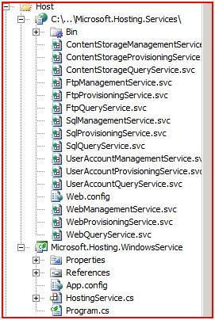](setting-up-components/_static/image53.jpg)

## Security Role Provider

The sample code uses the [Windows Role Provider](https://msdn.microsoft.com/library/6b241xwt.aspx) to perform a role check in WCF on every call to verify that the caller is a member of the WindowsBuiltInRole.Administrator group. This is implemented in the file WindowsAuthorizationManager.cs within the Microsoft.Hosting.Management project, as seen in the figure below.

[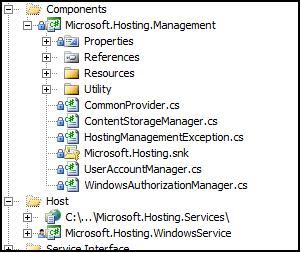](setting-up-components/_static/image57.jpg)

### Changing the Role

If there is a need to change this role, the method for modifying is CheckAccessCore, shown in the figure below

[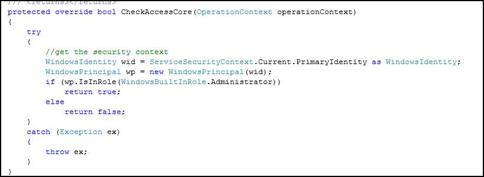](setting-up-components/_static/image59.jpg)