Configuring FTP User Isolation in IIS 7
====================
by [Robert McMurray](https://github.com/rmcmurray)

## Compatibility

| Version | Notes |
| --- | --- |
| IIS 7.5 | The FTP 7.5 service ships as a feature for IIS 7.5 in Windows 7 and Windows Server 2008 R2. |
| IIS 7.0 | The FTP 7.0 and FTP 7.5 services were shipped out-of-band for IIS 7.0, which required downloading and installing the service from the following URL: [https://www.iis.net/download/FTP](https://www.iis.net/downloads/microsoft/ftp). |

## Introduction

Microsoft has created a new FTP service that has been completely rewritten for Windows Server 2008. This new FTP service incorporates many new features that enable web authors to publish content better than before, and offers web administrators more security and deployment options.

This document will walk you through the various FTP user isolation settings using the new FTP user interface and by directly editing the IIS configuration files.

> [!NOTE]
> This walk-through contains a series of steps where you will be logging in to your FTP site using the local administrator account. These steps should only be followed on the server itself using the loopback address or over SSL from a remote server. If you prefer to use a separate user account instead of the administrator account, you will need to create the appropriate folders and set the correct permissions for that user account when necessary.

### Prerequisites

The following items are required to complete the procedures in this article:

1. IIS 7 must be installed on your Windows Server 2008 RC0 server, and the Internet Information Services Manager must be installed.
2. The new FTP service must be installed. You can download and install the FTP service from the [https://www.iis.net/](https://www.iis.net/) web site using one of the following links: 

    - [FTP for IIS 7 (x64)](https://go.microsoft.com/fwlink/?LinkID=143197)
    - [FTP for IIS 7 (x86)](https://go.microsoft.com/fwlink/?LinkID=143196)
3. You will need to create a root folder for FTP publishing: 

    - Create a folder at `%SystemDrive%\inetpub\ftproot`
    - Set the permissions to allow anonymous access: 

        - Open a command prompt.
        - Type the following command:

            [!code-console[Main](configuring-ftp-user-isolation-in-iis-7/samples/sample1.cmd)]
        - Close the command prompt.
4. You will need to create additional content folders: 

    - Create a folder at `%SystemDrive%\inetpub\ftproot\LocalUser\Public`
    - Create a folder at `%SystemDrive%\inetpub\adminfiles`

## Using the FTP Site Wizard to Create an FTP site

In this first section we will create a new FTP site that can be opened for Read-only access by anonymous users and Read/Write access by the administrator account. 

1. In IIS Manager, in the **Connections** pane, click the **Sites** node in the tree.
2. As shown in the image below, right-click the **Sites** node in the tree and click **Add FTP Site**, or click **Add FTP Site** in the **Actions** pane.  
    [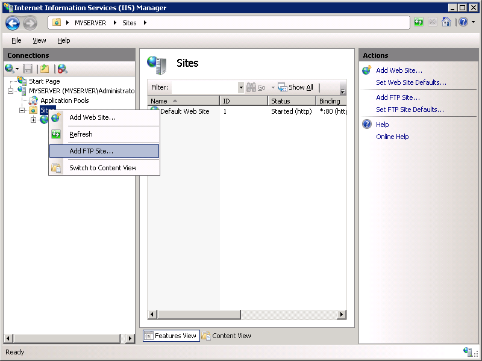](configuring-ftp-user-isolation-in-iis-7/_static/image1.png)
3. When the **Add FTP Site** wizard appears: 

    - Enter "My New FTP Site" in the **FTP site name** box, then navigate to the `%SystemDrive%\inetpub\ftproot` folder that you created in the Prerequisites section. Note that if you choose to type in the path to your content folder, you can use environment variables in your paths.
    - When you have completed these items, click **Next**.  
        [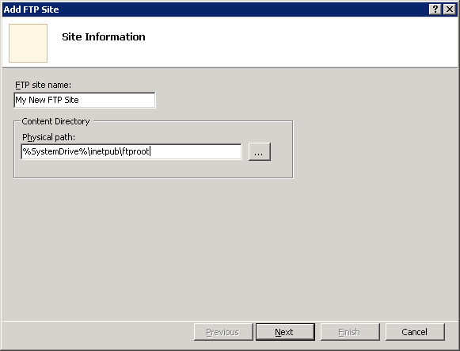](configuring-ftp-user-isolation-in-iis-7/_static/image5.png)
4. On the next page of the wizard: 

    - You would normally choose an IP address for your FTP site from the **IP Address** drop-down, or you could choose to accept the default selection of "All Unassigned." Because you will be using the administrator account later in this walk-through, you want to make sure that you restrict access to the server and enter the local loopback IP address for your computer by typing "127.0.0.1" in the **IP Address** box.
    - You would normally enter the TCP/IP port for the FTP site in the **Port** box. For this walk-through, you will choose to accept the default port of 21.
    - For this walk- through, you will not use a host name, so make sure that the **Virtual Host** box is blank.
    - Make sure that the **Certificates** drop-down is set to "Not Selected" and that the **Allow SSL** option is selected.
    - When you have completed these items, click **Next**.  
        [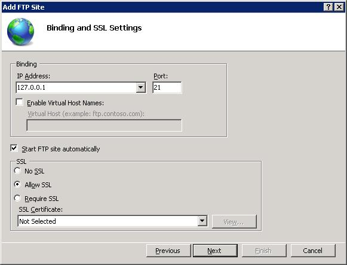](configuring-ftp-user-isolation-in-iis-7/_static/image1.jpg)
5. On the next page of the wizard: 

    - Select **Anonymous** for the **Authentication** settings.
    - For the **Authorization** settings, choose "Anonymous users" from the **Allow access to** drop-down, and select **Read** for the **Permissions** option.
    - When you have completed these items, click **Finish**.  
        [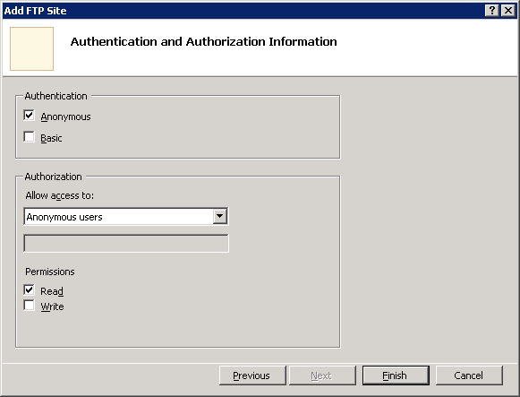](configuring-ftp-user-isolation-in-iis-7/_static/image11.png)
6. In IIS Manager, click the node for the FTP site that you created; this will display the icons for all of the FTP features.  
    [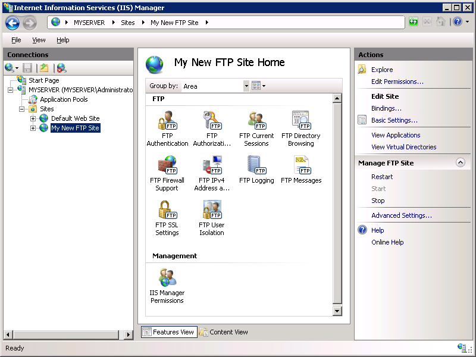](configuring-ftp-user-isolation-in-iis-7/_static/image15.png)
7. We need to add Basic Authentication so that users can log in. To do so, double-click the **FTP Authentication** icon to open the FTP authentication feature page.  
    [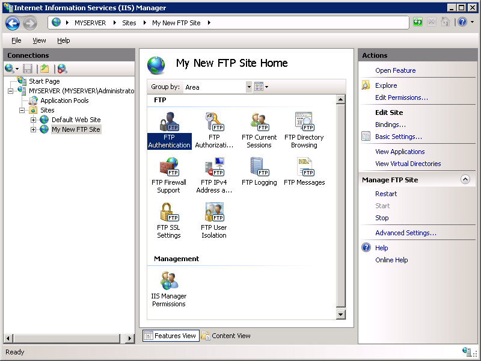](configuring-ftp-user-isolation-in-iis-7/_static/image19.png)
8. When the **FTP Authentication** page is displayed, highlight **Basic Authentication** and then click **Enable** in the **Actions** pane.  
    [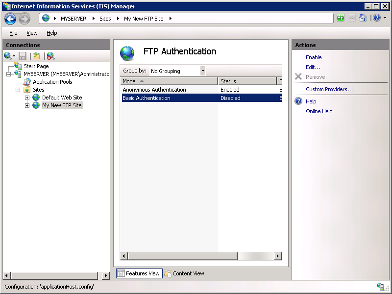](configuring-ftp-user-isolation-in-iis-7/_static/image23.png)
9. In IIS Manager, click the node for the FTP site to re-display the icons for all of the FTP features.
10. We need to add an authorization rule so that the administrator can log in. To do so, double-click the **FTP Authorization Rules** icon to open the FTP authorization rules feature page.  
    [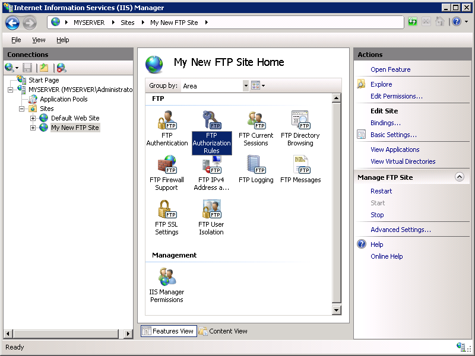](configuring-ftp-user-isolation-in-iis-7/_static/image27.png)
11. When the **FTP Authorization Rules** page is displayed, click **Add Allow Rule** in the **Actions** pane.  
    [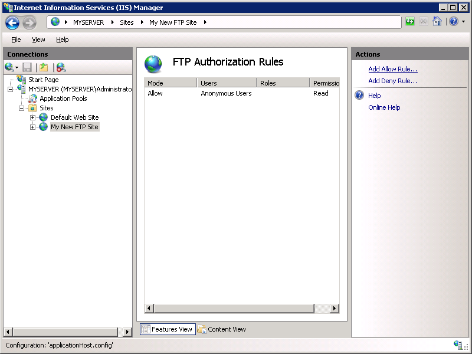](configuring-ftp-user-isolation-in-iis-7/_static/image31.png)
12. When the **Add Allow Authorization Rule** dialog box is displayed 

    - Select **Specified users**, then type "administrator" in the box.
    - For **Permissions**, select both **Read** and **Write**.
    - When you have completed these items, click **OK**.  
        [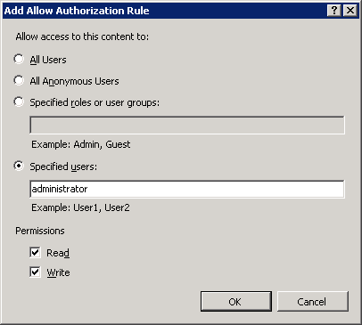](configuring-ftp-user-isolation-in-iis-7/_static/image35.png)

### Summary

To recap the items that you completed in this section:

1. You created a new FTP site named "My New FTP Site", with the site's content root at `%SystemDrive%\inetpub\ftproot`.
2. You bound the FTP site to the local loopback address for your computer on port 21, and we chose not to use Secure Sockets Layer (SSL) for the FTP site.
3. You created a default rule for the FTP site to allow anonymous users "Read" access to the files.
4. You added an authorization rule that allows the administrator account both "Read" and "Write" permissions for the FTP site.
5. You added Basic Authentication to the FTP site.

## Examining the New FTP User Isolation Settings

1. In IIS Manager, click the node for the FTP site that you created; this will display the icons for all of the FTP features.
2. Double-click the **FTP User Isolation** icon to open the FTP user isolation feature.  
    [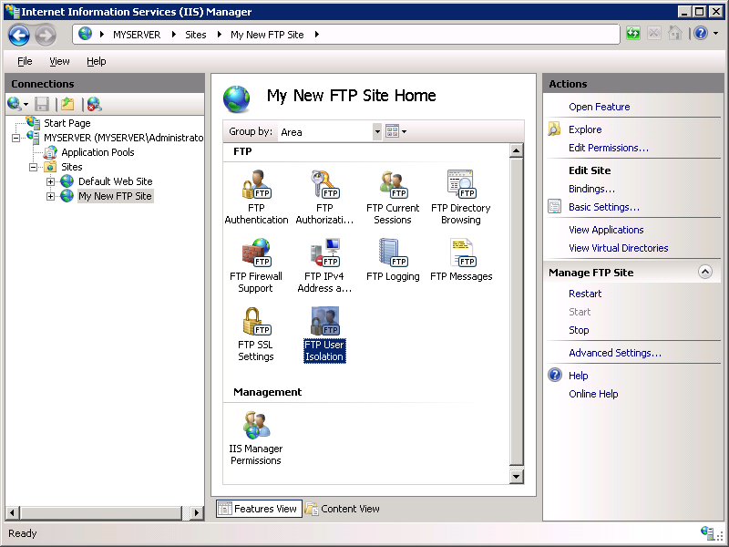](configuring-ftp-user-isolation-in-iis-7/_static/image39.png)
3. When the **FTP User Isolation** feature page is displayed, notice that you have five different options available:  
    
4. These five options are defined as: 

    - **Do not isolate users. Start users in**: 

        - **FTP root directory**

            - This option specifies that all FTP sessions will start in the root directory for the FTP site.
                > [!NOTE]
                > This option is new in this FTP server, and simply disables all user isolation or starting folder logic.
        - **User name directory**

            - This option specifies that all FTP sessions will start in the physical or virtual directory with the same name of the currently logged on user if the folder exists; otherwise, the FTP session will start in the root directory for the FTP site.
                > [!NOTE]
                > This option is the same as choosing no user isolation in the IIS 6.0 FTP server. For additional information about using this option, see the "Do Not Isolate Users Mode" section in the [Hosting Multiple FTP Sites with FTP User Isolation (IIS 6.0)](https://go.microsoft.com/fwlink/?LinkId=62833) topic.
    - **Isolate users. Restrict users to the following directory**: 

        - **User name directory (disable global virtual directories)**

            - This option specifies that you want to isolate FTP user sessions to the physical or virtual directory with the same name of the FTP user account. The user sees only their FTP root location and is, therefore, restricted from navigating higher up the physical or virtual directory tree. Any global virtual directories that are created will be ignored.
                > [!NOTE]
                > This option is new in this FTP server.
        - **User name physical directory (enable global virtual directories)**

            - This option specifies that you want to isolate FTP user sessions to the physical directory with the same name of the FTP user account. The user sees only their FTP root location and is, therefore, restricted from navigating higher up the physical directory tree. Any global virtual directories that are created will apply to all users.
                > [!NOTE]
                > This option is the same as choosing user isolation in the IIS 6.0 FTP server.
        - **FTP home directory configured in Active Directory**

            - This option specifies that you want to isolate FTP user sessions to the home directory that is configured in the Active Directory account settings for each FTP user.
                > [!NOTE]
                > This option is the same as choosing Active Directory user isolation in the IIS 6.0 FTP server. For additional information about using this option, see the "Isolate Users Using Active Directory Mode" section in the [Hosting Multiple FTP Sites with FTP User Isolation (IIS 6.0)](https://go.microsoft.com/fwlink/?LinkId=62833) topic.

## Configuring User Isolation Settings by Physical Directories

When isolating users by physical directories only, all FTP user sessions are restricted to the physical directory with the same name of the FTP user account. However, any global virtual directories that are created will apply to all users.

1. In IIS Manager, click the node for the FTP site that you created; this will display the icons for all of the FTP features.
2. Double-click the **FTP User Isolation** icon to open the FTP user isolation feature.  
    
3. When the FTP User Isolation feature page is displayed, select the **User name physical directory (enable global virtual directories)** option, then click **Apply** in the **Actions** pane.  
    [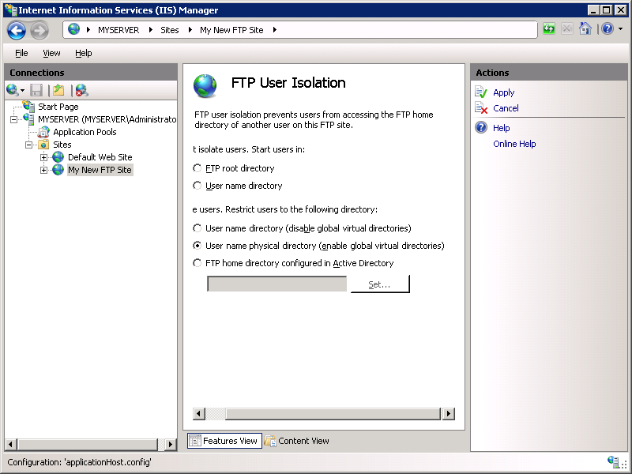](configuring-ftp-user-isolation-in-iis-7/_static/image51.png)

### Logging in to your FTP site

You can now log in to your FTP site using user isolation, but the following information applies:

1. If you log in to your FTP site anonymously, your session will be restricted to the "LocalUser\Public" folder that you created in the Prerequisites section.
2. If you attempt to log in to your FTP site using the administrator account, your logon request will be denied because the administrator account does not have a home directory defined. To allow the administrator account to log in you would need to create a home directory for the administrator account at `%SystemDrive%\inetpub\ftproot\LocalUser\Administrator`. After which, if you logged in to your FTP site using the administrator account, your session will be restricted to the "LocalUser\Administrator" folder that you just created.

### Summary

To recap the items that you completed in this step, you configured FTP user isolation using the **User name physical directory (enable global virtual directories)** option. When using this mode of user isolation, all FTP user sessions are restricted to the physical directory with the same name of the FTP user account, and any global virtual directories that are created will apply to all users.

To create home directories for each user, you first need to create a physical directory under your FTP server's root folder that is named after your domain or named LocalUser for local user accounts. Next, you need to create a physical directory for each user account that will access your FTP site. The following table lists the home directory syntax for the authentication providers that ship with the FTP service:

| User Account Types | Physical Home Directory Syntax |
| --- | --- |
| Anonymous users | %FtpRoot%\LocalUser\Public |
| Local Windows user accounts (requires basic authentication) | %FtpRoot%\LocalUser\%UserName% |
| Windows domain accounts (requires basic authentication) | %FtpRoot%\%UserDomain%\%UserName% |
| IIS Manager or ASP.NET custom authentication user accounts | %FtpRoot%\LocalUser\%UserName% |

> [!NOTE]
> In the above table, %FtpRoot% is the root directory for your FTP site; for example, `C:\Inetpub\Ftproot`.

**Important Note**: Global virtual directories are enabled; all virtual directories that are configured at the root-level of your FTP site can be accessed by all FTP users, provided that they have sufficient permissions.

## Configuring User Isolation Settings for All Directories

When isolating users for all directories, all FTP user sessions are restricted to the physical or virtual directory with the same name of the FTP user account. In addition, all global virtual directories that are created will be ignored. In this step you will configure user isolation for all directories, and add a virtual directory for the administrator user.

1. In IIS Manager, click the node for the FTP site that you created; this will display the icons for all of the FTP features.
2. Double-click the **FTP User Isolation** icon to open the FTP user isolation feature.  
    
3. When the **FTP User Isolation** feature page is displayed, select the **User name directory (disable global virtual directories)** option, then click **Apply** in the **Actions** pane.  
    
4. Expand the tree node for your FTP site, then right-click the LocalUser folder and click **Add Virtual Directory**.
    > [!NOTE]
    > In this example the "LocalUser" folder is a physical directory, but a virtual directory could also have been used.
    [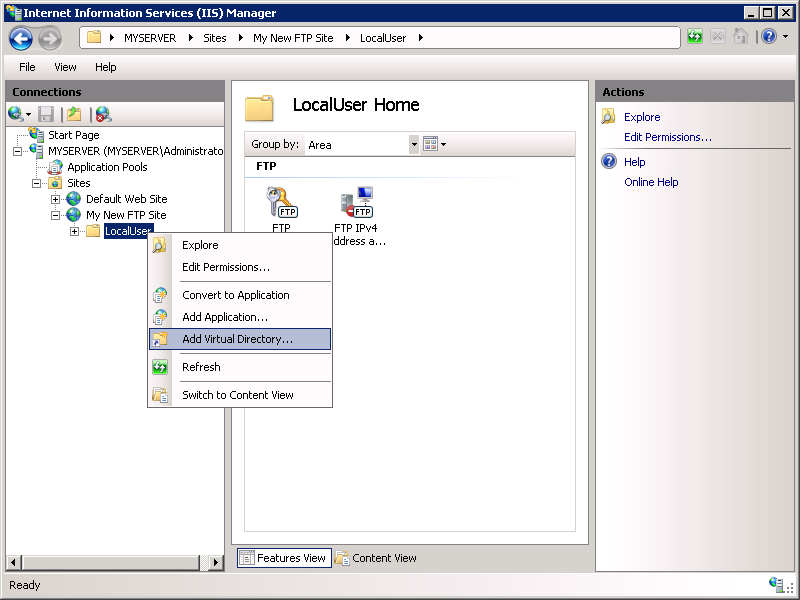](configuring-ftp-user-isolation-in-iis-7/_static/image63.png)
5. When the **Add Virtual Directory** dialog box appears: 

    - Enter "administrator" for the **Alias**.
    - Enter `%SystemDrive%\inetpub\adminfiles` for the **Physical path**.
    - When you have completed these items, click **OK**.  
        [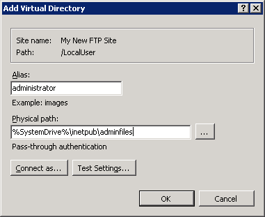](configuring-ftp-user-isolation-in-iis-7/_static/image67.png)

### Logging in to your FTP site

You can now log in to your FTP site using user isolation, but the following information applies:

1. As with Step 3, if you log in to your FTP site anonymously, your session will be restricted to the "LocalUser\Public" folder that you created in the Prerequisites section.
2. If you log in to your FTP site using the administrator account, your session will be restricted to the "/LocalUser/administrator" virtual directory that you just created.

### Summary

To recap the items that you completed in this step, you configured FTP user isolation using the **User name directory (disable global virtual directories)** option. When using this mode of user isolation, all FTP user sessions are restricted to the virtual or physical directory with the same name of the FTP user account, and any global virtual directories that are created will be ignored.

To create home directories for each user, you first need to create a virtual or physical directory under your FTP server's root folder that is named after your domain or named LocalUser for local user accounts. Next, you need to create a virtual or physical directory for each user account that will access your FTP site. The following table lists the home directory syntax for the authentication providers that ship with the FTP service:

| User Account Types | Physical Home Directory Syntax |
| --- | --- |
| Anonymous users | %FtpRoot%\LocalUser\Public |
| Local Windows user accounts (requires basic authentication) | %FtpRoot%\LocalUser\%UserName% |
| Windows domain accounts (requires basic authentication) | %FtpRoot%\%UserDomain%\%UserName% |
| IIS Manager or ASP.NET custom authentication user accounts | %FtpRoot%\LocalUser\%UserName% |

> [!NOTE]
> In the above table, %FtpRoot% is the root directory for your FTP site; for example, `C:\Inetpub\Ftproot`.

Global virtual directories are ignored; all virtual directories that are configured at the root-level of your FTP site cannot be accessed by any FTP users. All virtual directories must be explicitly defined under a user's physical or virtual home directory path.