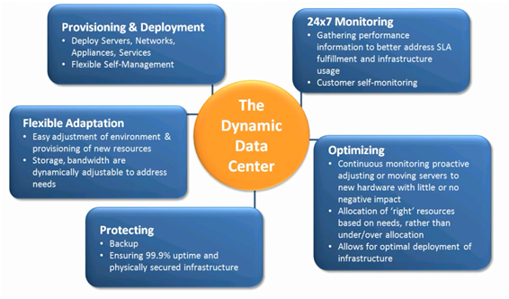

Dynamic Data Center Toolkit for Hosting
====================
by Brad Joseph

## Dynamic Data Center Toolkit for Hosting

Microsoft is makes it possible for hosting providers to offer dedicated host services with the Dynamic Data Center Toolkit for Hosting Providers, a free, extensible toolkit that makes it possible for hosting providers to provide virtualized IT infrastructure and managed services to their customers.

- Step-by-step instructions that you can use to build an instantly scalable virtualized infrastructure
- Sample code and best practices
- Marketing collateral to help you market and sell managed services

 With the Dynamic Data Center Toolkit for Hosting Providers, you can deliver services built on Microsoft Windows Server 2008 Hyper-V and Microsoft System Center. The toolkit also contains guidance on how to establish appropriate service level agreements (SLAs) and how to create portals that customers can use to directly provision, manage, and monitor their infrastructure.This section discusses best practices and technical guidance for using [Dynamic Data Center Toolkit for Hosting Providers](https://www.microsoft.com/hosting/dynamicdatacenter/Home.html). 