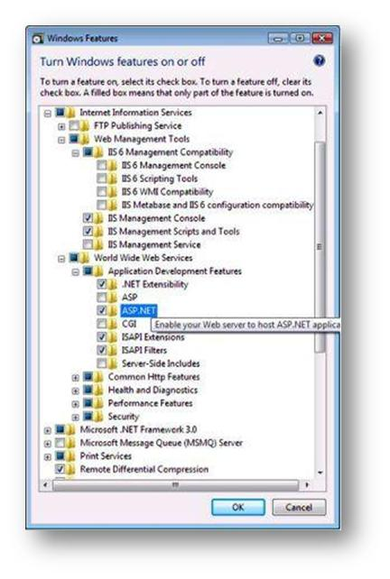

Upgrading ASP.NET 1.1 to IIS 7.0 on Windows Vista and Windows Server 2008
====================
by IIS Team

## Introduction

For ASP.NET application developers who move to the Windows Vista™ or later Windows operating system, IIS 7.0 and above represent a significant advance over earlier IIS versions. IIS Integrated mode offers increased security and new application possibilities, among other improvements.

Most developers who move to Windows Vista upgrade from the Microsoft Windows® XP operating system to Windows Vista and upgrade their ASP.NET applications in the process. Or they install on Windows Vista the ASP.NET applications developed on other Windows operating systems.

This paper details important post-installation and post-upgrade configuration steps that must be performed for applications to work on the new operating system. It describes changes between Classic mode and IIS Integrated mode that affect ASP.NET applications, and how to work around these known problems.

One of the significant improvements in IIS 7.0 and above is an integrated pipeline feature that enables Web applications to use a single request-processing pipeline from either managed or non-managed code applications. In addition, the new pipeline model reduces redundant behavior that results from two separate implementations of the same feature.

For example, in previous releases, IIS and ASP.NET implemented separate request pipelines that did not share access to events and handler modules. Authentication was performed independently within each pipeline. In the new model, authentication can be done one time for IIS and ASP.NET.

Other benefits of this integration include:

- ASP.NET services such as Forms Authentication and Roles working with IIS content types–for example, static and classic ASP pages.
- IIS functionality extending with managed code and with ASP.NET pipeline modules, instead of only with ISAPI extensions or CGI.
- Simplified troubleshooting resulting from the integration of event tracing and error logging.
- Sharing application configuration between ASP.NET and IIS.

This article examines compatibility issues for ASP.NET applications migrating from earlier versions of IIS to IIS 7.0 and above and specifically focuses on differences that relate to transitioning from Classic mode to using the integrated pipeline in Integrated mode.

For a complete overview of the features and benefits of ASP.NET and IIS integration, see the article [ASP.NET Integration with IIS 7.0 and Above](aspnet-integration-with-iis.md).

## Upgrading from Earlier Versions of IIS to Windows Vista

The chart that follows shows the availability of IIS 7.0 on the available versions of Windows Vista:

| Windows Vista Version | IIS 7.0 Availability |
| --- | --- |
| Home Basic | N |
| Home Premium | Y |
| Business | Y |
| Ultimate | Y |

### ASP.NET Upgrade Scenarios on Windows Vista

The following table provides a brief outline of the supported upgrade paths for ASP.NET on earlier versions of Windows operating systems to ASP.NET on Windows Vista. Where issues are noted, see the sections that follow for more information about upgrade restrictions and limitations.

The table also shows that upgrades from server OS versions to client OS versions are not available. Instead, you must perform a clean installation of Vista on a computer with a server OS currently installed.

| Operating System | IIS Version | .NET Framework Version | Considerations when Upgrading to Windows Vista / IIS 7.0 |
| --- | --- | --- | --- |
| Windows 2000 Server | IIS 5.0 | 1.0, 1.1, 2.0 | Upgrade to Windows Vista not available. |
| Windows 2000 Professional | IIS 5.0 | 1.0, 1.1, 2.0 | Clean Install of OS is required. |
| Windows Server 2003 | IIS 6.0 | 1.0, 1.1, 2.0 | Upgrade to Windows Vista not available. |
| Windows XP Home | N/A | 1.0, 1.1, 2.0 | Windows XP Home did not include IIS. Users may decide to install IIS 7.0 or above new on Windows Vista. |
| Windows XP Professional | IIS 5.1 | 1.0 | The .NET Framework 1.0 is not supported on Windows Vista. ASP.NET 1.0 applications must be upgraded to at least ASP.NET 1.1 (ASP.NET 2.0 recommended). |
| 1.1 | Manual configuration is required after upgrade (see later in this article). |
| 2.0 | ASP.NET must be selected in the IIS setup options following an upgrade in order for ASP.NET 2.0 to be configured in Integrated Mode. |
| Windows XP Tablet PC | IIS 5.1 | 1.0 | The .NET Framework 1.0 is not supported on Windows Vista. ASP.NET 1.0 applications must be upgraded to at least ASP.NET 1.1 (ASP.NET 2.0 recommended). |
| 1.1 | Manual configuration is required after upgrade (see later in this article). |
| 2.0 | ASP.NET must be selected in the IIS setup options following an upgrade in order for ASP.NET 2.0 to be configured in Integrated Mode. |
| Windows XP Professional x64 | IIS 5.1 | 1.1, 2.0 | Clean Install of OS is required. |

### Post-Installation Application Configuration

Immediately following an installation or upgrade to Windows Vista, users must perform additional configuration steps to enable applications to work. The post-installation configuration depends on the ASP.NET version that each application uses.

### Configuring ASP.NET 1.1 Applications

Before installing the .NET Framework 1.1 (which is needed if you are running ASP.NET 1.1 applications), users must perform the following two steps to enable ASP.NET applications:

#### Procedure

Each IIS application pool that runs an ASP.NET application must be explicitly configured using the .NET Framework version that matches the version of ASP.NET used for the application. You can only run one version of ASP.NET per application pool, so you must use separate application pools for each ASP.NET version.

In the IIS Manager console, open Application Pools, then right-click an application pool and select Basic Settings. In the Edit Application Pool dialog box shown in Figure 1, select the .NET Framework version that matches the applications configured in the application pool, then click OK.

**Figure 1: Edit Application Pool Settings**

## Using ASP.NET 1.1 in Classic Mode

ASP.NET 1.1 uses an IIS ISAPI extension when running in Classic mode, which is the default setting for ASP.NET following installation or upgrade (notice that ASP.NET 2.0 can also run in Integrated mode on Windows Vista, which does not require an ISAPI extension).

You must explicitly allow the version of ASP.NET used by your applications to run using the ISAPI and CGI Restrictions configuration in the IIS Management Console. Open IIS Manager and select ISAPI and CGI Restrictions. In the ISAPI and CGI Restrictions page, select each version of ASP.NET that is set to Not Allowed in the Restriction column and click the Allowed link on the right side of the page to change the setting to Allowed.

Figure 2 shows an example of the ISAPI and CGI Restrictions page with the version of the Aspnet\_isapi.dll assembly used for ASP.NET 1.1 selected. In the figure, the setting for this ISAPI extension must be changed from Not Allowed to Allowed.

**Figure 2: ISAPI and CGI Restrictions List**

### Configuring ASP.NET 2.0 Applications

The .NET Framework 2.0 is installed during Windows Vista installation and therefore, ASP.NET 2.0 is already present on the server after installation. However, to complete the ASP.NET configuration on Vista for ASP.NET 2.0 applications, users must perform the following two steps:

#### Step 1

From the Windows Vista Package Manager (Control Panel\Programs and Features\Turn Windows Features On or Off), select ASP.NET as shown in Figure 3, and click OK.

> [!NOTE]
> When ASP.NET is already installed on the computer before this step, selecting ASP.NET in this manner ensures that additional configuration steps are completed.

**Figure 3: Windows Vista Installation - Windows Features**

#### Step 2

Each IIS application pool that runs an ASP.NET application must be explicitly configured using the .NET Framework version that matches the version of ASP.NET used for the application. You can only run one version of ASP.NET per application pool, so you must use separate application pools for each ASP.NET version.

In IIS Manager, open Application Pools, then right-click an Application Pool and select Basic Settings. In the Edit Application Pool dialog box shown in Figure 4, select the .NET Framework version that matches the applications configured in the application pool, and then click OK.

**Figure 4: Application Pool &amp; Integrated Mode**

### Application Pool Settings

When upgrading ASP.NET applications on earlier versions of Windows operating systems to Windows Vista, applications are configured in application pools based on IIS application isolation settings as follows:

| IIS Isolation Configuration Before Upgrade | IIS Application Pool | IIS Application Pool Identity |
| --- | --- | --- |
| Low | AppPool Low | NT AUTHORITY\NETWORK SERVICE |
| Medium | AppPool Medium | IWAM\_&lt;machine name&gt; |
| High | Applications are configured in an Application Pool matching the application name | IWAM\_&lt;machine name&gt; |

### ASP.NET v1.0 is Not Supported on Windows Vista

The .NET Framework 1.0 is not supported on Windows Vista and therefore, ASP.NET 1.0 applications must be upgraded to at least ASP.NET 1.1. We strongly recommend that you upgrade your ASP.NET 1.0 applications to ASP.NET 2.0 to take advantage of the better performance and maintainability features found in the later versions of ASP.NET.

### HTTP Handlers

In an upgrade to IIS 7.0 and above on Windows Vista, only preconditioned HTTP handlers configured at the global level are upgraded. Handlers configured at the site level are not upgraded.

### Side-by-Side Support

You can run applications developed on different versions of ASP.NET (for example, 1.1 and 2.0) side-by-side on IIS. You must configure applications in an IIS application pool. This pool must be configured for the version of ASP.NET for which the application was developed. You can configure only one ASP.NET version per application pool.

### The .NET Framework 1.1 Requires WoW 64 Configuration on 64-bit Windows Vista

ASP.NET is not set up correctly if the .NET Framework 1.1 is installed on 64-bit versions of Windows Vista. After installing the .NET Framework 1.1 on 64-bit versions of Windows Vista, you must manually configure applications to run using WOW 64 at the global level using the IIS Administration tool.

## Configuring the Pipeline Mode Used by an Application

IIS is configured to use the new Integrated mode for new applications. This is the default behavior. The pipeline mode is configured using the application pool settings. Change these settings using one of the following:

- The IIS Administration Tool
- The APPCMD.EXE command line tool
- By editing the application configuration file with a text editor

If you are upgrading an existing computer to IIS 7.0 or above, the applications are configured to run in Classic mode by default. Classic mode provides compatibility for applications that have specific dependencies on the implementation of the HTTP pipeline in earlier versions of IIS.

However, if you are importing an existing application to a computer running IIS 7.0 and above, and you are copying the Web site, the pipeline mode used is determined by the settings of the application pool that the application is configured to run in.

For example, if you copy the application to your computer and configure it to run in the Default Application Pool, it runs using that application pool's settings which, by default, are configured to Integrated mode. To change the pipeline mode for your application, either change the Default Application Pool settings or create a new application pool with the settings that you want.

Read more about how to configure an existing application to use Integrated mode in the article [ASP.NET Integration with IIS 7.0 and Above](aspnet-integration-with-iis.md), in the section entitled, "Migrating ASP.NET Applications to IIS 7.0 and Above Integrated mode". This provides instructions for changing the application configuration settings.

## Compatibility

ASP.NET Pipeline modules developed against earlier versions of IIS and later configured to use Integrated mode with IIS 7.0 and above may experience differences in behavior or other compatibility issues. Such problems are caused by the architectural differences between the pipeline in earlier IIS versions and the modular design of IIS 7.0 and above, and the integrated HTTP pipeline.

The remaining sections of this article describe potential compatibility issues that applications may encounter and include suggested workarounds. If a suggested workaround is not practical to implement, configure your application to run in Classic mode to avoid the compatibility issue.

## Known Differences Between Integrated Mode and Classic Mode

The following provides a list of know issues between the two modes. Read this list carefully.

#### In Integrated mode, Application\_OnError is not called for exceptions that occur in HttpApplication::Init

In Integrated mode, exceptions that occur during the initialization of an application or module cannot be intercepted using the Application.Error event.

Also, applications that use Server.ClearError to recover from errors cannot clear errors during application initialization. This is to prevent an application from ignoring an error during initialization. Applications that log error information for each exception that occurs will not be able to log the errors that occur during application initialization, although these errors are reported using Web events and HTTP responses.

If an application requires implementation of such exception handling during initialization, it must be run in Classic mode rather than in Integrated mode.

#### Server.ClearError in EndRequest does not clear exception message in Integrated mode

In Integrated mode, calling Server.ClearError in EndRequest does not clear the exception response if an exception has occurred earlier in request processing. Applications that clear the exception message in EndRequest cannot remove the exception output from the response.

If an application requires implementation of such exception handling during EndRequest, it must be run in Classic mode rather than in Integrated mode.

#### Integrated mode applications may write to a response in EndRequest after an exception has been formatted and written to the response

In Integrated mode, it is possible to write to and display an additional response written after an exception has occurred.

This does not occur in Classic mode. If an error occurs during the request, and the application writes to the response in EndRequest after the exception has occurred, the response information written in EndRequest displays. This only affects requests that include unhandled exceptions.

To avoid writing to the response after an exception, an application must check HttpContext.Error or HttpResponse.StatusCode before writing to the response.

#### In Integrated mode, ASP.NET no longer suppresses the content type when the response is empty

In Integrated mode, ASP.NET handlers generate Content Type headers when explicitly set by a module, even if the response is empty. Some applications generate a content type for empty responses. If desired, modify applications to explicitly remove the Content Type header by setting it to NULL.

#### Different windows identity in Forms authentication

When Forms Authentication is used by an application and anonymous access is allowed, the Integrated mode identity differs from the Classic mode identity in the following ways:

- ServerVariables["LOGON\_USER"] is filled.
- Request.LogognUserIdentity uses the credentials of the [NT AUTHORITY\NETWORK SERVICE] account instead of the [NT AUTHORITY\INTERNET USER] account.

This behavior occurs because authentication is performed in a single stage in Integrated mode. Conversely, in Classic mode, authentication occurs first with IIS using anonymous access, and then with ASP.NET using Forms authentication. Thus, the result of the authentication is always a single user-- the Forms authentication user. AUTH\_USER/LOGON\_USER returns this same user because the Forms authentication user credentials are synchronized between IIS and ASP.NET.

A side effect is that LOGON\_USER, HttpRequest.LogonUserIdentity, and impersonation no longer can access the Anonymous user credentials that IIS would have authenticated by using Classic mode.

#### Default Authentication\_OnAuthenticate event does not raise in Integrated mode

In Integrated mode, the DefaultAuthenticationModule.Authenticate event no longer raises. In Classic mode, this event is raised when no authentication has occurred. In Integrated mode, an application that sets authentication mode=None, and subscribes to the DefaultAuthentication.Authenticate event, will receive an exception indicating that this feature is not supported in Integrated mode. Authentication schemes that rely on this pattern will not function.

To work around this change, Integrated mode applications may subscribe to AuthenticateRequest instead.

#### In Integrated mode Request.RawUrl contains the new query string after RewritePath is called

In Integrated mode, after RewritePath is called on a URL with a new query string, the Request.RawUrl property contains the new query string. In Classic mode, it contains the old query string.

To work around this change, rewrite your application so that it does not depend on the old behavior.

#### Passport Network credentials authentication is not supported in Windows Vista

Passport Network credentials functionality is removed from Windows Vista and the Microsoft Windows Server® 2008 operating system, so Passport Network credentials authentication applications do not work by default in ISAPI or Integrated mode.

#### PassportAuthentication module is not part of the Integrated pipeline

In Integrated mode, the ASP.NET Passport Authentication Module is removed from the pipeline by default. If it is used by an application, it may be added back into the pipeline. As stated above, the underlying Passport Network credentials functionality is removed from Windows Vista and Microsoft Windows Server 2008, so Passport Network credentials authentication applications do not work by default in ISAPI or Integrated mode.

#### Large, valid forms auth tickets (length &lt;= 4096 bytes) present in the query string are rejected by IIS 7.0 and Above

IIS rejects requests with large cookieless ASP.NET tickets, such as those used in Forms authentication, session state, and anonymous id that in total exceed 4096 bytes. For security reasons, this prevents buffer overflow exploits that use large query strings. Applications that store custom data or that use very large user names in Forms authentication tickets may see that requests are rejected because the query strings are too large.

To change this behavior, adjust the maximum query string size in the IIS request-filtering configuration section.

#### In Integrated mode, the ASP.NET request time-out is applied multiple times during the request, allowing the request to execute longer

In Integrated mode, the managed request execution time-out is reset for each new transition in the pipeline. This means that the request can use up to (time-out \*(# of module notifications)), as long as any single time-out does not exceed the maximum time set for a time-out.

Slow requests may not be aborted or may take a significantly longer time before aborting, depending on the number of ASP.NET modules and how well these modules are merged together. Avoid this behavior by reducing the length of time setting for the time-out.

#### Trace settings are not transferred to Server.Transfer target page

Integrated mode does not support transferring trace settings to the target of a Server.Transfer operation.

#### The method Httpcontext.Current.Response.Write() cannot work in Application\_Onstart()

In Integrated mode, an application cannot call Http.Current.Response.Write() in an Application\_Onstart() method.

#### HttpRequest.LogonUserIdentity throws an exception when accessed before PostAuthenticateRequest

In Integrated mode, the HttpRequest.LogonUserIdentity property will throw an exception when it is accessed before PostAuthenticateRequest. If a module accesses this property before PostAuthenticateRequest, an exception is thrown.

To avoid this behavior: do not access this property in your application; or, access it after PostAuthenticateRequest completes.

#### In Integrated mode, ASP.NET modules will receive the first unauthenticated request to IIS 7.0 and above when Anonymous authentication is disabled

In Integrated mode, when an IIS authentication scheme other than Anonymous authentication is used, the first request from the client that does not contain the required credentials is visible to ASP.NET modules in the BeginRequest and AuthenticateRequest stages.

In comparison, in Classic mode an ASP.NET application would not see such a request because IIS rejects it with a 401 challenge before ASP.NET has a chance to process it.

This means that ASP.NET modules will see an extra request in the BeginRequest and AuthenticateRequest stages. The request appears in Web events and in any custom logging done in BeginRequest or EndRequest.

#### ASP.NET cannot impersonate the client identity until PostAuthenticateRequest

In Integrated mode, ASP.NET will not impersonate the client until the PostAuthenticateEvent if client impersonation is enabled for an application using the application's Web.config or in Machine.config.

Also, when client impersonation is enabled, modules running in the BeginRequest and AuthenticateRequest events execute with the process identity instead of with the authenticated user's identity. This should not be a problem because modules rarely access resources in these events, since the authenticated user has not yet been established.

However, if this is done, the process identity is used to access resources.

Because of the possible elevation of user rights that this change may cause, IIS throws an exception when client impersonation is enabled. This indicates that the application should either be moved to Classic mode or that this error should be turned off if it can be confirmed that resources are accessed in the BeginRequest or AuthenticateRequest events.

#### Content-Type header is not generated when charset and content type are set to empty string

HTTP.sys no longer generates the Content-Type header when it is explicitly set to String.Empty. Applications whose clients rely on having an empty Content-Type header may be affected by this change.

#### In Integrated mode, both synchronous and asynchronous events raise for each module before the next module executes

In Integrated mode, both synchronous and asynchronous events will raise for each module, before the server moves on to the next module.

This differs from Classic mode in which all asynchronous module notifications execute first, followed by all synchronous notifications. There should be no effect to applications unless there is a dependence on the ordering (see "The ordering of modules is reversed for PreSendRequestHeaders and PreSendRequestContent when using Integrated mode" elsewhere in this document).

#### Response headers are removed in Integrated mode after calling ClearHeader in a custom IHttpModule

In Integrated mode, calling ClearHeaders does not automatically generate default headers. Applications that call ClearHeaders to return the headers to the default state for an .aspx page instead clear all response headers.

#### Using Windows and Forms authentication together in Integrated mode is not supported

In Integrated mode, setting Impersonate=true and using Forms authentication is not supported and causes an error or incorrect behavior.

#### In Integrated mode, IIS 7.0 and above always rejects new lines in response headers (even if ASP.NET enableHeaderChecking is set to false)

In Integrated mode, an exception is thrown when you try to set a response header to a value that contains \r or \n. In Classic mode, this value is encoded by default and passed through if header encoding is turned off. For security reasons, applications should not try to write unencoded new lines in header values.

#### PreSendRequestHeaders and PreSendRequestContent events will raise together for each module

In Integrated mode, modules that subscribe to the PreSendRequestHeaders and PreSendRequestContent events are notified together for the PreSendRequestHeaders and PreSendRequestContent events.

For example, an application may break if module A has a dependency on module B running first in PreSendRequestHeaders, before module A runs for PreSendRequestContent, such as if module B modifies some request state and module A relies on it.

#### The ordering of modules is reversed for PreSendRequestHeaders and PreSendRequestContent when using Integrated mode

In Integrated mode, modules that subscribe to PreSendRequestHeaders and PreSendRequestContent will be notified in the opposite order of their appearance in the section. Applications that have multiple modules configured to run in either of these events are affected by this change if they share a dependency on event ordering.

To work around such issues, either change the order of modules in the section or run the application in Classic mode.

#### In Integrated mode, threading and queuing settings in are ignored

In Integrated mode, ASP.NET—not IIS—processes requests on threads, and does not use the threading or queuing semantics used in Classic mode. Because of this difference, applications may experience different throughput or stress behavior in Integrated mode than when running in Classic mode.

#### If a configuration file error is encountered when using Integrated mode, IIS, not ASP.NET, generates the error message

For applications running in Integrated mode, IIS now reads application configuration files. Therefore, if malformed XML is found in the Web.config file or if there are configuration errors in the file, IIS always generates an error message, and not ASP.NET.

Because IIS and ASP.NET write errors in different formats, the format of the error message differs depending on whether the application runs in Integrated mode or Classic mode. Here is an example of one type of a configuration file error that IIS generates: Internal Server Error Config error: Configuration file is not well-formatted XML

#### In Integrated mode, ASP.NET applications must subscribe to pipeline events during a module's Init call

ASP.NET applications using the ASP.NET HTTP pipeline could subscribe to application events outside the pipeline. However, ASP.NET applications using the IIS Integrated mode pipeline must now always subscribe to events during the module's Init() method. The example that follows shows how an event subscription is implemented in Init:

[!code-vb[Main](upgrading-aspnet-11-to-iis-on-windows-vista-and-windows-server-2008/samples/sample1.vb)]

For more information about how to create IIS modules, see the article, [Developing a Module using .NET](https://go.microsoft.com/fwlink/?LinkId=78387).

## Additional Resources

For more information about upgrading to IIS 7.0 and above on Windows Vista, see the article on IIS 7.0 application compatibility on Windows Vista, [Compatibility and Feature Requirements for Windows Vista](https://go.microsoft.com/fwlink/?LinkID=77940).