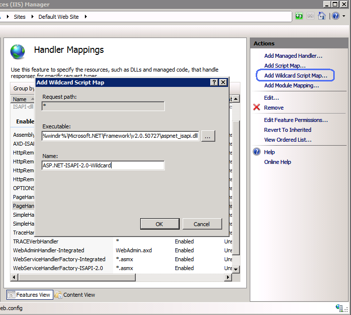

Wildcard script mapping and IIS 7 integrated pipeline
====================
by [Ruslan Yakushev](https://github.com/ruslany)

The big benefit of the IIS 7 and above integrated request processing pipeline is the fact that all the nice and useful ASP.NET features can be used for any type of content on your web site; not just for ASP.NET-specific content. For example, ASP.NET SQL-based membership can be used to protect static files and folders. Also, ASP.NET extensibility API's, such as **IHttpHandler** and **IHttpModule** can be used to add custom modules and handlers that would be executed even for non-ASP.NET content.

IIS 6 did not have this level of integration. ASP.NET was plugged into IIS 6 as an ISAPI extension and by default was configured to handle ONLY requests mapped to that extension - for example any request that ended with ".aspx" would be be processed by ASP.NET extension. This obviously was a big limitation for customers who wanted to be able to use ASP.NET features for all other contend on web site. The most common way to workaround that was to use "Wildcard script mapping". This post explains how an application that used wildcard script mapping in IIS 6 can be migrated over to IIS 7 and above.

Assume you had configured ASP.NET in IIS 6 to handle all requests by using wildcard script mapping. For example you had an ASP.NET module for URL rewriting and you wanted this module to handle extension-less URLs.

This wildcard script map configuration is typically done within IIS 6 manager by opening the properties dialog for either web server or web site and selecting **Home Directory** tab, then clicking on **Configuration** button and then clicking on the **Insert** button for "Wildcard application maps":

Now, as you move your application to IIS 7 and above, you want to configure it to achieve the same behavior of ASP.NET. There are two options on how this can be done: using **Classic** pipeline mode or using **Integrated** pipeline mode.

### Wildcard script mapping in IIS 7 and above classic pipeline mode

With classic pipeline mode the ASP.NET is plugged into the IIS request processing pipeline as an ISAPI extension - exactly the same way as it was in IIS 6. In fact, if you open %WINDIR%\system32\inetsrv\config\applicationHost.config file and locate the &lt;handlers&gt; section inside of it you can see how IIS is configured to map ASP.NET specific requests to the **aspnet\_isapi.dll**:

[!code-xml[Main](wildcard-script-mapping-and-iis-integrated-pipeline/samples/sample1.xml)]

Notice the **preCondition** attribute for the handler mapping. Among other things this attribute is set to **classicMode**, which ensures that this handler mapping only takes effect when the application pool is configured to run in classic mode.

Now if you want to configure wildcard mapping for the ASP.NET running in classic mode, you can do it by choosing "Handler Mappings" in IIS Manager and then clicking on "Add Wildcard Script Map..." action.

Choose **aspnet\_isapi.dll** as an executable and give this script mapping some meaningful name, such as **ASP.NET-ISAPI-2.0-Wildcard**. After that click OK and then click Yes in the "Add Wildcard Script Map" dialog.

Next, switch to the ordered list view for the handler mappings by clicking on "View Ordered List..." action and move the newly created mapping to the bottom of the list just before the StaticFile handler mapping:

If you open a web.config file and look into the &lt;handlers&gt; section you should see that the wildcard script map for ASP.NET is located just before the StaticFile hanlder:

[!code-xml[Main](wildcard-script-mapping-and-iis-integrated-pipeline/samples/sample2.xml)]

The relative order of the wildcard handler mapping is important: if you define this handler mapping after the "StaticFile" handler mapping then "StaticFile" will handle all the requests and no requests will ever come to ASP.NET wildcard handler.

As you may already know the ASP.NET wildcard handler mapping in IIS 7 and above is subject to the same performance limitations as existed in IIS 6. The problem with this kind of handler mapping is that ALL requests are processed by it, including requests for static files. The ASP.NET static file handler is not as powerful as native IIS static file handler. Plus static files served by ASP.NET will not be cached by server and they also will not be cached by web browsers. Because of these performance limitations it is recommended that you use IIS 7 and above integrated pipeline to achieve the same functionality as with wildcard mappings in IIS 6.

### IIS 7 and above integrated pipeline instead of wildcard script mapping

With integrated pipeline, the ASP.NET functionality is fully integrated into the main request processing in IIS, which means that all ASP.NET features are now available for any type of requests. This effectively eliminates the need for the wildcard handler mapping. Now you can use your existing ASP.NET modules and have them applied to all requests.

For example let's say you had a URL rewriting module written in ASP.NET. On IIS 6 this module was registered inside of the &lt;system.web&gt; section in web.config file as below:

[!code-xml[Main](wildcard-script-mapping-and-iis-integrated-pipeline/samples/sample3.xml)]

Since on IIS 6 this module was only executed for requests to managed content, it only worked for URLs that had .aspx extension, such *as http://example.com/archive/2008/08/26/post-title.**aspx***. If you wanted it to handle extension-less URLs you had to configure wildcard script mapping for ASP.NET. With IIS 7 and above integrated pipeline you do not have to do that anymore. In order to make this module apply to extension-less URLs you need to register it within the &lt;system.webServer&gt; section inside of web.config file as below:

[!code-xml[Main](wildcard-script-mapping-and-iis-integrated-pipeline/samples/sample4.xml)]

Make sure that you leave the preCondition attribute empty here as it would enforce that the module will be executed for all requests, not just for requests for ASP.NET specific content.

Registering your managed modules this way does not have such dramatic performance impact as when using wildcard script mappings. Even though the module is invoked for all requests to web application, all the existing handler mappings are still in effect, which means that the static files are still served by the native IIS static file handler. Another benefit of registering your module this way is that now it can be applied to requests for PHP, ASP or any other dynamic pages. You would not be able to do that if you used wildcard script mappings.

One last thing to mention here is that you can also use the attribute on the &lt;modules&gt; section called **runAllManagedModulesForAllRequests**.

[!code-xml[Main](wildcard-script-mapping-and-iis-integrated-pipeline/samples/sample5.xml)]

This attribute forces IIS to ignore the preCondition="managedHandler" attribute, hence all managed modules will be invoked for all requests to web application.