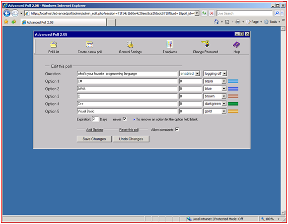

Advanced Poll on IIS
====================
by Eric Woersching

## Introduction

Advanced Poll is a polling system with a powerful administration tool. It features: multiple pools, templates, unlimited options, multi-language support, IP-Logging, IP-Locking, cookie support, comment feature, vote expire feature, random poll support and more. Advanced Poll supports data in text files and MySQL databases. For more information about Advanced Poll, see [http://www.proxy2.de/scripts.php](http://www.proxy2.de/scripts.php).

The following sections describe how to install and configure Advanced Poll for use with FastCGI on IIS 6.0. This document assumes that you have completed the setup and configuration of the FastCGI extension and PHP libraries as described here: [https://www.iis.net/fastcgi/phpon60](using-fastcgi-to-host-php-applications-on-iis-60.md).

## Notes on PHP Setup

Advanced Poll does not need many modifications beyond the default configuration provided by PHP **.** From the base configuration file provided by PHP, you only need to modify the following lines in your php.ini configuration file to get Advanced Poll to work:

- Define 'extension\_dir' as 'c:\php\ext' (i.e., the location of your php extensions directory)
- Uncomment 'extension=php\_mysql.dll' in the extensions list to enable MySQL support

## Download and Unpack the Application

First, download the latest stable release of Advanced Poll. For this article, we use Advanced Poll 2.0.8. Download it from [here](http://www.proxy2.de/scripts.php). Once you download the package, uncompress it and copy all the files and folders to C:\Inetpub\wwwroot\advancedpoll.

## Set Up the Database

Advanced Poll supports both text files and mySQL as the backend data repository. Here, we use the MySQL database option. These instructions assume that you already have MySQL installed and running.

Before starting the installation procedure for AdvancedPoll, you must create a database on your server. Also create a user and grant this user db ownership permission to the database. Follow the instructions in the [Setting Up a Database for a PHP Application on IIS](../install-and-configure-php-on-iis/setting-up-a-database-for-a-php-application-on-iis.md) article for a MySQL database. This walkthrough uses the following database information:

- Database Name: 'advancedpoll'
- Database User: 'advancedpoll'
- Account Password: 'advancedpoll'

## Set Up and Configure the Application

1. Open the configuration file **Configu.inc.php** with a text editor, and set your database settings:  

    [!code-powershell[Main](advanced-poll-on-iis/samples/sample1.ps1)]
2. Call the install script from your browser `http://localhost/advancedpoll/install.php`, and follow the setup instructions.  
    

All the necessary database tables are created.

## Test the Advanced Poll Application

To test that Advanced Poll has been installed successfully, use the built-in demonstration polls as illustrated in the following screenshots.

Create a poll and view it as a site visitor would. Follow these steps:

1. Navigate to `http://localhost/advancedpoll/admin`.
2. Enter the *administrator user name* and *password* created in the last installation step.  
    
3. Once logged in, click **Create a new poll**. A form displays:  
    
4. Click **Save** to publish this poll.
5. Here you see the actual poll as site visitors see it.  
    

## Getting More Information

To discuss the FastCGI support in IIS, or file bug reports, use the FastCGI forums:

- [IIS.NET / IIS 6.0 FastCGI forums](https://forums.iis.net/1103.aspx)
- [IIS 7.0 FastCGI forums](https://forums.iis.net/1104.aspx)

To get more information regarding running various PHP applications on IIS, refer to:

- [PHP on IIS portal](https://php.iis.net/)
- [PHP community forum](https://forums.iis.net/1102.aspx).