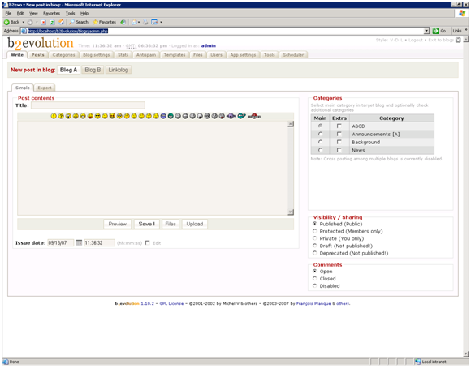

# b2Evolution on IIS

by Eric Woersching

## Introduction

A popular open source blogging solution, b2Evolution, includes all the features of traditional blog tools, and extends them with evolved features such as file and photo management, advanced skinning, multiple blogs support, as well as detailed user permissions. For more information about b2Evolution, see [http://www.b2evolution.net/](http://www.b2evolution.net/).

The following sections describe how to install and configure b2Evolution for use with FastCGI on IIS 6.0. This document assumes that you have completed the setup and configuration of the FastCGI extension and PHP libraries as described here: [https://www.iis.net/fastcgi/phpon60](using-fastcgi-to-host-php-applications-on-iis-60.md).

## Download and Unpack the Application

First, download the latest stable release of b2Evolution. For this article, we use b2Evolution 1.10.2. Download it from [here](http://b2evolution.net/downloads/index.html). Once you download the package, uncompress it and copy all the files and folders to `C:\Inetpub\wwwroot\b2evolution`.

## Set Up the Database

Before starting the installation procedure for b2Evolution, create a database on your server. Also create a user and grant this user db ownership permission to the database. Follow the instructions in the [Setting Up a Database for a PHP Application on IIS](../install-and-configure-php-on-iis/setting-up-a-database-for-a-php-application-on-iis.md) article for a MySQL database. This walkthrough uses the following database information:

- Database Name: 'b2Evolution'
- Database User: 'b2Evolution'
- Account Password: 'b2Evolution'

## Set Up and Configure the Application

To ensure that the installation process completes without errors, follow the instructions to set the file and directory permissions: [http://manual.b2evolution.net/Directory\_and\_file\_permissions](http://manual.b2evolution.net/Directory_and_file_permissions). For this walkthrough, we simply provided modify permissions to the local machine "Internet Guest Account" account for the following directories and file:

- /blogs/media/blogs
- /blogs/media/users
- /blogs/conf/\_basic\_config.php

We also updated the php.ini file to add the php\_mysql.dll module into it under the Dynamic Extensions section in the file and ensured that the extension directory points to the correct location:

- extension\_dir = "./ext
- extension=php\_mysql.dll

Here are the steps to follow:

1. Browse to the [http://localhost/b2evolution/doc/install\_new.html](http://localhost/b2evolution/doc/install_new.html) page for detailed setup instructions.
2. Click the Install link on the top of the page to redirect to the Install Wizard.  
    
3. If you get an error stating that the config file (\_basic\_config.php) cannot be automatically updated, follow the alternate solution listed. Manually copy and paste the content listed on that page into the config file and then start the installation from scratch at: [http://localhost/b2evolution/blogs/install/index.php?locale=en-US](http://localhost/b2evolution/blogs/install/index.php?locale=en-US).  
    
4. All the tables are created and the admin password is created. Copy this password and use it to log into the site as an Administrator. Change the password immediately: [http://localhost/b2evolution/blogs/admin.php](http://localhost/b2evolution/blogs/admin.php).
5. Go to the next page to learn how to verify that b2Evolution has been setup correctly.

## Test the b2Evolution Application

To test that b2Evolution has been installed successfully, create a blog posting and view it as a site visitor would. Follow these steps:

1. Navigate to [http://localhost/b2Evolution/blogs/admin.php](http://localhost/b2Evolution/blogs/admin.php).
2. Enter the administrator username and password created in the last installation step.  
    
3. Once logged in, enter a title for your post and some content and click Preview. This launches another IE window and displays the post:  
    
4. Click Save to publish this content to the Blog selected (Blog A in the case above)
5. Click the "Exit to blogs" link on the upper right hand corner of the page to leave the Administrator portal and browse to the actual blog site.  
    

You now see the actual Blog A as site visitors see it.

## Changing the permalink structure

The default permalinks in b2evolution look something like:  
`http://www.yoursite.com/blogs/index.php?title=post_title&c=1&tb=1&pb=1&more=1`

When hosting b2evolution on IIS you can change this structure to the one that does not use query string. In the blog administration console go to the Blog Settings &gt; URLs tab, where you can choose different link formats; for example:  
`http://www.yoursite.com/blogs/2003/05/20/post_title`

In order for this permalink structure to work you need to instal [Microsoft URL rewrite module for IIS 7.0](https://www.iis.net/downloads/microsoft/url-rewrite "URL rewrite module"). Once it is installed, create a web.config file in the same folder where b2evolution php scripts are and then paste the following into it:

[!code-xml[Main](b2evolution-on-iis/samples/sample1.xml)]

## Getting More Information

To discuss the FastCGI Extension for IIS 6.0, or file bug reports, use the FastCGI forums:

- [IIS.NET / IIS 6.0 FastCGI forums](https://forums.iis.net/1103.aspx).

To get more information regarding running various PHP applications on IIS, refer to:

- [PHP on IIS portal](https://php.iis.net/)
- [PHP community forum](https://forums.iis.net/1102.aspx).
