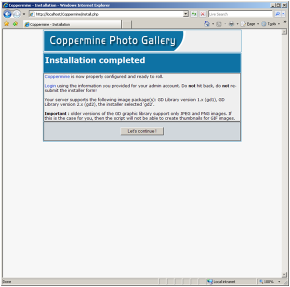

Coppermine on IIS
====================
by Eric Woersching

## Introduction

Coppermine is a multi-purpose, fully-featured and integrated web picture gallery script written in PHP. Coppermine uses GD or ImageMagick as the image library with a MySQL backend.

The following sections describe how to install and configure Coppermine for use with FastCGI on IIS 6.0. This document assumes that you have completed the setup and configuration of the FastCGI extension and PHP libraries as described here: [https://www.iis.net/fastcgi/phpon60](using-fastcgi-to-host-php-applications-on-iis-60.md).

## Download and Unpack the Application

First, download the latest stable release of Coppermine. For this article, we use Coppermine 1.4.13 downloaded from [here](http://downloads.sourceforge.net/coppermine/cpg1.4.13.zip).

Once you downloaded the package, uncompress it and copy all the files and folders to C:\Inetpub\wwwroot\Coppermine. Add permissions to IIS\_WPG to have Write access for the following folders:

- C:\inetpub\wwwroot\Coppermine\include
- C:\inetpub\wwwroot\Coppermine\albums

Ensure that both GD2 and MySQL are enabled in PHP by uncommenting the modules in the php.ini file.

[!code-unknown[Main](coppermine-on-iis/samples/sample-127103-1.unknown)]

## Set Up the Database

Before starting the installation procedure for Coppermine create a database on your server. Also create a database user and grant this user db ownership permission to the database. Follow the instructions in the [Setting Up a Database for a PHP Application on IIS](../install-and-configure-php-on-iis/setting-up-a-database-for-a-php-application-on-iis.md) article for a MySQL database. This walkthrough uses the following database information:

- Database Name: 'Coppermine'
- Database User: 'cpguser'
- Account Password: 'password'

## Set Up and Configure Coppermine

Open your web browser and browse to [http://localhost/Coppermine/install.php](http://localhost/Coppermine/install.php), the Coppermine setup page.

1. Enter the required installation information as in the screen shot below (replace the Database Server Hostname and Passwords with the information of your database server). Click "Let's Go!".  
    
2. Click "Let's Continue" to complete the setup.  
    
3. After the installation is complete, delete the file install.php from c:\inetpub\wwwroot\Coppermine to ensure that no one can reconfigure the gallery.

You must change the access permissions on the include folder now that the installation is finished. Ensure that the folder is NOT writable by the service account that is used for the application pool associated with the "Default Web Site". Once the permissions have been specified, you can browse to [http://localhost/Coppermine/index.php](http://localhost/Coppermine/index.php) and log on using the administrative username and password that you have specified earlier.

## Getting More Information

To discuss the FastCGI Extension for IIS 6.0, or file bug reports, use the FastCGI forums:

- [IIS.NET / IIS 6.0 FastCGI forums](https://forums.iis.net/1103.aspx).

To get more information regarding running various PHP applications on IIS, refer to:

- [PHP on IIS portal](https://php.iis.net/)
- [PHP community forum](https://forums.iis.net/1102.aspx).