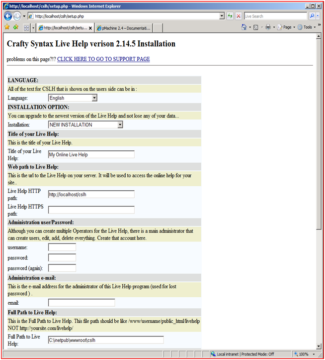
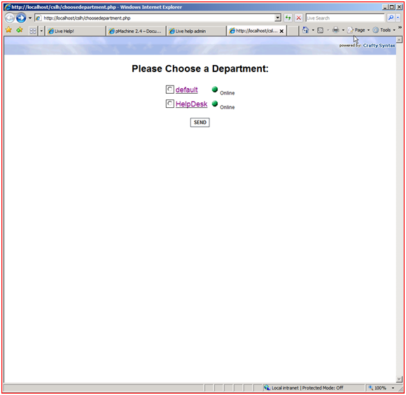
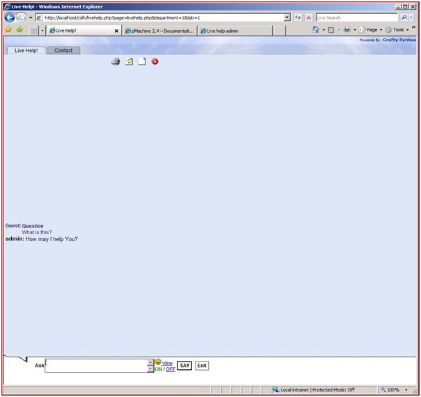

# Crafty Syntax Live Help on IIS

by Eric Woersching

## Introduction

Crafty Syntax Live Help is an open source, live support solution that helps customer support with live help functionality. It can pro-actively push visitors to your site or one requested by the customer. Crafty Syntax includes a large range of features to allow multiple operators, multiple departments and multiple languages.

For more information about Crafty Syntax Live Help, see [http://www.craftysyntax.com/](http://www.craftysyntax.com/).

The following sections describe how to install and configure Crafty Syntax Live Help for use with FastCGI on IIS 6.0. This document assumes that you have completed the setup and configuration of the FastCGI extension and PHP libraries as described here: [https://www.iis.net/fastcgi/phpon60](using-fastcgi-to-host-php-applications-on-iis-60.md).

## Notes on PHP Setup

Crafty Syntax Live Help does not need many modifications beyond the default configuration provided by PHP **.** From the base configuration file provided by PHP, you need modify only the following lines in your php.ini configuration file to get Crafty Syntax Live Help working:

- Define `extension\_dir` as `c:\php\ext` (i.e. the location of your php extensions directory)
- Uncomment `extension=php\_mysql.dll` in the extensions list to enable MySQL support

## Download and Unpack the Application

First, download the latest stable release of Crafty Syntax Live Help. For this article, we use Crafty Syntax Live Help 2.14.5 downloaded from [here](http://www.craftysyntax.com/installation.php). Once you download the package, uncompress it and copy all the files and folders to `C:\Inetpub\wwwroot\cslh`.

## Set Up the Database

Before starting the installation procedure for Crafty Syntax Live Help, create a database on your server. Also create a user and grant this user db ownership permission to the database. Follow the instructions in the [Setting Up a Database for a PHP Application on IIS](../install-and-configure-php-on-iis/setting-up-a-database-for-a-php-application-on-iis.md) article for a MySQL database. This walkthrough uses the following database information:

- Database Name: 'cslh'
- Database User: 'cslh'
- Account Password: 'cslh'

## Set Up and Configure Crafty Syntax Live Help

Browse to the [http://localhost/cslh/setup.php](http://localhost/cslh/setup.php) page for detailed setup instructions.

1. Click the Install link on the top of the page to redirect to the Install Wizard.
2. Enter the required database information using the database name and user name created earlier.  
    
3. All the tables are created and the config.php code is created. Copy the generated code and paste into config.php file:  
    
4. Go to the next page to learn how to verify the installation of Crafty Syntax Live Help.

## Test the Application

To test that Crafty Syntax has been installed successfully, chat with an operator to obtain support. Follow these steps:

1. Navigate to [http://localhost/cslh/livehelp.php](http://localhost/cslh/livehelp.php).
2. Select the default department.  
    
3. Enter the question:  
    

The operator responds to the question and starts the chat to provide live help.

## Getting More Information

To discuss the FastCGI Extension for IIS 6.0, or file bug reports, use the FastCGI forums:

- [IIS.NET / IIS 6.0 FastCGI forums](https://forums.iis.net/1103.aspx).

To get more information regarding running various PHP applications on IIS, refer to:

- [PHP on IIS portal](https://php.iis.net/)
- [PHP community forum](https://forums.iis.net/1102.aspx).
