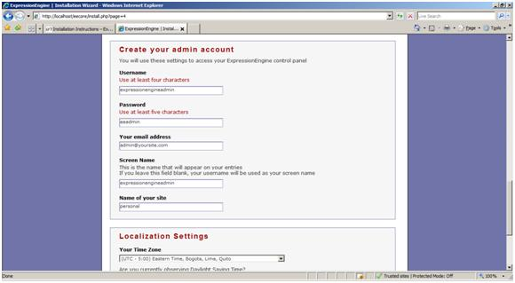
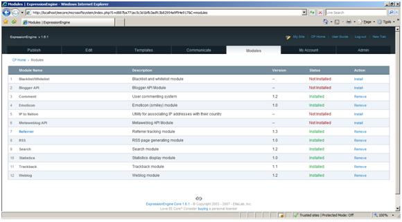
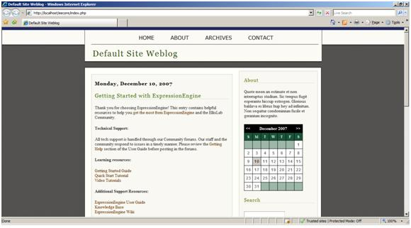

ExpressionEngine on IIS
====================
by Eric Woersching

## Introduction

ExpressionEngine is a flexible, feature-rich content management system that empowers thousands of individuals, organizations, and companies around the world to easily manage their websites.

For more information about ExpressionEngine, see [http://ExpressionEngine.com/](http://expressionengine.com/).  
  
In this section, we go through the steps that are required to install ExpressionEngine to work with FastCGI extension on IIS 7.0 and above, and Windows Server® 2008. To find out more about FastCGI support in IIS, see [https://www.iis.net/fastcgi](../../../downloads/microsoft/fastcgi-for-iis.md).

The following steps assume that you have completed the setup and configuration of FastCGI extension and PHP libraries as described in [https://www.iis.net/fastcgi/phpon60](using-fastcgi-to-host-php-applications-on-iis-60.md).

## Download and Unpack ExpressionEngine

First, download the latest stable release of the ExpressionEngine application. For this article, we use ExpressionEngine (EECore1.6.1). Download the full package from the mirror [https://secure.expressionengine.com/download.php?ACT=agreement&amp;id=34](https://secure.expressionengine.com/download.php?ACT=agreement&amp;id=34).  
  
 Once you download the package, uncompress it and copy the files and folders to C:\Inetpub\wwwroot\eecore.

## Set Up the Database

Before starting the installation procedure for ExpressionEngine, create a database on your server. Also create a user and grant this user db ownership permission to the database. Follow the instructions in the [Setting Up a Database for a PHP Application on IIS](../install-and-configure-php-on-iis/setting-up-a-database-for-a-php-application-on-iis.md) article for a MySQL database. This walkthrough uses the following database information:

- Database Name: 'expressionengine'
- Database User: 'eemsuser'
- Account Password: 'eems'

## Set Up and Configure ExpressionEngine

Installation information and setup information documents are available at [http://expressionengine.com/docs/installation/installation.html](http://expressionengine.com/docs/installation/installation.html).

> 1. Rename the "eecore\System" folder to "eecore\microsoftsystem". This increases security by keeping the directory containing your ExpressionEngine backend files hidden from public access.  
> 2. Delete the following file and directory. They upgrade from the previous version.  
>  Eecore\microsoftsystem /update.php --- Delete this file  
>  Eecore\microsoftsystem/updates --- Delete this folder  
> 3. Provide all permissions to the IIS user for the following folders:  
>   
> images/avatars/uploads/   
> images/captchas/   
> images/member\_photos/   
> images/pm\_attachments/   
> images/signature\_attachments/   
> images/uploads/   
> system/cache/

## Run the Installation Script

Inside the root directory, you find a file called install.php. Browse to the install using [http://localhost/eecore/install.php](http://localhost/eecore/install.php). This runs a script which configures your database and sets up the default site. Be sure that you access the file through your webserver and not by loading the file into your web browser locally.

> 1. Click Click Here to begin to start installation

> 2. Accept the agreement and click Submit.

3. Provide a name for the folder, which you renamed from System. Click Submit.

> 4. Provide the details of your database: Admin username, password, time zone, etc. Click install ExpressionEngine.  
> MySQLUserName as: eemsuser  
> MySQLPassword as: eems  
> MySQLDataBase as : expressionengine  
> Admin account user name as : expressionengineadmin  
> And password as : eeadmin

> 5. You see the confirmation screen for a successful installation.

> 6. Login to the Control Panel using the Admin username and password.

The following are some screenshots of ExpressionEngine after it is up and running on IIS.

## Getting More Information

To discuss the FastCGI Extension for IIS 6.0, or file bug reports, please use the FastCGI forums:   
• [IIS.NET / IIS 6.0 FastCGI forums](https://forums.iis.net/1103.aspx).   
  
To get more information regarding running various PHP applications on IIS refer to   
• [PHP on IIS portal](https://php.iis.net/)  
• [PHP community forum](https://forums.iis.net/1102.aspx).