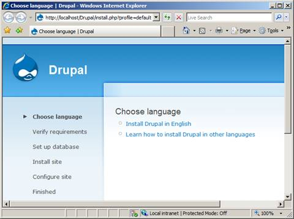

# Install Drupal on IIS

by [Ruslan Yakushev](https://github.com/ruslany)

## Introduction

Drupal is a free, open-source content management system (CMS) software that lets individuals or communities of users easily publish, manage, and organize a wide variety of content on a Web site.

For more information about Drupal, visit the [Drupal Web site](http://www.drupal.org/).

This article describes how to install and configure Drupal for use with the FastCGI extension on Internet Information Services 7 (IIS 7) and above on Windows® Web Server 2008. The instructions assume that you have set up and configured the FastCGI extension and the PHP libraries. The instructions have been tested and found to work with the following software versions:

- PHP 5.2.9
- MySQL 5.1.34
- Drupal 6.14

## Prerequisites

From the base default configuration file provided by PHP, modify the following lines in your **Php.ini** configuration:

- Define `extension\_dir` as `c:\php\ext` (for example, the location of your PHP extensions directory).
- Uncomment `extension=php\_mysql.dll` in the extensions list to enable MySQL support.

In order for Drupal to work correctly with IIS 7 and above, it is necessary to install an [update for the IIS FastCGI module for IIS 7](https://blogs.iis.net/ruslany/archive/2008/08/27/update-for-iis-7-0-fastcgi-module.aspx).

## Download and Unpack the Application

First, download the latest stable release of [Drupal](http://www.drupal.org/). For this article, Drupal version 6.14 was used (future versions are likely to be similar to install). Uncompress the Drupal files and copy them to `C:\Inetpub\wwwroot\drupal` (or another directory of your choosing).

Before running the Drupal installer, create the configuration file **Settings.php**, which Drupal uses to store key configuration settings. Assign write permissions to it with the command (from the installation directory):

1. Copy the **.\sites\default\default.settings.php** file to **.\sites\default\settings.php**.
2. Grant "write" permissions to the file.  

    [!code-console[Main](install-drupal-on-iis/samples/sample1.cmd)]
3. The installer will modify the Settings.php file with information provided during the installation process.
4. Check to ensure that the file permissions are set back to "read only" once the installation is complete. If the file permissions did not change back, you must change them manually with the command:  

    [!code-console[Main](install-drupal-on-iis/samples/sample2.cmd)]
5. Drupal uses the Sites\Default\Files directory to store temporary files and therefore must be able to write and modify files in this folder.
6. Create the folder:  

    [!code-console[Main](install-drupal-on-iis/samples/sample3.cmd)]
7. Grant "modify" permissions to the folder:  

    [!code-console[Main](install-drupal-on-iis/samples/sample4.cmd)]

## Set Up the Database

Before starting the installation procedure for Drupal, you must create a database on your server. Also create a user and grant this user "db ownership" permission to the database. This article uses the following database information:

- Database name: **drupal**
- Database user: **drupal**
- Account password: **drupal**

### Run the Installation Script

1. Open a Web browser, and go to `http://localhost/drupal/`. The first page of the installation script appears. Click **Install Drupal in English**. The Verify requirements step should proceed automatically unless you are missing requirements.  

      
    *Figure 1: Choose language page*
2. On the **Database configuration page**, type the following information:  

   - Database name: **drupal**
   - User name: **drupal**
   - Password: **drupal**

     Click **Save and continue**. The required database tables are created, and the configuration is saved into the Sites\Default\Settings.php file. Remove the "modify" permissions on this file.

       
     *Figure 2: Database configuration page*
3. On the **Configure site** page, enter the required configuration information.  

      
    *Figure 3: Configure site page*

## Enable Clean URLs

By default, Drupal uses query string parameters for all the URLs it generates for your Web site. With the URL Rewrite Module, however, you can create "clean URLs."

IIS 6.0 does not have URL rewriting capabilities, so you can use a third-party URL rewriting product such as [ISAPI Rewrite](https://www.iis.net/downloads?tabid=34&g=6&i=1599) or [Ionics ISAPI Rewrite Filter](http://www.codeplex.com/IIRF).

IIS 7 and above have URL rewriting support, which can be enabled by installing the [URL Rewrite Module](../../extensions/url-rewrite-module/using-the-url-rewrite-module.md).

The following instructions describe how the URL Rewrite Module for IIS 7 and above can be used to enable clean URLs in Drupal.

1. Open the **Web.config** file located in `C:\inetpub\wwwroot\drupal` folder. If you do not have a Web.config file in the **drupal** directory, create it.
2. Copy and paste the following XML code into this file.  

    [!code-xml[Main](install-drupal-on-iis/samples/sample5.xml)]
3. Save the **web.config** file.
4. Open a Web browser, and go to `http://localhost/Drupal/index.php?q=admin/settings/clean-urls`.  
      
    *Figure 4: Clean URLs page*
5. Under **Clean URLs**, select the **Enabled** option button, and then click **Save configuration**. If you successfully changed the URL format, all the URLs are represented in a hierarchical form that does not use query string parameters (for example, [http://localhost/Drupal/admin/settings/clean-urls](http://localhost/Drupal/admin/settings/clean-urls)).

> [!NOTE]
> *This article updates: " Drupal on IIS" by Ruslan Yakushev, published on September 19, 2008.*

## Links for Further Information

- [Setting up FastCGI for PHP](../running-php-applications-on-iis/set-up-fastcgi-for-php.md).
- [Using FastCGI to Host PHP Applications on IIS 7.0 and Above](using-fastcgi-to-host-php-applications-on-iis.md).
- [Installing PHP on Windows Vista with FastCGI](../install-and-configure-php-on-iis/installing-php-on-windows-vista-with-fastcgi.md).
- [Installing FastCGI Support On Server Core](../install-and-configure-php-on-iis/install-php-and-fastcgi-support-on-server-core.md).
- [FastCGI forum](https://forums.iis.net/1104.aspx).
- [PHP community forum](https://forums.iis.net/1102.aspx).
- [Clean URLs on IIS](http://drupal.org/node/3854).
