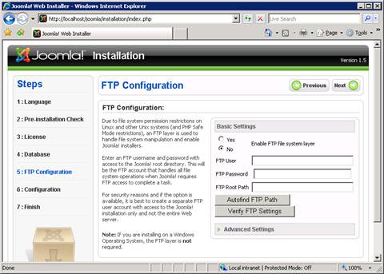
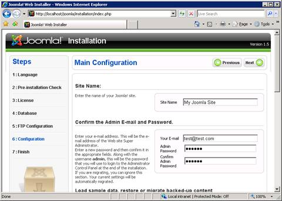
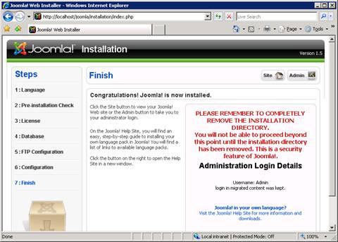
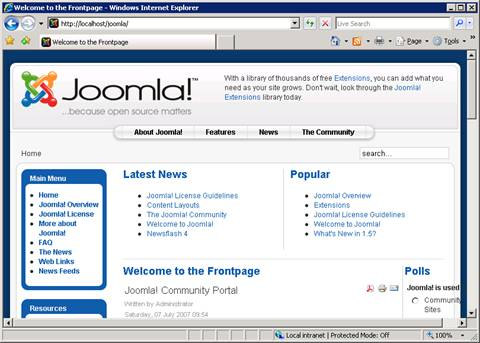

Install Joomla! on IIS
====================
by [Ruslan Yakushev](https://github.com/ruslany)

## Introduction

Joomla is an open-source content management system (CMS) that lets you build Web sites and powerful online applications, such as:

- Corporate Web sites or portals
- Corporate intranets and extranets
- Online magazines, newspapers, and publications
- E-commerce and online reservations
- Government applications
- Small business Web sites
- Non-profit and organizational Web sites
- Community-based portals
- School and church Web sites
- Personal or family home pages

For more information about Joomla, visit the [Joomla Web site](http://www.joomla.org/).

This article describes how to install and configure Joomla for use with the FastCGI extension on Internet Information Services 7 (IIS 7) and above on Windows® Web Server 2008. The instructions assume that you have set up and configured the FastCGI extension and the PHP libraries. The instructions have been tested and found to work with the following software versions:

- PHP 5.2.9
- MySQL 5.1.34
- Joomla 1.5.14

## Prerequisites

From the base default configuration file provided by PHP, modify the following lines in your **Php.ini** configuration:

- Define `extension\_dir` as `c:\php\ext` (for example, the location of your php extensions directory).
- Uncomment `extension=php\_mysql.dll` in the extensions list to enable MySQL support.

In order for Joomla to work correctly with IIS 7 and above, it is necessary to install an [Update for IIS FastCGI module for IIS 7](https://blogs.iis.net/ruslany/archive/2008/08/27/update-for-iis-7-0-fastcgi-module.aspx).

## Download and Unpack the Application

First, download the latest stable release of [Joomla](http://www.joomla.org/). For this article, Joomla version 1.5.14 was used (future versions are likely to be similar to install). Uncompress the Joomla files and copy them to **C:\Inetpub\wwwroot\joomla** (or another directory of your choosing).

Before running the Joomla installer, create the configuration file **Configuration.php**, which Joomla uses to store key configuration settings. Assign write permissions to it with the command (from the installation directory):

[!code-console[Main](install-joomla-on-iis/samples/sample1.cmd)]

The installer will modify the **Configuration.php** file with information provided during the installation process.

Joomla uses the Administrator\Cache folder Tmp and therefore needs to be able to write and modify files in this folder. Grant "modify" permissions to the folder:

[!code-console[Main](install-joomla-on-iis/samples/sample2.cmd)]

Joomla uses the temporary folder Tmp to store temporary files and therefore needs to be able to write and modify files in this folder. Grant "modify" permissions to the folder:

[!code-console[Main](install-joomla-on-iis/samples/sample3.cmd)]

## Set Up the Database

Before starting the installation procedure for Joomla, you must create a database on your server. Also create a user and grant this user "db ownership" permission to the database. This article uses the following database information:

- Database name: **joomla**
- Database user: **joomla**
- Account password: **joomla**

## Run the Installation Script

1. Start the configuration procedure in a Web browser. Go to `http://localhost/joomla/`. (If the Index.php file is not in the browser default document, then add it.)
2. Select the *language*, and then click **Next**.  

    

    *Figure 1: Choose Language page*
3. Verify that all pre-installation checks are successful, and then click **Next**.  

    

    *Figure 2: Pre-installation Check page*
4. Review the GNU General Public License, and then click **Next**.  

    

    *Figure 3: License page*
5. On this page enter the following information, and then click **Next**. 

   - Host Name: **localhost**
   - Username: **joomla**
   - Password: **joomla**
   - Database: **joomla**

     

     *Figure 4: Database Configuration page*
6. On the **FTP Configuration** page, select the **No** option button (not to enable FTP file system layer), and then click **Next**.  

    

    *Figure 5: FTP Configuration page*
7. Specify the *site name* and the *administrator password*. Click **Next** to complete the installation.  

    Note: You may scroll down and install sample data if you prefer.

    

    *Figure 6: Main Configuration page*
8. The Finish page appears, and you are instructed to delete the `C:\inetpub\wwwroot\joomla\installation` directory.  

    

    *Figure 7: Finish page*
9. You can now go to the Joomla site.  

    

    *Figure 8: Joomla site*

## Enable Search Engine Friendly URLs

By default, Joomla uses query string parameters for all the URLs it generates for your Web site. You change this by enabling search engine friendly URLs, a feature which relies on the URL rewriting functionality.

IIS 6.0 does not include URL rewriting capabilities; you can use a third-party URL rewriting product such as [ISAPI\_Rewrite](https://www.iis.net/downloads?tabid=34&g=6&i=1599) or [Ionics ISAPI Rewrite Filter](http://www.codeplex.com/IIRF).

IIS 7 and above includes URL rewriting support, which can be enabled by installing [Microsoft URL Rewrite Module for IIS 7](https://www.microsoft.com/downloads/details.aspx?familyid=836778EA-B2F2-4907-B2DC-A152EC0A4BC4&amp;displaylang=en).

1. Download and install the **Microsoft URL Rewrite Module**.
2. If it does not already exist; create and open a **Web.config** file located in the `C:\inetpub\wwwroot\joomla` directory.
3. Paste the following XML code into this file.  

    [!code-xml[Main](install-joomla-on-iis/samples/sample4.xml)]
4. Save the **web.config** file.
5. Open a Web browser, and log on to the Joomla administrator console at `http://localhost/joomla/administrator/`.
6. Click on **Site** --&gt; **Global Configuration** menu to configure SEO Settings:  

    - Search Engine Friendly URLs - **Yes**
    - Add suffix to URLs - **No**  
          
        *Figure 9: Global Configuration page*
7. Click **Apply** to save the configuration.
8. Restart **Windows® Internet Explorer®**.
9. Go to `http://localhost/joomla/`. All links in Joomla pages now have URLs without query string parameters. If you click on any of these links, the server returns a correct response:  

     

     *Figure 10: Links in Joomla page*

> [!NOTE]
> *This article updates " Joomla! on IIS" by Ruslan Yakushev, published on December 12, 2008.*

## Links for Further Information

- [Setting up FastCGI for PHP](../running-php-applications-on-iis/set-up-fastcgi-for-php.md).
- [Using FastCGI to Host PHP Applications on IIS 7.0 and Above](using-fastcgi-to-host-php-applications-on-iis.md).
- [Installing PHP on Windows Vista with FastCGI](../install-and-configure-php-on-iis/installing-php-on-windows-vista-with-fastcgi.md).
- [Installing FastCGI Support On Server Core](../install-and-configure-php-on-iis/install-php-and-fastcgi-support-on-server-core.md).
- [FastCGI forum](https://forums.iis.net/1104.aspx).
- [PHP community forum](https://forums.iis.net/1102.aspx).
