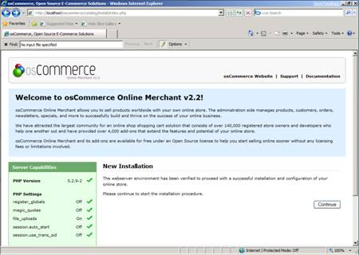
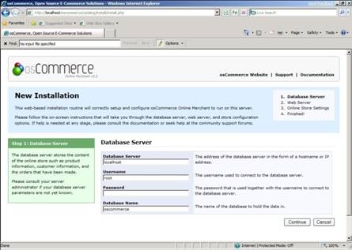
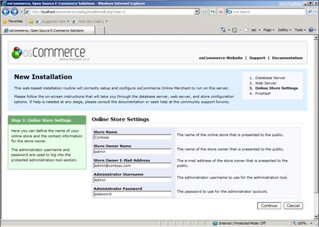
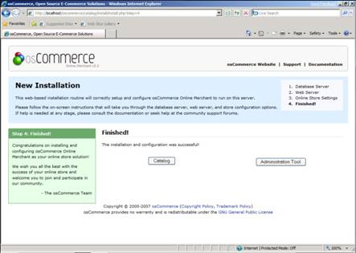
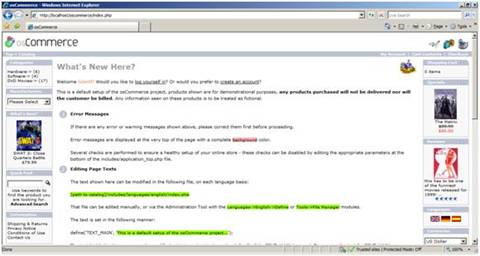
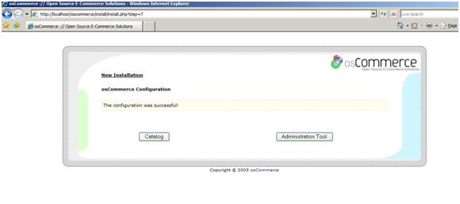

Install osCommerce on IIS
====================
by Eric Woersching

## Introduction

OsCommerce is an open-source online shopping and e-commerce solution that is available for free under the GNU General Public License. It features a rich set of online shopping cart functionality that lets users set up, run, and maintain their online stores with minimal effort and with no costs, fees, or limitations.

For more information about osCommerce, visit the [osCommerce Web site](http://www.oscommerce.com/).

This article describes how to install and configure osCommerce for use with the FastCGI extension on Internet Information Services 7 (IIS 7) and above and on Windows Server® 2008 R2. The instructions assume that you have set up and configured the FastCGI extension and the PHP libraries.

## Download and Unpack the Application

First, download the latest stable release of [osCommerce](http://www.oscommerce.com/solutions/downloads). For this article, oscommerce-2.2ms2-060817 was used. Uncompress the osCommerce files and copy the files in the "catalog" folder to `C:\Inetpub\wwwroot\oscommerce`.

Set the permissions on the **osCommerce/include/Configure.php** file to read, write, and execute. (If these permissions are not set correctly, you get an error message.)

Before running the osCommerce installer, grant "Write" permissions to the **Configure.php** file.

[!code-console[Main](install-oscommerce-on-iis/samples/sample1.cmd)]

## Set Up the Database

Before starting the installation procedure for osCommerce, you must create a database on your server. Also create a user and grant this user "db ownership" permission to the database.This article uses the following database information:

- Database name: **oscommerce**
- Database user: **oscommerceuser**
- Account password: **oscommerce**

## Set Up and Configure the Application

Update the **Php.ini** file to add the **Php\_mysql.dll** module under the **Dynamic Extensions** section in the file, and ensure that the extension directory points to the correct location:

[!code-console[Main](install-oscommerce-on-iis/samples/sample2.cmd)]

1. Start the configuration procedure in a Web browser. Go to `http://www.my-server.com/osCommerce/catalog`. (If the Index.php file is not in the browser default document, then add it.)
2. Click on the installation link on the top of the page to redirect to the Install Wizard. The welcome page appears on the Web browser, and the configuration procedure can be started by clicking **Continue**.  

    

    *Figure 1: Welcome screen*
3. Next, provide details for the osCommerce database that you have created. Click **Continue**.  

    

    *Figure 2: Database import*
4. You can now accept the default settings; or you can change the *URL* in the **WWW Address** box and change the *path* in the **Webserver Root Directory** box. Click **Continue**.  

    

    *Figure 3: Database import was successful*
5. Provide the information for your new Online Store, and then click **Continue**.  

    

    *Figure 4: osCommerce configuration*
6. The following message appears after a successful installation.  

    

    *Figure 5: osCommerce configuration successful*

## Post Installation

After installing osCommerce, follow these steps to make your application secure and functional.

1. Rename or delete the **osCommerce/install** folder.
2. Reset the permissions on **osCommerce/includes/configure.php** to read and execute.
3. Set the permissions on the **osCommerce/images** directory to read, write, and execute.
4. Set the permissions on the **admin/images/graphs** directory to read, write, and execute.
5. Create the directory **admin/backups** and set the permissions to read, write, and execute. (Save the database backup of your store in the "Tools" section of store administration in the **admin/backups** directory).

## Test osCommerce

To test that osCommerce was successfully installed, try to chat with an operator to obtain support:

1. Go to `http://localhost/oscommerce/index.php`.  

    

    *Figure 6: osCommerce page*
2. Shop by selecting the items available in the left panel.  

    

    *Figure 7: Shop at osCommerce*

> [!NOTE]
> *This article updates " osCommerce on IIS" by Eric Woersching, published on October 24, 2008.*

## Links for Further Information

[Setting up FastCGI for PHP](../running-php-applications-on-iis/set-up-fastcgi-for-php.md).

[Using FastCGI to Host PHP Applications on IIS 7.0 and Above](using-fastcgi-to-host-php-applications-on-iis.md).

[Installing PHP on Windows Vista with FastCGI](../install-and-configure-php-on-iis/installing-php-on-windows-vista-with-fastcgi.md).

[Installing FastCGI Support On Server Core](../install-and-configure-php-on-iis/install-php-and-fastcgi-support-on-server-core.md).

[FastCGI forum](https://forums.iis.net/1104.aspx).

[PHP community forum](https://forums.iis.net/1102.aspx).