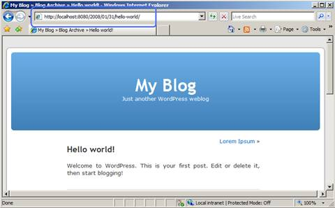

Install WordPress on IIS
====================
by Eric Woersching

## Introduction

WordPress is a blog publishing application and content management system. According to wordpress.org,WordPress is "a state-of-the-art semantic personal publishing platform with a focus on aesthetics, Web standards, and usability." The following sections describe how to install and configure WordPress for use with FastCGI on Internet Information Services 7 (IIS 7) and above. This document assumes that you have completed the setup and configuration of the [FastCGI extension and PHP libraries](using-fastcgi-to-host-php-applications-on-iis-60.md).

The easiest way to install WordPress is by downloading it from the Windows® Web App Gallery. If you need the Microsoft® Web Platform, you can install the components with the Microsoft® Web Platform Installer (Web PI), which is also available at the [Windows Web App Gallery](https://www.microsoft.com/web/gallery/Categories.aspx?sorting=alphabetical).

The following article provides guidance for installing WordPress manually. The instructions have been tested and found to work in the following configurations:

- Windows Server® 2008 operating system
- IIS 7
- PHP 5.2.9
- MySQL 5.1.34
- WordPress 2.8.5

## Prerequisites

From the base default configuration file provided by PHP, modify the following lines in your Php.ini configuration:

- Define extension\_dir as c:\php\ext (for example, the location of your php extensions directory).
- Uncomment extension=php\_mysql.dll in the extensions list to enable MySQL support.

## Download and Unpack the Application

First, download the latest stable release of [WordPress](http://wordpress.org/download/). For this article, WordPress version 2.8.5 was used. Uncompress the WordPress files and copy the files to **C:\Inetpub\wwwroot\wordpress** or another directory of your choosing. There is no need to modify permissions on the WordPress Web directory, because the default permissions suffice.

## Set Up the Database

Before starting the installation procedure for WordPress, you must create a database on your server. Also create a user and grant this user "db ownership" permission to the database. This article uses the following database information:

- Database name: **wordpress**
- Database user: **wordpress**
- Account password: **wordpress**

## Modify the Configuration File

Modify the WordPress configuration file to connect to the database.

1. From **Windows® Explorer**, navigate to the installation directory (**C:\inetpub\wwwroot\wordpress**), and rename the file **wp-config-sample.php** to **wp-config.php**.
2. Edit **wp-config.php**; change the **DB\_NAME**, **DB\_USER**, **DB\_PASSWORD**, and **DB\_HOST** values as follows:

[!code-xml[Main](install-wordpress-on-iis/samples/sample1.xml)]

## Setup and Configure the Application

1. From **Windows® Internet Explorer®**, go to `http://localhost/wordpress/wp-admin/install.php`.
2. Type the *name* of your blog and your *e-mail address*, and then click **Install WordPress**.  

    

    *Figure 1: Enter information*
3. Note the temporary password assigned for the administrator account.  

    

    *Figure 2: Note the administrator password*
4. Begin managing your blog from [`http://localhost/wordpress/wp-login.php`](http://localhost/wordpress/wp-login.php).  

    

    *Figure 3: Log on to blog*
5. The Welcome page appears.  

    

    *Figure 4: Welcome page*

## Enable "Pretty Permalinks"

Typically, WordPress users must use "almost pretty" URLs (for example, `http://contoso.com/index.php/yyyy/mm/dd/post-name/`). With the URL Rewrite module, you can create "Pretty Permalinks" (for example, `http://example.com/year/month/day/post-name/`) for WordPress blogs hosted on IIS.

The steps that follow assume that WordPress is installed in a Web site root directory. If WordPress is installed in a subdirectory, then the rewrite rules must be included in the Web.config file located within the same subdirectory as the WordPress files.

1. Install **URL Rewrite Go Live** release.
2. Log on to **WordPress** as an administrator.
3. Click the **Settings** button.
4. Click the **Permalinks** tab for the **Customize Permalink Structure** page.  

    

    *Figure 5: Customize permalink structure page*
5. Select **Custom Structure**, and then type  
    **/%year%/%monthnum%/%day%/%postname%/** in the     **Custom Structure** text box.
6. Click **Save Changes**. You will see that all the blog post links have URLs that follow the format you have specified; however, if you click any link, the Web server returns a 404 - File Not Found error, because WordPress relies on a URL rewriting capability within a server to rewrite requests that have "pretty permalinks" to an Index.php file.

## Create Rewrite Rule

1. Open the **Web.config** file (located in the same directory as the WordPress files). If you do not have a Web.config file in the WordPress directory, create it.
2. Copy and paste the following XML section into the system.webServer element:  

    [!code-xml[Main](install-wordpress-on-iis/samples/sample2.xml)]

This rule matches any requested URL; if the URL does not correspond to a file or a folder on a file system, then the rule rewrites the URL to Index.php and determines which content to serve based on the REQUEST\_URI server variable that contains the original URL before it was modified by the rule.

## Test the Rewrite Rule

After the rewrite rule is saved to the Web.config file, open a Web browser, and then click any one of the permalinks in WordPress blog. You should see the correct content returned by the Web server for every permalink.

  
*Figure 6: Blog welcome page*

> [!NOTE]
> *This article updates " WordPress on IIS" by Eric Woersching, published on September 11, 2008.*

## Links for Further Information

[Setting up FastCGI for PHP](../running-php-applications-on-iis/set-up-fastcgi-for-php.md).

[Using FastCGI to Host PHP Applications on IIS 7.0 and Above](using-fastcgi-to-host-php-applications-on-iis.md).

[Installing PHP on Windows Vista with FastCGI](../install-and-configure-php-on-iis/installing-php-on-windows-vista-with-fastcgi.md).

[Installing FastCGI Support On Server Core](../install-and-configure-php-on-iis/install-php-and-fastcgi-support-on-server-core.md).

[FastCGI forum](https://forums.iis.net/1104.aspx).

[PHP community forum](https://forums.iis.net/1102.aspx).