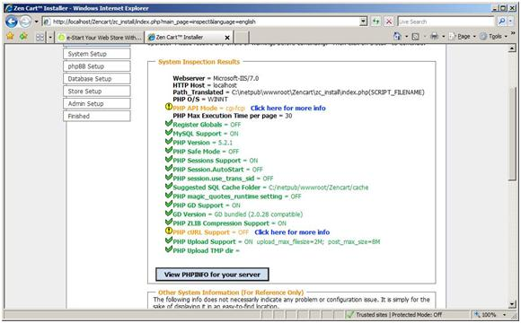

Install Zen Cart on IIS
====================
by Eric Woersching

## Introduction

Zen Cart is a PHP-based, open-source online store management system. It uses a MySQL database and HTML components. Support is provided for several languages and currencies, and it is freely available under the GNU General Public License (GPL).

For more information about Zen Cart, visit the [Zen Cart](http://www.zen-cart.com/) Web site.

This article describes how to install and configure Zen Cart for use with the FastCGI extension on Internet Information Services 7 (IIS 7) and above, and on Windows Server® 2008. The instructions assume that you have set up and configured the FastCGI extension and the PHP libraries. The instructions have been tested and found to work with the following software versions:

- PHP 5.2.9
- MySQL 5.1.34
- Zen Cart 1.3.8

## Download and Unpack the Application

First, download the latest stable release of [Zen Cart](http://www.zen-cart.com/). For this article, zen-cart-v1.3.8 was used (future versions are likely to be similar to install). Uncompress and copy all the files and folders to **C:\Inetpub\wwwroot\zencart** (or another directory of your choosing).

## Set Up the Database

Before starting the installation procedure for Zen Cart, you must create a database on your server. Also create a user and grant this user "db ownership" permission to the database. This article uses the following database information:

- Database name: **zencart**
- Database user: **zencart**
- Account password: **zencart**

## Set Up and Configure the Application

Update the **Php.ini** file to add the **Php\_mysql.dll** module under the **Dynamic Extensions** section in the file, and ensure that the extension directory points to the correct location:

[!code-console[Main](install-zen-cart-on-iis/samples/sample1.cmd)]

Note that this article uses the "/zencart" folder as an example, but this is not required. You may use another folder, or you can install Zen Cart in the "root" directory (the base of your Web site).

## Create the Configure.php Files

You must create files to identify the settings of your particular server and the location of the Zen Cart files you loaded, and then change the permissions on these files.

1. On the server, locate the file **/zencart/includes/dist-configure.php**.
2. Rename this file to **configure.php**.
3. On the server, locate the file **/zencart/admin/includes/dist-configure.php**.
4. Rename this file to **configure.php**.
5. Change the permissions for these two files to read, execute, and write by opening a command prompt.
6. Browse to the **C:\inetpub\wwwroot\zencart** directory.
7. Type **icacls includes\configure.php /grant BUILTIN\IIS\_IUSRS:W**
8. Type **icacls admin\includes\configure.php /grant BUILTIN\IIS\_IUSRS:W**
9. Type **icacls cache /grant BUILTIN\IIS\_IUSRS:W**

## Run the Installer

The installer automatically supplies information during installation, but you must confirm that the auto-detected answers are correct (they may differ on some servers):

1. Confirm the *physical path* to your Zen Cart directory (for example, C:\Inetpub\wwwroot\zencart).
2. Go to the http://localhost/zc\_install/zencart/install.php page for detailed setup instructions.
3. On the **Welcome** screen, click **Continue.**
4. At the **license page**, read and confirm acceptance of the GPL licensing agreement.
5. The installer examines your server for compliance with the technical requirements for running Zen Cart. Anything marked in red or with an "X" must be addressed before the installer can continue. Items marked with an orange or yellow caution symbol are simply warnings that may or may not apply to your setup at this point.
6. If you make changes to your server, click **Re-Check** (or press **F5** in your browser) to refresh the display and reflect the changes made before proceeding.
7. When the system inspection is satisfactory (all green check marks), click **Install** at the bottom of the screen.  

    

    *Figure 1: System inspection results*
8. Provide database information about your *MySQL database*, *user name*, and *password*. If you do not have a MySQL database setup with a user name and password, you must create one.  

    

    *Figure 2: Database setup*
9. Next, you are prompted for *phpBB path* information. If you have the phpBB forum software already installed on your site, enable it for connectivity and synchronization from Zen Cart by specifying the path where the phpBB files are located. (For example, if the files are located in ...public\_html/forums, enter /forums in the Zen Cart installer for the path to the phpBB files.)   
 If you do not have the phpBB forum software already installed on your site, select     **No** .
10. Complete the Store information about your e-commerce shop. Except for demonstration data, all of the information can also be (re)configured later in the administrator area of your shop.
11. To install the demonstration data, select **Yes**, and then click **Save Store Settings**.
12. Complete the administrator information to set your *login name*, *admin e-mail address*, and *password*. Note that both the login name and password are case sensitive.
13. Save the administrator settings to complete installation. Providing there were no errors during installation, you can now enter the Admin or the Catalog.

## After Installation

When you enter the Catalog, you receive security warnings about the Configure.php files and the /zc\_install directory.

### Configure.php files

Change the permissions on the **Configure.php** files to read and execute:

[!code-console[Main](install-zen-cart-on-iis/samples/sample2.cmd)]

Note that "zencart" is used as an example in this article; your site may or may not include "zencart" as a folder name.

1. Open a command prompt.
2. Browse to **c:\inetpub\wwwroot\zencart**.
3. Type **icacls includes\configure.php /reset**
4. Type **icacls admin\includes\configure.php /reset**
5. Download a copy of these files to your computer from the server; they have been set up and configured to your server specifications based on the installation process. Most errors or problems can be corrected with minor adjustments to these two files.

### zc\_install directory

Delete the **/zencart/zc\_install** directory. If you are only testing and plan to install again, rename the folder (for example, /catalog/zc\_install\_complete) until you take your site live.

Note that it is better to use a name other than zc\_install\_complete; some hackers may try to use it if they have read this help file.

For security reasons, do not leave a zc\_install folder on the server of a live site.

> [!NOTE]
> *This article updates " Zen Cart on IIS" by Eric Woersching, published on March 19, 2008.*

## Links for Further Information

[Setting up FastCGI for PHP](../running-php-applications-on-iis/set-up-fastcgi-for-php.md).

[Using FastCGI to Host PHP Applications on IIS 7.0 and Above](using-fastcgi-to-host-php-applications-on-iis.md).

[Installing PHP on Windows Vista with FastCGI](../install-and-configure-php-on-iis/installing-php-on-windows-vista-with-fastcgi.md).

[Installing FastCGI Support On Server Core](../install-and-configure-php-on-iis/install-php-and-fastcgi-support-on-server-core.md).

[FastCGI forum](https://forums.iis.net/1104.aspx).

For more information about running PHP applications on IIS, see the [PHP community forum](https://forums.iis.net/1102.aspx).