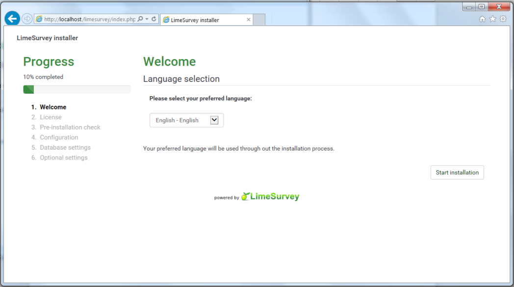
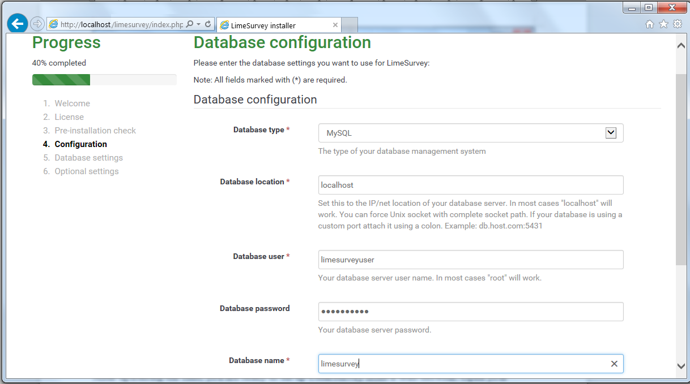
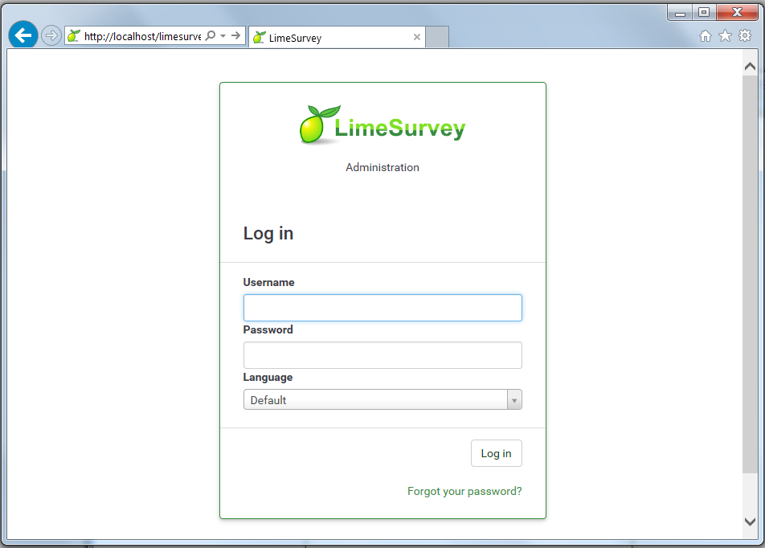
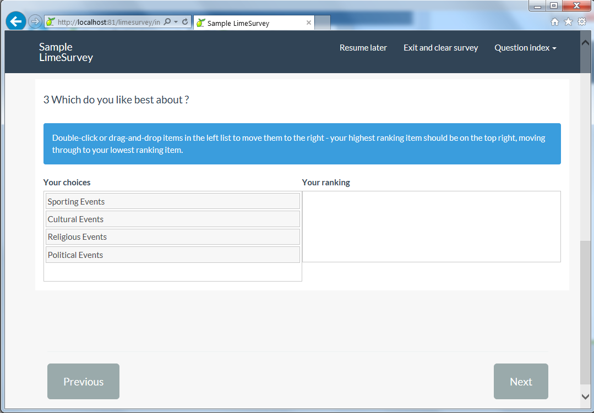

LimeSurvey on IIS
====================
by Eric Woersching

## Introduction

LimeSurvey is a fully functional online survey development and data entry system including data entry screen, public data entry script, conditional questions, method for issuing unqiue invitation links (tokens), emailing invitations and recording responses, and basic statistical analysis.

For more information about LimeSurvey, see [https://www.limesurvey.org/](http://www.limesurvey.org/).  

 In this section, we go through the steps required to install LimeSurvey to work with FastCGI extension on IIS 7.0 and above. To find out more about FastCGI support in IIS, see [https://www.iis.net/fastcgi](https://www.iis.net/downloads/microsoft/fastcgi-for-iis).

The following steps assume that you have completed the setup and configuration of FastCGI extension and PHP libraries as described in [this article](using-fastcgi-to-host-php-applications-on-iis-60.md).

## Download and Unpack LimeSurvey

First, download the latest stable release of the LimeSurvey application. For this article, we use LimeSurvey 2.5x downloaded from [https://www.limesurvey.org/#download](http://sourceforge.net/project/showfiles.php?group_id=74605.ir)

Once you download the package, uncompress it and copy all the files and folders to `C:\Inetpub\wwwroot\limesurvey`.

## Set Up the Database

Before starting the installation procedure for LimeSurvey, create a database on your server. Also create a user and grant this user db ownership permission to the database. Follow the instructions in the [Setting Up a Database for a PHP Application on IIS](../install-and-configure-php-on-iis/setting-up-a-database-for-a-php-application-on-iis.md) article for a MySQL database. This walkthrough uses the following database information:

- Database Name: 'limesurvey'
- Database User: 'limesurveyuser'
- Account Password: 'limesurvey'

## Set Up and Configure LimeSurvey

### Install Required Libraries

LimeSurvey requires two libraries named mbstring and php\_pdo\_mysql. To enable both libraries, open the PHP.ini file located in the PHP installation folder and search for mbstring and php\_pdo\_mysql. The lines that contain these stringsare most likely commented out with a semicolon. Remove the semicolons, save and restart your Web server.  
 LDAP and GD are optional libraries for the LimeSurvey tool. We have not enabled these tools for our application.

### Run the Installation Script

Go to "[http://localhost/limesurvey/admin](http://localhost/limesurvey/admin/install/index.php)". Now the LimeSurvey installation script starts.

Follow the administration step &ndash; when you come to the database configuration screen please enter the credentials you configure for your database.

### Login to the LimeSurvey Administration

After completing the installation you will be forwarded to the administration login page at "[http://your.domain.com/limesurvey/admin](http://your.domain.com/limesurvey/admin/admin.php)".

You should get the followin login screen. If you did not change the administration username and password during installation the default credentials are &ldquo;admin&rdquo; and &ldquo;password&rdquo; and must be changed as soon as possible.

## How to Use LimeSurvey

Refer to the below link for admin setup and using LimeSurvey.

[http://manual.limesurvey.org/](http://manual.limesurvey.org/)

If you would like to check out/import some sample survey there are several surveys available in `C:\Inetpub\wwwroot\limesurvey\docs\samplesurveys`

Refer to the following screen shots for the survey.

## Getting More Information

To discuss the FastCGI support in IIS, or file bug reports, use the FastCGI forums:

- [IIS.NET / IIS 6.0 FastCGI forums](https://forums.iis.net/1103.aspx)
- [IIS 7.0 FastCGI forums](https://forums.iis.net/1104.aspx)

To get more information regarding running various PHP applications on IIS refer to:

- [PHP on IIS portal](https://php.iis.net/)
- [PHP community forum](https://forums.iis.net/1102.aspx)
