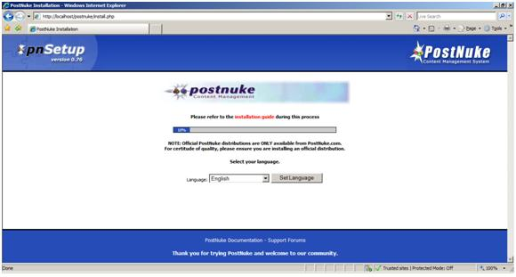

PHPNuke on IIS
====================
by Eric Woersching

## Introduction

PostNuke is a software application that creates an impressive, dynamic Web site and provides the webmaster with a site that they can administer through a Web browser with a minimal amount of HTML knowledge.

In addition, PostNuke's functionality can be increased by installing modules, blocks and themes. For example, you can add a forum, a gallery and a contact form. You can also change how the entire site looks by changing themes. All of this can be done with just a few clicks in the administration panel, saving hours of time, both in the initial creation of the website and in its day to day maintenance.

For more information about PostNuke, see [http://www.postnuke.com/](http://www.postnuke.com/).

In this section, we go through the steps required to install PostNuke to work with the FastCGI extension on IIS 6.0 and IIS 7.0 and above. To find out more about FastCGI support in IIS, see [https://www.iis.net/fastcgi](../../../downloads/microsoft/fastcgi-for-iis.md).

The following steps assume that you have completed the setup and configuration of FastCGI extension and PHP libraries as described in [https://www.iis.net/fastcgi/phpon60](using-fastcgi-to-host-php-applications-on-iis-60.md).

## Download and Unpack PostNuke

First, download the latest stable release of the PostNuke application framework. For this article, we use PostNuke-0.764.zip downloaded from the mirror [http://noc.postnuke.com/frs/?group\_id=5&amp;release\_id=700](http://noc.postnuke.com/frs/?group_id=5&amp;release_id=700).

Once you download the package, uncompress it and copy all the files and folders in the HTML directory to C:\Inetpub\wwwroot\postnuke folder.

## Set Up the Database

Before starting the installation procedure for PostNuke, create a database on your server. Also create a user and grant this user db ownership permission to the database. Follow the instructions in the [Setting Up a Database for a PHP Application on IIS](../install-and-configure-php-on-iis/setting-up-a-database-for-a-php-application-on-iis.md) article for a MySQL database. This walkthrough uses the following database information:

- Database Name: 'postnuke'
- Database User: 'postnukeuser'
- Account Password: 'postnuke'

## Set Up and Configure the Application

PostNuke is simple to install.

> 1. To begin the install script, type the URL of the install.php file into your Web browser. If you installed PostNuke to your c:\inetpub\wwwroot\postnuke folder, the install file is located at [http://localhost/postnuke/install.php](http://localhost/postnuke/install.php).

 

> 2. From here, select the default language for your PostNuke site. The English language files are included with the distribution, so we select English.

> 3. Read through the license agreement.

Following the license agreement, a CHMOD (or permissions) check is run on some files and directories. In order to install correctly, PostNuke must be able to write to certain files during the installation, and for the more advanced features, certain directories must also be writable. If these conditions are not met, a warning displays.

In our case, the file register\_globals is used in other applications running on the same machine and is not set as off.

Once you pass the CHMOD, information about the database you created is required. The database host, database name, username, password, database type (i.e MySQL, PostgreSQL or similar) and table type are needed. The table prefix setting allows you to specify a prefix for each table in the database – meaning that PostNuke database tables will not conflict if you wish to have more than one installation using the same database. For most installs, the table prefix setting can be left as ‘pn', though if you plan to install PostNuke multiple times, change the prefix.

> 4. Once the details are filled in, click ‘new install.' You are asked to verify the details you provided to the installer.

 

> 5. After the confirmation, the installer asks for database creation. Since we have already created the database, do not check the create database option before clicking Start.

> 6. Confirmation on the created tables displays. Click Continue after the confirmation.

> 6. Provide the admin details for the setup and click the Set Login button.

It confirms a successful installation.

## How to Use

Open the admin.php page to maintain the required information.

## Getting More Information

To discuss the FastCGI Extension for IIS 6.0, or file bug reports, please use the FastCGI forums:   
• [IIS.NET / IIS 6.0 FastCGI forums](https://forums.iis.net/1103.aspx).   
  
To get more information regarding running various PHP applications on IIS, refer to:   
• [PHP on IIS portal](https://php.iis.net/)  
• [PHP community forum](https://forums.iis.net/1102.aspx).