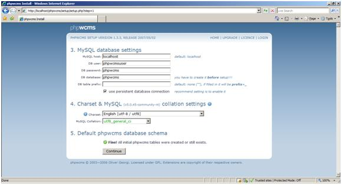
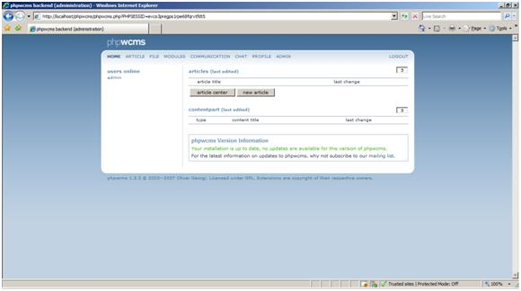

# PHPWCMS on IIS

by Eric Woersching

## Introduction

PHPWCMS is a web content management system optimized for fast and easy setup and works on any standard web server. PHPWCMS is perfect for professional, public and private users. It is very easy to learn and provides the flexibility to separate layout and content

For more information about PHPWCMS, see [http://www.phpwcms.com/](http://www.phpwcms.com/).

In this section, we go through the steps required to install PHPWCMS to work with the FastCGI extension on IIS 7.0 and above. To find out more about FastCGI support in IIS, see [https://www.iis.net/fastcgi](https://www.iis.net/downloads/microsoft/fastcgi-for-iis).

The following steps assume that you have completed the setup and configuration of FastCGI extension and PHP libraries as described here [https://www.iis.net/fastcgi/phpon60](using-fastcgi-to-host-php-applications-on-iis-60.md).

## Download and Unpack PHPWCMS

First, download the latest stable release of PHPWCMS application. For this article, we use the phpwcms\_1.3.3. Full Package downloaded from the mirror [http://sourceforge.net/projects/phpwcms/](http://sourceforge.net/projects/phpwcms/).

Once you download the package, uncompress it and copy files and folders to `C:\Inetpub\wwwroot\phpwcms`.  
For installation help, see [http://www.phpwcms.org/](http://www.phpwcms.org/).

## Set Up the Database

Before starting the installation procedure for PHPWCMS, create a database on your server. Also create a user and grant this user db ownership permission to the database. Follow the instructions in the [Setting Up a Database for a PHP Application on IIS](../install-and-configure-php-on-iis/setting-up-a-database-for-a-php-application-on-iis.md) article for a MySQL database. This walkthrough uses the following database information:

- Database Name: 'phpwcms'
- Database User: 'phpwcmsuser'
- Account Password: 'phpwcms'

## Set Up and Configure PHPWMCS

1. Provide "All" permissions to the IIS user for the files and folders located in the PHPWCMS directory.  

    - upload
    - filearchive
    - filearchive/can\_be\_deleted
    - template
    - content
    - content/ads
    - content/images
    - content/gt
    - content/form
    - content/rss
    - content/tmp
    - content/pages
2. Provide "Read&amp;Write" permissions to the IIS user for the files and folders located in the PHPWCMS directory.  

   - setup/setup.conf.inc.php
   - template/inc\_css/frontend.css
   - config/phpwcms/conf.indexpage.inc.php
   - template/inc\_default/startup.php

     
3. Call the install script in your browser via the following path: `http://localhost/phpwcms/setup/index.php`  

    

    Installation starts with the welcome message.
4. Click "I Agree the GPL, Continue…" to continue to the installation after reading the license.  

    

    The system reports the available server configuration.

    - If the register\_globals is set to on, then set it to off by editing the PHP.ini file located in the PHP folder.
    - Set safe\_mode to off in the PHP.ini file to avoid security risks.
5. After the configuration confirmation, click "Start setup PHPWCMS" to start the setup.  

    
6. Enter the database details created for the PHPWCMS application above and click "Continue".
7. Confirm the Char set options required. We select default options for our application.  

    
8. Confirm the table creation by selecting the check box to create PHPWCMS tables and click Continue.  

    
9. Take the table creation backup for future use and click Continue.  

    
10. After getting the table creation confirmation, click Continue. Enter the admin user details and click Continue.  

    

    
11. Confirm the folder settings by clicking "send path values". We need not change any information here, as all folders already exist in the application.  

    
12. Download conf.inc.php from the Download the created config file\* link and save it to your hard disk. Then move that file to the config\phpwcms\ folder.
13. The system confirms the folder permissions and confirms the installation completion. Delete the setup folder after this installation.
14. Press LOGIN in the upper right corner and login with your username and password created.  

    

    This takes you to the home screen.

    

## Getting More Information

To discuss the FastCGI support in IIS, or file bug reports, use the FastCGI forums:

- [IIS.NET / IIS 6.0 FastCGI forums](https://forums.iis.net/1103.aspx)
- [IIS 7.0 FastCGI forums](https://forums.iis.net/1104.aspx)

To get more information regarding running various PHP applications on IIS, refer to:

- [PHP on IIS portal](https://php.iis.net/)
- [PHP community forum](https://forums.iis.net/1102.aspx)
