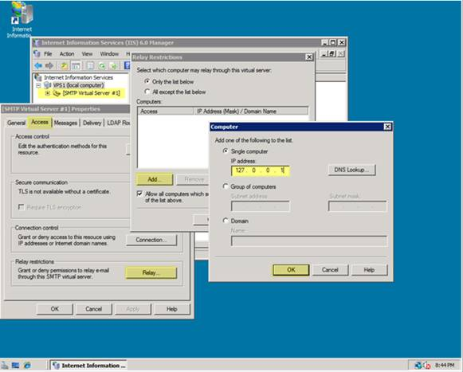

Configure SMTP E-Mail in IIS 7
====================
by Tali Smith

## Introduction

To send e-mail from a PHP application using the System.Net.Mail API, you must configure Simple Mail Transfer Protocol (SMTP) e-mail. Configuring e-mail services tells the System.Net.Mail application programming interface (API) to which SMTP server to deliver the e-mail generated by your application. Mail can be delivered immediately, or it can be delivered to a file location on disk where it can be retrieved for delivery later. For example, a company can provide an e-mail link for sending feedback messages or for requesting information.

The procedures for configuring SMTP e-mail can be performed at the following levels in Internet Information Services 7 (IIS 7) and above:

- Web server
- Site
- Application
- Physical and virtual directories
- File (URL)

## Install SMTP

The SMTP server is not installed by default.

1. Open Server Manager by right-clicking on **My Computer**, and selecting **Manage**. (Alternately, open **Control Panel**, click on **Programs and Features**, and then select **Turn Windows features on or off**.)
2. Under **Features**, select **Add Features**.
3. Select the **SMTP Server** check box.
4. Click **Add Required Role Services**. If there are any missing roles required for the SMTP installation, Windows Server® 2008 R2 or Windows Server® 2008 installs them. Click **Next**.
5. You need to step through the entire wizard again, even though IIS is already installed (IIS 6 Management Compatibility and the IIS 6 Management Console must be installed for SMTP to work).  

    

    *Figure 1: Confirm Installation Selections*
6. Press **Close** when installation is complete.

## Configure SMTP E-Mail for a Web Application

Once you add SMTP, you can configure it for your PHP applications. This can be done by using the user interface (UI), by running Appcmd.exe commands from a command prompt, by editing configuration files directly, or by writing Windows® Management Instrumentation (WMI) scripts. Note that you must have IIS installed before enabling SMTP.

### Use the User Interface

1. Open **Internet Information Services (IIS) Manager**, and then navigate to the level you want to manage.
2. **Features View**, double-click **SMTP E-mail**.
3. On the **SMTP E-mail** page, type the e-mail address of the sender in the **E-mail address** text box.
4. On the **SMTP E-mail** page, select one of the following delivery methods:  

    - **Deliver e-mail to SMTP server:** to deliver e-mail messages immediately. This requires an operational SMTP server for which the user has credentials.
    - **Store e-mail in pickup directory:** to store e-mails in a file location on disk for later delivery by the PHP application (or by a Microsoft® ASP.NET application or by a user).
5. If **Deliver e-mail to SMTP server** is selected, do the following:  

    - Type the unique name of your SMTP server in the **SMTP Server** text box, or select the **Use localhost** check box to set the name to **LocalHost**. Setting the name to LocalHost means that ASP.NET uses an SMTP server on the local computer. Typically, this is the default SMTP virtual server.
    - Enter a TCP port in the **Port** text box. Port 25 is the SMTP standard TCP port and is the default setting. More than one virtual server can use the same TCP port if all servers are configured by using different IP addresses.
    - Under **Authentication Settings**, specify the authentication mode and credentials if your SMTP server requires these.
6. If **Store e-mail in pickup directory** is selected, type the batch e-mail location in the **Store e-mail in pickup directory** text box.
7. Click **Apply** in the **Actions** pane.

### Use the Command Line

You can configure IIS so that e-mail is delivered immediately or stored for later delivery.

#### Deliver e-mail messages immediately

To configure SMTP e-mail to deliver e-mail messages immediately, use the following syntax:

[!code-console[Main](configure-smtp-e-mail-in-iis-7-and-above/samples/sample1.cmd)]

The variable **from***string* is the e-mail address of the sender. The variable **/deliveryMethod:network** configures IIS to deliver e-mail messages immediately. The variable **/network.port***int* sets the TCP port that is used by IIS to deliver e-mail messages. The variable **/network.host***string* specifies the host used for SMTP transactions. The variable **network.defaultCredentials:True**|**False** enables or disables authentication using the default network credentials. If **defaultCredentials** is set to **True**, Kerberos or NTLM are used if the server supports these protocols. The variables **network.userName:** *string* and **network. password:** *string* set a basic authentication user name and password.

#### Store e-mails for later delivery

To configure SMTP e-mail to store e-mails in a file location on disk for later delivery by an application, such as an ASP.NET application, or by a user, such as an administrator, use the following syntax:

[!code-console[Main](configure-smtp-e-mail-in-iis-7-and-above/samples/sample2.cmd)]

The variable from string is the e-mail address of the sender. The variable/deliveryMethod:PickupDirectoryFromIis|SpecifiedPickupDirectory string configures IIS to store e-mails in a file location on disk for later delivery. The variable /SpecifiedPickupDirectory string sets the file location on disk in which to store the e-mail messages for later delivery.

Note that when you use Appcmd.exe to configure the **&lt;mailSettings&gt;** element at the global level in IIS, you must specify **/commit:WEBROOT** in the command so that configuration changes are made to the root Web.config file instead of the ApplicationHost.config file.

### Edit the Configuration Files

1. First, configure the Php.ini file. Open the **Php.ini** file, and find the entry:  

    [!code-console[Main](configure-smtp-e-mail-in-iis-7-and-above/samples/sample3.cmd)]
2. Set the following values:  

    [!code-console[Main](configure-smtp-e-mail-in-iis-7-and-above/samples/sample4.cmd)]
  
 Note that the default value is localhost, so there is no need to change this if SMTP is installed locally.  

    - Save and close the **Php.ini** file.
3. Enable Relay for localhost:  

    - Open the **Internet Information Services (IIS) 6.0 Manager**.
    - Right-click on **Default SMTP Virtual Server**.
4. On the **Properties** page, open the **Access** tab, and then click on **Connection**. You can see which server or IP addresses are allowed to connect to the server.
5. If the IP address 127.0.0.1 is not listed, add it using the **Add** button. You may also add your server IP address to the list.  

    

    *Figure 2: Enable Relay for localhost*
6. Click **OK** to accept the information.
7. Click the **Relay** button on the **Access** tab, and set up the relay options for the server. Ensure that localhost and the IP address 127.0.0.1 are granted permission to relay mail.
8. Click **OK** to accept the options, and then click **Apply** and **OK** to return to the main page of the IIS Manager.
9. Click **Restart IIS**.

## Test E-Mail from PHP

Create a test script to see whether you can send e-mail using PHP. Copy the following text and save it as **email\_test.php** at your server root.

[!code-xml[Main](configure-smtp-e-mail-in-iis-7-and-above/samples/sample5.xml)]

Run the file at **mydomain.com/email\_test.php**.

## Links for Further Information

- [Configure SMTP e-mail in IIS 7](https://technet.microsoft.com/en-us/library/cc772058(WS.10).aspx).
- [Discuss in IIS Forums](https://forums.iis.net/1102.aspx)