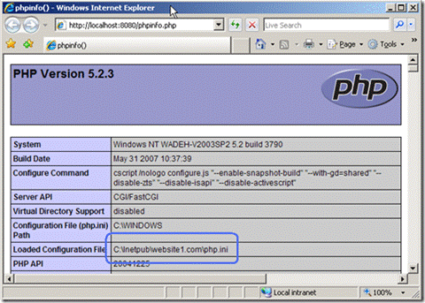
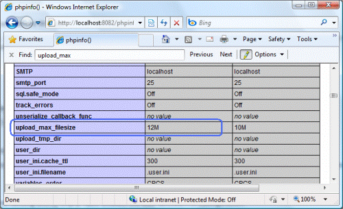

Enable Per-Site PHP Configuration on IIS 7 and IIS 6.0
====================
by Tali Smith

## Introduction

A common requirement when running PHP applications in shared hosting environment is per-site configuration, because each PHP application may require a different set of PHP settings. Shared hosting providers often want to provide their customers with an option of controlling PHP configuration if necessary.

With PHP 5.3 final release available, it is now simpler than before to implement per-site PHP configuration because PHP 5.3 has built-in support for per-directory INI settings and for user-defined INI files.

This article describes per-site configuration for both PHP 5.2 and PHP 5.3.

## Enable Per-Site PHP Configuration with PHP 5.2 on IIS 6.0

For example, suppose you have two Web sites in IIS 6.0, website1.com and website2.com, and you want each Web site to use its own php.ini file. Assume that php.ini for Website1.com is located in the C:\Inetpub\website1.com folder, and php.ini for Website2.com is located in C:\Inetpub\website2.com folder.

1. Create script mappings and FastCGI configuration sections for each Web site. You can use the helper script fcgiconfig.js, located in the %WINDIR%\system32\inetsrv\ folder.
2. Execute the following commands to create PHP script mappings for website1.com and website2.com. Make sure you replace &lt;php\_path&gt; with the correct path to PHP executable and &lt;site\_id&gt; with the correct site ID.  

    [!code-console[Main](enable-per-site-php-configuration-on-iis-60-and-iis-7-and-above/samples/sample1.cmd)]
3. Open the fcgiext.ini file located in %WINDIR%\system32\inetsrv. It should contain the following sections:  

    [!code-console[Main](enable-per-site-php-configuration-on-iis-60-and-iis-7-and-above/samples/sample2.cmd)]
  
 The [PHP website1.com] and [PHP website2.com] sections can be used to specify some site specific FastCGI configuration settings, such as the path to php.ini file for each of the Web sites. When it begins, the PHP process determines the location of configuration php.ini file by using various settings, such as the PHPRC environment variable. (For a detailed description of the PHP startup process, see the     [PHP documentation](http://www.php.net/manual/en/configuration.php) .) If the PHP process finds a php.ini file in the path specified in the PHPRC environment variable, it will use it; otherwise, the PHP process will revert to default location of php.ini.
4. Configure FastCGI to set this PHPRC environment variable to point to site-specific php.ini file with the following commands:  

    [!code-console[Main](enable-per-site-php-configuration-on-iis-60-and-iis-7-and-above/samples/sample3.cmd)]
5. If you examine the fcgiext.ini file, you will see that the configuration sections have been updated:  

    [!code-console[Main](enable-per-site-php-configuration-on-iis-60-and-iis-7-and-above/samples/sample4.cmd)]
6. You can now verify that PHP loads its configuration from site specific location:  

    - Copy php.ini into C:\Inetpub\website1.com
    - Create a phpinfo.php file in C:\Inetpub\website1.com
    - Place this code inside of phpinfo.php: &lt;?php phpinfo(); ?&gt;
    - Open web browser and make a request to http://website1.com/phpinfo.php. The output of phpinfo.php file will show the location from where php.ini file was loaded:  
          
        *Figure 1 website1*

## Enable per-Site PHP Configuration with PHP 5.2 on IIS 7 and Above

The section describes the recommended way of enabling per-site PHP configuration.

### Create Per-site PHP Process Pools

To enable per-site PHP configuration, you must associate a dedicated FastCGI process pool with each Web site. A FastCGI process pool is uniquely identified by the combination of fullPath and arguments attributes. So, if you need to create several FastCGI process pools for the same process executable, such as php-cgi.exe, you can use the arguments attribute to distinguish process pools definitions. In addition, with php-cgi.exe processes, you can use the command-line switch "-d" to define an INI entry for PHP process. You can use this switch to set a PHP setting that makes the arguments string unique.

For example, suppose you have two Web sites ("website1" and "website2") that each need their own set of PHP settings. The FastCGI process pools can be defined as follows:

[!code-xml[Main](enable-per-site-php-configuration-on-iis-60-and-iis-7-and-above/samples/sample5.xml)]

The PHP setting **open\_basedir** is used here to distinguish between process pool definitions. In addition, it ensures that the PHP executable for each process pool can perform file operations only within the root folder of the corresponding Web site.

PHP handler mapping for website1 is:

[!code-xml[Main](enable-per-site-php-configuration-on-iis-60-and-iis-7-and-above/samples/sample6.xml)]

PHP handler mapping for website2 is:

[!code-xml[Main](enable-per-site-php-configuration-on-iis-60-and-iis-7-and-above/samples/sample7.xml)]

## Specify PHP.INI Location

When it begins, the PHP process determines the location of configuration php.ini file by using various settings, such as the PHPRC environment variable. (For a detailed description of the PHP startup process, see the [PHP documentation](http://www.php.net/manual/en/configuration.php).) If the PHP process finds a php.ini file in the path specified in the PHPRC environment variable, it will use it; otherwise, the PHP process will revert to default location of php.ini. The PHPRC environment variable can be used to allow hosting customers to use their own versions of php.ini files.

If website1 and website2 are located at C:\WebSites\website1 and C:\WebSites\website2, then the php-cgi.exe process pools in the &lt;fastCgi&gt; section of applicationHost.config can be configured as follows:

[!code-xml[Main](enable-per-site-php-configuration-on-iis-60-and-iis-7-and-above/samples/sample8.xml)]

Now website1 has its own version of php.ini in C:\WebSites\website1, while website2 has its own version of php.ini in C:\WebSites\website2. This configuration also ensures that if there is no php.ini found in location specified by PHPRC environment variable, then PHP will fall back to using the default php.ini file located in the folder where php-cgi.exe is located.

## Enable Per-Site PHP Configuration with PHP 5.3 on IIS 6.0 or IIS 7 and Above

Now, suppose you want two versions of PHP 5.3 on the two Web sites, this time in IIS 7 and above. Suppose that the PHP application at website1.com does some heavy database activity and therefore requires longer script execution time, which in PHP is controlled by the max\_execution\_time setting. The PHP application at website2.com is a photo album where visitors may upload very large image files; it therefore requires a bigger maximum allowed file upload size, which is controlled by the php.ini setting upload\_max\_filesize.

To enable this scenario on IIS, you first need to install PHP 5.3 and configure IIS to work with it. The easiest way to do this is to use the PHP installer, which is available at the [community PHP site](http://windows.php.net/download/). Make sure to use the installer for the VC9 non-thread-safe build of PHP 5.3, and choose the "IIS FastCGI" option during the installation. Alternatively, you can follow the instructions described in the article "[Using FastCGI to Host PHP Applications on IIS 7.0 and Above](../install-and-configure-php-applications-on-iis/using-fastcgi-to-host-php-applications-on-iis.md)" and create the FastCGI handler/script mapping at the server level, so that the mapping applies to all Web sites on the server.

There are now two options:

1. Define the per-site PHP settings in the main php.ini file.
2. Let Web application owners define those settings in user-defined INI files.

## Define in the Main PHP.INI File

1. Open the main **php.ini** file (If you used the PHP installer, then this file will most probably be located at C:\Program Files\PHP\ folder. If you installed from a compressed [ZIP] file archive, then the file will be at the same directory where the php-cgi.exe file is located).
2. Add the following at the end of the file:  

    [!code-console[Main](enable-per-site-php-configuration-on-iis-60-and-iis-7-and-above/samples/sample9.cmd)]
3. Save the php.ini file, and then recycle the application pools for these Web sites for the PHP.INI changes to take effect.
4. Use **phpinfo()** or **ini\_get("max\_execution\_time")** to check that the new settings have overwritten the default settings. Create a PHP file with the following text and save it in the Web root folder:  

    [!code-xml[Main](enable-per-site-php-configuration-on-iis-60-and-iis-7-and-above/samples/sample10.xml)]
5. Open the PHP script on the Web site http://localhost/phpinfo.php.  

    

    *Figure 2: phpinfo() page*  
 This output shows that the local value of the max\_execution\_time setting (in the second column) is 300, while the master value, or default, is 30.

## Enable the User-Defined INI files

If you want to allow Web application owners to control PHP settings themselves, you can enable a user-defined PHP configuration.

1. Add the following setting, which specifies the name to be used for user-specific INI files, to the main **php.ini** file. Setting this to an empty value disables the user-defined PHP configuration.  

    [!code-console[Main](enable-per-site-php-configuration-on-iis-60-and-iis-7-and-above/samples/sample11.cmd)]
2. Create a file called **.user.ini** in **C:\inetpub\website1.com\** folder, and add the following:  

    [!code-console[Main](enable-per-site-php-configuration-on-iis-60-and-iis-7-and-above/samples/sample12.cmd)]
3. Add the following to the file **.user.ini** in **C:\inetpub\website2.com\** folder:  

    [!code-console[Main](enable-per-site-php-configuration-on-iis-60-and-iis-7-and-above/samples/sample13.cmd)]

    Note that if your main php.ini file has [PATH] sections that point to the root folders of these sites, then you need to remove those sections; if you do not remove those sections, the user-defined settings will not take effect.
4. Use **phpinfo()** or **ini\_get("max\_execution\_time")** to check that the new settings have overwritten the default settings. Create a PHP file with the following text and save it in the Web root folder:  

    [!code-xml[Main](enable-per-site-php-configuration-on-iis-60-and-iis-7-and-above/samples/sample14.xml)]
5. Open the PHP script on the Web site http://localhost/phpinfo.php.  

    

    *Figure 3: phpinfo() page*

    Note also that when you enable the user-defined INI files, the settings in those files are cached by the PHP engine to avoid re-reading those files for every request. This means that if the user makes a change to .user.ini file, then that change may not take effect right away. Instead it may take effect after the cache time to live (TTL) has expired. The cache TTL value is controlled by the php.ini setting user\_ini.cache\_ttl, which is set to 300 seconds (5 minutes) by default.

> [!NOTE]
>> *This article combines information from "*[*Per-site PHP configuration with PHP 5.3 and IIS*](https://blogs.iis.net/ruslany/archive/2009/07/11/per-site-php-configuration-with-php-5-3-and-iis.aspx)*" published on July 11, 2009, "*[*Per-site PHP configuration with IIS FastCGI*](http://ruslany.net/2008/07/per-site-php-configuration-with-iis-fastcgi/)*" published on July 12, 2008, and "*[*Using FastCGI to Host PHP Applications on IIS 7.0*](../install-and-configure-php-applications-on-iis/using-fastcgi-to-host-php-applications-on-iis.md#PHP_Versioning)*" published on June 26, 2009, all by Ruslan Yakushev.*

## Links for Further Information

[IIS 7 FastCGI Module Forum](https://forums.iis.net/1104.aspx).

[PHP Community Forum](https://forums.iis.net/1102.aspx).

[IIS Administration Pack](https://www.iis.net/downloads/microsoft/administration-pack).