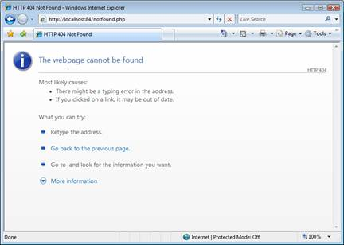
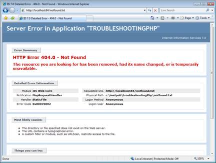

Improve PHP Error Messages in IIS 7
====================
by Tali Smith

## Introduction

PHP errors often do not provide sufficient detail to help diagnose errors that occur within the framework. These include basic errors such as 404 Not Found. Because of this, the default "detailed error" experience for PHP applications may be ineffective for troubleshooting basic errors.

Internet Information Services (IIS) improves PHP error handling by intercepting common error conditions and providing redirection for common HTTP status codes.

By default, IIS is configured to return detailed error messages to local clients and to return generic error messages to remote clients. This is done to allow effective troubleshooting locally, while protecting production applications from disclosing sensitive details to remote clients when errors occur.

IIS generates very detailed error messages for most errors. These contain, at minimum, information about the request and the error, including which module generated the error and during which part of the request processing. For errors caused by IIS and its built-in modules, the errors also contain likely resolutions. This dramatically simplifies the troubleshooting process for most errors.

This article, based on the hands-on labs in the [PHP on Windows Training Kit](https://www.microsoft.com/downloads/details.aspx?FamilyID=c8498c9b-a85a-4afa-90c0-593d0e4850cb&amp;DisplayLang=en), describes how IIS takes care of basic errors handling and how IIS diagnoses application-level errors by enabling PHP error messages.

## Basic Error Handling

IIS improves PHP error handling by intercepting common error conditions and providing redirection for common HTTP status codes.

Note that IIS also support error messages generated by application frameworks, which often offer application-specific information to help diagnose application errors. For example, Microsoft® ASP.NET takes advantage of this to provide detailed exception stack traces and other information.

If you request the page http://localhost:84/notfound.php from Windows® Internet Explorer®, you get a default "Not Found" error—a non-descriptive 404 error page.

*Figure 1: A non-descriptive 404 error message*

The default IIS "Not Found" error message provides useful information to help diagnose the error condition; it correctly identifies the error and suggests solutions for most common error conditions by providing information such as the source (module, notification) of the error and background information such as the URL, mapped physical path, and the authentication method being used. For example:

- Response information: HTTP 404 Not Found.
- Detailed error information: The module (IIS Web Core), the Notification (MapRequestHandler), the handler (StaticFileHandler), and the error code (0x80070002 – File Not Found).
- Request information: The requested URL and the physical path `C:\inetpub\troubleshootingPhp\notfound.txt`.
- The "Most likely causes" section correctly suggests the most likely error cause to be: "The directory or file specified does not exist on the Web server".
- The "Things you can try" section suggests the corresponding solution: "Create the content on the Web server".

*Figure 2: Detailed 404 error message*

You can also get IIS detailed errors for some PHP errors by configuring IIS to perform some additional validation of PHP requests.

To configure IIS to provide additional validation of PHP requests, use the following steps:

1. Switch to the **IIS Manager**. If it is closed, click **Start**,and then select **Internet Information Services (IIS) Manager**.
2. In the tree view on the left, click the server node.
3. Under **IIS**, double-click **Handler Mappings** to edit the PHP handler mapping.
4. Right-click the **PHP via FastCGI** entry, and then click **Edit**.
5. Click **Request Restrictions**.
6. Select the **Invoke handler only if request is mapped to** check box.
7. Leave the **File** option button selected.
8. Click **OK** twice.
9. Click **Yes** in the **Edit Module Mapping** dialog box.
10. To test, trigger a "Not Found" condition again to verify that the PHP 404 error is now handled by IIS, providing more detail. Using **Internet Explorer**, request `http://localhost:84/notfound.php` (this page does not exist).
11. You receive an IIS detailed error indicating that the Notfound.php page was not found on the server.  

    An IIS 401.3 Unauthorized detailed error also provides information; it indicates that the request does not have the permission to view the page due to access control list (ACL) configuration and provides an extensive explanation of how to resolve this issue.

    

    *Figure 3: An Access Denied error*

## Enable PHP Error Messages to Diagnose Application-Level Errors

Configuring IIS to validate requests causes IIS to attempt to open the PHP script file corresponding to the request URL and generates detailed error messages for any conditions that preclude this. This typically includes:

- File not found
- Access denied due to incorrect permissions
- Access denied due to insufficient authentication
- For most other error conditions, especially those that occur at the application level, IIS detailed error messages do not contain sufficient information to help diagnose the error effectively.

The biggest examples of such errors are script parsing and script interpretation errors. While you can force IIS detailed error messages for these errors, this typically does not provide any value in diagnosing the root cause of the error. In these cases, you must rely on the information provided by PHP to diagnose these errors.

By default, PHP is not configured to display these errors to the response to prevent disclosure of sensitive information.

Notethat for local debugging, you can enable PHP error display to diagnose PHP errors while debugging. Consider disabling PHP error display for production applications.

If you request a page with a script error, you receive the IIS detailed error message. This happens because by default PHP does not generate a response with the error details, so IIS inserts its generic "500 Server Error" detailed error. While this error correctly suggests that PHP has returned a 500 error code, it does not provide application-specific information about what caused the error.

You can configure PHP to display errors in responses.

1. Using **Windows® Explorer**, browse to `C:\PHP`.
2. Open the **Php.ini** filein the PHP installation directory.
3. Find and set the **display\_errors = On** directive:  

    [!code-xml[Main](improve-php-error-messages-in-iis-7-and-above/samples/sample1.xml)]
4. Save and close the file.
5. Reset IIS. Click **Start**,and then select **Command Prompt**, right click and select **Run** **as administrator** to open a command-line window.
6. Type **iisreset.exe**
7. Press **Enter**.

If you request a page with a script error now, you get a PHP parse error:

[!code-xml[Main](improve-php-error-messages-in-iis-7-and-above/samples/sample2.xml)]

If you see only the default Internet Explorer HTTP 500 Internal Server Error page, you must disable friendly error messages. Within Internet Explorer Go to **Tools**, **Internet Options**, **Advanced** tab, and then clear the **Show friendly HTTP error messages** check box.

Note that PHP also provides options for customizing default error handling or completely overriding it.

*Note: This article uses material from the [PHP on Windows Training Kit](https://www.microsoft.com/downloads/details.aspx?FamilyID=c8498c9b-a85a-4afa-90c0-593d0e4850cb&amp;DisplayLang=en), published on August 25, 2009.*

## Links for Further Information

[Error Handling and Logging](http://www.php.net/errorfunc).