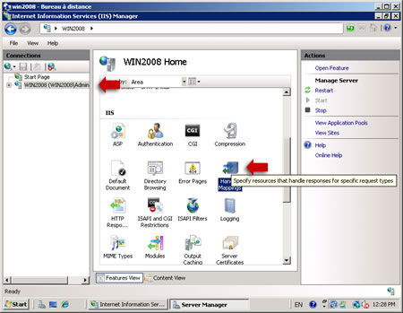
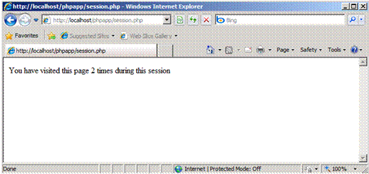

Install and Configure PHP
====================
by Tali Smith

## Introduction

The fastest and easiest way to install PHP on Internet Information Services (IIS) is by using the Microsoft® Web Platform Installer (Web PI). Web PI completely automates setting up IIS, FastCGI, and the latest version of PHP from the php.net Web site. With Web PI, you can navigate to the "Web Platform" tab and select "PHP" under "Framework and Runtimes" customize link. Alternately, use the instructions that follow as guidance for installing PHP with Windows® Installer or using a compressed (Zip) file installation.

There are two builds for each PHP version: one is thread-safe, and one is not (referred to as the non-thread-safe [NTS] version). The thread-safe version is designed for environments where the Web server core can keep the PHP engine in memory, running multiple treads of execution for different Web requests simultaneously. The architecture of IIS and the FastCGI extension provide an isolation model that keeps requests separate, removing the need for a thread-safe version. The NTS version does not have any of the code that allows PHP to manage multiple threads. As a result, there is a performance improvement on IIS when using the NTS version when compared to the tread-safe version because the NTS version avoids unnecessary thread-safety checks (FastCGI ensures a single-threaded execution environment).

## Install PHP

There are two main ways to install PHP on a Windows®-based computer: download the Windows Installer or use the Windows Zip file from the [PHP Web site](http://www.php.net/downloads.php). Either method will get PHP working, but both have some extra steps that are needed to make PHP work well.

### Windows Installer

The Windows Installer version can get a complete PHP environment up and running, but the installation of extensions can be confusing. By default, no extensions are installed, and this can adversely affect the usefulness of the PHP installation. Alternately, all of the extensions can be installed; this results in an unstable system because some of the extensions can conflict with others. It is generally easier to use the Zip file installation.

### Zip File Installation

To use the Zip file installation, follow the instructions in [Using FastCGI to Host PHP Applications on IIS 7.0 and Above](../install-and-configure-php-applications-on-iis/using-fastcgi-to-host-php-applications-on-iis.md). The Zip file installation installs many of the extensions that are available for the Windows Installer version; however, none of the extensions are enabled until their entries in the Php.ini file are set up.

1. Download the [latest non-thread-safe Zip file package](http://www.php.net/downloads.php) with binaries of PHP. Under **Windows Binaries**, click on the most current PHP non-thread-safe Zip package to download the PHP files.
2. Unpack the files to a directory of your choice (for example, C:\PHP) on your IIS server.
3. Rename the **Php.ini-recommended** to **php.ini**.
4. Open the **Php.ini** file in a text editor, then uncomment and modify settings as follows:  

    - Set **fastcgi.impersonate = 1**.  
 FastCGI under IIS supports the ability to impersonate security tokens of the calling client. This allows IIS to define the security context that the request runs under.
    - Set **cgi.fix\_pathinfo = 0**  
 The         **cgi.fix\_pathinfo** provides         **PATH\_INFO/PATH\_TRANSLATED** support for Common Gateway Interface (CGI). Setting this to 1 will cause PHP CGI to fix its paths to conform to the specification.
    - Set **cgi.force\_redirect = 0**.
    - Set **open\_basedir** to point to a folder or network path where the content of the Web site(s) is located.
    - Set **extension\_dir** to point to a location where PHP extensions reside. For PHP 5.2.X, this is typically **extension\_dir = "./ext"**.
    - Set **error\_log="C:php\_errors.log"**  
 This can help with troubleshooting.
    - Enable the required PHP extension by un-commenting corresponding lines. More information follows in the section, [Extensions](#Extensions_1).  

        

        *Figure 1 Windows extensions*
5. Click on **Start**, **Settings**, **Control Panel**, and then double-click on the **System** icon (using the class view).
6. Click on the **Advanced system settings** link in the left column.
7. From the **System Properties** window, click on the **Advanced** tab, and then click on the **Environment Variables** button at the bottom.
8. Select the **Path** variable from the **System Variables** section, and then click on **Edit**. Add: **c:\php** to your system path.  

    

    *Figure 2: Edit System Variable*
9. Click **OK** until you have exited the System Properties window.
10. Start IIS Manager by clicking on **Start**, **Programs**, **Administrative Tools**, and then **Internet Information Services (IIS) Manager**.
11. From the **IIS Manager**, click on the *hostname* of your server in the **Connections** panel on the left.
12. Double-click on the **Handler Mappings** icon.  

    

    *Figure 3: Internet Information Services (IIS) Manager*
13. From the **Handler Mappings** **Actions** panel, click on **Add Module Mapping**.  

    

    *Figure 4: Handler Mappings*
14. Type the following information into the appropriate text boxes, and then click **OK**.  

    - Request path: **\*.php**
    - Module **: FastCGImodule**
    - Executable: **C:\php\php-cgi.exe**
    - Name: **FastCGI**

    

    *Figure 5: Add Script Map*
15. Click **OK**, and then **c** lick **Yes.**
16. In the left panel, click on your server's *hostname*, and then double-click on the **Default Document** icon.
17. From the **Actions** panel on the right, click **Add**.
18. Enter **index.php** as the new default document name, and then click **OK**.
19. Enter **default.php** as the new default document name, and then click **OK**.
20. In the left panel, click on your server's *hostname*.
21. In the **Actions** panel on the right, click **Restart**.
22. Create a new text document, and save it as **c:\inetpub\wwwroot\phpinfo.php** with the following content:  

    [!code-xml[Main](install-and-configure-php/samples/sample1.xml)]
23. You should now see the PHP information page at http://localhost/phpinfo.php.  

    

    *Figure 6: PHP information page*

## Extensions

It is important to determine which extensions are needed by the applications that will be running and then to limit the installed extensions to only those. For a typical open-source application installation, for example, the following extensions are installed:

- **Database Extensions** &mdash; Most open-source applications that use MySQL for a database engine use either the *php\_mysql* or the *php\_mysqli* extensions. For new development work, either of these extensions work well, or consider using the PDO versions of the MySQL driver (PDO is a PHP extension providing a data-access abstraction layer that can be used with a variety of databases); this extra layer of abstraction provides a richer set of object database functionality and controls. If Microsoft® SQL Server® (or an express version, such as Microsoft® SQL Server® 2008 Express or Microsoft® SQL Server® 2005 Express Edition) is the database engine, use the *php\_mssql* extension for open-source applications. For new development work, use the PDO version of the SQL driver.
- **Image Handling Extensions** &mdash; Many of the open-source applications that enable work with images make use of the GD2 extension – *php\_gd2*, which has a number of good basic image manipulation application programming interfaces (APIs). Some applications use the [ImageMagick application and libraries](http://www.imagemagick.org/script/index.php). There is also a *php\_exif* library for working with the extended information that modern digital cameras store within the images.
- **Internationalization and Localization Extensions** &mdash- The two most commonly used extensions for i18n and l10n are *php\_mbstring* (Multi-Byte String) and *php\_gettext* (Native Language Support). Many of the open-source applications use one or both of these.
- **Web Services Extensions** &mdash; Choose the Web services extensions based on the services desired. For PHP, the SOAP extension is widely used. The XML-RPC extension is often used in conjunction with SOAP and other services.

## PHP.INI File Settings

The Php.ini file provides PHP with configuration and environmental information. Below are a number of settings for the Php.ini file that help PHP work better with Windows.

### Required Settings

- **extension\_dir = &lt;PATH TO EXTENSIONS&gt;** The extension\_dir needs to point to the directory where the PHP extensions are stored. The path can be fully qualified (for example, C:\PHP\ext) or relative (for example, .\ext). Extensions that are specified lower in the Php.ini file need to be located in the extension\_dir. If the extensions specified are not in the extension\_dir, then PHP will give a warning message at the start of script execution, and the application may show errors because of the missing functionality.
- **extension = xxxxxx.dll** For each extension enabled, a corresponding extension= directive that tells PHP which extensions in the extension\_dir to load at startup time is necessary.
- **log\_errors=On** PHP errors can also go through the PHP error logging facility. This can be used to send errors to a file or to a service (for example, syslog) and works with the error\_logdirective described below. When running under IIS, log\_errors must be enabled with a valid error\_log. Otherwise, FastCGI considers any startup messages (which may be benign) as an error condition, which generates an HTTP 500 return error code to the browser.
- **error\_log=&lt;path\_to\_error\_log\_file"** The error\_log needs to specify the fully qualified, or relative, path to the file where the PHP error log is stored. This file needs to be writable for the IIS service. The most common places for this file are in various temporary directories (for example, C:\inetpub\temp\php-errors.log). That puts the log in a place that IIS can use, and also keeps the log close to where PHP applications are running.
- **cgi.force\_redirect = 0** This directive is required for running under IIS. It is a directory security facility required by many other Web servers; however, enabling it under IIS will cause the PHP engine to fail on Windows.
- **cgi.fix\_pathinfo = 1** This lets PHP access real path info following the CGI specification. The IIS FastCGI implementation needs this extension set.
- **fastcgi.impersonate = 1** FastCGI under IIS supports the ability to impersonate security tokens of the calling client. This allows IIS to define the security context that the request runs under.
- **fastcgi.logging = 0** FastCGI logging should be disabled on IIS. If it is left enabled, then any messages of any class are treated by FastCGI as error conditions, which will cause IIS to generate an HTTP 500 exception.

### Optional Settings

- **max\_execution\_time=##** This directive sets the maximum amount of time that can be taken executing any given script. The default is 30 seconds. Some applications need more time to process batch operations (for example, Gallery2 loading multiple images from a remote location). However, setting the execution time higher than 300 seconds is not advised because there are often other parts of the connection that cannot support such a long execution time.
- **memory\_limit=###M** The amount of memory available for the PHP process (in MB). The default is 128 MB, which is appropriate for most PHP applications.
- **display\_errors=Off** This directive determines whether to include any error messages in the stream that it returns to the Web server. If turned on, PHP will send the classes of errors that are defined with the **error\_reporting** directive back to IIS as part of the error stream. Many of the open-source applications bypass error reporting by executing commands prefaced with @. This allows the applications to control error handling.
- **Mail functions** PHP is configured by default to send outbound mail through an SMTP server located on the same system as the Web server. Note that most Windows installations usually have the Web and mail servers on separate systems.

## Enable PHP Session State

1. In **Windows® Explorer**, create the **session** subdirectory in the PHP installation directory.
2. Right-click the **session** directory, and select **Properties**.
3. In the **Security** tab, click **Edit**.
4. Click **Add**, and enter **IIS\_IUSRS** for **Enter the object names to select**.
5. Click **OK**.
6. Select the **Modify** permission check box, and click **OK**.  

    

    *Figure 7: Permissions for session folder*
7. Click **OK** in the **Session Properties** window.
8. Open **php.ini** in the PHP installation directory, and set the **session.save\_path** setting to the **session** subdirectory:  

    [!code-console[Main](install-and-configure-php/samples/sample2.cmd)]
9. Save and close the file.
10. Click **Start**, and then select **Command Prompt**.
11. Type **runas /user:administrator cmd.exe** to enable elevated permissions.
12. Type **iisreset** at the command prompt, and then press the ENTER key.  

    

    *Figure 8: IISRESET command*

    Note that PHP uses file-based session state by default. You can modify a number of additional session settings, including whether cookie or URL sessions should be used, and whether sessions are created on the first request or need to be explicitly created.
13. Test the session state by using Windows Explorer, navigate to **C:\inetpub\wwwroot**.
14. Create a folder and rename it **phpapp**.
15. Create **session.php** in the **phpapp** directory.
16. Paste the following into it:  

    [!code-xml[Main](install-and-configure-php/samples/sample3.xml)]
17. Save and close the file.
18. Start **Internet Explorer**, and navigate to `http://localhost/phpapp/session.php`.  

    

    *Figure 9: Using session state*
19. Observe that the counter is 1.
20. Request `http://localhost/phpapp/session.php` again, or press **F5**.  

    

    *Figure 10: Using session state*

    21. Observe that the counter is 2.

> [!NOTE]
> *This article uses information from "*[*Using FastCGI to Host PHP Applications on IIS 7.0 and Above*](../install-and-configure-php-applications-on-iis/using-fastcgi-to-host-php-applications-on-iis.md#InstallPHP)*" by Ruslan Yakushev, published on December 5, 2007.*

## Links for Further Information

[PHP on Windows Training Kit](https://www.microsoft.com/downloads/details.aspx?displaylang=en&amp;FamilyID=c8498c9b-a85a-4afa-90c0-593d0e4850cb).

[Installing PHP on Windows Server 2008](https://www.microsoft.com/video/en/us/details/7293e003-91c5-4e50-a3c9-ff47b3c62bbc).

[PHP on IIS7](https://php.iis.net/).

[Deploying IIS 7.5 + FASTCGI + PHP on Server Core](https://blogs.msdn.com/philpenn/archive/2009/07/19/deploying-iis-7-5-fastcgi-php-on-server-core.aspx).

[Discuss in IIS Forums](https://forums.iis.net/1102.aspx)