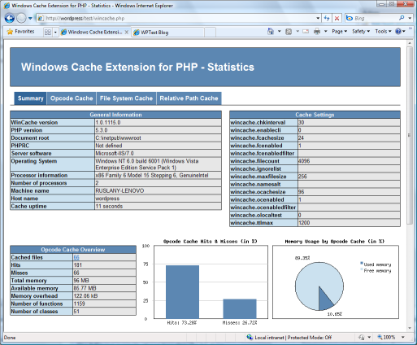

# Use the Windows Cache Extension for PHP

by [Ruslan Yakushev](https://github.com/ruslany)

## Introduction

The Windows Cache Extension for PHP is a PHP accelerator that is used to significantly increase the speed of PHP applications running on the Windows® operating system. Any PHP application can take advantage of the functionality provided by the Windows Cache Extension for PHP without any code modifications. All that is required is that the extension is enabled and loaded by the PHP engine.

The Windows Cache Extension includes three different types of caches:

- **PHP Opcode Cache**  
   PHP is a script processing engine that reads an input stream of data that contains text and/or PHP instructions and produces another stream of data, most commonly in the HTML format. This means that on a Web server, the PHP engine reads, parses, compiles, and executes a PHP script each time that it is requested by a Web client. The reading, parsing, and compilation operations put additional load on the Web server's CPU and file system and thus affect the overall performance of a PHP Web application. The PHP bytecode (opcode) cache is used to store the compiled script bytecode in shared memory so that it can be reused by the PHP engine for subsequent executions of the same script.
- **File Cache**  
   Even with the PHP bytecode cache enabled, the PHP engine has to accesses the script files on a file system. When PHP scripts are stored on a remote universal naming convention (UNC) file share, the file operations introduce a significant performance overhead. The Windows Cache Extension for PHP includes a file cache that is used to store the content of the PHP script files in shared memory, which reduces the amount of file system operations performed by PHP engine.
- **Relative File Path Cache**  
   PHP scripts very often include or operate with files by using relative file paths. Every relative file path has to be converted to an absolute file path by the PHP engine. When a PHP application uses many PHP files and accesses them by relative paths, the operation of resolving relative paths to absolute paths may have a negative impact on the application's performance. The Windows Cache Extension for PHP provides a relative file path cache, which is used to store the mappings between relative and absolute file paths, thereby reducing the number of relative path resolutions that the PHP engine has to perform.

## Install the Windows Cache Extension for PHP

There are two packages for the extension: one package is for PHP versions 5.2.X, and the other package is for PHP 5.3.X. Make sure that you use the appropriate package for your version of PHP.

The extension packages can be found at:

[Windows Cache Extension 1.0 for PHP 5.2](https://www.microsoft.com/downloads/details.aspx?FamilyID=6feb7f6a-7dcb-4083-bb7a-d8b22ba2d3d8&amp;displaylang=en)

[Windows Cache Extension 1.0 for PHP 5.3](https://www.microsoft.com/downloads/details.aspx?FamilyID=ba2e0d7a-02ce-42be-a7a3-2baa5d666bf7&amp;displaylang=en)

1. Unpack the package that is appropriate for the PHP version you are using.
2. Copy the **Php\_wincache.dll** file into the PHP extensions folder. Typically this folder is called "ext" and it is located in the same folder with all PHP binary files. For example:  

    [!code-console[Main](use-the-windows-cache-extension-for-php/samples/sample1.cmd)]
3. Using a text editor, open the **Php.ini** file, which is usually located in the same folder where all PHP binary files are. For example:  

    [!code-console[Main](use-the-windows-cache-extension-for-php/samples/sample2.cmd)]
4. Add the following line at the end of the **Php.ini** file:  

    [!code-console[Main](use-the-windows-cache-extension-for-php/samples/sample3.cmd)]
5. Save and close the Php.ini file.
6. Recycle your Internet Information Services (IIS) application pools for PHP to pick up the configuration changes.
7. To check that the extension has been enabled, create a file called **phpinfo.php** with the following PHP code that calls phpinfo() function:  

    [!code-console[Main](use-the-windows-cache-extension-for-php/samples/sample4.cmd)]
8. Save the Phpinfo.php file in the root folder of an IIS Web site that uses PHP.
9. Open a browser and make a request to `http://yoursitename/phpinfo.php`.
10. Search within the returned Web page for a section called "wincache". If the extension is enabled, then you should see the configuration settings provided by the Windows Cache Extension for PHP.

> [!IMPORTANT]
> Do not forget to remove the **Phpinfo.php** file from the Web site's root folder after you have confirmed that extension has been enabled.

## Compatibility Notes

The extension is supported only on the following configurations:

Windows operating system:

- Windows® XP Service Pack 3 (SP3) with IIS 5.1 and FastCGI Extension
- Windows Server® 2003 with IIS 6.0 and FastCGI Extension
- Windows Vista® SP1 with IIS 7.0 and FastCGI Module
- Windows Server® 2008 with IIS 7.0 and FastCGI Module
- Windows® 7 with IIS 7 and FastCGI Module
- Windows Server® 2008 R2 with IIS 7.0 and FastCGI Module

PHP:

- PHP 5.2.X, Non-thread-safe build
- PHP 5.3 X86, Non-thread-safe VC9 build

> [!IMPORTANT]
> The Windows Cache Extension can only be used when IIS is configured to run PHP via FastCGI.

## Configuration Settings

The following table lists and describes the configuration settings provided by the Windows Cache Extension for PHP:

### Table 1 : Configuration Settings

| **Setting** | **Default** | **Minimum** | **Maximum** | **Changeable** | **Description** |
| --- | --- | --- | --- | --- | --- |
| wincache.fcenabled | 1 (On) | 0 (Off) | 1 (On) | PHP\_INI\_ALL | Enables or disables the file cache functionality. |
| wincache.fcachesize | 24 | 5 | 85 | PHP\_INI\_SYSTEM | Defines the maximum memory size (in megabytes) that is allocated for the file cache. If the total size of all the cached files exceeds the value specified in this setting, then most stale files will be removed from the file cache. |
| wincache.maxfilesize | 256 | 10 | 2048 | PHP\_INI\_SYSTEM | Defines the maximum allowed size (in kilobytes) for a single file to be cached. If a file size exceeds the specified value, the file will not be cached. This setting applies to the file cache only. |
| wincache.ocenabled | 1 (On) | 0 (Off) | 1 (On) | PHP\_INI\_ALL | Enables or disables the opcode cache functionality |
| wincache.ocachesize | 96 | 15 | 255 | PHP\_INI\_SYSTEM | Defines the maximum memory size (in megabytes) that is allocated for the opcode cache. If the cached opcode size exceeds the specified value, then most stale opcode will be removed from the cache. Note that the opcode cache size must be at least 3 times bigger than file cache size. If that is not the case the opcode cache size will be automatically increased. |
| wincache.filecount | 4096 | 1024 | 16384 | PHP\_INI\_SYSTEM | Defines how many files are expected to be cached by the extension, so that appropriate memory size is allocated at the startup time. If the number of files exceeds the specified value, the Windows Cache Extension for PHP will re-allocate more memory as needed. |
| wincache.chkinterval | 30 | 2 | 300 | PHP\_INI\_SYSTEM | Defines how often (in seconds) the Windows Cache Extension for PHP checks for file changes in order to refresh the cache. |
| wincache.ttlmax | 1200 | 60 | 7200 | PHP\_INI\_SYSTEM | Defines the maximum time to live (in seconds) for a cached entry without being used. |
| wincache.ignorelist | no value | no value | no value | PHP\_INI\_ALL | Defines a list of files that should not be cached by the Windows Cache Extension for PHP. The files list is specified by using file names only, separated by the pipe symbol - "&#124;". For example: `wincache.ignorelist = "index.php|misc.php|admin.php"` |
| wincache.namesalt | no value | no value | no value | PHP\_INI\_SYSTEM | Defines a string that will be used when naming the cached objects that are stored in shared memory. This is used to avoid conflicts that may be caused if other applications within an IIS worker process try to access shared memory. |

## Configure FastCGI for Optimal Performance

The FastCGI module in IIS has a configuration setting [maxInstances](../../configuration/system.webServer/fastCgi/application/index.md) that controls the number of concurrently running Php-cgi.exe processes that IIS creates to process PHP requests. To achieve optimal performance, it is recommended that you fine tune this setting for your specific environment, starting with 8–10 instances per CPU core (for example, maxInstances=32 for a quad-core CPU).

The Windows Cache Extension for PHP caches the compiled PHP opcode in the shared memory, which helps to avoid redoing of such CPU intensive operations as parsing and compiling of the PHP source code. This means that when Windows Cache Extension for PHP is enabled, fewer CPU cycles are required for a Web server to process PHP requests. Because of that, the previously configured value for the FastCGI maxInstances setting may not be adequate to load the server's CPU completely, and it may be necessary to increase the value further.

To increase the maxInstances value on IIS 7, run this command from an elevated command prompt:

[!code-console[Main](use-the-windows-cache-extension-for-php/samples/sample5.cmd)]

> [!NOTE]
> Replace the fullPath with the path to **Php-cgi.exe** on your server.

Alternatively, you can edit the `<fastCgi>` section of the **ApplicationHost.config** file located at `C:\Windows\System32\inetsrv\config\` folder:

[!code-xml[Main](use-the-windows-cache-extension-for-php/samples/sample6.xml)]

To increase the maxInstances value on IIS 5.1 and IIS 6.0 run this command:

[!code-console[Main](use-the-windows-cache-extension-for-php/samples/sample7.cmd)]

> [!NOTE]
> Replace the section name if necessary.

Alternatively, you can edit the **Fcgiext.ini** file located at `C:\Windows\System32\inetsrv\` folder:

[!code-console[Main](use-the-windows-cache-extension-for-php/samples/sample8.cmd)]

When you measure the performance of the Windows Cache Extension for PHP, make sure to monitor the CPU usage. If you see that the CPU is not fully utilized, try increasing the FastCGI maxInstances setting to get better performance.

## Extension Functions

The Windows Cache Extension for PHP provides several functions that can be called from a PHP script to return extension-specific information about the cache internals. These functions are listed below:

### Table 2: Extension Functions

| **Function Name** | **Description** | **Return Values** |
| --- | --- | --- |
| array wincache\_fcache\_fileinfo() | Retrieves information about files cached in the file cache | An array of cached files and metadata or FALSE on failure |
| array wincache\_fcache\_meminfo() | Retrieves information about file cache memory usage | An array of data about memory usage or FALSE on failure |
| array wincache\_ocache\_fileinfo() | Retrieves information about files cached in the opcode cache | An array of cached files and metadata or FALSE on failure |
| array wincache\_ocache\_meminfo() | Retrieves information about memory usage by the opcode cache | An array of data about memory usage or FALSE on failure |
| array wincache\_rplist\_fileinfo() | Retrieves information about cached mappings between relative file paths and corresponding absolute file paths | An array of cached relative file paths or FALSE on failure |
| array wincache\_rplist\_meminfo() | Retrieves information about memory usage by the relative file path cache | An array of data about memory usage or FALSE on failure |
| array wincache\_refresh\_if\_changed() | Refreshes the cache entries for the files, whose names were passed in the input argument. If no argument is specified then refreshes all the entries in the cache | Returns TRUE on success or FALSE on failure |

## Example: Obtain Cache Information

To retrieve information about entries in the file cache, use the following code:

[!code-xml[Main](use-the-windows-cache-extension-for-php/samples/sample9.xml)]

This will produce output similar to the following:

[!code-csharp[Main](use-the-windows-cache-extension-for-php/samples/sample10.cs)]

## Example: Refresh a Cache Entry

Windows Cache Extension for PHP performs regular checks on the cached files to ensure that if any file has changed, then the corresponding entry in the cache is updated. By default, this check is performed every 30 seconds. For example, suppose you have a PHP script that updates another PHP script that stores application configuration settings. After the new configuration settings have been saved to a file, the application might still use the old settings until the cache is refreshed. It would be preferable to refresh the cache right after the file has been changed.

The following example shows how you can refresh a cache entry:

[!code-xml[Main](use-the-windows-cache-extension-for-php/samples/sample11.xml)]

## Use the Windows Cache Extension for PHP Statistics Script

The installation package for Windows Cache Extension 1.0 for PHP includes a PHP script, **wincache.php**, that can be used to obtain cache information and statistics.

If the Windows Cache Extension for PHP was installed via Web Platform Installer, then this script is located in `%SystemDrive%\Program Files\IIS\Windows Cache for PHP\`. On a 64-bit version of the Windows Server operating system, the script is located in `%SystemDrive%\Program Files (x86)\IIS\Windows Cache` for PHP. If the extension was installed manually, then the **Wincache.php** will be located in the same folder from which the content of the installation package was extracted.

To use **Wincache.php**, copy it into a root folder of your Web site or into any subfolder. To protect the script, open it in any text editor and change the values for the USERNAME and PASSWORD constants. If any other IIS authentication is enabled on the server then follow the instructions in the comments:

[!code-console[Main](use-the-windows-cache-extension-for-php/samples/sample12.cmd)]

> [!IMPORTANT]
> Always protect the **wincache.php** script by using either the built-in authentication or the server's authentication mechanism. Leaving this script unprotected may compromise the security of your web application and web server.

> [!NOTE]
> This article updates: "Using Windows Cache Extension for PHP" by Ruslan Yakushev, published on October, 2009.

## See also

- [IIS 7.0 Output Caching](../../manage/managing-performance-settings/walkthrough-iis-output-caching.md)
- [IIS7 Output Caching for Dynamic Content - Speed Up Your ASP and PHP Applications](https://blogs.iis.net/bills/archive/2007/05/02/iis7-output-caching-for-dynamic-content-dramatically-speed-up-your-asp-and-php-applications.aspx)
- [Windows Cache Extension for PHP](https://www.iis.net/downloads/microsoft/wincache-extension)
- [Windows Cache Extension 1.0 for PHP 5.2 - RC.](https://www.microsoft.com/downloads/details.aspx?FamilyID=6feb7f6a-7dcb-4083-bb7a-d8b22ba2d3d8&amp;displaylang=en)
- [Windows Cache Extension 1.0 for PHP 5.3 - RC.](https://www.microsoft.com/downloads/details.aspx?FamilyID=ba2e0d7a-02ce-42be-a7a3-2baa5d666bf7&amp;displaylang=en)
- [Improving Performance with Native Output Caching](../../manage/managing-performance-settings/improving-performance-with-native-output-caching.md)
