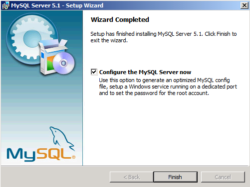
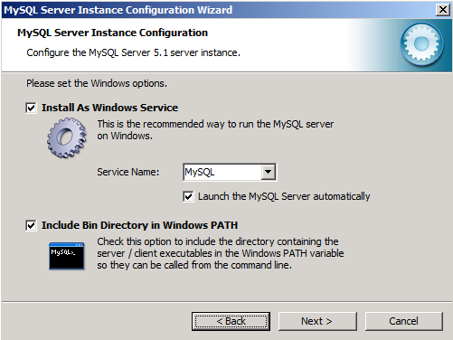

# Walkthrough - Set Up MySQL 5.1 for PHP applications

by [Ruslan Yakushev](https://github.com/ruslany)

## Overview

This article provides a basic step by step guide on how to install and configure MySQL on the Windows Operating System. For more detailed instructions about installing and configuring MySQL on Windows refer to the [official MySQL documentation](http://dev.mysql.com/doc/refman/5.1/en/windows-installation.html).

## Downloading and Installing MySQL

The MySQL binaries and installer can be downloaded from the [official MySQL site](http://dev.mysql.com/downloads/mysql/5.1.html). The instructions in this article are based on MySQL version 5.1 Community Edition installed with the Windows MSI installer.

Run the installer and choose the installation option. For a majority of the cases, the typical installation is sufficient:

However, if you want to control which components get installed or if you want to use a non-default installation path then choose the "Custom" option.

When the installation is complete, make sure to check the box to "Configure the MySQL Server now". This will launch the "MySQL Server Instance Configuration Wizard" that will guide you through the configuration process for the MySQL instance.

## Configuring MySQL instance

Follow these steps in the "MySQL Server Instance Configuration Wizard" to optimize the MySQL configuration for the kind of tasks you expect it to perform.

On the first page of the wizard choose "Detailed Configuration":

On the next page choose the server type option:

Choose the "Database Usage" option:

The Database usage options control what kind of database storage engine is used on the server:

- MyISAM – Optimized for high performance SELECT operations. It has low overhead in terms of memory usage and disk utilization, but at the cost of not supporting transactions
- InnoDB – Provides fully ACID transactional capabilities, but at the cost of more aggressive usage of disk space and memory

For an in-depth comparison of these database engines, refer to [MySQL Storage Engine Architecture](http://dev.mysql.com/tech-resources/articles/storage-engine/part_1.html). As a general recommendation – if the web applications on your server require multi-statement transactions, advanced isolation levels and row-level locking, foreign key constraints, or otherwise have a requirement for ACID features -- use InnoDB. Otherwise, use MyISAM.

Next choose the number of concurrent connections to the server:

On the next page choose networking options :

If you have mysql and web server on the same machine you may consider not enabling TCP/IP networking and instead use named pipes. Note though that some PHP applications may require TCP connection to MySQL. Refer to the application's documentation to confirm if it supports named pipes connection to MySQL.

Choose the default charset to use when creating new databases:

Next ensure that MySQL will be configured as a Windows Service:

Optionally, you can add the MySQL Bin directory to the Windows PATH environment variable. That will make it easier to launch MySQL tools from the command line.

Finally provide the password for the database administrative account, which in called "root" in MySQL. Make sure that you leave the "Create an Anonymous Account" checkbox cleared:

On the next page click "Execute" to apply all the configuration settings and to start the MySQL service:

Now you can logon to MySQL by opening a command line window and typing:

[!code-console[Main](walkthrough-set-up-mysql-51-for-php-applications/samples/sample1.cmd)]

If MySQL was configured correctly then the MySQL prompt will be shown:

[!code-console[Main](walkthrough-set-up-mysql-51-for-php-applications/samples/sample2.cmd)]
