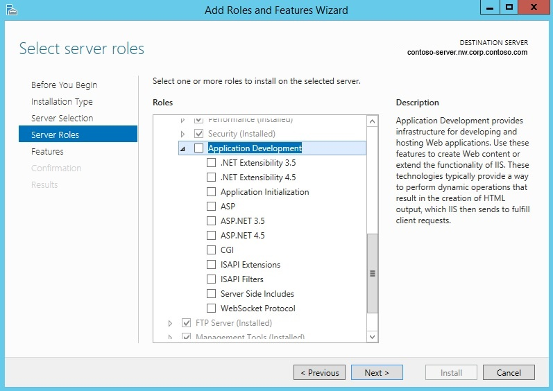
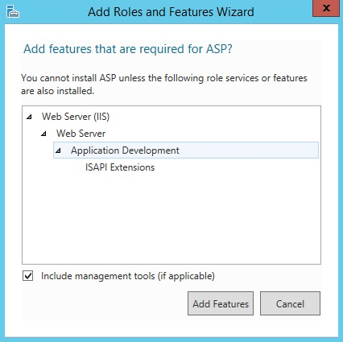
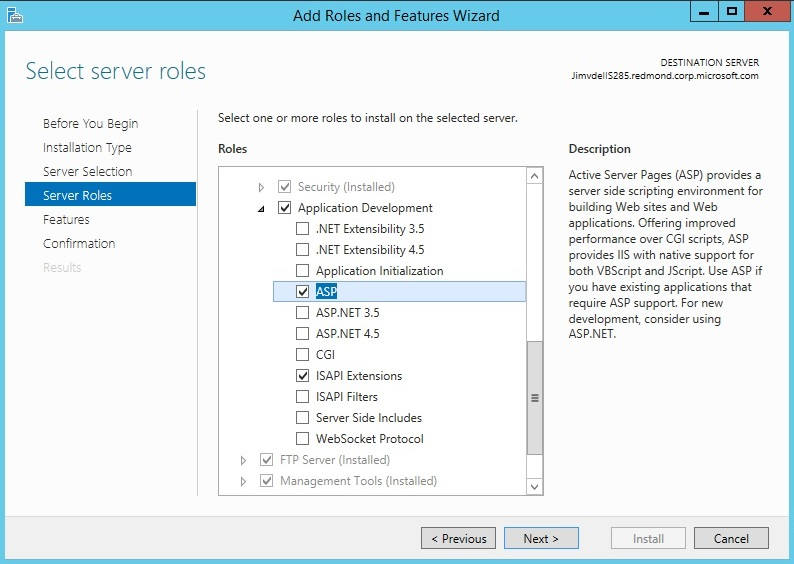
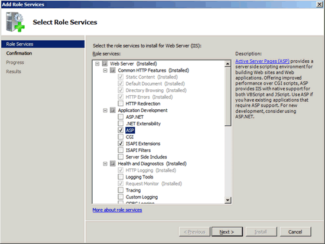
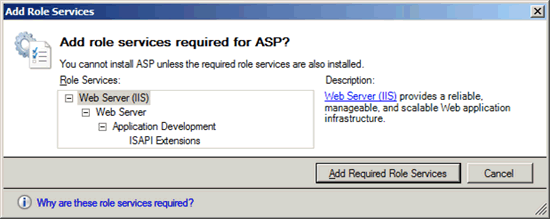

# Classic ASP Not Installed by Default on IIS 7.0 and above

by [Robert McMurray](https://github.com/rmcmurray)

One of the challenges of running IIS on your own server vs. running it [in the cloud](https://docs.microsoft.com/azure/app-service/) is that you need to install the components you need manually, and it can sometimes be tricky figuring out what needs to be installed to get the functionality you need. For example, in IIS, the classic version of ASP is not installed by default. Because of this, you might see HTTP 404 errors when you try to browse to an ASP page on your server, or you might see the source code for your ASP page displayed in your browser window. Both of these error conditions are created when configuration settings that are used to define the environment for classic ASP are not installed.

To support and configure ASP applications on your Web server, you must install the ASP module. To install the ASP module on IIS, use the following steps for your version of Windows.

## Installing Classic ASP on Windows Server 2012 or Windows Server 2012 R2

1. On the taskbar, click **Server Manager**.
2. In **Server Manager**, click the **Manage** menu, and then click **Add Roles and Features**.
3. In the **Add Roles and Features** wizard, click **Next**. Select the installation type and click **Next**. Select the destination server and click **Next**.
4. On the **Server Roles** page, expand **Web Server (IIS)**, expand **Web Server**, and then expand **Application Development**.
    
5. On the **Server Roles** page, select **ASP**.
6. If the **Add features that are required by ASP?** dialog box appears, click **Add Features**. (This page appears only if you have not already installed ISAPI Extensions on your server.)  
    
7. On the **Server Roles** page, **ASP** and **ISAPI Extensions** should be selected. Click **Next**.
    
8. On the **Features** page, click **Next**.
9. On the **Confirmation** page, click **Install**.
10. On the **Results** page, click **Close**.

## Installing Classic ASP on Windows 8 or Windows 8.1

1. On the **Start** screen, move the pointer all the way to the lower left corner, right-click the **Start** button, and then click **Control Panel**.
2. In **Control Panel**, click **Programs and Features**, and then click **Turn Windows features on or off**.
3. Expand **Internet Information Services**, expand **World Wide Web Services**, expand **Application Development Features**, and then select **ASP**.
    

    > [!NOTE]
    > The ISAPI Extensions feature will be selected if it has not already been installed.
4. Click **OK**.
5. Click **Close**.

## Installing Classic ASP onWindows Server 2008 or Windows Server 2008 R2

1. Click **Start**, point to **Administrative Tools**, and then click **Server Manager**.
2. In the **Server Manager** hierarchy pane, expand **Roles**, and then click **Web Server (IIS)**.
3. In the **Web Server (IIS)** pane, scroll to the **Role Services** section, and then click **Add Role Services**.
4. On the **Select Role Services** page of the **Add Role Services Wizard**, select **ASP**.

    
5. If the **Add role services required by ASP** dialog box appears, click **Add Required Role Services**. (This page appears only if you have not already installed the ISAPI Extensions role service on your server.)

    
6. On the **Select Role Services** page, click **Next**.
7. On the **Confirm Installation Selections** page, click **Install**.
8. On the **Results** page, click **Close**.

## Installing Classic ASP on Windows Vista or Windows 7 Client

1. Click **Start**, and then click **Control Panel**.
2. In **Control Panel**, click **Programs and Features**, and then click **Turn Windows Features on or off**.
3. Expand **Internet Information Services**, then **World Wide Web Services**, then **Application Development Features**.
4. Select **ASP**, and then click **OK**.

    

## More Information

For more information about how to install classic ASP and how to configure classic ASP options, see the [ASP \<asp>](../../configuration/system.webServer/asp/index.md) article in the IIS configuration reference.
