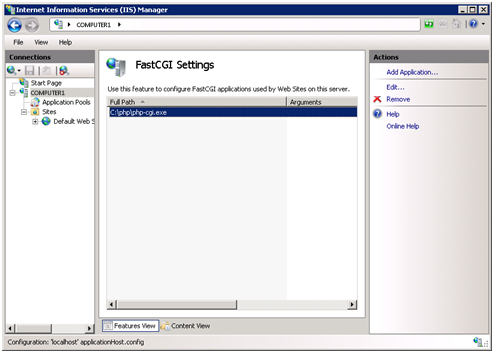
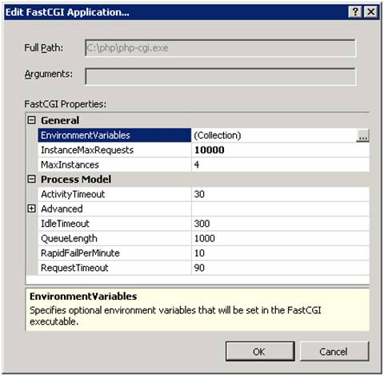
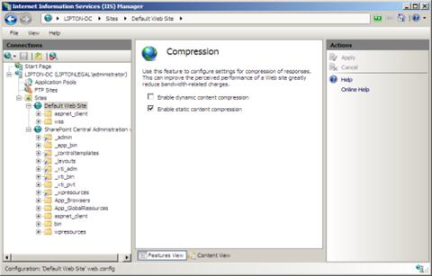

# Best Practices for PHP on the Microsoft Web Platform

by Tali Smith

## Introduction

There are various steps you can take to optimize Windows Server 2008 R2 or Windows Server 2008, IIS 7 and above, and FastCGI performance for your Web workloads and PHP applications. These procedures can be generally be performed from the UI by running Appcmd.exe commands in a command-line window and editing configuration files directly or by writing Windows&reg; Management Instrumentation (WMI) scripts.

## Configure PHP Process Recycling Behavior

Make sure that FastCGI always recycles the php-cgi.exe processes before the native PHP recycling kicks in. The FastCGI process recycling behavior is controlled by the configuration property **instanceMaxRequests**. This property specifies how many requests the FastCGI process will process before recycling. PHP also has a similar process recycling functionality that is controlled by an environment variable **PHP\_FCGI\_MAX\_REQUESTS**. By setting **instanceMaxRequests** to be smaller or equal to **PHP\_FCGI\_MAX\_REQUESTS**, you can ensure that the native PHP process recycling logic will never kick in.

The FastCGI settings can be configured either by using IIS Manager or by using the command-line tool **AppCmd**.

### Use IIS Manager

1. To configure FastCGI recycling settings by using IIS Manager, you need to install Administration Pack for IIS, and then select **FastCGI Settings** at the server level.  

    

    *Figure 1 IIS Manager, FastCGI Settings*
2. Next, select the FastCGI application that you want to configure, and then click **Edit** in the **Actions** pane on right-hand side.  

    

    *Figure 2 FastCGI Settings page*
3. In the **Edit FastCGI** **Application** dialog box, set **InstanceMaxRequest** to **10000**, and then click on the **browse** button next to the **EnvironmentVariables** setting.  

    

    *Figure 3 Edit FastCGI Application dialog box*
4. Add the **PHP\_FCGI\_MAX\_REQUESTS** environment variable and set its value to **10000**.  

    > [!NOTE]
    > If you do not configure these settings, then the following default settings are used: **InstanceMaxRequests** of 200, **PHP\_FCGI\_MAX\_REQUESTS** of 500 (on most PHP builds).

    

    *Figure 4 Environment Variables Collection Editor*

### Use the Command Line

To configure the recycling behavior of FastCGI and PHP via **appcmd**, use the following commands:

[!code-console[Main](best-practices-for-php-on-the-microsoft-web-platform/samples/sample1.cmd)]

## Disable Unneeded Services and Processes

If the server running Windows Server 2008 R2 or Windows Server 2008 will be a dedicated Web server, there are various steps you can take to optimize performance for your Web workloads. Note that these procedures can be performed easily and quickly from the UI or from a command line.

Make sure any unneeded roles and features in the Windows Server 2008 installation are not installed. Remove processes such as:

- Microsoft Find Fast and other search indexing services.
- Three-dimensional (3-D) screen savers (which may occupy CPU resources).
- Unused networking protocols.
- Unneeded mail servers.
- Unused antivirus scanners and hardware drivers for mice and infrared ports.

To use the UI, click **Start**, click **Services**, and then scroll down to the service you want to disable and click **Properties**. Click the arrow under **Startup type**, and then click **Disabled**.

> [!NOTE]
> Test the Web server for correct operation after you disable each service to make sure that you did not disable a service you want to continue to use. Also, note any services that are dependent on the service you want to stop.

There is also command-line–based management in Windows Server 2008. Prior versions of Windows provided few if any dependency checks when users had to add/remove server roles or other software. A simple command in Windows Server 2008 can provide server administrators with a listing of the components that will be added or removed. The server manager command also provides a mechanism for performing unattended installation of server roles and features. You can choose to install a single role or feature or combine installation of multiple roles/features via an XML answer file. You can now easily gather information on the installed roles and/or features of any given server and export those results to XML for documentation. You can also determine what server components will be affected by the installation or removal of a server role or feature.

## Optimize Server Performance

To optimize Windows Server 2008 or Windows Server 2008 R2 performance, you can:

- Run the IIS pageable code in working memory to maximize the data throughput.
- Run the IIS process (Inetinfo.exe) as a background service.
- Disable IIS logging.

### Minimize IIS logging

Unless required, disable logging on Web sites, virtual directories, files, and folders. You can use the UI or the command line. When logging is switched on, there is a constant appending of text files on the server that details everything about the Web sites. This is necessary if you are monitoring bandwidth though; switch on logging periodically to keep an eye on sites and the bandwidth they use, then switch off logging at all other times. There is generally no need to keep logging on permanently, unless you do want to constantly monitor bandwidth.

To use the UI, open the IIS Manager and navigate to the level you want to manage. In **Features View**, double-click **Logging**. On the **Logging** page, in the **Actions** pane, click **Disable** to disable logging.

To use the command line to disable logging, use the following syntax:

[!code-console[Main](best-practices-for-php-on-the-microsoft-web-platform/samples/sample2.cmd)]

## Enable Bandwidth Throttling

With increasing numbers of sites offering media content, the bandwidth costs for many businesses can be very high. In addition, a large percentage of media bandwidth is wasted because the media content sent to the client is never really used. It is common for users browsing video sites to watch only part of a video before moving on to the next video or leaving the page. However, a Web server using progressive download to deliver the video will typically send significantly more data than is required for those few seconds of play time. Most of that data never gets used.

For example, if your videos on average only get 5 seconds of viewing time but deliver (buffer) 30 seconds worth of video data in those 5 seconds, you are potentially wasting more than 80 percent of your bandwidth.

### Use the Bit Rate Throttling Module

IIS includes a Bit Rate Throttling Module, which automatically detects the encoding rate of the most popular video types. You can control how much data you would like to pre-send to the client in order to eliminate initial buffering delays (fast start) and at what percentage of the encoded rate you would like to deliver the content. You can also configure many other options, such as maximum bandwidth and concurrent connections, and control the module programmatically.

*Figure 5 Bandwidth throttling*

### Limit the number of connections to site

You can also limit the number of connections available to individual Web sites.

1. From the IIS Manager, expand the Web server and click to select the Web site.
2. Click **Limits…** in the Actions pane
3. Check the box for Limit number of connections
4. Enter the number of connections that you want to allow. Note that each connected client uses approximately four concurrent connections.
5. Click **OK.**

### Enable CPU monitoring

You can also enable CPU monitoring to monitor and to automatically shut down worker processes that consume large amounts of CPU time.

1. From the IIS Manager, expand the Web server and select an Application Pool.
2. Click Advanced Settings from the Actions tab.
3. In the **Limit** box in the **CPU** section, and type the value that you want.
4. Click **OK**.

## Use HTTP Keep-Alives

The HTTP keep-alive response header improves Web server performance by keeping a client/server connection open across multiple requests to the server. The open connection improves performance when a client makes multiple requests for Web page content, because the server can return the content for each request more quickly. Otherwise, the server has to open a new connection for every request. By default, the HTTP keep-alive response header is enabled in IIS.

1. From the IIS Manager and navigate to the level you want to manage.
2. In **Features View**, double-click **HTTP Response Headers**.
3. On the **HTTP Response Headers** page, in the **Actions** pane, click **Set Common Headers**.
4. In the **Set Common HTTP Response Headers** dialog box, select the **Enable HTTP keep-alive** check box, and then click **OK**.

To enable the HTTP keep-alive header from the command line, use the following syntax:

[!code-console[Main](best-practices-for-php-on-the-microsoft-web-platform/samples/sample3.cmd)]

## Use HTTP Compression

One of the most effective ways to reduce the bandwidth needed to deliver the application responses is to use HTTP compression. This can reduce the size of the response by a substantial amount, often by a factor of 10 when applied to easily compressible text content such as HTML. Since compression is based on Content-Encoding negotiation defined in the HTTP 1.1 protocol, enabling it is safe for clients that do not support compression—these clients simply receive an uncompressed version of the content.

IIS provides the two compression features:

- Static compression
- Dynamic compression

Static compression pre-compresses static content and saves it on disk, thereby allowing future requests to serve compressed content directly without compression overhead. Dynamic compression compresses the response in real time and therefore enables compression for responses generated by applications. Any application framework on IIS can take advantage of dynamic compression—including ASP, ASP.NET, or PHP.

Dynamic compression usually does not have a prohibitive CPU overhead. In fact, dynamic compression often causes less than 5 percent of the total CPU utilization on a busy server. Dynamic compression can be deployed somewhat liberally to allow for maximum bandwidth savings for any application workloads.

You can further optimize compression overhead by configuring the compression strength in order to achieve the desired compression versus CPU overhead ratio.

You can configure HTTP compression by using the UI, by running Appcmd.exe commands in a command-line window, by editing configuration files directly, or by writing WMI scripts.

For example, to enable dynamic content compression from the command line, type the following and press ENTER:

[!code-console[Main](best-practices-for-php-on-the-microsoft-web-platform/samples/sample4.cmd)]

To enable compression on a particular site from the UI, select the site, and then, from the Work pane, select the Compression management tool. Choose whether you want to compress static content, dynamic content, or both.

*Figure 6 HTTP compression*

## Use Forms Authentication

This feature secures the application and the static image files and works well for sites or applications on public Web servers that receive many requests. This authentication mode lets you manage client registration and authentication at the application level, instead of relying on the authentication mechanisms provided by the operating system. You can use the built-in membership database or a custom membership provider.

In the past, people would often protect the application pages themselves and leave images and media content open for public access. It wasn't easy to extend the same Internet-based authentication scheme to static content unless the static content was served through custom handlers. Even this wasn't a perfect solution, as you would often lose performance and static content features such as static compression and ranged request support.

With IIS, you can configure Forms Authentication and URL Authorization rules once for the entire site, and you know that your ASPX pages, PHP scripts, HTML files, and media content is protected from unauthorized access.

You can enable Forms Authentication by using the UI, running Appcmd.exe in a command-line window, by editing configuration files directly, or by writing WMI scripts.

1. From the IIS Manager, navigate to the level you want to manage.
2. In **Features View**, double-click **Authentication**.
3. On the **Authentication** page, select **Forms Authentication**.
4. In the **Actions** pane, click **Enable** to use Forms Authentication with the default settings.  

    

    *Figure 7 Forms Authentication*

To enable or disable Forms Authentication from the command line, use the following syntax:

[!code-console[Main](best-practices-for-php-on-the-microsoft-web-platform/samples/sample5.cmd)]

## Manage IIS 7.0 and above with the PowerShell Provider

The IIS PowerShell Provider is a Windows PowerShell snap-in that allows you to manage IIS configuration and run-time data. It gives easy access to Web-Sites, Application Pools, Web applications, Virtual Directories, request in flight, Worker Processes, and .NET Application Domains within Worker Processes.

Microsoft Windows PowerShell command-line shell and scripting language helps IT professionals achieve greater control and productivity. Using a new admin-focused scripting language, more than 130 standard command-line tools, and consistent syntax and utilities, Windows PowerShell allows IT professionals to more easily control system administration and accelerate automation. Windows PowerShell is built on top of the .NET common language runtime (CLR) and the .NET Framework, accepting and returning .NET objects.

Figure 8 shows how to use the PowerShell Provider to create a new IIS application.

*Figure 8 PowerShell Management Console*

The IIS PowerShell Provider allows you to:

- Create Web sites, Web applications, virtual directories, and application pools.
- Change simple configuration properties on Web sites, Web applications, virtual directories, and application pools.
- Add and change complex configuration settings.
- Query run-time data (Web site state, application pool state, currently executing requests).
- Execute advanced configuration tasks, scripting, and integration with other PowerShell snap-ins and features.
- Search and discover configuration settings.

For example, you can create a new application pool from the PowerShell Provider. This only requires the name to be specified.

[!code-powershell[Main](best-practices-for-php-on-the-microsoft-web-platform/samples/sample6.ps1)]

For more information, see the article "[Managing IIS with the IIS 7.0 and Above PowerShell Snap-in](../../manage/powershell/index.md)."

## Extend IIS 7 and Above

The IIS architecture is designed to be extensible from top to bottom, allowing you to replace any part of the built-in feature set with a custom implementation that suits your needs. As a result, instead of providing a patchwork of plug-in points, IIS implements all of its own features on top of the public extensibility model. This design is found throughout the platform, from the modular Web server engine itself to the configuration system to the IIS Manager console.

Often, the desired Web workload requires additional functionality that may not be part of the built-in IIS feature set. Or, in some cases, the application may require a customized set of functionality for which the built-in features are not flexible enough. Because all of the IIS features are built on public extensibility APIs, you can replace any of them with a custom implementation that best fits your needs.

### Extend the IIS Manager

Developers can extend the IIS Manager by providing a UI for their custom components and having that UI fully integrated into IIS Manager in the same way as any out-of-the-box IIS component. By using the IIS Manager extensibility, API developers can take advantage of remote management capabilities for their components for free.

IIS Manager has built-in remote administration capabilities. Using HTTPS between the IIS Manager and the remote server, this feature includes the ability to define trusted users in IIS Manager and have identities securely stored in the IIS configuration, Windows security accounts manager (SAM) or Active Directory, or a .NET provider.

Unlike other tools that also support remote administration, the IIS Manager remote administration architecture offers several key advantages. First, it allows users who are not administrators on the server to manage sites and applications over which they have control. Second, the IIS Manager remoting mechanism uses HTTPS, instead of DCOM, which is easier to expose through corporate firewalls. Together, these two capabilities make the IIS Manager attractive for delegated remote management of IIS Web sites, especially in shared Web-hosting environments.

The IIS Manager provides an extensible architecture on which most of the built-in IIS Manager features are based. To facilitate the remote management scenario, each management feature consists of two parts: the client-side components that provide the UI experience inside IIS Manager, and the server-side component that provides the actual management services. The server-side service is loaded inside IIS Manager for local management scenarios or inside the Web Management Service in remote management scenarios. In the latter case, IIS Manager handles the required communication between the components in IIS Manager on the client machine and the service running inside WmSvc on the target server machine.

### Extend the configuration schema

Extending the configuration schema can help manage your application. You can automate deployment of the application script to a virtual directory, or configure the role used to authorize users for caption editing, either system wide or for each Web site or application. Extending the schema involves adding a simple .xml file in the `%SystemRoot%\system32\inetsrv\config\schema` directory on your computer. The IIS\_schema.xml file is already present in this directory and can be used as an example to set up your own schema. Create a file named CUSTOM\_schema.xml and set it up, and then register the section in the applicationHost.config. This involves adding just one line in the applicationHost.config.

## Use a Non-Thread-Safe Build of PHP

A best practice is to use a non-thread-safe build of PHP with IIS FastCGI, available in PHP 5.2.1 or greater. There are two builds for each PHP version. One is thread safe, and one isn't, referred to as the Non-Thread-Safe (NTS) version. The thread-safe version is designed for environments where the Web server core can keep the PHP engine in memory, running multiple treads of execution for different Web requests simultaneously. The architecture of IIS and the FastCGI extension provide an isolation model that keeps requests separate, removing the need for a thread-safe version. The NTS doesn't have any of the code that allows PHP to manage multiple threads. As a result, you will see a performance improvement on IIS when using the NTS version as compared to the tread-safe version.

IIS had always supported PHP but in a way that precluded many real-life PHP applications from being hosted in production environments. This was due to limitations in the two ways IIS offered for running PHP applications: using the Common Gateway Interface (CGI) protocol or using the PHP ISAPI extension.

Because CGI requires a separate process for each request, apps hosted using CGI would perform poorly on Windows. Conversely, PHP apps using the IIS high-performance multithreaded ISAPI interface would often suffer from instability due to the lack of thread safety in some popular PHP extensions.

In an attempt to solve these problems, the IIS team developed the FastCGI component. The open FastCGI protocol allows PHP and many other application frameworks that require a single-threaded environment (including Ruby on Rails, Perl, and Python) to run more reliably on IIS. Unlike the standard CGI implementation, FastCGI enables process reuse by maintaining a pool of worker processes, each processing no more than one request at a time, thus resulting in much-improved performance. FastCGI also benefitted from a community-centric development and testing model.

## Set the Default Document

IIS uses a configuration file named web.config. This file can be placed at any point within an application, and is used to include Web server directives that affect that directory and the ones below it. Many applications currently distribute the file .htaccess, which provides a similar set of capabilities. You can use the web.config file to identify the default document for your application, as follows:

[!code-xml[Main](best-practices-for-php-on-the-microsoft-web-platform/samples/sample7.xml)]

The bold **remove** entry in this example is required. If there is a previous definition for Index.php, this will remove it and place the new one at the top of the default document list. If there isn't a previous one, the remove will be ignored.

## Use the URL Rewriter Module

IIS includes a URL Rewriter module comprising a complete, expression-based engine for rewriting rules. These rules can be configured manually or by using the IIS Manager. The URL Rewriter module can import and convert mod\_rewrite rules.

A typical simple rewrite rule, which converts all requests that come in to *http.example.com* into `http://www.example.com`, is shown in the following code:

[!code-xml[Main](best-practices-for-php-on-the-microsoft-web-platform/samples/sample8.xml)]

## Use the Request Filtering Module

IIS uses the Request Filtering module to limit browser access to files or directories based upon specified criteria. The URL Filtering module is a powerful engine for securing access to various URLs and requests.

An example of how to use request filtering to block access to certain types of files, such as include or log files, follows:

[!code-xml[Main](best-practices-for-php-on-the-microsoft-web-platform/samples/sample9.xml)]

## IIS 6.0 and 5.1

Earlier versions of IIS do not have the URL Rewriter module. One of the major uses for this module is to limit access to certain files and / or directories. For the older versions of IIS, it is possible to provide similar protections.

## Links for Further Information

- [Optimize IIS Performance (IIS 7)](https://technet.microsoft.com/library/cc770381(WS.10).aspx).
- [Windows Server Performance Team Blog](https://docs.microsoft.com/archive/blogs/winserverperformance/tuning-windows-server-2008-for-php)
- [Top 10 Performance Improvements in IIS 7.0](https://technet.microsoft.com/magazine/2008.09.iis.aspx).
- [Enable or Disable Logging (IIS 7)](https://technet.microsoft.com/library/cc754631.aspx).
- [IIS 7.0 Bit Rate Throttling Module Released](https://weblogs.asp.net/scottgu/archive/2008/03/18/iis-7-0-bit-rate-throttling-module-released.aspx)
- [Bit Rate Throttling is now released](https://blogs.iis.net/vsood/archive/2008/03/15/bit-rate-throttling-is-now-released.aspx).
- [Configuring HTTP Compression in IIS 7](https://technet.microsoft.com/library/cc771003.aspx).
- [Build Web Server Solutions with End-To-End Extensibility](https://msdn.microsoft.com/magazine/cc164241.aspx)
- [How to Get Started Extending Module Properties for IIS 7.0 and Above in IIS Manager](../../develop/extending-the-management-ui/how-to-get-started-extending-module-properties-for-iis-in-iis-manager.md).
- [How to Take Advantage of the IIS 7.0 and Above Integrated Pipeline](../building-and-running-aspnet-applications/how-to-take-advantage-of-the-iis-integrated-pipeline.md)
- [Enable Forms Authentication (IIS 7)](https://technet.microsoft.com/library/cc771077.aspx).
- [How to Use Request Filtering](../../manage/configuring-security/use-request-filtering.md).
- [Importing Apache mod\_rewrite Rules](../../extensions/url-rewrite-module/importing-apache-modrewrite-rules.md).
- [Translating .htaccess Content to IIS web.config](../install-and-configure-php-applications-on-iis/translate-htaccess-content-to-iis-webconfig.md).