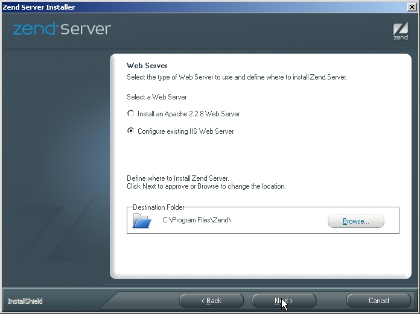
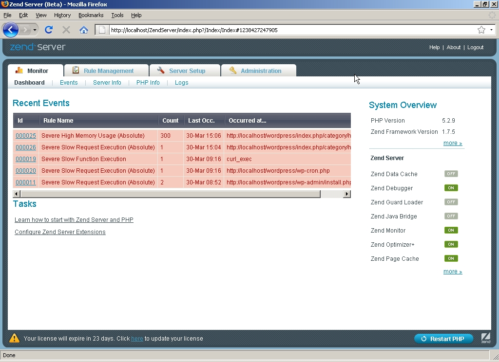
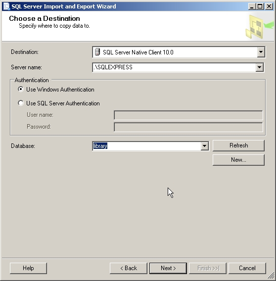
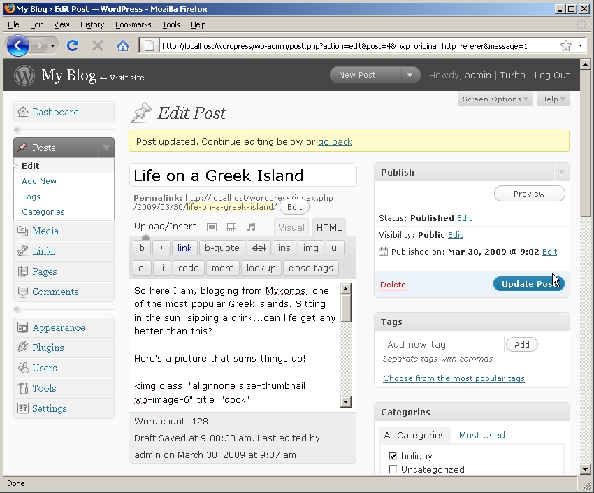
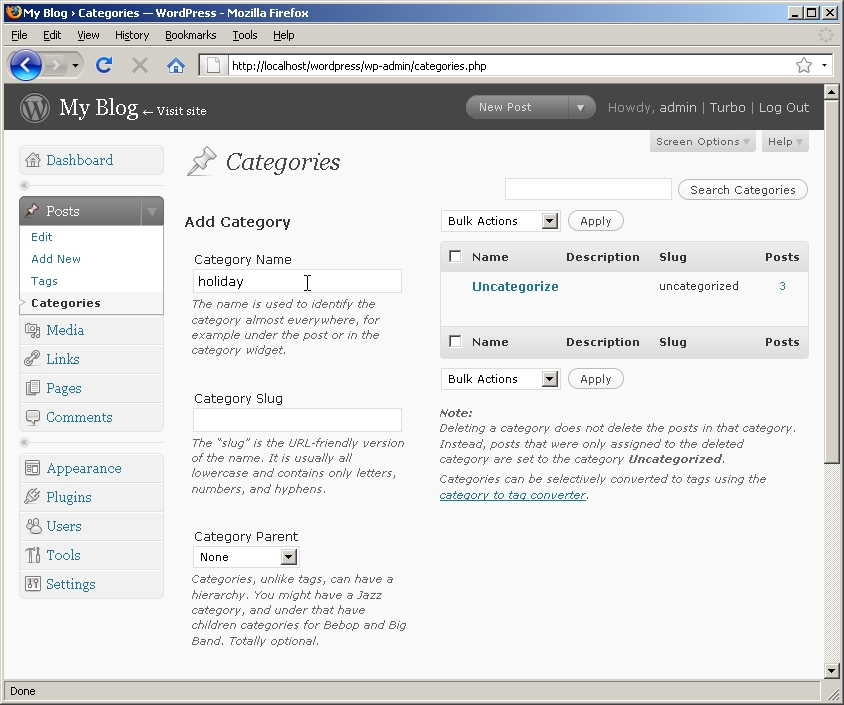
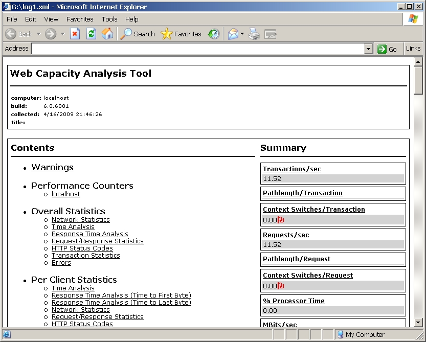

Build a High-Performance PHP Stack with Windows IIS and Zend Server
====================
by Vikram Vaswani

This article was written by Vikram Vaswani of Zend Technologies Ltd.

If you're a Web application developer, you've undoubtedly heard of PHP, the open-source Web programming language. PHP is an extremely popular tool for building dynamic, data-driven Web applications, as it's easy to learn, interconnects with a wide variety of RDBMSs (including Oracle, MySQL and Microsoft SQL Server), and comes with excellent documentation and deep community support.

There's only one glitch: setting up a full-fledged PHP development environment under Windows typically requires one to download, install and then configure various bits of software to talk nicely to one another. This process is something that novice developers often struggle with, and it can produce a fair amount of frustration when things don't work "out of the box".

This is not a problem entirely without solutions. The Microsoft Web Platform offers one answer, but it certainly isn't the only one. There's also another option that you might like to consider: Zend Server, a Windows-based PHP stack that plays well with Microsoft Internet Information Services (IIS), Microsoft SQL Server and MySQL. And over the next few pages, I'm going to show you how to use it to build a high-performance, enterprise-ready PHP+Windows stack.

## Getting Started

To quote its official Web site ([http://www.zend.com/en/products/server/](http://www.zend.com/en/products/server/)), Zend Server is "a complete, enterprise-ready Web Application Server for running and managing PHP applications that require a high level of reliability, performance and security." Simply put, it provides a consistent and reliable PHP stack that can be easily deployed in both Windows and \*NIX environments. This stack includes the latest version of PHP, some optional components (Apache, MySQL and Zend Framework), and support for Microsoft IIS, Java, and various databases, including Oracle, MySQL, DB2 and Microsoft SQL Server. All versions of Zend Server come with the Zend Optimizer+ opcode caching engine to significantly speed up PHP performance.

Zend Server comes in two flavors, which may broadly be classified as 'commercial' and 'community'. The commercial version, known simply as Zend Server, requires purchase of a commercial license, which entitles you to software updates and technical support, in addition to goodies like page (URL) caching, automatic application alerts and diagnostics. The community version, known as Zend Server CE, is available free of charge, but lacks some of the "extras" in the commercial version.

Your choice of server flavor will usually be defined by your needs (and your budget). If you're a PHP hobbyist or planning to use the server for non-critical PHP applications, Zend Server CE will probably meet all your needs. If, on the other hand, you're running critical enterprise applications and/or need technical support for your PHP environment, a commercial Zend Server license will probably serve you better. Both versions are available for Windows environments and, regardless of which one you choose, you'll get all of the following:

- All-in-one installation package: Zend Server provides all the key components of a PHP stack in a single point-and-click installation package. This is ideal for novice developers just getting started with PHP; it's also useful for experienced programmers who need to set up a test or development system with minimum fuss.
- Web-based administration: Zend Server comes with an integrated administration panel that allows administrators to monitor server status using a standard Web browser. This graphical administration panel also provides a handy way to change server configuration, set and reset PHP configuration variables, and enable or disable PHP modules.
- Debugging and performance tools: Zend Server includes a number of additional components to improve application performance and make development and debugging easier. These components include Zend Optimizer+, a performance accelerator; Zend Data Cache, a data caching API; Zend Debugger, a full-featured script debugger; and Zend Java Bridge, a PHP/Java connector. All these components can be selectively enabled or disabled from the server administration console at run-time. The commercial version of Zend Server also includes event monitoring and page caching, to improve performance and reduce downtime in network environments.
- Certified PHP stack: The version of PHP that ships with Zend Server is tested and certified by Zend Technologies. This ensures a consistent development environment across various platforms. Having the support and reputation of a major software vendor behind the product also significantly increases the comfort level of project managers and customers who are dipping their toes into PHP-based application development for the first time. The commercial version of Zend Server also includes regular updates and security fixes, to ensure that your PHP applications remains up-to-date and protected.

Enough with the advertising...let's kick the tires on this thing and see how it works!

## Installing Zend Server

To get started with Zend Server, download the Windows installation package from the [Zend Technologies Web site](http://www.zend.com/en/products/server/downloads). While you're there, you should request a free trial license key - this license is valid for 30 days and allows you to try out all the features of the commercial product. The product will automatically revert to a CE-like version, with some features disabled, once the license runs out.

If you're using Windows XP Professional, Windows Vista or Windows Server 2008, IIS is included with your operating system (although it is an optional installation on Windows Vista). For purposes of this article, I'll assume that you're installing Zend Server on Windows Vista with Microsoft IIS 7.0. If you're using a different version of the operating system, relax - the Windows installation package also works with Windows XP Professional (IIS 5.1 and IIS 6.0) and Windows Server 2008 (IIS 7.5), with no changes necessary. I'll also assume that you have both MySQL 5.1 and Microsoft SQL Server Express 2008 installed on your system. If you don't, you can get Microsoft SQL Server Express 2008 free of charge from [the Microsoft Web site](https://www.microsoft.com/express/sql/download/), and MySQL 5.1 from [the MySQL Web site](http://www.mysql.com/) or via the Zend Server installer.

Get things rolling by starting up the installer. You should see a welcome screen, as below:  

Accept the license terms, and choose a Custom Installation.  

At this point, you can choose which of the various Zend Server components should be installed. It's definitely worth keeping the bundled performance and monitoring tools, such as Zend Optimizer+ and Zend Monitor, and it's a good idea to install Zend Framework, which provides a set of ready-made components that simplify PHP development. I'll be showing you how to hook your PHP scripts up to Microsoft SQL Server Express and MySQL a little further along, so also install the MS-SQL Native Client, MySQL and phpMyAdmin if you don't already have them.  

Next, configure Zend Server to integrate with your existing IIS web server installation. If you're using Windows XP Professional, Windows Vista or Windows Server 2008, IIS should already be installed and working on your system.   

Confirm your choices, and let the installer go to work downloading files and setting things up.  

Once done, the installer will display a success message and allow you to immediately start the Zend Server process.  

Since this is its first run, Zend Server will prompt for an administrator password, as well as your license key.   

Enter the requested information and you'll be transferred to the server administration panel.

## Understanding The Zend Server Administration Panel

Zend Server is fully configurable via its Web-based administration panel, which is typically found at [http://localhost/ZendServer/](http://localhost/ZendServer/) and is broadly divided into four sections:

**Monitor**: Think of the Monitor section as a one-stop shop for anything and everything related to the server's current status and health. The aptly-named Dashboard provides a quick overview of recent PHP events, such as errors and warnings, as well as information on the current status of the various Zend add-on components. This section is also the place to go to view phpinfo() output and server error logs. Under Zend Server CE, the event monitoring tools are absent.  

**Rule Management**: Two of the key selling points of Zend Server can be found in the Rule Management section: the built-in URL caching system, and the event monitoring system. The Rule Management -&gt; Monitoring section is ground zero for the event monitor. It allows the administrator to set up "watch rules" for PHP requests and trigger actions on certain conditions, such as an uncaught exception or unusually-high memory consumption. In a similar vein, the Rule Management -&gt; Caching section allows administrators to define URL patterns that, when encountered, are automatically cached to improve performance. These two features offer huge benefits to administrators tasked with managing business-critical applications in an enterprise environment; however, it's worth noting that they're not included in Zend Server CE.   

**Server Setup**: The Server Setup section is where administrators head when they need to change server parameters. This section allows an administrator to turn on or off the various Zend performance and optimization components, such as Zend Optimizer+, Zend Page Cache and Zend Debugger. It also provides a graphical interface to the php.ini configuration file, making it easy to alter PHP configuration variables or enable PHP extensions. Finally, it also allows administrators to configure allow or deny rules for the Zend Studio remote debugging client, as well as to integrate Zend Studio with the event monitoring system to relay information on PHP events. Under Zend Server CE, the event monitoring tools are absent.  

**Administration**: The Administration section provides tools to change the administrator password and update the license key. It also reports on available updates, and allows the administrator to install these with a single click. Under Zend Server CE, these update management tools are absent.  

## Building A Simple Application...Or Two

Now that you know your way around Zend Server, let's put together a simple PHP script to check that everything's working as it should. Using a text editor, create a file containing the following PHP code:

[!code-xml[Main](build-a-high-performance-php-stack-with-windows-iis-and-zend-server/samples/sample1.xml)]

Save this file as whoami.php in the site root folder (typically, C:\inetpub\wwwroot\), and then browse to [http://localhost/whoami.php](http://localhost/whoami.php). You should see something like this:  

This is a very basic "Hello World" script in PHP: the echo statement simply prints a string to the output device - in this case, the browser.

How about something a little more complicated, to demonstrate the power of PHP scripting? Here's a PHP script for a simple guessing game: a Web form that invites the user to try and guess the name of a breakfast item. The item itself is randomly selected from a pre-defined array on each iteration. Here's the code (guess.php):

[!code-html[Main](build-a-high-performance-php-stack-with-windows-iis-and-zend-server/samples/sample2.html)]

This script begins by defining an array containing various common breakfast items, and initializing a session with the session\_start() function. This session is used to store a randomly-selected item from the array. A Web form prompts the user to guess the item; on submission, the user's input is stored in the $\_POST array. The script then reads the user's input from the $\_POST array, tests it against the value stored in the session, and displays a message indicating if the guess is correct or not. The strlen() and substr() functions, which respectively return string length and string segments, are used to provide hints to help the user along.

Here's what it looks like:  

## Integrating With Microsoft SQL Server

One of the reasons for PHP's popularity as a Web scripting language has been its strong support for a variety of different RDBMSs...and Microsoft SQL Server is no exception! In this section, you'll see just how easy it is to get started building data-driven Web applications with PHP, by connecting to an MS-SQL database, reading records from it and displaying them as an HTML page.

To activate MS-SQL support under Zend Server, there's really only one step: enable PHP's mssql extension, which is included with Zend Server but disabled by default. To do this, log in to the Zend Server administration console at [http://localhost/ZendServer/](http://localhost/ZendServer/), and visit the Server Setup -&gt; Extensions section. Find the entry for mssql and turn it on.  

You will be prompted to restart PHP. Do so via the button at the bottom right of the page. PHP will restart, and the extension will now be enabled.  

Once you've got the module enabled, initialize a new database and populate it with some data. With SQL Server Express 2008, the easiest way to do this is to import from a file containing structured data, such as a CSV-formatted file. [Here's an example](build-a-high-performance-php-stack-with-windows-iis-and-zend-server/_static/books1.zip) of one such file.

To import this data, start the SQL Server Import and Export Wizard, and select Flat File Source as the data source. Browse for and select the input CSV file. Remember that the first row of the file contains the field names.  

Create a new database named 'library' to hold this data.  

Set the destination table name, and preview the data to ensure that it will be imported correctly.  

Confirm the settings, and proceed to import the data.  

You can verify that the data has been correctly imported through the sqlcmd command-line tool, as below:

[!code-console[Main](build-a-high-performance-php-stack-with-windows-iis-and-zend-server/samples/sample3.cmd)]

Now, try reading and displaying these records using PHP (mssql.php):

[!code-html[Main](build-a-high-performance-php-stack-with-windows-iis-and-zend-server/samples/sample4.html)]

This script begins by opening a connection to the database server using the mssql\_connect() function with the server name and administrator credentials. It then selects the newly-minted library database with mssql\_select\_db(), and executes a query on the database with the mssql\_query() function.

The number of records returned by the query are obtained via a call to mssql\_num\_rows(). If one or more records are present, a loop is used to iterate over the result set, returning individual records as objects via mssql\_fetch\_object(). Individual fields of each record can now be accessed as object properties; it's then fairly simple to present these field values as an HTML table. Once all the records in the result set have been processed, the connection is closed with mssql\_close().

Here's what the output looks like in a Web browser:  

## Integrating With MySQL

Built-in MySQL support (as well as the option to download and install MySQL during the Zend Server installation process) means that it's also extremely easy to create MySQL-backed PHP applications with Zend Server. To illustrate, let's port the example in the previous section to use MySQL instead of Microsoft SQL Server Express.

The first step is to create a database, and a table to hold the data. Do this by opening a command prompt window and connecting to the MySQL server using the MySQL command-line client.

[!code-console[Main](build-a-high-performance-php-stack-with-windows-iis-and-zend-server/samples/sample5.cmd)]

Type 'help;' or '\h' for help. Type '\c' to clear the buffer.

[!code-sql[Main](build-a-high-performance-php-stack-with-windows-iis-and-zend-server/samples/sample6.sql)]

Import the raw data into this table from the CSV file using the LOAD DATA INFILE command.

[!code-console[Main](build-a-high-performance-php-stack-with-windows-iis-and-zend-server/samples/sample7.cmd)]

Create a MySQL user with privileges to access this database.

[!code-console[Main](build-a-high-performance-php-stack-with-windows-iis-and-zend-server/samples/sample8.cmd)]

Log in as the new user and check that the data has been imported with a quick SELECT.

[!code-console[Main](build-a-high-performance-php-stack-with-windows-iis-and-zend-server/samples/sample9.cmd)]

Type 'help;' or '\h' for help. Type '\c' to clear the buffer.

[!code-console[Main](build-a-high-performance-php-stack-with-windows-iis-and-zend-server/samples/sample10.cmd)]

Now, all that's left is to do the same thing using PHP. Here's the code (mysql.php):

[!code-html[Main](build-a-high-performance-php-stack-with-windows-iis-and-zend-server/samples/sample11.html)]

This script begins by opening a connection to the database server using the mysqli\_connect() function with the user account credentials created in the previous step. It then executes a query on the database with the mysqli\_query() function. The number of records returned by the query are obtained via a call to mysqli\_num\_rows(), and a loop is used to iterate over the result set, returning individual records as objects via mysqli\_fetch\_object(). Individual fields of each record can now be accessed as object properties.

Here's what the output looks like in a Web browser:  

As the previous two examples illustrate, it's extremely easy to create PHP applications that interact with different database systems using the built-in tools provided with Zend Server.

## Improving Performance with Page Caching

One of Zend Server's key benefits is its built-in page caching system, which automatically caches the HTML output generated by PHP scripts on the basis of pre-specified caching rules. This feature significantly boosts performance when used with applications that run lots of PHP code to generate their pages (think your average CMS). This page caching system is easily configurable by the server administrator from the Zend Server administration panel once the application is installed and deployed; it's not necessary to change any application-level code to enable this feature.

To illustrate how this works, let's try installing and benchmarking a popular PHP application with Zend Server. The application in question is Wordpress, a popular PHP/MySQL blogging platform, and you can download it free of charge from the Wordpress Web site ([http://www.wordpress.org/](http://www.wordpress.org/)). The following discussion assumes that you have successfully installed Wordpress 2.7.1; detailed installation instructions can be obtained from the Web site ([http://codex.wordpress.org/Installing\_WordPress](http://codex.wordpress.org/Installing_WordPress)). Note that you will need to activate PHP's mysql extension through the Zend Server administration panel (Server Setup -&gt; Extensions) before beginning the installation process.

Assuming you've got it all set up, log in to the Wordpress administration area and adjust the permalink settings to use search-engine friendly URLs (Settings -&gt; Permalink Settings):  

Now, create a new post (Posts -&gt; Add New).  

While you're at it, create a new category (for example, 'holiday') for your post and publish it to that category.  

Visit your Wordpress site, select the category (note down the URL, you'll need it a little further along) and you should see your newly-created post(s).  

Now, let's quantitatively analyze the benefit of Zend Server's page caching system, by benchmarking performance using the Microsoft Web Capacity Analysis Tool (WCAT) ([https://www.iis.net/1466/ItemPermalink.ashx](https://www.iis.net/downloads/community/2007/05/wcat-63-x86)). First, visit the Zend Server administration panel and turn off all the Zend performance components under Server Setup -&gt; Components, including the Zend Page Cache and the Zend Optimizer+.  

Now, run WCAT with the category URL you noted earlier, using 20 virtual clients and warmup/duration/cooldown periods of 180/180/30 seconds (example scenario and configuration files can be downloaded here; these are based on information obtained from [the IIS.net forum post](https://forums.iis.net/t/1150332.aspx). From the output below, it's clear that the server tops out at 11.52 transactions/second, with an average response time of 1736 ms.  

Now, let's see if we can improve that number. Visit the Zend Server administration panel and turn on the Zend Page Cache and Zend Optimizer+. Restart PHP, and then enter a new caching rule (Rule Management -&gt; Caching) for your Wordpress installation, as in the following image:  

As the above examples demonstrate, Zend Server provides a fully-functional, enterprise-ready PHP stack for Windows, one that plays well with all of the most common database systems, including Microsoft SQL Server and MySQL. A Web-based administration panel and event monitor makes server configuration and maintenance simple, and built-in page caching and code acceleration features can improve PHP's default performance by orders of magnitude. Have fun playing with it...and happy coding!