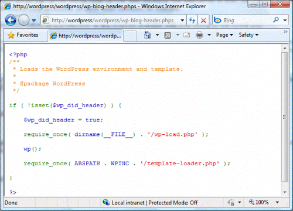

# Enable PHP Syntax Highlighting on IIS 7

by Tali Smith

You can configure Internet Information Services 7 (IIS 7) and above to output syntax-highlighted source code for PHP files stored on the Web server or Web site. This feature is useful in development environments because you can quickly make the source code accessible to other team members.

:::image type="icon" source="enable-php-syntax-highlighting-on-iis-7-and-above/_static/image1.gif" ::: Note that you should not attempt these procedures on any Internet-accessible Web site as this greatly compromises the security of your Web application.

The HTTP requests for the PHP source code are usually identified by the .phps file extension (for example, `http://localhost/index.phps`). You must configure IIS to understand and handle the HTTP requests with this extension. There are two options for this: create an IIS handler mapping for \*.phps or use the [IIS URL Rewrite Module](https://www.iis.net/downloads/microsoft/url-rewrite "Download the IIS URL Rewrite Module").

## Configure IIS Handler Mapping

The PHP executable supports a command-line argument "-s" that is used to display color, syntax-highlighted source code for any PHP script. You can create a handler mapping for "\*.phps" and use C:\[path to PHP installation]\php-cgi.exe|-s as the executable:

  
*Figure 1: Add Module Mapping*

Next, rename or copy the .php file to a .phps file, and then request the .phps file from a Web browser.

## Use IIS URL Rewrite Module

If you do not want to rename each .php file to .phps, you can use the IIS URL Rewrite rule and a simple PHP script. In the root directory of your Web site, create a file called **highlighter.phpb**, and then copy the following code into the file:

[!code-xml[Main](enable-php-syntax-highlighting-on-iis-7-and-above/samples/sample1.xml)]

After that, add the following rewrite rule to the **Web.config** file located at the root directory of your Web site:

[!code-xml[Main](enable-php-syntax-highlighting-on-iis-7-and-above/samples/sample2.xml)]

Now, if you request a URL that has an extension of .phps, the highlighted source code is returned in response, provided that the corresponding .php file exists under the Web site's root directory.

  
*Figure 2: Highlighted code response*

This article is based on the blog post "[Enable PHP Syntax Highlighting on IIS 7](https://blogs.iis.net/ruslany/archive/2009/10/07/enable-php-syntax-highlighting-on-iis-7.aspx)" by Ruslan Yakushev, published on October 7, 2009.
