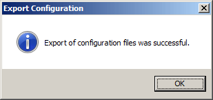
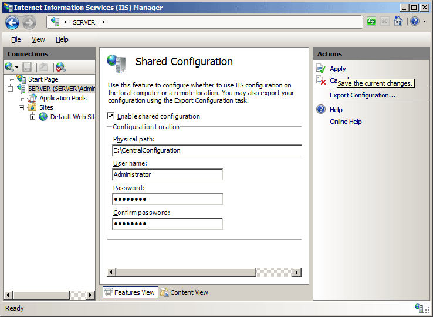

# Configuration Redirection &lt;configurationRedirection&gt;

## Overview

The `<configurationRedirection>` element lets you to share configuration files from a centralized location to multiple Internet Information Services (IIS) 7 server computers in a Web farm. This allows you to configure one IIS 7 server in your Web farm and to share the resulting configuration settings across all IIS 7 servers in the Web farm. This element also lets you store configuration settings on a UNC server that all Web server computers in the Web farm can access.

### Changes in IIS 7.5

In IIS 7.5, two new attributes have been added that control whether IIS will use change notifications or UNC polling to determine if the configuration files have changed. These attributes are:

- `enableUncPolling`:

  - When set to **true**, IIS will periodically check the UNC share to test if the configuration files have been updated.
  - When set to **false**, change notifications will continue be used as they were in IIS 7.0.
- `pollingPeriod`: Specifies the time interval between UNC checks that IIS will use.

## Compatibility

| Version | Notes |
| --- | --- |
| IIS 10.0 | The `<configurationRedirection>` element was not modified in IIS 10.0. |
| IIS 8.5 | The `<configurationRedirection>` element was not modified in IIS 8.5. |
| IIS 8.0 | The `<configurationRedirection>` element was not modified in IIS 8.0. |
| IIS 7.5 | The `enableUncPolling` and `pollingPeriod` attributes were added in IIS 7.5. |
| IIS 7.0 | The `<configurationRedirection>` element was introduced in IIS 7.0. |
| IIS 6.0 | IIS 6.0 did not support shared configuration. |

## Setup

The `<configurationRedirection>` element is included in the default installation of IIS 7.

## How To

### How to export configuration settings and enable shared configuration

1. Open **Internet Information Services (IIS) Manager**:

    - If you are using Windows Server 2012 or Windows Server 2012 R2:

        - On the taskbar, click **Server Manager**, click **Tools**, and then click **Internet Information Services (IIS) Manager**.
    - If you are using Windows 8 or Windows 8.1:

        - Hold down the **Windows** key, press the letter **X**, and then click **Control Panel**.
        - Click **Administrative Tools**, and then double-click **Internet Information Services (IIS) Manager**.
    - If you are using Windows Server 2008 or Windows Server 2008 R2:

        - On the taskbar, click **Start**, point to **Administrative Tools**, and then click **Internet Information Services (IIS) Manager**.
    - If you are using Windows Vista or Windows 7:

        - On the taskbar, click **Start**, and then click **Control Panel**.
        - Double-click **Administrative Tools**, and then double-click **Internet Information Services (IIS) Manager**.
2. In the **Connections** pane, click the server connection for which you want to set up configuration redirection.
3. In the **Home** pane, double-click **Shared Configuration**.  
    
4. In the **Actions** pane, click **Export Configuration**  
    
5. In the **Export Configuration** dialog box, type the path to the directory where you want to export the configuration files in the **Physical path** box, type and confirm the encryption password, and then click **OK**.  
    
6. When the Export Configuration dialog box appears, click **OK**.  
    

### How to enable shared configuration

1. Open **Internet Information Services (IIS) Manager**:

    - If you are using Windows Server 2012 or Windows Server 2012 R2:

        - On the taskbar, click **Server Manager**, click **Tools**, and then click **Internet Information Services (IIS) Manager**.
    - If you are using Windows 8 or Windows 8.1:

        - Hold down the **Windows** key, press the letter **X**, and then click **Control Panel**.
        - Click **Administrative Tools**, and then double-click **Internet Information Services (IIS) Manager**.
    - If you are using Windows Server 2008 or Windows Server 2008 R2:

        - On the taskbar, click **Start**, point to **Administrative Tools**, and then click **Internet Information Services (IIS) Manager**.
    - If you are using Windows Vista or Windows 7:

        - On the taskbar, click **Start**, and then click **Control Panel**.
        - Double-click **Administrative Tools**, and then double-click **Internet Information Services (IIS) Manager**.
2. In the **Connections** pane, click the server connection for which you want to set up configuration redirection.
3. In the **Home** pane, double-click **Shared Configuration**.  
    
4. In the **Shared Configuration** pane, select the **Enable shared configuration** option.
5. In the **Physical path** box, type the path to the shared configuration files, type the account name with permissions to access the shared configuration files in the **User name** box, type the account's password in the **Password** box, and then type the account password again in the **Confirm password** box.  
    
6. In the **Actions** pane, click **Apply**.
7. In the **Enter encryption key** password box on the **Encryption Keys Password** dialog box, type the password for the encryption key that you created in step 5, and then click **OK**.  
    
8. In each of the **Shared Configuration** dialog boxes that appear, click **OK** to close the dialogs.  
      
      

    > [!NOTE]
    > You must close and restart IIS Manager before it will reflect these configuration changes.

## Configuration

The `<configurationRedirection>` element is configured in the Redirection.config file.

### Attributes

| Attribute | Description |
| --- | --- |
| `enabled` | Optional Boolean attribute.  Specifies whether configuration redirection is enabled or disabled on the Web server.  The default value is `false`. |
| `enableUncPolling` | Optional Boolean attribute.  **true** if UNC polling should be used to check if the configuration files have been updated; otherwise, **false** if change notifications should be used. Note: The time interval between checks is configured by the `pollingPeriod` attribute.  **Note:** This attribute was added in IIS 7.5.  The default value is `false`. |
| `password` | Optional string attribute.  Specifies the password that you need to authenticate the user name to access the location for configuration file storage. This is a case sensitive string.  **Note:** To avoid storing unencrypted password strings in configuration files, always use AppCmd.exe or the IIS Manager to enter passwords. If you use these management tools, the password strings will be encrypted automatically before they are written to the XML configuration files. This provides better password security than storing unencrypted passwords. |
| `path` | Optional string attribute.  Specifies the location from which to read configuration files and encryption keys. This can be a network path or a folder on the local computer.  There is no default value. |
| `pollingPeriod` | Optional timeSpan attribute.  Specifies the time interval between checks that IIS will use to check if the configuration files have been updated. Note: This only applies when the `enableUncPolling` attribute is set to **true**.  **Note:** This attribute was added in IIS 7.5.  The default value is `00:03:00` (three minutes.) |
| `userName` | Optional string attribute.  Specifies the user name to access the location for configuration file storage.  There is no default value. |

### Child Elements

None.

### Configuration Sample

The following code example shows how to configure IIS 7 to share configuration files and encryption keys to a shared directory on the network.

[!code-xml[Main](configurationRedirection/samples/sample1.xml)]

## Sample Code

The following examples enable shared configuration by using the exported configuration files that are shared at `\\ServerName\ShareName`, and by using a user name of "MyUser" with a password of "P@ssw0rd" to access the share.

### C\#

[!code-csharp[Main](configurationRedirection/samples/sample2.cs)]

### VB.NET

[!code-vb[Main](configurationRedirection/samples/sample3.vb)]

### JavaScript

[!code-javascript[Main](configurationRedirection/samples/sample4.js)]

### VBScript

[!code-vb[Main](configurationRedirection/samples/sample5.vb)]
