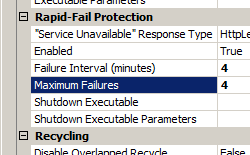

Failure Settings for an Application Pool &lt;failure&gt;
====================

## Overview

The `<failure>` element of the `<add>` element in the `<applicationPools>` collection configures the actions to take when an application pool fails. The **autoShutdownExe**, **orphanActionExe**, **rapidFailProtection** attributes of the `<failure>` element can be especially useful when troubleshooting or debugging applications, because they give you the flexibility to specify the action that Internet Information Services (IIS) 7 will take when an application fails, such as running an external executable to log or debug the failure.

## Compatibility

| Version | Notes |
| --- | --- |
| IIS 10.0 | The `<failure>` element was not modified in IIS 10.0. |
| IIS 8.5 | The `<failure>` element was not modified in IIS 8.5. |
| IIS 8.0 | The `<failure>` element was not modified in IIS 8.0. |
| IIS 7.5 | The `<failure>` element was not modified in IIS 7.5. |
| IIS 7.0 | The `<failure>` element was introduced in IIS 7.0. |
| IIS 6.0 | The `<failure>` element replaces portions of the IIS 6.0 **IIsApplicationPools** metabase property. |

## Setup

The `<applicationPools>` collection is included in the default installation of IIS 7.

## How To

### How to edit rapid-fail protection configuration settings

1. Open **Internet Information Services (IIS) Manager**: 

    - If you are using Windows Server 2012 or Windows Server 2012 R2: 

        - On the taskbar, click **Server Manager**, click **Tools**, and then click **Internet Information Services (IIS) Manager**.
    - If you are using Windows 8 or Windows 8.1: 

        - Hold down the **Windows** key, press the letter **X**, and then click **Control Panel**.
        - Click **Administrative Tools**, and then double-click **Internet Information Services (IIS) Manager**.
    - If you are using Windows Server 2008 or Windows Server 2008 R2: 

        - On the taskbar, click **Start**, point to **Administrative Tools**, and then click **Internet Information Services (IIS) Manager**.
    - If you are using Windows Vista or Windows 7: 

        - On the taskbar, click **Start**, and then click **Control Panel**.
        - Double-click **Administrative Tools**, and then double-click **Internet Information Services (IIS) Manager**.
2. In the **Connections** pane, expand the server name, click **Application Pools**, and click the application pool you want to edit.  
    
3. In the **Actions** pane, click **Advanced Settings...**
4. In the **Advanced Settings** dialog box, click the rapid-fail protection property that you want to edit, then edit the value in the property value section of the dialog box, and then click **OK**. For example, change the **Failure Interval (minutes)** to **4** and **Maximum Failures** to **4**.  
    

## Configuration

### Attributes

| Attribute | Description |
| --- | --- |
| `autoShutdownExe` | Optional string attribute. Specifies an executable to run when the WWW service shuts down an application pool. You can use the **autoShutdownParams** attribute to send parameters to the executable. |
| `autoShutdownParams` | Optional string attribute. Specifies command-line parameters for the executable that is specified in the **autoShutdownExe** attribute. |
| `loadBalancerCapabilities` | Optional enum attribute. Specifies behavior when a worker process cannot be started, such as when the request queue is full or an application pool is in rapid-fail protection. The **loadBalancerCapabilities** attribute can be one of the following possible values. The default value is `HttpLevel`. | Value | Description | | --- | --- | | `HttpLevel` | Specifies that a 503 error code has been returned. Load balancers that are not HTTP aware will not switch to a different node because the 503 response tells the load balancer that the computer is healthy. The numeric value is `2`. | | `TcpLevel` | Specifies that the TCP connection will terminate. This is useful when you use a load balancer that is not HTTP aware. The numeric value is `1`. | |
| `orphanActionExe` | Optional string attribute. Specifies an executable to run when the WWW service orphans a worker process (if the **orphanWorkerProcess** attribute is set to **true**). You can use the **orphanActionParams** attribute to send parameters to the executable. |
| `orphanActionParams` | Optional string attribute. Indicates command-line parameters for the executable named by the **orphanActionExe** attribute. To specify the process ID of the orphaned process, use %1%. |
| `orphanWorkerProcess` | Optional Boolean attribute. Specifies whether to assign a worker process to an orphan state instead of terminating it when an application pool fails. The default value is `false`. |
| `rapidFailProtection` | Optional Boolean attribute. Setting to true instructs the WWW service to remove from service all applications that are in an application pool when: - The number of worker process crashes has reached the maximum specified in the **rapidFailProtectionMaxCrashes** attribute. - The crashes occur within the number of minutes specified in the **rapidFailProtectionInterval** attribute. The default value is `true`. |
| `rapidFailProtectionInterval` | Optional timeSpan attribute. Specifies the number of minutes before the failure count for a process is reset. The default value is `00:05:00` (five minutes). |
| `rapidFailProtectionMaxCrashes` | Optional uint attribute. Specifies the maximum number of failures that are allowed within the number of minutes specified by the **rapidFailProtectionInterval** attribute.   **Note:** Starting in IIS 7.5 this value must be between 1 and 2147483647. The default value is `5`. |

### Child Elements

None.

### Configuration Sample

The following configuration sample enables rapid failure protection for a single application pool named DefaultAppPool, configures a rapid fail protection interval of 5 minutes, and sets the maximum number of failures within the number of minutes to 5.

[!code-xml[Main](failure/samples/sample1.xml)]

## Sample Code

The following code examples enable rapid fail protection for the DefaultAppPool on your server, then set the protection interval to five minutes, and set the maximum number of crashes to 5.

### AppCmd.exe

[!code-console[Main](failure/samples/sample2.cmd)]

> [!NOTE]
> You must be sure to set the **commit** parameter to `apphost` when you use AppCmd.exe to configure these settings. This commits the configuration settings to the appropriate location section in the ApplicationHost.config file.

### C#

[!code-csharp[Main](failure/samples/sample3.cs)]

### VB.NET

[!code-vb[Main](failure/samples/sample4.vb)]

### JavaScript

[!code-javascript[Main](failure/samples/sample5.js)]

### VBScript

[!code-vb[Main](failure/samples/sample6.vb)]