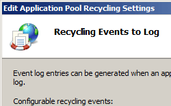

Periodic Restart Settings for Application Pool Recycling <periodicRestart>
====================

## Overview

The `<periodicRestart>` element contains configuration settings that allow you to control when an application pool is recycled. You can specify that Internet Information Services (IIS) 7 recycle the application pool after a time interval (in minutes) or at a specific time each day. You can also configure IIS to base the recycle on the amount of virtual memory or physical memory that the worker process in the application pool is using or configure IIS to recycle the application pool after the worker process has processed a specific number of requests.

## Compatibility

| Version | Notes |
| --- | --- |
| IIS 10.0 | The `<periodicRestart>` element was not modified in IIS 10.0. |
| IIS 8.5 | The `<periodicRestart>` element was not modified in IIS 8.5. |
| IIS 8.0 | The `<periodicRestart>` element was not modified in IIS 8.0. |
| IIS 7.5 | The `<periodicRestart>` element was not modified in IIS 7.5. |
| IIS 7.0 | The `<periodicRestart>` element was introduced in IIS 7.0. |
| IIS 6.0 | The `<periodicRestart>` element replaces portions of the IIS 6.0 **IIsApplicationPools** metabase property. |

## Setup

The `<applicationPools>` collection is included in the default installation of IIS 7.

## How To

### How to set up periodic recycling for an application pool

1. Open **Internet Information Services (IIS) Manager**: 

    - If you are using Windows Server 2012 or Windows Server 2012 R2: 

        - On the taskbar, click **Server Manager**, click **Tools**, and then click **Internet Information Services (IIS) Manager**.
    - If you are using Windows 8 or Windows 8.1: 

        - Hold down the **Windows** key, press the letter **X**, and then click **Control Panel**.
        - Click **Administrative Tools**, and then double-click **Internet Information Services (IIS) Manager**.
    - If you are using Windows Server 2008 or Windows Server 2008 R2: 

        - On the taskbar, click **Start**, point to **Administrative Tools**, and then click **Internet Information Services (IIS) Manager**.
    - If you are using Windows Vista or Windows 7: 

        - On the taskbar, click **Start**, and then click **Control Panel**.
        - Double-click **Administrative Tools**, and then double-click **Internet Information Services (IIS) Manager**.
2. In the **Connections** pane, expand the server name, and then click **Application Pools**.
3. In the **Application Pools** pane, select the application pool you want edit.
4. In the **Actions** pane, click **Recycling...**   
    
5. On the Recycling Conditions page of the Edit Application Pool Recycling Settings Wizard, select at least one of the options in the **Fixed Intervals** section, type values into the appropriate text boxes, and then click **Next**.  
    
6. (Optional) On the Recycling Events to Log page of the Edit Application Pool Recycling Settings Wizard, select the configurable recycling events and run-time recycling events that you want IIS to send to the event log when they occur, and then click **Finish**.  
    
 

## Configuration

The `<periodicRestart>` element is configurable at the server level in the ApplicationHost.config file.

### Attributes

| Attribute | Description |
| --- | --- |
| `memory` | Optional uint attribute. Specifies the amount of virtual memory (in kilobytes) that a worker process can use before the worker process is recycled. The maximum value supported for this property is 4,294,967 KB. The default value is `0`, which disables the attribute. |
| `privateMemory` | Optional uint attribute. Specifies the amount of private memory (in kilobytes) that a worker process can use before the worker process recycles. The maximum value supported for this property is 4,294,967 KB. The default value is `0`, which disables the attribute. |
| `requests` | Optional uint attribute. Specifies that the worker process should be recycled after it processes a specific number of requests. The default value is `0`, which disables the attribute. |
| `time` | Optional timeSpan attribute. Specifies that the worker process should be recycled after a specified amount of time has elapsed. The default value is `29:00:00` (29 hours). |

### Child Elements

| Element | Description |
| --- | --- |
| `[schedule](https://www.iis.net/configreference/system.applicationhost/applicationpools/add/recycling/periodicrestart/schedule)` | Optional element. Specifies the scheduling of periodic restarts of application pools. |

### Configuration Sample

The following configuration sample uses the application pool `<add>` element to create a new application pool named Contoso. The `<recycling>` element configures logging for application pool restarts, the `<periodicRestart>` element configures when the application pool restarts, and the `<processModel>` element configures the **shutdownTimeLimit** and **startupTimeLimit** attributes for shutting down and starting the worker processes in the application pool for 30 seconds each. If these time limits are exceeded, IIS terminates the worker process.

[!code-xml[Main](index/samples/sample1.xml)]

## Sample Code

The following code examples add an application pool named Contoso to your IIS 7 server, then set the application pool to daily recycle at 3:00 A.M.

### AppCmd.exe

[!code-console[Main](index/samples/sample2.cmd)]

You can also use the following syntax:

[!code-console[Main](index/samples/sample3.cmd)]

> [!NOTE]
> You must be sure to set the **commit** parameter to `apphost` when you use AppCmd.exe to configure these settings. This commits the configuration settings to the appropriate location section in the ApplicationHost.config file.

### C#

[!code-csharp[Main](index/samples/sample4.cs)]

### VB.NET

[!code-vb[Main](index/samples/sample5.vb)]

### JavaScript

[!code-javascript[Main](index/samples/sample6.js)]

### VBScript

[!code-vb[Main](index/samples/sample7.vb)]