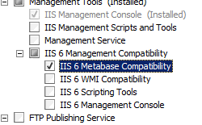

Custom Metadata &lt;customMetadata&gt;
====================

## Overview

The `<customMetadata>` element contains settings that are used internally by the metabase compatibility feature of Internet Information Services (IIS) 7.

> [!IMPORTANT]
> The `<customMetadata>` section of the configuration should not be modified directly. Use the metabase APIs to set any metabase settings that are represented in this section.

In IIS 6.0, all of the IIS settings were kept in the metabase. In addition, any custom settings that were required by applications were stored in the metabase. In IIS 7, all IIS settings are now kept in ApplicationHost.config and Web.config Files. IIS 7 provides backwards-compatibility through the IIS 6 Metabase Compatibility feature, which is sometimes referred to as the Admin Base Object (ABO) mapper component. This feature listens for applications that attempt to write to the metabase, and maps all IIS 6.0 metabase settings to their IIS 7 equivalents. If an IIS 6.0 setting has no IIS 7 equivalent, the setting will be written to the `<customMetadata>` element.

## Compatibility

| Version | Notes |
| --- | --- |
| IIS 10.0 | The `<customMetadata>` element was not modified in IIS 10.0. |
| IIS 8.5 | The `<customMetadata>` element was not modified in IIS 8.5. |
| IIS 8.0 | The `<customMetadata>` element was not modified in IIS 8.0. |
| IIS 7.5 | The `<customMetadata>` element was not modified in IIS 7.5. |
| IIS 7.0 | The `<customMetadata>` element was introduced in IIS 7.0. |
| IIS 6.0 | The `<customMetadata>` element replaces any IIS 6.0 metabase objects that are not directly mapped to IIS 7 configuration elements. |

## Setup

The `<customMetadata>` element is not available on the default installation of IIS 7 and later. To install it, use the following steps.

### Windows Server 2012 or Windows Server 2012 R2

1. On the taskbar, click **Server Manager**.
2. In **Server Manager**, click the **Manage** menu, and then click **Add Roles and Features**.
3. In the **Add Roles and Features** wizard, click **Next**. Select the installation type and click **Next**. Select the destination server and click **Next**.
4. On the **Server Roles** page, expand **Web Server (IIS)**, expand **Management Tools**, expand **IIS 6 Management Compatibility**, and then select **IIS 6 Metabase Compatibility**. Click **Next**.  
     .
5. On the **Select features** page, click **Next**.
6. On the **Confirm installation selections** page, click **Install**.
7. On the **Results** page, click **Close**.

### Windows 8 or Windows 8.1

1. On the **Start** screen, move the pointer all the way to the lower left corner, right-click the **Start** button, and then click **Control Panel**.
2. In **Control Panel**, click **Programs and Features**, and then click **Turn Windows features on or off**.
3. Expand **Internet Information Services**, expand **Web Management Tools**, expand **IIS 6 Management Compatibility**, and then select **IIS Metabase and IIS 6 configuration compatibility**.  
    
4. Click **OK**.
5. Click **Close**.

### Windows Server 2008 or Windows Server 2008 R2

1. On the taskbar, click **Start**, point to **Administrative Tools**, and then click **Server Manager**.
2. In the **Server Manager** hierarchy pane, expand **Roles**, and then click **Web Server (IIS)**.
3. In the **Web Server (IIS)** pane, scroll to the **Role Services** section, and then click **Add Role Services**.
4. On the **Select Role Services** page of the **Add Role Services Wizard**, select **IIS 6 Metabase Compatibility**, and then click **Next**.  
    
5. On the **Confirm Installation Selections** page, click **Install**.
6. On the **Results** page, click **Close**.

### Windows Vista or Windows 7

1. On the taskbar, click **Start**, and then click **Control Panel**.
2. In **Control Panel**, click **Programs and Features**, and then click **Turn Windows Features on or off**.
3. Expand **Internet Information Services**, then select **IIS Metabase and IIS 6 configuration compatibility**, and then click **OK**.  
    
 

## How To

The `<customMetadata>` section of the configuration should not be modified directly; therefore, no examples are available.

## Configuration

### Attributes

None.

### Child Elements

| Element | Description |
| --- | --- |
| [`key`](key/index.md) | Optional element.  Adds a custom metadata setting to the collection of custom metadata settings. |

## Sample Code

The `<customMetadata>` section of the configuration should not be modified directly; therefore, no examples are available.