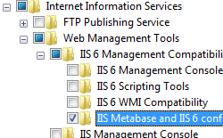

Custom Metadata Key Property &lt;property&gt;
====================

## Overview

The `<property>` element of the `<key>` element adds a metabase property to the collection of metabase properties.

**Important Note**: The `<customMetadata>` section of the configuration should not be modified directly. Use the metabase APIs to set any metabase settings that are represented in this section.

In IIS 6.0, all of the IIS settings were kept in the metabase. In addition, any custom settings that were required by applications were stored in the metabase. In IIS 7, all IIS settings are now kept in ApplicationHost.config and Web.config Files. IIS 7 provides backwards-compatibility through the IIS 6 Metabase Compatibility feature, which is sometimes referred to as the Admin Base Object (ABO) mapper component. This feature listens for applications that attempt to write to the metabase, and maps all IIS 6.0 metabase settings to their IIS 7 equivalents. If an IIS 6.0 setting has no IIS 7 equivalent, the setting will be written to the `<customMetadata>` element.

## Compatibility

| Version | Notes |
| --- | --- |
| IIS 10.0 | The `<property>` element was not modified in IIS 10.0. |
| IIS 8.5 | The `<property>` element was not modified in IIS 8.5. |
| IIS 8.0 | The `<property>` element was not modified in IIS 8.0. |
| IIS 7.5 | The `<property>` element was not modified in IIS 7.5. |
| IIS 7.0 | The `<property>` element of the `<key>` element was introduced in IIS 7.0. |
| IIS 6.0 | The `<customMetadata>` element replaces any IIS 6.0 metabase objects that are not directly mapped to IIS 7 configuration elements. |

## Setup

The `<customMetadata>` element is not available on the default installation of IIS 7 and later. To install it, use the following steps.

### Windows Server 2012 or Windows Server 2012 R2

1. On the taskbar, click **Server Manager**.
2. In **Server Manager**, click the **Manage** menu, and then click **Add Roles and Features**.
3. In the **Add Roles and Features** wizard, click **Next**. Select the installation type and click **Next**. Select the destination server and click **Next**.
4. On the **Server Roles** page, expand **Web Server (IIS)**, expand **Management Tools**, expand **IIS 6 Management Compatibility**, and then select **IIS 6 Metabase Compatibility**. Click **Next**.  
     .
5. On the **Select features** page, click **Next**.
6. On the **Confirm installation selections** page, click **Install**.
7. On the **Results** page, click **Close**.

### Windows 8 or Windows 8.1

1. On the **Start** screen, move the pointer all the way to the lower left corner, right-click the **Start** button, and then click **Control Panel**.
2. In **Control Panel**, click **Programs and Features**, and then click **Turn Windows features on or off**.
3. Expand **Internet Information Services**, expand **Web Management Tools**, expand **IIS 6 Management Compatibility**, and then select **IIS Metabase and IIS 6 configuration compatibility**.  
    
4. Click **OK**.
5. Click **Close**.

### Windows Server 2008 or Windows Server 2008 R2

1. On the taskbar, click **Start**, point to **Administrative Tools**, and then click **Server Manager**.
2. In the **Server Manager** hierarchy pane, expand **Roles**, and then click **Web Server (IIS)**.
3. In the **Web Server (IIS)** pane, scroll to the **Role Services** section, and then click **Add Role Services**.
4. On the **Select Role Services** page of the **Add Role Services Wizard**, select **IIS 6 Metabase Compatibility**, and then click **Next**.  
    
5. On the **Confirm Installation Selections** page, click **Install**.
6. On the **Results** page, click **Close**.

### Windows Vista or Windows 7

1. On the taskbar, click **Start**, and then click **Control Panel**.
2. In **Control Panel**, click **Programs and Features**, and then click **Turn Windows Features on or off**.
3. Expand **Internet Information Services**, then select **IIS Metabase and IIS 6 configuration compatibility**, and then click **OK**.  
    
 

## How To

The `<customMetadata>` section of the configuration should not be modified directly; therefore, no examples are available.

## Configuration

### Attributes

| Attribute | Description |
| --- | --- |
| `id` | Optional unit attribute. Specifies the unique identifier of the metabase entry. |
| `dataType` | Required enum attribute. Specifies the type of data to retrieve. The **dataType** attribute can be one of the following possible values. | Value | Description | | --- | --- | | `DWord` | An unsigned 32-bit number. The numeric value is `1`. | | `String` | A null-terminated ASCII string. The numeric value is `2`. | | `Binary` | Binary data in any form. The numeric value is `3`. | | `ExpandSZ` | A null-terminated string that contains unexpanded environment variables, such as %PATH%. The numeric value is `4`. | | `MultiSZ` | An array of null-terminated strings, terminated by two null characters. The numeric value is `5`. | |
| `userType` | Optional unit attribute. Specifies the user type of the data. The default value is `1`. |
| Attributes | Optional flags attribute. Specifies the flags, contained in the [METADATA\_RECORD](https://msdn.microsoft.com/en-us/library/ms524635.aspx) structure, that are used to get the data. The attributes attribute can be one of the following possible values. The default value is `Inherit`. | Value | Description | | --- | --- | | `None` | Specifies that no flags are set. The numeric value is `0`. | | `Inherit` | Specifies that the data can be inherited. The numeric value is `1`. | | `PartialPath` | Returns any inherited data even if the complete path is not available. This flag is only valid when the Inherit flag is also set. The numeric value is `2`. | | `Secure` | Specifies that the data is stored and transported in a secure manner. The numeric value is `4`. | | `Reference` | Specifies that the data was retrieved by reference. The numeric value is `8`. | | `Volatile` | Specifies that the data is not stored in long-term storage. The numeric value is `16`. | | `IsInherited` | Denotes that the data items were inherited. The numeric value is `32`. | | `InsertPath` | Replaces MD\_INSERT\_PATH\_STRINGW with the path of the data item relative to the handle. The numeric value is `64`. | | `LocalMachineOnly` | Specifies that the data is not replicated during web cluster replication. The numeric value is `128`. | | `NonSecureOnly` | Specifies that secure properties should not be retrieved when using metabase functions that return all data. The numeric value is `256`. | |
| `Value` | Optional case-sensitive string attribute. Specifies a custom value. |

### Child Elements

None.

## Sample Code

The `<customMetadata>` section of the configuration should not be modified directly; therefore, no examples are available.