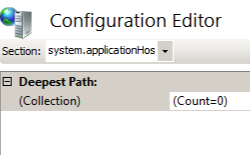

Service Autostart Providers &lt;serviceAutoStartProviders&gt;
====================

## Overview

The `<serviceAutoStartProviders>` element specifies a collection of managed assemblies that Windows Process Activation Service (WAS) will load automatically when the `startMode` attribute of an application pool is set to `AlwaysRunning`. This collection allows developers to specify assemblies that perform initialization tasks before any HTTP requests are serviced. For example, an application developer may want to establish the initial database connections for the application before IIS begins request processing; this will enable the application to perform faster for initial requests that require round trips to and from a database.

For more information about how to configure application pools to start automatically, see the [`<applicationPools>`](../applicationpools/index.md) topic.

> [!NOTE]
> This element was introduced in IIS 7.5.

## Compatibility

| Version | Notes |
| --- | --- |
| IIS 10.0 | The `<serviceAutoStartProviders>` element was not modified in IIS 10.0. |
| IIS 8.5 | The `<serviceAutoStartProviders>` element was not modified in IIS 8.5. |
| IIS 8.0 | The `<serviceAutoStartProviders>` element was not modified in IIS 8.0. |
| IIS 7.5 | The `<serviceAutoStartProviders>` element was introduced in IIS 7.5. |
| IIS 7.0 | N/A |
| IIS 6.0 | N/A |

## Setup

The `<serviceAutoStartProviders>` element is included in the default installation of IIS 7.5. 

## How To

### How to configure a service autostart provider

> [!NOTE]
> There is no direct user interface that lets you configure the `<serviceAutoStartProviders>` element, therefore the following steps will use the IIS Configuration Editor feature.

1. Open **Internet Information Services (IIS) Manager**: 

    - If you are using Windows Server 2012 or Windows Server 2012 R2: 

        - On the taskbar, click **Server Manager**, click **Tools**, and then click **Internet Information Services (IIS) Manager**.
    - If you are using Windows 8 or Windows 8.1: 

        - Hold down the **Windows** key, press the letter **X**, and then click **Control Panel**.
        - Click **Administrative Tools**, and then double-click **Internet Information Services (IIS) Manager**.
    - If you are using Windows Server 2008 or Windows Server 2008 R2: 

        - On the taskbar, click **Start**, point to **Administrative Tools**, and then click **Internet Information Services (IIS) Manager**.
    - If you are using Windows Vista or Windows 7: 

        - On the taskbar, click **Start**, and then click **Control Panel**.
        - Double-click **Administrative Tools**, and then double-click **Internet Information Services (IIS) Manager**.
2. In the **Connections** pane, click the server name.
3. In the **Home** pane, double-click the **Configuration Editor** feature.  
    
4. In the **Section** drop-down menu, expand **system.applicationHost**, and then click **serviceAutoStartProviders**.  
    
5. Click the ellipsis (**...**) on the right-side of the **(Collection)** field.
6. In the **Actions** pane, click **Add**.
7. When the Collection Editor dialog box appears: 

    - Enter the name of your autostart provider in the **name** field. For example:  
 "MyAutostartProvider"
    - Enter the managed type of your autostart assembly in the **type** field. For example:  
 "MyAutostartProvider, MyAutostartProvider, version=1.0.0.0, Culture=neutral, PublicKeyToken=426f62526f636b73"
    - Close the Collection Editor dialog box.  
        
8. In the **Actions** pane, click **Apply**.

> [!NOTE]
> This section contains information about how to modify your IIS settings by using the IIS Configuration Editor. Incorrectly editing your IIS configuration settings can severely damage your IIS installation. Therefore, make sure that you follow these steps carefully. For added security, you should back up your IIS configuration settings before you use the IIS Configuration Editor to make any modifications. For more information about how to back up your IIS configuration settings and how to use the IIS Configuration Editor, see the following topics:

- **How to Back Up an IIS 7 Configuration**  
    [https://technet.microsoft.com/library/dd819406.aspx](https://technet.microsoft.com/library/dd819406.aspx)
- **Configuration Editor Page**  
    [https://technet.microsoft.com/library/dd569081.aspx](https://technet.microsoft.com/library/dd569081.aspx)
 

## Configuration

The `<serviceAutoStartProviders>` element is configured at the global level in the ApplicationHost.config file.

### Attributes

None.

### Child Elements

| Element | Description |
| --- | --- |
| [`add`](add.md) | Optional element.  Adds a provider to the collection of autostart providers. |
| `clear` | Optional element.  Clears the collection of autostart providers. |
| `remove` | Optional element.  Removes a provider from the collection of autostart providers. |

### Configuration Sample

The following sample displays a `<serviceAutoStartProviders>` element that adds a custom autostart provider to the collection.

[!code-xml[Main](index/samples/sample1.xml)]

## Sample Code

The following examples add a sample provider to the collection of autostart providers.

### AppCmd.exe

[!code-console[Main](index/samples/sample2.cmd)]

> [!NOTE]
> You must be sure to set the **commit** parameter to `apphost` when you use AppCmd.exe to configure these settings. This commits the configuration settings to the appropriate location section in the ApplicationHost.config file.

### C#

[!code-csharp[Main](index/samples/sample3.cs)]

### VB.NET

[!code-vb[Main](index/samples/sample4.vb)]

### JavaScript

[!code-javascript[Main](index/samples/sample5.js)]

### VBScript

[!code-vb[Main](index/samples/sample6.vb)]
