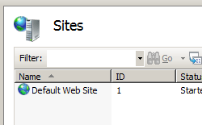

Application Defaults &lt;applicationDefaults&gt;
====================

## Overview

The `<applicationDefaults>` element of the `<sites>` element specifies the default application settings for all applications on the server.

> [!NOTE]
> If the same attribute or child element is configured in both the `<applicationDefaults>` section and in the `<application>` section for a specific application, the configuration in the `<application>` section is used for that application.

## Compatibility

| Version | Notes |
| --- | --- |
| IIS 10.0 | The `<applicationDefaults>` element was not modified in IIS 10.0. |
| IIS 8.5 | The `<applicationDefaults>` element was not modified in IIS 8.5. |
| IIS 8.0 | The `<applicationDefaults>` element was not modified in IIS 8.0. |
| IIS 7.5 | The `<applicationDefaults>` element was not modified in IIS 7.5. |
| IIS 7.0 | The `<applicationDefaults>` element of the `<sites>` element was introduced in IIS 7.0. |
| IIS 6.0 | The `<applicationDefaults>` element is analogous to setting setting application options at the **W3SVC** level in the IIS 6.0 metabase. |

## Setup

The `<applicationDefaults>` element of the `<sites>` element is included in the default installation of IIS 7 and later.

## How To

### How to configure the default application settings for a server

1. Open **Internet Information Services (IIS) Manager**: 

    - If you are using Windows Server 2012 or Windows Server 2012 R2: 

        - On the taskbar, click **Server Manager**, click **Tools**, and then click **Internet Information Services (IIS) Manager**.
    - If you are using Windows 8 or Windows 8.1: 

        - Hold down the **Windows** key, press the letter **X**, and then click **Control Panel**.
        - Click **Administrative Tools**, and then double-click **Internet Information Services (IIS) Manager**.
    - If you are using Windows Server 2008 or Windows Server 2008 R2: 

        - On the taskbar, click **Start**, point to **Administrative Tools**, and then click **Internet Information Services (IIS) Manager**.
    - If you are using Windows Vista or Windows 7: 

        - On the taskbar, click **Start**, and then click **Control Panel**.
        - Double-click **Administrative Tools**, and then double-click **Internet Information Services (IIS) Manager**.
2. In the **Connections** pane, expand the server name, then click the **Sites** node.
3. In the server's **Sites** pane, click **Set Web Site Defaults...** in the **Actions** pane.  
    
4. In the **Web Site Defaults** dialog box, specify your default application settings for all Web sites, and then click **OK**.  
    

## Configuration

### Attributes

| Attribute | Description |
| --- | --- |
| `applicationPool` | Optional string attribute.  Specifies the default application pool to which all applications on the server are assigned. |
| `enabledProtocols` | Optional string attribute.  Specifies the protocols to use to communicate with all applications on the server. |
| `path` | Optional string attribute.  Specifies the default virtual path of all applications on the server. |

### Child Elements

None.

### Configuration Sample

The following configuration sample sets the default application pool for all Web sites to "DefaultAppPool".

[!code-xml[Main](applicationDefaults/samples/sample1.xml)]

## Sample Code

The following code samples set the default application pool for all Web sites to "DefaultAppPool".

### AppCmd.exe

[!code-console[Main](applicationDefaults/samples/sample2.cmd)]

> [!NOTE]
> You must be sure to set the **commit** parameter to `apphost` when you use AppCmd.exe to configure these settings. This commits the configuration settings to the appropriate location section in the ApplicationHost.config file.

### C#

[!code-csharp[Main](applicationDefaults/samples/sample3.cs)]

### VB.NET

[!code-vb[Main](applicationDefaults/samples/sample4.vb)]

### JavaScript

[!code-javascript[Main](applicationDefaults/samples/sample5.js)]

### VBScript

[!code-vb[Main](applicationDefaults/samples/sample6.vb)]