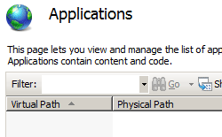
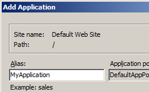

Application for a Site &lt;application&gt;
====================

## Overview

The `<application>` element controls the configuration settings for a specific application. An application in Internet Information Services (IIS) 7 or later is a grouping of files that delivers content or provides services over protocols, such as HTTP. When you create an application in IIS 7 and later, the application's path becomes part of the site's URL.

In IIS 7 and later, each site must have at least one application, called the root or default application. However, a site can have more than one application. For example, your online commerce Web site can contain several applications, such as a shopping cart application that lets users gather items during shopping and a login application that allows users to recall saved payment information when they make a purchase.

An application must contain at least one virtual directory, called the root or default virtual directory with configuration settings defined in a `<virtualDirectory>` element.

## Compatibility

| Version | Notes |
| --- | --- |
| IIS 10.0 | The `<application>` element was not modified in IIS 10.0. |
| IIS 8.5 | The `<application>` element was not modified in IIS 8.5. |
| IIS 8.0 | The `preLoadEnabled` attribute was added to initiate the initialization process prior to receiving a request. |
| IIS 7.5 | The `<application>` element was updated to include the `serviceAutoStartEnabled` and `serviceAutoStartProvider` attributes. |
| IIS 7.0 | The `<application>` element was introduced in IIS 7.0. |
| IIS 6.0 | The `<application>` element replaces the IIS 6.0 **IIsWebVirtualDir** and **IIsWebDirectory** metabase objects. |

## Setup

The `<application>` element is included in the default installation of IIS 7 and later.

## How To

### How to create a new Web application

1. Open **Internet Information Services (IIS) Manager**: 

    - If you are using Windows Server 2012 or Windows Server 2012 R2: 

        - On the taskbar, click **Server Manager**, click **Tools**, and then click **Internet Information Services (IIS) Manager**.
    - If you are using Windows 8 or Windows 8.1: 

        - Hold down the **Windows** key, press the letter **X**, and then click **Control Panel**.
        - Click **Administrative Tools**, and then double-click **Internet Information Services (IIS) Manager**.
    - If you are using Windows Server 2008 or Windows Server 2008 R2: 

        - On the taskbar, click **Start**, point to **Administrative Tools**, and then click **Internet Information Services (IIS) Manager**.
    - If you are using Windows Vista or Windows 7: 

        - On the taskbar, click **Start**, and then click **Control Panel**.
        - Double-click **Administrative Tools**, and then double-click **Internet Information Services (IIS) Manager**.
2. In the **Connections** pane, expand the server name, expand **Sites**, and then click the Web site to which you want to add an application.
3. In the **Actions** pane, click **View Applications**, and then click **Add Application...**  
    
4. In the **Add Application** dialog box, at a minimum enter information in the **Alias:** and **Physical path:** text boxes, and then click **OK**.  
      
    > [!NOTE]
    > You can click     **Select...** to choose a different application pool, click     **Connect as...** to configure the application to accept credentials from a specific account, and click     **Test Settings...** to test authentication and authorization settings for the application.

## Configuration

The `<application>` element is configurable at the server level in the ApplicationHost.config file.

### Attributes

| Attribute | Description |
| --- | --- |
| `applicationPool` | Optional string attribute.  Specifies the application pool to which the application is assigned.  There is no default value. |
| `enabledProtocols` | Optional string attribute.  Specifies the protocols through which to communicate with the application. This value enables HTTP and HTTPS protocols for the application.  The default value is `http`. |
| `path` | Required string attribute.  Specifies the virtual path of the application. Must be a unique path within the parent site.  There is no default value. |
| `preLoadEnabled` | Optional Boolean attribute.  Specifies that IIS simulates a user request to the default page of an application or virtual directory so that it is initialized. In effect IIS starts the application when the application pool is started without having received a request. This increases performance by performing initialization tasks such as loading managed modules and compiling managed code. No log is generated in the IIS logs. The application pool's startMode setting must be set to `AlwaysRunning`.  The default value is `False`. |
| `serviceAutoStartEnabled` | Optional Boolean attribute.  **true** if the autostart is enabled for this application; otherwise, **false**.  The default value is `false`. |
| `serviceAutoStartProvider` | Optional string attribute.  Specifies the name of the autostart provider that the Windows Process Activation Service (WAS) will use if `serviceAutoStartEnabled` is set to **true**.  There is no default value. |

### Child Elements

| Element | Description |
| --- | --- |
| [`virtualDirectory`](virtualdirectory.md) | Optional element.  Specifies configuration settings for a virtual directory in the parent application. |
| [`virtualDirectoryDefaults`](virtualdirectorydefaults.md) | Optional element.  Specifies the default settings for all virtual directories in the parent application. |

### Configuration Sample

The following configuration example displays a `<site>` element that contains two applications. The first `<application>` element defines the root application for the site, along with the root virtual directory for the application. The second `<application>` element contains the configuration settings for a CRM application on the Web site. The path attribute defines the path for the application. This `<application>` element contains two `<virtualDirectory>` elements. The first defines the root virtual directory for the application, and the second defines an Images virtual directory for the application.

[!code-xml[Main](index/samples/sample1.xml)]

## Sample Code

The following examples create a new application named ShoppingCart with a virtual directory root of C:\Inetpub\Contoso\ShoppingCart for a site that is named Contoso.

> [!NOTE]
> When you create an application from the command prompt or from a script, you must explicitly create a root virtual directory for the application.

### AppCmd.exe

[!code-console[Main](index/samples/sample2.cmd)]

> [!NOTE]
> You must be sure to set the **commit** parameter to `apphost` when you use AppCmd.exe to configure these settings. This commits the configuration settings to the appropriate location section in the ApplicationHost.config file.

### C#

[!code-csharp[Main](index/samples/sample3.cs)]

### VB.NET

[!code-vb[Main](index/samples/sample4.vb)]

### JavaScript

[!code-javascript[Main](index/samples/sample5.js)]

### VBScript

[!code-vb[Main](index/samples/sample6.vb)]