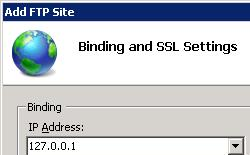

FTP Site-level Settings &lt;ftpServer&gt;
====================

## Overview

The `<ftpServer>` element of the `<site>` element specifies the site-level settings for FTP features for FTP sites.

In IIS 6.0, the settings for the FTP service were stored in a separate section of the metabase than Web sites. In IIS 7 and later, FTP settings are stored in the ApplicationHost.config file within the same `<site>` and `<siteDefaults>` elements that store the settings for Web sites. Because of this, settings that are specified in the `<ftpServer>` element cannot be delegated, nor can they be specified within `<location>` elements.

> [!NOTE]
> Additional FTP settings are stored in the [`<system.ftpServer>`](../../../../system.ftpserver/index.md) section of the ApplicationHost.config file, and these settings are specified within `<location>` elements.

## Compatibility

| Version | Notes |
| --- | --- |
| IIS 10.0 | The `<ftpServer>` element was not modified in IIS 10.0. |
| IIS 8.5 | The `<ftpServer>` element was not modified in IIS 8.5. |
| IIS 8.0 | The `<ftpServer>` element was not modified in IIS 8.0. |
| IIS 7.5 | The `<ftpServer>` element ships as a feature of IIS 7.5. |
| IIS 7.0 | The `<ftpServer>` element was introduced in FTP 7.0, which was a separate download for IIS 7.0. |
| IIS 6.0 | The `<ftpServer>` element and its child elements replace the IIS 6.0 FTP settings that were located in the **LM/MSFTPSVC** metabase path. |

> [!NOTE]
> The FTP 7.0 and FTP 7.5 services shipped out-of-band for IIS 7.0, which required downloading and installing the modules from the following URL:

> [https://www.iis.net/expand/FTP](https://www.iis.net/downloads/microsoft/ftp)

With Windows 7 and Windows Server 2008 R2, the FTP 7.5 service ships as a feature for IIS 7.5, so downloading the FTP service is no longer necessary.

## Setup

To support FTP publishing for your Web server, you must install the FTP service. To do so, use the following steps.

### Windows Server 2012 or Windows Server 2012 R2

1. On the taskbar, click **Server Manager**.
2. In **Server Manager**, click the **Manage** menu, and then click **Add Roles and Features**.
3. In the **Add Roles and Features** wizard, click **Next**. Select the installation type and click **Next**. Select the destination server and click **Next**.
4. On the **Server Roles** page, expand **Web Server (IIS)**, and then select **FTP Server**.  
  
    > [!NOTE]
    > To support ASP.Membership authentication or IIS Manager authentication for the FTP service, you will need to select     **FTP Extensibility** , in addition to     **FTP Service** .  
     .
5. Click **Next**, and then on the **Select features** page, click **Next** again.
6. On the **Confirm installation selections** page, click **Install**.
7. On the **Results** page, click **Close**.

### Windows 8 or Windows 8.1

1. On the **Start** screen, move the pointer all the way to the lower left corner, right-click the **Start** button, and then click **Control Panel**.
2. In **Control Panel**, click **Programs and Features**, and then click **Turn Windows features on or off**.
3. Expand **Internet Information Services**, and then select **FTP Server**.   
  
    > [!NOTE]
    > To support ASP.Membership authentication or IIS Manager authentication for the FTP service, you will also need to select     **FTP Extensibility** .   
    
4. Click **OK**.
5. Click **Close**.

### Windows Server 2008 R2

1. On the taskbar, click **Start**, point to **Administrative Tools**, and then click **Server Manager**.
2. In the **Server Manager** hierarchy pane, expand **Roles**, and then click **Web Server (IIS)**.
3. In the **Web Server (IIS)** pane, scroll to the **Role Services** section, and then click **Add Role Services**.
4. On the **Select Role Services** page of the **Add Role Services Wizard**, expand **FTP Server**.
5. Select **FTP Service**.  
  
    > [!NOTE]
    > To support ASP.Membership authentication or IIS Manager authentication for the FTP service, you will also need to select     **FTP Extensibility** .  
    
6. Click **Next**.
7. On the **Confirm Installation Selections** page, click **Install**.
8. On the **Results** page, click **Close**.

### Windows 7

1. On the taskbar, click **Start**, and then click **Control Panel**.
2. In **Control Panel**, click **Programs and Features**, and then click **Turn Windows Features on or off**.
3. Expand **Internet Information Services**, and then **FTP Server**.
4. Select **FTP Service**.  
  
    > [!NOTE]
    > To support ASP.Membership authentication or IIS Manager authentication for the FTP service, you will also need to select     **FTP Extensibility** .   
    
5. Click **OK**.

### Windows Server 2008 or Windows Vista

1. Download the installation package from the following URL: 

    - [https://www.iis.net/expand/FTP](https://www.iis.net/downloads/microsoft/ftp)
- Follow the instructions in the following walkthrough to install the FTP service: 

    - [Installing and Troubleshooting FTP 7](https://go.microsoft.com/fwlink/?LinkId=88547)

## How To

### How to enable or disable Anonymous authentication for an FTP site

1. Open **Internet Information Services (IIS) Manager**: 

    - If you are using Windows Server 2012 or Windows Server 2012 R2: 

        - On the taskbar, click **Server Manager**, click **Tools**, and then click **Internet Information Services (IIS) Manager**.
    - If you are using Windows 8 or Windows 8.1: 

        - Hold down the **Windows** key, press the letter **X**, and then click **Control Panel**.
        - Click **Administrative Tools**, and then double-click **Internet Information Services (IIS) Manager**.
    - If you are using Windows Server 2008 or Windows Server 2008 R2: 

        - On the taskbar, click **Start**, point to **Administrative Tools**, and then click **Internet Information Services (IIS) Manager**.
    - If you are using Windows Vista or Windows 7: 

        - On the taskbar, click **Start**, and then click **Control Panel**.
        - Double-click **Administrative Tools**, and then double-click **Internet Information Services (IIS) Manager**.
2. In the **Connections** pane, expand the server name, expand the **Sites** node, and then click the name of the site.
3. In the site's **Home** pane, double-click the **FTP Authentication** feature.
4. On the **FTP Authentication** page, select **Anonymous Authentication**.
5. In the **Actions** pane, click **Enable** to enable Anonymous authentication or click **Disable** to disable Anonymous authentication.  
    

* * *

### How to use the FTP Site Wizard to Create an FTP Site with Anonymous Read Access

1. Open **Internet Information Services (IIS) Manager**: 

    - If you are using Windows Server 2012 or Windows Server 2012 R2: 

        - On the taskbar, click **Server Manager**, click **Tools**, and then click **Internet Information Services (IIS) Manager**.
    - If you are using Windows 8 or Windows 8.1: 

        - Hold down the **Windows** key, press the letter **X**, and then click **Control Panel**.
        - Click **Administrative Tools**, and then double-click **Internet Information Services (IIS) Manager**.
    - If you are using Windows Server 2008 or Windows Server 2008 R2: 

        - On the taskbar, click **Start**, point to **Administrative Tools**, and then click **Internet Information Services (IIS) Manager**.
    - If you are using Windows Vista or Windows 7: 

        - On the taskbar, click **Start**, and then click **Control Panel**.
        - Double-click **Administrative Tools**, and then double-click **Internet Information Services (IIS) Manager**.
2. In the **Connections** pane, click the **Sites** node in the tree.
3. Right-click the **Sites** node in the tree and click **Add FTP Site**, or click **Add FTP Site** in the **Actions** pane.
4. When the **Add FTP Site** wizard appears: 

    - Enter "My New FTP Site" in the **FTP site name** box.
    - For the **Physical path** box, you can use one of the following options to specify your content directory: 

        - Click the ellipsis (**...**) button, and then navigate to the folder that contains the content for your FTP site.
        - Type in the path to your content folder in the box. Note that if you choose to type the path, you can use environment variables in your paths. For example, you can use "%*SystemDrive*%\inetpub\ftproot" for your content directory.
    - When you have completed these items, click **Next**.  
        
5. On the second page of the **Add FTP Site** wizard: 

    - Choose an IP address for your FTP site from the **IP Address** drop-down, or choose to accept the default selection of "All Unassigned."
    - Enter the TCP/IP port for the FTP site in the **Port** box. By default, FTP sites and clients use port 21. (Note: To specify Implicit FTPS, you need to use port 990.)
    - To use an FTP virtual host name, select the box for **Enable Virtual Host Names**, then enter the virtual host name in the **Virtual Host** box.
    - For the SSL options, choose one of the following options: 

        - Select **No SSL** to disable the SSL options.
        - Select **Allow SSL** to allow FTP clients to optionally use FTP over SSL when they connect with the FTP server.
        - Select **Require SSL** to allow FTP clients to always use FTP over SSL when they connect with the FTP server.
        - If you choose **Allow SSL** or **Require SSL**, choose a certificate from the **SSL Certificate** drop-down menu.
    - When you have completed these items, click **Next**.  
        
6. On the next page of the wizard: 

    - Select **Anonymous** for the **Authentication** settings.
    - For the **Authorization** settings, choose "Anonymous users" from the **Allow access to** drop-down.
    - Select **Read** for the **Permissions** option.
    - When you have completed these items, click **Finish**.  
        

* * *

### How to enable or disable Basic authentication for an FTP site

1. Open **Internet Information Services (IIS) Manager**: 

    - If you are using Windows Server 2012 or Windows Server 2012 R2: 

        - On the taskbar, click **Server Manager**, click **Tools**, and then click **Internet Information Services (IIS) Manager**.
    - If you are using Windows 8 or Windows 8.1: 

        - Hold down the **Windows** key, press the letter **X**, and then click **Control Panel**.
        - Click **Administrative Tools**, and then double-click **Internet Information Services (IIS) Manager**.
    - If you are using Windows Server 2008 or Windows Server 2008 R2: 

        - On the taskbar, click **Start**, point to **Administrative Tools**, and then click **Internet Information Services (IIS) Manager**.
    - If you are using Windows Vista or Windows 7: 

        - On the taskbar, click **Start**, and then click **Control Panel**.
        - Double-click **Administrative Tools**, and then double-click **Internet Information Services (IIS) Manager**.
2. In the **Connections** pane, expand the server name, expand the **Sites** node, and then click the name of the site.
3. In the site's **Home** pane, double-click the **FTP Authentication** feature.
4. On the **FTP Authentication** page, select **Basic Authentication**.  
    
5. In the **Actions** pane, click **Enable** to enable Basic authentication or click **Disable** to disable Basic authentication.

* * *

### How to use the FTP Site Wizard to Create an FTP Site with Basic authentication and Read/Write Access

1. Open **Internet Information Services (IIS) Manager**: 

    - If you are using Windows Server 2012 or Windows Server 2012 R2: 

        - On the taskbar, click **Server Manager**, click **Tools**, and then click **Internet Information Services (IIS) Manager**.
    - If you are using Windows 8 or Windows 8.1: 

        - Hold down the **Windows** key, press the letter **X**, and then click **Control Panel**.
        - Click **Administrative Tools**, and then double-click **Internet Information Services (IIS) Manager**.
    - If you are using Windows Server 2008 or Windows Server 2008 R2: 

        - On the taskbar, click **Start**, point to **Administrative Tools**, and then click **Internet Information Services (IIS) Manager**.
    - If you are using Windows Vista or Windows 7: 

        - On the taskbar, click **Start**, and then click **Control Panel**.
        - Double-click **Administrative Tools**, and then double-click **Internet Information Services (IIS) Manager**.
2. In the **Connections** pane, click the **Sites** node in the tree.
3. Right-click the **Sites** node in the tree and click **Add FTP Site**, or click **Add FTP Site** in the **Actions** pane.
4. When the **Add FTP Site** wizard appears:

    - Enter &quot;My New FTP Site&quot; in the **FTP site name** box.
    - For the **Physical path** box, you can use one of the following options to specify your content directory: 

        - Click the ellipsis (**...**) button, and then navigate to the folder that contains the content for your FTP site.
        - Type in the path to your content folder in the box. Note that if you choose to type the path, you can use environment variables in your paths. For example, you can use &quot;%*SystemDrive*%\inetpub\ftproot&quot; for your content directory.
    - When you have completed these items, click **Next**.  
        
5. On the second page of the **Add FTP Site** wizard:

    - Choose an IP address for your FTP site from the **IP Address** drop-down, or choose to accept the default selection of &quot;All Unassigned.&quot;
    - Enter the TCP/IP port for the FTP site in the **Port** box. By default, FTP sites and clients use port 21. (Note: To specify Implicit FTPS, you need to use port 990.)
    - To use an FTP virtual host name, select the box for **Enable Virtual Host Names**, then enter the virtual host name in the **Virtual Host** box.
    - For the SSL options, choose one of the following options: 

        - Select **No SSL** to disable the SSL options.
        - Select **Allow SSL** to allow FTP clients to optionally use FTP over SSL when they connect with the FTP server.
        - Select **Require SSL** to allow FTP clients to always use FTP over SSL when they connect with the FTP server.
        - If you choose **Allow SSL** or **Require SSL**, choose a certificate from the **SSL Certificate** drop-down menu.
    - When you have completed these items, click **Next**.   
        
6. On the next page of the wizard:

    - Select **Basic** for the **Authentication** settings.
    - For the **Authorization** settings, choose &quot;Specified users&quot; from the **Allow access to** drop-down, and enter an account name in the box below the drop-down menu.
    - Select **Read** and **Write** for the **Permissions** option.
    - When you have completed these items, click **Finish**.  
        

## Configuration

The site-specific `<ftpServer>` element is configured at the `<site>` level.

### Attributes

| Attribute | Description |
| --- | --- |
| `allowUTF8` | Optional **Boolean** attribute.  **true** if UTF8 is enabled; otherwise, **false**.  The default value is `true`. |
| `serverAutoStart` | Optional **Boolean** attribute.  **true** if IIS should start the FTP site automatically when the FTP service is started; otherwise, **false**.  The default value is `true`. |
| `state` | Dynamically-generated read-only enum attribute.  Specifies the current run-time state for an FTP site. Possible values are: <table> <tbody> <tr> <td>Name</td> <td>Description</td></tr> <tr> <td><code>Starting</code></td> <td>Specifies that the FTP site is starting.  The numeric value is <code>0</code>.</td></tr> <tr> <td><code>Started</code></td> <td> 
Specifies that the FTP site is currently running.  The numeric value is <code>1</code>.
</td></tr> <tr> <td><code>Stopping</code></td> <td>Specifies that the FTP site is stopping.  The numeric value is <code>2</code>.</td></tr> <tr> <td><code>Stopped</code></td> <td> 
Specifies that the FTP site has stopped.  The numeric value is <code>3</code>.
</td></tr> <tr> <td><code>Unknown</code></td> <td>Specifies that the FTP site is in an unknown state.  The numeric value is <code>4</code>.</td></tr></tbody></table>There is no default value and the attribute is not configurable. `None`. |
| `lastStartupStatus` | Dynamically generated read-only uint attribute.  Specifies the state from when the FTP site was last started.  There is no default value and the attribute is not configurable. |

### Child Elements

| Element | Description |
| --- | --- |
| [`connections`](connections.md) | Optional element.  Specifies the connection-specific settings for an FTP site. |
| [`security`](security/index.md) | Optional element.  Specifies the security-related settings for an FTP site. |
| [`customFeatures`](customfeatures/index.md) | Optional element.  Specifies a collection of custom FTP providers that were developed by using FTP extensibility. |
| [`messages`](messages.md) | Optional element.  Specifies the connection-related messages that an FTP site will display to FTP clients. |
| [`fileHandling`](filehandling.md) | Optional element.  Specifies the file-handling settings for an FTP site. |
| [`firewallSupport`](firewallsupport.md) | Optional element.  Specifies the settings for an FTP site that are required for FTP connections that are made through a firewall. |
| [`userIsolation`](userisolation/index.md) | Optional element.  Specifies the home directory lookup behavior for FTP connections. For example, users can be restricted to a home directory that is based on their login name. |
| [`directoryBrowse`](directorybrowse.md) | Optional element.  Specifies the directory listing options for an FTP site. These settings affect how the FTP service will display directory listings to FTP clients. |
| [`logfile`](logfile.md) | Optional element.  Specifies the logging options for an FTP site. |
| [`sessions`](sessions/index.md) | Dynamically-generated read-only element.  Contains a collection of currently-connected FTP sessions. Each session contains various metadata such as the client's IP address, the currently-executed command, etc. |

### Methods

| Method | Description |
| --- | --- |
| [`Start`](start.md) | Starts an FTP site. |
| [`Stop`](stop.md) | Stops an FTP site. |
| [`FlushLog`](flushlog.md) | Flushes the log file for an FTP site. |

### Configuration Sample

The following sample illustrates several configuration settings in the `<ftpServer>` element for an FTP site. More specifically, the `<site>` settings in this example demonstrate how to:

- Create an FTP site and add the binding for the FTP protocol on port 21.
- Configure the FTP SSL options to allow secure access on both the control and data channel using a certificate.
- Disable Anonymous authentication and enable Basic authentication for FTP.
- Deny access for FTP **SYST** command.
- Specify the UNIX directory listing format.
- Configure the logging options.
- Specify a customized welcome message and enable local detailed error messages.
- Specify that users will start in a home directory that is based on their login name, but only if that directory exists.

[!code-xml[Main](index/samples/sample1.xml)]
 
The following sample illustrates several security-related configuration settings in the `<system.ftpServer>` element for an FTP site. More specifically, the `<location>` settings in this example demonstrate how to:

- Specify an FTP authorization rule for read and write access for the administrators group.
- Specify FTP request filtering options that deny \*.exe, \*.bat, and \*.cmd files.
- Specify FTP request limits for a maximum content length of 1000000 bytes and a maximum URL length of 1024 bytes.
- Block FTP access to the \_vti\_bin virtual directory, which is used with the FrontPage Server Extensions.
- Specify FTP IP filtering options that allow access from 127.0.0.1 and deny access from the 169.254.0.0/255.255.0.0 range of IP addresses.

[!code-xml[Main](index/samples/sample2.xml)]

## Sample Code

The following examples configure an FTP site to use the UNIX style for directory listings, and to display the available directory storage in bytes.

### AppCmd.exe

[!code-console[Main](index/samples/sample3.cmd)]

> [!NOTE]
> You must be sure to set the **commit** parameter to `apphost` when you use AppCmd.exe to configure these settings. This commits the configuration settings to the appropriate location section in the ApplicationHost.config file.

### C#

[!code-csharp[Main](index/samples/sample4.cs)]

### VB.NET

[!code-vb[Main](index/samples/sample5.vb)]

### JavaScript

[!code-javascript[Main](index/samples/sample6.js)]

### VBScript

[!code-vb[Main](index/samples/sample7.vb)]