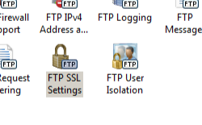

FTP over SSL &lt;ssl&gt;
====================

## Overview

The `<ssl>` element specifies the FTP over Secure Sockets Layer (SSL) settings for the FTP service; FTP over SSL was first introduced for IIS 7 in FTP 7.0.

Unlike using HTTP over SSL, which requires a separate port and connection for secure (HTTPS) communication, secure FTP communication occurs on the same port as non-secure communication. FTP 7 supports two different forms of FTP over SSL:

- **Explicit FTPS**: By default, FTP sites and clients use port 21 for the control channel, and the server and client will negotiate secondary ports for data channel connections. In a typical FTP request, an FTP client client will connect to an FTP site over the control channel, and then the client can negotiate SSL/TLS with the server for either the control channel or the data channel. When you are using FTP 7, you are using Explicit SSL if you enable FTPS and you assign the FTP site to any port other than port 990.
- **Implicit FTPS**: Implicit FTPS is an older form of FTP over SSL that is still supported by FTP 7. With Implicit FTPS, an SSL handshake must be negotiated before any FTP commands can be sent by the client. In addition, even though Explicit FTPS allows the client to arbitrarily decide whether to use SSL, Implicit FTPS requires that the entire FTP session must be encrypted. When you are using FTP 7, you are using Implicit SSL if you enable FTPS and you assign the FTP site to port 990.

Depending on the security options that you configure in the `controlChannelPolicy` and `dataChannelPolicy` attributes, an FTP client may switch between secure and non-secure multiple times in a single Explicit FTPS session. There are several ways that this might be implemented depending on your business needs:

| controlChannelPolicy | dataChannelPolicy | Notes |
| --- | --- | --- |
| `SslAllow` | `SslAllow` | This configuration allows the client to decide whether any part of the FTP session should be encrypted. |
| `SslRequireCredentialsOnly` | `SslAllow` | This configuration protects your FTP client credentials from electronic eavesdropping, and allows the client to decide whether data transfers should be encrypted. |
| `SslRequireCredentialsOnly` | `SslRequire` | This configuration requires that the client's credentials must be secure, and then allows the client to decide whether FTP commands should be encrypted. However, all data transfers must be encrypted. |
| `SslRequire` | `SslRequire` | This configuration is the most secure - the client must negotiate SSL by using the FTPS-related commands before other FTP commands are allowed, and all data transfers must be encrypted. |

## Compatibility

| Version | Notes |
| --- | --- |
| IIS 10.0 | The `<ssl>` element was not modified in IIS 10.0. |
| IIS 8.5 | The `<ssl>` element was not modified in IIS 8.5. |
| IIS 8.0 | The `<ssl>` element was not modified in IIS 8.0. |
| IIS 7.5 | The `<ssl>` element of the `<security>` element ships as a feature of IIS 7.5. |
| IIS 7.0 | The `<ssl>` element of the `<security>` element was introduced in FTP 7.0, which was a separate download for IIS 7.0. |
| IIS 6.0 | The FTP service in IIS 6.0 did not support FTP over SSL. |

> [!NOTE]
> The FTP 7.0 and FTP 7.5 services shipped out-of-band for IIS 7.0, which required downloading and installing the modules from the following URL:
> 
> [https://www.iis.net/expand/FTP](https://www.iis.net/downloads/microsoft/ftp)

With Windows 7 and Windows Server 2008 R2, the FTP 7.5 service ships as a feature for IIS 7.5, so downloading the FTP service is no longer necessary.

## Setup

To support FTP publishing for your Web server, you must install the FTP service. To do so, use the following steps.

### Windows Server 2012 or Windows Server 2012 R2

1. On the taskbar, click **Server Manager**.
2. In **Server Manager**, click the **Manage** menu, and then click **Add Roles and Features**.
3. In the **Add Roles and Features** wizard, click **Next**. Select the installation type and click **Next**. Select the destination server and click **Next**.
4. On the **Server Roles** page, expand **Web Server (IIS)**, and then select **FTP Server**.  
  
    > [!NOTE]
    > To support ASP.Membership authentication or IIS Manager authentication for the FTP service, you will need to select     **FTP Extensibility** , in addition to     **FTP Service** .  
     .
5. Click **Next**, and then on the **Select features** page, click **Next** again.
6. On the **Confirm installation selections** page, click **Install**.
7. On the **Results** page, click **Close**.

### Windows 8 or Windows 8.1

1. On the **Start** screen, move the pointer all the way to the lower left corner, right-click the **Start** button, and then click **Control Panel**.
2. In **Control Panel**, click **Programs and Features**, and then click **Turn Windows features on or off**.
3. Expand **Internet Information Services**, and then select **FTP Server**.   
  
    > [!NOTE]
    > To support ASP.Membership authentication or IIS Manager authentication for the FTP service, you will also need to select     **FTP Extensibility** .   
    
4. Click **OK**.
5. Click **Close**.

### Windows Server 2008 R2

1. On the taskbar, click **Start**, point to **Administrative Tools**, and then click **Server Manager**.
2. In the **Server Manager** hierarchy pane, expand **Roles**, and then click **Web Server (IIS)**.
3. In the **Web Server (IIS)** pane, scroll to the **Role Services** section, and then click **Add Role Services**.
4. On the **Select Role Services** page of the **Add Role Services Wizard**, expand **FTP Server**.
5. Select **FTP Service**.  
  
    > [!NOTE]
    > To support ASP.Membership authentication or IIS Manager authentication for the FTP service, you will also need to select     **FTP Extensibility** .  
    
6. Click **Next**.
7. On the **Confirm Installation Selections** page, click **Install**.
8. On the **Results** page, click **Close**.

### Windows 7

1. On the taskbar, click **Start**, and then click **Control Panel**.
2. In **Control Panel**, click **Programs and Features**, and then click **Turn Windows Features on or off**.
3. Expand **Internet Information Services**, and then **FTP Server**.
4. Select **FTP Service**.  
  
    > [!NOTE]
    > To support ASP.Membership authentication or IIS Manager authentication for the FTP service, you will also need to select     **FTP Extensibility** .   
    
5. Click **OK**.

### Windows Server 2008 or Windows Vista

1. Download the installation package from the following URL: 

    - [https://www.iis.net/expand/FTP](https://www.iis.net/downloads/microsoft/ftp)
2. Follow the instructions in the following walkthrough to install the FTP service: 

     - [Installing and Troubleshooting FTP 7](https://go.microsoft.com/fwlink/?LinkId=88547)

## How To

### How to configure SSL options for an FTP site

1. Open **Internet Information Services (IIS) Manager**: 

    - If you are using Windows Server 2012 or Windows Server 2012 R2: 

        - On the taskbar, click **Server Manager**, click **Tools**, and then click **Internet Information Services (IIS) Manager**.
    - If you are using Windows 8 or Windows 8.1: 

        - Hold down the **Windows** key, press the letter **X**, and then click **Control Panel**.
        - Click **Administrative Tools**, and then double-click **Internet Information Services (IIS) Manager**.
    - If you are using Windows Server 2008 or Windows Server 2008 R2: 

        - On the taskbar, click **Start**, point to **Administrative Tools**, and then click **Internet Information Services (IIS) Manager**.
    - If you are using Windows Vista or Windows 7: 

        - On the taskbar, click **Start**, and then click **Control Panel**.
        - Double-click **Administrative Tools**, and then double-click **Internet Information Services (IIS) Manager**.
2. In the **Connections** pane, expand the server name, expand the **Sites** node, and then click the name of the site.
3. In the site's **Home** pane, double-click the **FTP SSL Settings** feature.  
    
4. From the **SSL Certificate** list, select the certificate that you want to use for connections to the FTP server.  
    
5. Under **SSL Policy**, select one of the following options: 

    - **Allow SSL connections**: Allows the FTP server to support both non-SSL and SSL connections with a client.
    - **Require SSL connections**: Requires SSL encryption for communication between the FTP server and a client.
    - **Custom**: Enables you to configure a different SSL encryption policy for the control channel and the data channel. If you choose this option, click the **Advanced...** button. When the **Advanced SSL Policy** dialog box opens, select the following options: 

        - Under **Control Channel** select one of the following options for SSL encryption over the control channel: 

            - **Allow**: Specifies that SSL is allowed for the control channel; an FTP client may use SSL for the control channel, but it is not required.
            - **Require**: Specifies that SSL is required for the control channel; an FTP client may not switch to a non-secure mode of communication for the control channel.
            - **Require only for credentials**: Specifies that only the user credentials have to be sent over SSL session; an FTP client must use SSL for their user name and password, but the client is not required to use SSL for the control channel after they have logged in.
        - Under **Data Channel**, select one of the following options for SSL encryption over the data channel: 

            - **Allow**: SSL is allowed for the data channel; an FTP client may use SSL for the data channel, but it is not required.
            - **Require**: SSL is required for the data channel; an FTP client may not switch to a non-secure mode of communication for the data channel.
            - **Deny**: SSL is denied for the data channel; an FTP client may not use SSL for the data channel.
        - Click **OK** to close the **Advanced SSL Policy** dialog box.
6. In the **Actions** pane, click **Apply**.

## Configuration

The `<ssl>` element is configured at the site level.

### Attributes

| Attribute | Description |
| --- | --- |
| `controlChannelPolicy` | Optional enum attribute.  Specifies the SSL policy for the FTP control channel.  **Note:** There is no enum value that denies SSL for the command channel; to deny SSL, do not bind an SSL certificate to the FTP site by specifying a certificate hash in the `serverCertHash` attribute. <table> <tbody> <tr> <th>Value</th> <th>Description</th></tr> <tr> <th><code>SslAllow</code></th> <td>Specifies that SSL is allowed for the control channel.  The numeric value is <code>0</code>.</td></tr> <tr> <th><code>SslRequire</code></th> <td>Specifies that SSL is required for the control channel.  The numeric value is <code>1</code>.</td></tr> <tr> <th><code>SslRequireCredentialsOnly</code></th> <td>Specifies that only the "USER" and "PASS" commands have to be sent over SSL session. After an FTP client has logged in, the client can switch to a non-secure mode.  The numeric value is <code>2</code>.</td></tr></tbody></table>The default value is `SslRequire`. |
| `dataChannelPolicy` | Optional enum attribute.  Specifies the SSL policy for the FTP data channel. <table> <tbody> <tr> <th>Value</th> <th>Description</th></tr> <tr> <th><code>SslAllow</code></th> <td>Specifies that SSL is allowed for the data channel.  The numeric value is <code>0</code>.</td></tr> <tr> <th><code>SslRequire</code></th> <td>Specifies that SSL is required for the data channel.  The numeric value is <code>1</code>.</td></tr> <tr> <th><code>SslDeny</code></th> <td>Specifies that SSL is denied for the data channel.  The numeric value is <code>2</code>.</td></tr></tbody></table>The default value is `SslRequire`. |
| `serverCertHash` | Optional string attribute.  Specifies the thumbprint hash for the server side certificate to use for SSL connections.  There is no default value. |
| `serverCertStoreName` | Optional string attribute.  Specifies the certificate store for server SSL certificates.  The default value is `MY`. |
| `ssl128` | Optional **Boolean** attribute.  Specifies whether 128-bit SSL is required.  The default value is `false`. |

### Child Elements

None.

### Configuration Sample

The following sample illustrates several configuration settings in the `<ftpServer>` element for an FTP site. More specifically, the `<site>` settings in this example demonstrate how to:

- Create an FTP site and add the binding for the FTP protocol on port 21.
- Configure the FTP SSL options to allow secure access on both the control and data channel using a certificate.
- Disable Anonymous authentication and enable Basic authentication for FTP.
- Deny access for FTP **SYST** command.
- Specify the UNIX directory listing format.
- Configure the logging options.
- Specify a customized welcome message and enable local detailed error messages.
- Specify that users will start in a home directory that is based on their login name, but only if that directory exists.

[!code-xml[Main](ssl/samples/sample1.xml)]

## Sample Code

The following examples configure an FTP site so that it requires SSL for both the data channel and control channel.

### AppCmd.exe

[!code-console[Main](ssl/samples/sample2.cmd)]

> [!NOTE]
> You must be sure to set the **commit** parameter to `apphost` when you use AppCmd.exe to configure these settings. This commits the configuration settings to the appropriate location section in the ApplicationHost.config file.

### C#

[!code-csharp[Main](ssl/samples/sample3.cs)]

### VB.NET

[!code-vb[Main](ssl/samples/sample4.vb)]

### JavaScript

[!code-javascript[Main](ssl/samples/sample5.js)]

### VBScript

[!code-vb[Main](ssl/samples/sample6.vb)]