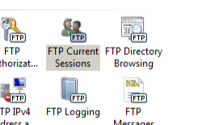

FTP Sessions &lt;sessions&gt;
====================

## Overview

The `<sessions>` element is a dynamically generated collection of `<session>` elements, each of which is dynamically created by the FTP service as clients connect to your FTP server. The data that is contained in the attributes for each `<session>` element is read-only; values can be queried but not modified. Each `<session>` element contains a `terminate` method, which allows you to disconnect the client session.

## Compatibility

| Version | Notes |
| --- | --- |
| IIS 10.0 | The `<sessions>` element was not modified in IIS 10.0. |
| IIS 8.5 | The `<sessions>` element was not modified in IIS 8.5. |
| IIS 8.0 | The `<sessions>` element was not modified in IIS 8.0. |
| IIS 7.5 | The `<sessions>` element of the `<ftpServer>` element ships as a feature of IIS 7.5. |
| IIS 7.0 | The `<sessions>` element of the `<ftpServer>` element was introduced in FTP 7.0, which was a separate download for IIS 7.0. |
| IIS 6.0 | N/A |

> [!NOTE]
> The FTP 7.0 and FTP 7.5 services shipped out-of-band for IIS 7.0, which required downloading and installing the modules from the following URL:

> [https://www.iis.net/expand/FTP](https://www.iis.net/downloads/microsoft/ftp)

With Windows 7 and Windows Server 2008 R2, the FTP 7.5 service ships as a feature for IIS 7.5, so downloading the FTP service is no longer necessary.

## Setup

To support FTP publishing for your Web server, you must install the FTP service. To do so, use the following steps.

### Windows Server 2012 or Windows Server 2012 R2

1. On the taskbar, click **Server Manager**.
2. In **Server Manager**, click the **Manage** menu, and then click **Add Roles and Features**.
3. In the **Add Roles and Features** wizard, click **Next**. Select the installation type and click **Next**. Select the destination server and click **Next**.
4. On the **Server Roles** page, expand **Web Server (IIS)**, and then select **FTP Server**.  
  
    > [!NOTE]
    > To support ASP.Membership authentication or IIS Manager authentication for the FTP service, you will need to select     **FTP Extensibility** , in addition to     **FTP Service** .  
     .
5. Click **Next**, and then on the **Select features** page, click **Next** again.
6. On the **Confirm installation selections** page, click **Install**.
7. On the **Results** page, click **Close**.

### Windows 8 or Windows 8.1

1. On the **Start** screen, move the pointer all the way to the lower left corner, right-click the **Start** button, and then click **Control Panel**.
2. In **Control Panel**, click **Programs and Features**, and then click **Turn Windows features on or off**.
3. Expand **Internet Information Services**, and then select **FTP Server**.   
  
    > [!NOTE]
    > To support ASP.Membership authentication or IIS Manager authentication for the FTP service, you will also need to select     **FTP Extensibility** .   
    
4. Click **OK**.
5. Click **Close**.

### Windows Server 2008 R2

1. On the taskbar, click **Start**, point to **Administrative Tools**, and then click **Server Manager**.
2. In the **Server Manager** hierarchy pane, expand **Roles**, and then click **Web Server (IIS)**.
3. In the **Web Server (IIS)** pane, scroll to the **Role Services** section, and then click **Add Role Services**.
4. On the **Select Role Services** page of the **Add Role Services Wizard**, expand **FTP Server**.
5. Select **FTP Service**.  
  
    > [!NOTE]
    > To support ASP.Membership authentication or IIS Manager authentication for the FTP service, you will also need to select     **FTP Extensibility** .  
    
6. Click **Next**.
7. On the **Confirm Installation Selections** page, click **Install**.
8. On the **Results** page, click **Close**.

### Windows 7

1. On the taskbar, click **Start**, and then click **Control Panel**.
2. In **Control Panel**, click **Programs and Features**, and then click **Turn Windows Features on or off**.
3. Expand **Internet Information Services**, and then **FTP Server**.
4. Select **FTP Service**.  
  
    > [!NOTE]
    > To support ASP.Membership authentication or IIS Manager authentication for the FTP service, you will also need to select     **FTP Extensibility** .   
    
5. Click **OK**.

### Windows Server 2008 or Windows Vista

1. Download the installation package from the following URL: 

    - [https://www.iis.net/expand/FTP](https://www.iis.net/downloads/microsoft/ftp)
- Follow the instructions in the following walkthrough to install the FTP service: 

    - [Installing and Troubleshooting FTP 7](https://go.microsoft.com/fwlink/?LinkId=88547)

## How To

### How to view the active sessions for an FTP site

1. Open **Internet Information Services (IIS) Manager**: 

    - If you are using Windows Server 2012 or Windows Server 2012 R2: 

        - On the taskbar, click **Server Manager**, click **Tools**, and then click **Internet Information Services (IIS) Manager**.
    - If you are using Windows 8 or Windows 8.1: 

        - Hold down the **Windows** key, press the letter **X**, and then click **Control Panel**.
        - Click **Administrative Tools**, and then double-click **Internet Information Services (IIS) Manager**.
    - If you are using Windows Server 2008 or Windows Server 2008 R2: 

        - On the taskbar, click **Start**, point to **Administrative Tools**, and then click **Internet Information Services (IIS) Manager**.
    - If you are using Windows Vista or Windows 7: 

        - On the taskbar, click **Start**, and then click **Control Panel**.
        - Double-click **Administrative Tools**, and then double-click **Internet Information Services (IIS) Manager**.
2. In the **Connections** pane, expand the server name, expand the **Sites** node, and then click the name of the site.  
    
3. In the site's **Home** pane, double-click **FTP Current Sessions**.  
    
4. The currently active FTP sessions will be displayed in the list view. You can disconnect an active session by highlighting it in the list and then clicking **Disconnect Session** in the **Actions** pane.

## Configuration

The `<sessions>` element is created at the site level.

### Attributes

None.

### Child Elements

| Element | Description |
| --- | --- |
| [`session`](session.md) | Dynamically created element. Specifies information about an FTP session. |

### Configuration Sample

The `<sessions>` element is dynamically generated; it cannot be configured.

## Sample Code

The following code samples illustrate looping through the list of sessions for an FTP site that is named "ftp.example.com". The code samples will list the session identifier, the user name, and the last command for each session.

### AppCmd.exe

You cannot query FTP session information by using AppCmd.exe.

### C#

[!code-csharp[Main](index/samples/sample1.cs)]

### VB.NET

[!code-vb[Main](index/samples/sample2.vb)]

### JavaScript

[!code-javascript[Main](index/samples/sample3.js)]

### VBScript

[!code-vb[Main](index/samples/sample4.vb)]