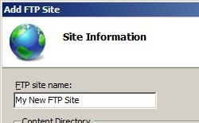
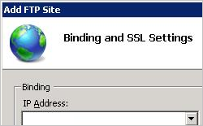

# Site &lt;site&gt;

## Overview

The `<site>` configuration element controls the configuration of a specific Web site that you run on your IIS 7 and later server. For example, the Default Web Site and its settings are defined in a `<site>` element, which is found between the opening and closing tags of the `<sites>` element.

You configure a `<site>` element when you create a new Web site on IIS 7 and later. The `<site>` element contains a **name** attribute that defines the name you have assigned the Web site, and an **id** attribute that defines the numeric identifier for the Web site. The `<site>` element contains child elements that define the applications and virtual directories that run on the site, as well as port, protocol, logging, and tracing configuration settings for the Web site.

## Compatibility

| Version | Notes |
| --- | --- |
| IIS 10.0 | The `<site>` element was not modified in IIS 10.0. |
| IIS 8.5 | The `<site>` element was not modified in IIS 8.5. |
| IIS 8.0 | The `<site>` element was not modified in IIS 8.0. |
| IIS 7.5 | The `<site>` element was not modified in IIS 7.5. |
| IIS 7.0 | The `<site>` element of the `<sites>` collection was introduced in IIS 7.0. |
| IIS 6.0 | The `<sites>` collection replaces the IIS 6.0 **IIsWebServer** metabase object. |

## Setup

The `<site>` element is included in the default installation of IIS 7 and later.

## How To

When you configure a new Web site on IIS 7, you must assign the Web site a site name and a physical path. There are also a number of optional configuration settings you can set. If you plan to continue to use the Default Web Site on your IIS 7 server, you must alter the binding information for the new site. You can do this by changing either the port or entering a host name for the new Web site.

### How to create a new Web site

1. Open **Internet Information Services (IIS) Manager**:

    - If you are using Windows Server 2012 or Windows Server 2012 R2:

        - On the taskbar, click **Server Manager**, click **Tools**, and then click **Internet Information Services (IIS) Manager**.
    - If you are using Windows 8 or Windows 8.1:

        - Hold down the **Windows** key, press the letter **X**, and then click **Control Panel**.
        - Click **Administrative Tools**, and then double-click **Internet Information Services (IIS) Manager**.
    - If you are using Windows Server 2008 or Windows Server 2008 R2:

        - On the taskbar, click **Start**, point to **Administrative Tools**, and then click **Internet Information Services (IIS) Manager**.
    - If you are using Windows Vista or Windows 7:

        - On the taskbar, click **Start**, and then click **Control Panel**.
        - Double-click **Administrative Tools**, and then double-click **Internet Information Services (IIS) Manager**.
2. In the **Connections** pane, expand the server name, and then click **Sites**.
3. In the **Actions** pane, click **Add Web Site**
4. In the **Add Web Site** dialog box, at a minimum, enter information in the **Site name** and **Physical path** text boxes and choose whether you want to enter information in the **Host name** text box or change the number in the **Port** box.  
    
5. On IIS Manager, click the refresh button to verify that the site has started.

### How to enable or disable Anonymous authentication for an FTP site

1. Open **Internet Information Services (IIS) Manager**:

    - If you are using Windows Server 2012 or Windows Server 2012 R2:

        - On the taskbar, click **Server Manager**, click **Tools**, and then click **Internet Information Services (IIS) Manager**.
    - If you are using Windows 8 or Windows 8.1:

        - Hold down the **Windows** key, press the letter **X**, and then click **Control Panel**.
        - Click **Administrative Tools**, and then double-click **Internet Information Services (IIS) Manager**.
    - If you are using Windows Server 2008 or Windows Server 2008 R2:

        - On the taskbar, click **Start**, point to **Administrative Tools**, and then click **Internet Information Services (IIS) Manager**.
    - If you are using Windows Vista or Windows 7:

        - On the taskbar, click **Start**, and then click **Control Panel**.
        - Double-click **Administrative Tools**, and then double-click **Internet Information Services (IIS) Manager**.
2. In the **Connections** pane, expand the server name, expand the **Sites** node, and then click the name of the site.
3. In the site's **Home** pane, double-click the **FTP Authentication** feature.
4. On the **FTP Authentication** page, select **Anonymous Authentication**.
5. In the **Actions** pane, click **Enable** to enable Anonymous authentication or click **Disable** to disable Anonymous authentication.  
    

### How to use the FTP Site Wizard to Create an FTP Site with Anonymous Read Access

1. Open **Internet Information Services (IIS) Manager**:

    - If you are using Windows Server 2012 or Windows Server 2012 R2:

        - On the taskbar, click **Server Manager**, click **Tools**, and then click **Internet Information Services (IIS) Manager**.
    - If you are using Windows 8 or Windows 8.1:

        - Hold down the **Windows** key, press the letter **X**, and then click **Control Panel**.
        - Click **Administrative Tools**, and then double-click **Internet Information Services (IIS) Manager**.
    - If you are using Windows Server 2008 or Windows Server 2008 R2:

        - On the taskbar, click **Start**, point to **Administrative Tools**, and then click **Internet Information Services (IIS) Manager**.
    - If you are using Windows Vista or Windows 7:

        - On the taskbar, click **Start**, and then click **Control Panel**.
        - Double-click **Administrative Tools**, and then double-click **Internet Information Services (IIS) Manager**.
2. In the **Connections** pane, click the **Sites** node in the tree.
3. Right-click the **Sites** node in the tree and click **Add FTP Site**, or click **Add FTP Site** in the **Actions** pane.
4. When the **Add FTP Site** wizard appears:

    - Enter "My New FTP Site" in the **FTP site name** box.
    - For the **Physical path** box, you can use one of the following options to specify your content directory: 

        - Click the ellipsis (**...**) button, and then navigate to the folder that contains the content for your FTP site.
        - Type in the path to your content folder in the box. Note that if you choose to type the path, you can use environment variables in your paths. For example, you can use "%*SystemDrive*%\inetpub\ftproot" for your content directory.
    - When you have completed these items, click **Next**.  
        
5. On the second page of the **Add FTP Site** wizard: 

    - Choose an IP address for your FTP site from the **IP Address** drop-down, or choose to accept the default selection of "All Unassigned."
    - Enter the TCP/IP port for the FTP site in the **Port** box. By default, FTP sites and clients use port 21. (Note: To specify Implicit FTPS, you need to use port 990.)
    - To use an FTP virtual host name, select the box for **Enable Virtual Host Names**, then enter the virtual host name in the **Virtual Host** box.
    - For the SSL options, choose one of the following options: 

        - Select **No SSL** to disable the SSL options.
        - Select **Allow SSL** to allow FTP clients to optionally use FTP over SSL when they connect with the FTP server.
        - Select **Require SSL** to allow FTP clients to always use FTP over SSL when they connect with the FTP server.
        - If you choose **Allow SSL** or **Require SSL**, choose a certificate from the **SSL Certificate** drop-down menu.
    - When you have completed these items, click **Next**.  
        
6. On the next page of the wizard: 

    - Select **Anonymous** for the **Authentication** settings.
    - For the **Authorization** settings, choose "Anonymous users" from the **Allow access to** drop-down.
    - Select **Read** for the **Permissions** option.
    - When you have completed these items, click **Finish**.  
        

## Configuration

You configure the `<site>` element at the server level in the ApplicationHost.config file.

### Attributes

| Attribute | Description |
| --- | --- |
| `id` | Optional uint attribute.  Specifies the random numeric identifier that is assigned by IIS when the site is created.  The Default Web Site is numbered 1. Other Web sites have random numbers composed of multiple digits. |
| `name` | Optional string attribute.  Specifies a friendly name that uniquely identifies a Web site, for example, "Contoso HR Forms." |
| `serverAutoStart` | Optional Boolean attribute.  Specifies whether the site should start automatically when the Management Service is started.  The default value is `true`. |

### Child Elements

| Element | Description |
| --- | --- |
| [`application`](application/index.md) | Optional element.  Specifies a collection of configuration settings for applications in the site. |
| [`applicationDefaults`](applicationdefaults.md) | Optional element.  Specifies default settings for all applications in the parent site. |
| [`bindings`](bindings/index.md) | Optional element.  Specifies bindings to access the site. |
| [`ftpServer`](ftpserver/index.md) | Optional element.  Specifies FTP settings for the site.  **Note:** This requires installing FTP 7.0 or FTP 7.5. |
| [`limits`](limits.md) | Optional element.  Configures settings to limit the amount of bandwidth, the number of connections, or the amount of time for connections to a site. |
| [`logFile`](logfile/index.md) | Optional element.  Configures settings for handling and storage of log files for the site. |
| [`traceFailedRequestsLogging`](../sitedefaults/index.md) | Optional element.  Specifies settings for logging failed-request traces for the site. |
| [`virtualDirectoryDefaults`](virtualdirectorydefaults.md) | Optional element.  Specifies default settings for all virtual directories in the site. |

### Configuration Sample

The following configuration example displays a `<site>` element in the ApplicationHost.config file. The **name** attribute defines the site name as Contoso, and the **id** attribute defines the IIS-specific identifier as **2**. The **physicalPath** attribute in the `<virtualDirectory>` element defines the physical location of the new site's content. The **protocol** attribute of the `<binding>` element defines the protocol the site will use, and the **bindingInformation** attribute defines `www.contoso.com` as the host header used by the new Web site.

[!code-xml[Main](index/samples/sample1.xml)]

## Sample Code

The following examples create a new Web site named Contoso with an ID of 2, and sets a binding for the HTTP protocol over port 80 with a host header of &quot;www.contoso.com&quot;. The physical path for the new Web site is C:\Inetpub\www.contoso.com\wwwroot.

### AppCmd.exe

[!code-console[Main](index/samples/sample2.cmd)]

> [!NOTE]
> You must be sure to set the **commit** parameter to `apphost` when you use AppCmd.exe to configure these settings. This commits the configuration settings to the appropriate location section in the ApplicationHost.config file.

### C\#

[!code-csharp[Main](index/samples/sample3.cs)]

### VB.NET

[!code-vb[Main](index/samples/sample4.vb)]

### JavaScript

[!code-javascript[Main](index/samples/sample5.js)]

### VBScript

[!code-vb[Main](index/samples/sample6.vb)]
