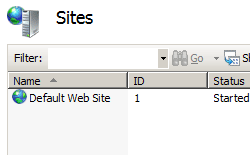
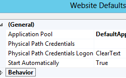

Default Bindings &lt;bindings&gt;
====================

## Overview

The `<bindings>` element configures the default binding information for all IIS 7 Web sites.

This element can contain a collection of `<binding>` elements. Each element in the collection defines a separate set of binding information that a request can use to contact the Web site. For example, if your site requires users to contact it using both the HTTP protocol and the HTTPS protocol, you must define a binding for each protocol.

You can also use a `<clear />` element in the `<bindings>` element of a `<site>` element to override the binding defaults inherited from the server level `<siteDefaults>` element.

## Compatibility

| Version | Notes |
| --- | --- |
| IIS 10.0 | The `<bindings>` element was not modified in IIS 10.0. |
| IIS 8.5 | The `<bindings>` element was not modified in IIS 8.5. |
| IIS 8.0 | The `<bindings>` element was not modified in IIS 8.0. |
| IIS 7.5 | The `<bindings>` element was not modified in IIS 7.5. |
| IIS 7.0 | The `<bindings>` element was introduced in IIS 7.0. |
| IIS 6.0 | The `<bindings>` collection replaces sections of the **ServerBindings** property on the IIS 6.0 **IIsWebServer** metabase object. |

## Setup

The `<bindings>` element is included in the default installation of IIS 7.

## How To

### How to configure the site defaults for a server

1. Open **Internet Information Services (IIS) Manager**: 

    - If you are using Windows Server 2012 or Windows Server 2012 R2: 

        - On the taskbar, click **Server Manager**, click **Tools**, and then click **Internet Information Services (IIS) Manager**.
    - If you are using Windows 8 or Windows 8.1: 

        - Hold down the **Windows** key, press the letter **X**, and then click **Control Panel**.
        - Click **Administrative Tools**, and then double-click **Internet Information Services (IIS) Manager**.
    - If you are using Windows Server 2008 or Windows Server 2008 R2: 

        - On the taskbar, click **Start**, point to **Administrative Tools**, and then click **Internet Information Services (IIS) Manager**.
    - If you are using Windows Vista or Windows 7: 

        - On the taskbar, click **Start**, and then click **Control Panel**.
        - Double-click **Administrative Tools**, and then double-click **Internet Information Services (IIS) Manager**.
2. In the **Connections** pane, expand the server name, then click the **Sites** node.
3. In the server's **Sites** pane, click **Set Web Site Defaults...** in the **Actions** pane.  
    
4. In the **Web Site Defaults** dialog box, specify your default options for all Web sites, and then click **OK**.  
  
    

## Configuration

You can add a `<bindings>` element for a server, which can contain a colleciton of individual `<binding>` elements that define the default protocol bindings for the server. You can also use a `<clear />` element in the `<bindings>` element of a `<site>` element to override the binding defaults inherited from the server level `<siteDefaults>` element.

### Attributes

None.

### Child Elements

| Element | Description |
| --- | --- |
| [`binding`](binding.md) | Optional element. Configures a default binding. |
| `clear` | Optional element. Clears the collection of default bindings. |

### Configuration Sample

The following configuration sample specifies the default `bindings` options for IIS 7.

[!code-xml[Main](index/samples/sample1.xml)]

## Sample Code

The following code samples configure the default `bindings` options for IIS 7.

### AppCmd.exe

[!code-console[Main](index/samples/sample2.cmd)]

> [!NOTE]
> You must be sure to set the **commit** parameter to `apphost` when you use AppCmd.exe to configure these settings. This commits the configuration settings to the appropriate location section in the ApplicationHost.config file.

### C#

[!code-csharp[Main](index/samples/sample3.cs)]

### VB.NET

[!code-vb[Main](index/samples/sample4.vb)]

### JavaScript

[!code-javascript[Main](index/samples/sample5.js)]

### VBScript

[!code-vb[Main](index/samples/sample6.vb)]