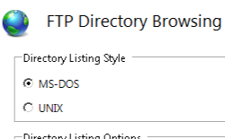

# Default FTP Directory Browse Settings &lt;directoryBrowse&gt;

## Overview

The `<directoryBrowse>` element is used to specify the content settings for directory browsing on FTP sites. When you configure directory browsing options, all directories in an FTP site will use the same settings. The directory browsing settings will typically only affect command-line FTP clients, but may impact some graphical FTP clients. For example, a graphical FTP client might not work with the MS-DOS style of directory listings, in which case you would need to configure the UNIX directory listing style.

## Compatibility

| Version | Notes |
| --- | --- |
| IIS 10.0 | The `<directoryBrowse>` element was not modified in IIS 10.0. |
| IIS 8.5 | The `<directoryBrowse>` element was not modified in IIS 8.5. |
| IIS 8.0 | The `<directoryBrowse>` element was not modified in IIS 8.0. |
| IIS 7.5 | The `<directoryBrowse>` element of the `<ftpServer>` element ships as a feature of IIS 7.5. |
| IIS 7.0 | The `<directoryBrowse>` element of the `<ftpServer>` element was introduced in FTP 7.0, which was a separate download for IIS 7.0. |
| IIS 6.0 | N/A |

> [!NOTE]
> The FTP 7.0 and FTP 7.5 services shipped out-of-band for IIS 7.0, which required downloading and installing the modules from the following URL:
> 
> [https://www.iis.net/expand/FTP](https://www.iis.net/downloads/microsoft/ftp)

With Windows 7 and Windows Server 2008 R2, the FTP 7.5 service ships as a feature for IIS 7.5, so downloading the FTP service is no longer necessary.

## Setup

To support FTP publishing for your Web server, you must install the FTP service. To do so, use the following steps.

### Windows Server 2012 or Windows Server 2012 R2

1. On the taskbar, click **Server Manager**.
2. In **Server Manager**, click the **Manage** menu, and then click **Add Roles and Features**.
3. In the **Add Roles and Features** wizard, click **Next**. Select the installation type and click **Next**. Select the destination server and click **Next**.
4. On the **Server Roles** page, expand **Web Server (IIS)**, and then select **FTP Server**.  
  
    > [!NOTE]
    > To support ASP.Membership authentication or IIS Manager authentication for the FTP service, you will need to select **FTP Extensibility**, in addition to **FTP Service**.  
     .
5. Click **Next**, and then on the **Select features** page, click **Next** again.
6. On the **Confirm installation selections** page, click **Install**.
7. On the **Results** page, click **Close**.

### Windows 8 or Windows 8.1

1. On the **Start** screen, move the pointer all the way to the lower left corner, right-click the **Start** button, and then click **Control Panel**.
2. In **Control Panel**, click **Programs and Features**, and then click **Turn Windows features on or off**.
3. Expand **Internet Information Services**, and then select **FTP Server**.   
  
    > [!NOTE]
    > To support ASP.Membership authentication or IIS Manager authentication for the FTP service, you will also need to select **FTP Extensibility**.   
    
4. Click **OK**.
5. Click **Close**.

### Windows Server 2008 R2

1. On the taskbar, click **Start**, point to **Administrative Tools**, and then click **Server Manager**.
2. In the **Server Manager** hierarchy pane, expand **Roles**, and then click **Web Server (IIS)**.
3. In the **Web Server (IIS)** pane, scroll to the **Role Services** section, and then click **Add Role Services**.
4. On the **Select Role Services** page of the **Add Role Services Wizard**, expand **FTP Server**.
5. Select **FTP Service**.  
  
    > [!NOTE]
    > To support ASP.Membership authentication or IIS Manager authentication for the FTP service, you will also need to select **FTP Extensibility**.  
    
6. Click **Next**.
7. On the **Confirm Installation Selections** page, click **Install**.
8. On the **Results** page, click **Close**.

### Windows 7

1. On the taskbar, click **Start**, and then click **Control Panel**.
2. In **Control Panel**, click **Programs and Features**, and then click **Turn Windows Features on or off**.
3. Expand **Internet Information Services**, and then **FTP Server**.
4. Select **FTP Service**.  
  
    > [!NOTE]
    > To support ASP.Membership authentication or IIS Manager authentication for the FTP service, you will also need to select **FTP Extensibility**.   
    
5. Click **OK**.

### Windows Server 2008 or Windows Vista

1. Download the installation package from the following URL: 

    - [https://www.iis.net/expand/FTP](https://www.iis.net/downloads/microsoft/ftp)
2. Follow the instructions in the following walkthrough to install the FTP service: 

     - [Installing and Troubleshooting FTP 7](https://go.microsoft.com/fwlink/?LinkId=88547)

## How To

### How to configure FTP directory browsing

1. Open **Internet Information Services (IIS) Manager**: 

    - If you are using Windows Server 2012 or Windows Server 2012 R2: 

        - On the taskbar, click **Server Manager**, click **Tools**, and then click **Internet Information Services (IIS) Manager**.
    - If you are using Windows 8 or Windows 8.1: 

        - Hold down the **Windows** key, press the letter **X**, and then click **Control Panel**.
        - Click **Administrative Tools**, and then double-click **Internet Information Services (IIS) Manager**.
    - If you are using Windows Server 2008 or Windows Server 2008 R2: 

        - On the taskbar, click **Start**, point to **Administrative Tools**, and then click **Internet Information Services (IIS) Manager**.
    - If you are using Windows Vista or Windows 7: 

        - On the taskbar, click **Start**, and then click **Control Panel**.
        - Double-click **Administrative Tools**, and then double-click **Internet Information Services (IIS) Manager**.
2. In the **Connections** pane, expand the server name, and then go to the site, application, or directory where you want to configure directory browsing.
3. In the **Home** pane, double-click **FTP Directory Browsing**.  
    
4. Configure the following options: 

    - Click to select **UNIX** for the **Directory Listing Style**.
    - Click to select **Virtual directories**.
    - Click to select **Available bytes**.  
        
5. Click **Apply** in the **Actions** pane.

## Configuration

### Attributes

| Attribute | Description |
| --- | --- |
| `showFlags` | Optional flags attribute.  Specifies the options for directory listings. <table> <tbody> <tr> <th>Name</th> <th>Value</th></tr> <tr> <th><code>LongDate</code></th> <td>Specifies whether to show long dates or short dates.  The numeric value is <code>2</code>.</td></tr> <tr> <th><code>StyleUnix</code></th> <td>Specifies whether to display UNIX-style directory listings; otherwise, displays MSDOS-style listings.  The numeric value is <code>4</code>.</td></tr> <tr> <th><code>DisplayAvailableBytes</code></th> <td>Specifies whether to display the available bytes in directory listings.  The numeric value is <code>16</code>.</td></tr> <tr> <th><code>DisplayVirtualDirectories</code></th> <td>Specifies whether to display virtual directories if set; otherwise, virtual directories are hidden.  The numeric value is <code>32</code>.</td></tr> <tr> <th><code>UseGmtTime</code></th> <td>Specifies whether to display dates and times in GMT.  The numeric value is <code>64</code>.</td></tr></tbody></table>There is no default value. |
| `virtualDirectoryTimeout` | Optional int attribute.  Specifies the maximum amount of time the FTP service will use to retrieve the timestamp information for virtual directories. If threshold is reached, or `virtualDirectoryTimeout` is set to 0, then the current date will be used instead.  The default value is `5`. |

### Child Elements

None.

### Configuration Sample

The following configuration sample displays an example `<siteDefaults>` element for a server that is configured to display UNIX-style directory listings and the available drive space for directory listings.

[!code-xml[Main](directoryBrowse/samples/sample1.xml)]

## Sample Code

The following code samples configure the FTP site defaults to display UNIX-style directory listings and the available drive space for directory listings.

### AppCmd.exe

[!code-console[Main](directoryBrowse/samples/sample2.cmd)]

> [!NOTE]
> You must be sure to set the **commit** parameter to `apphost` when you use AppCmd.exe to configure these settings. This commits the configuration settings to the appropriate location section in the ApplicationHost.config file.

### C\#

[!code-csharp[Main](directoryBrowse/samples/sample3.cs)]

### VB.NET

[!code-vb[Main](directoryBrowse/samples/sample4.vb)]

### JavaScript

[!code-javascript[Main](directoryBrowse/samples/sample5.js)]

### VBScript

[!code-vb[Main](directoryBrowse/samples/sample6.vb)]
