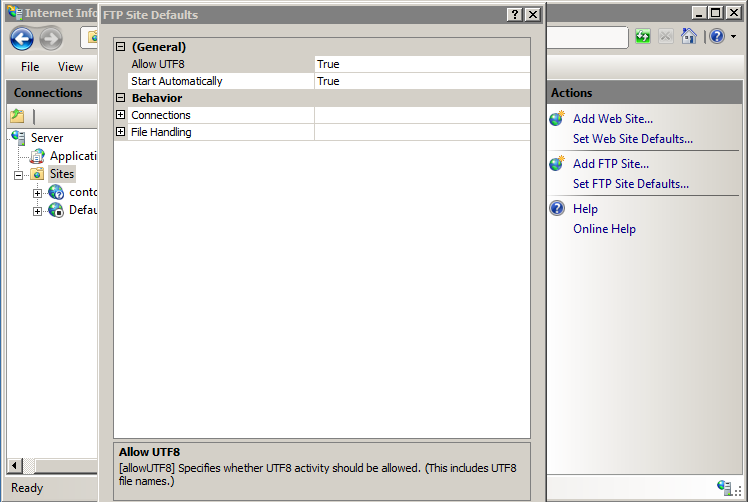

# Default FTP File Handling Settings &lt;fileHandling&gt;

## Overview

The `<fileHandling>` element is used to specify the way that the FTP service handles file operations. For example, the `keepPartialUploads` attribute configures whether the FTP service should keep files that were partially transferred, such as when a file transfer ends prematurely.

## Compatibility

| Version | Notes |
| --- | --- |
| IIS 10.0 | The `<fileHandling>` element was not modified in IIS 10.0. |
| IIS 8.5 | The `<fileHandling>` element was not modified in IIS 8.5. |
| IIS 8.0 | The `<fileHandling>` element was not modified in IIS 8.0. |
| IIS 7.5 | The `<fileHandling>` element of the `<ftpServer>` element ships as a feature of IIS 7.5. |
| IIS 7.0 | The `<fileHandling>` element of the `<ftpServer>` element was introduced in FTP 7.0, which was a separate download for IIS 7.0. |
| IIS 6.0 | N/A |

> [!NOTE]
> The FTP 7.0 and FTP 7.5 services shipped out-of-band for IIS 7.0, which required downloading and installing the modules from the following URL:
>
> <https://www.iis.net/downloads/microsoft/ftp>

With Windows 7 and Windows Server 2008 R2, the FTP 7.5 service ships as a feature for IIS 7.5, so downloading the FTP service is no longer necessary.

## Setup

To support FTP publishing for your Web server, you must install the FTP service. To do so, use the following steps.

### Windows Server 2012 or Windows Server 2012 R2

1. On the taskbar, click **Server Manager**.
2. In **Server Manager**, click the **Manage** menu, and then click **Add Roles and Features**.
3. In the **Add Roles and Features** wizard, click **Next**. Select the installation type and click **Next**. Select the destination server and click **Next**.
4. On the **Server Roles** page, expand **Web Server (IIS)**, and then select **FTP Server**.  
  
    > [!NOTE]
    > To support ASP.Membership authentication or IIS Manager authentication for the FTP service, you will need to select **FTP Extensibility**, in addition to **FTP Service**.  
    > 
5. Click **Next**, and then on the **Select features** page, click **Next** again.
6. On the **Confirm installation selections** page, click **Install**.
7. On the **Results** page, click **Close**.

### Windows 8 or Windows 8.1

1. On the **Start** screen, move the pointer all the way to the lower left corner, right-click the **Start** button, and then click **Control Panel**.
2. In **Control Panel**, click **Programs and Features**, and then click **Turn Windows features on or off**.
3. Expand **Internet Information Services**, and then select **FTP Server**.
  
    > [!NOTE]
    > To support ASP.Membership authentication or IIS Manager authentication for the FTP service, you will also need to select **FTP Extensibility**.  
    > 

4. Click **OK**.
5. Click **Close**.

### Windows Server 2008 R2

1. On the taskbar, click **Start**, point to **Administrative Tools**, and then click **Server Manager**.
2. In the **Server Manager** hierarchy pane, expand **Roles**, and then click **Web Server (IIS)**.
3. In the **Web Server (IIS)** pane, scroll to the **Role Services** section, and then click **Add Role Services**.
4. On the **Select Role Services** page of the **Add Role Services Wizard**, expand **FTP Server**.
5. Select **FTP Service**.  

    > [!NOTE]
    > To support ASP.Membership authentication or IIS Manager authentication for the FTP service, you will also need to select **FTP Extensibility**.  
    

6. Click **Next**.
7. On the **Confirm Installation Selections** page, click **Install**.
8. On the **Results** page, click **Close**.

### Windows 7

1. On the taskbar, click **Start**, and then click **Control Panel**.
2. In **Control Panel**, click **Programs and Features**, and then click **Turn Windows Features on or off**.
3. Expand **Internet Information Services**, and then **FTP Server**.
4. Select **FTP Service**.  
  
    > [!NOTE]
    > To support ASP.Membership authentication or IIS Manager authentication for the FTP service, you will also need to select **FTP Extensibility**.   
    

5. Click **OK**.

### Windows Server 2008 or Windows Vista

1. Download the installation package from the following URL:

    - <https://www.iis.net/downloads/microsoft/ftp>
2. Follow the instructions in the following walkthrough to install the FTP service:

    - [Installing and Troubleshooting FTP 7](https://go.microsoft.com/fwlink/?LinkId=88547)

## How To

### How to configure the default file handling options for an FTP server

1. Open **Internet Information Services (IIS) Manager**:

    - If you are using Windows Server 2012 or Windows Server 2012 R2:

        - On the taskbar, click **Server Manager**, click **Tools**, and then click **Internet Information Services (IIS) Manager**.
    - If you are using Windows 8 or Windows 8.1:

        - Hold down the **Windows** key, press the letter **X**, and then click **Control Panel**.
        - Click **Administrative Tools**, and then double-click **Internet Information Services (IIS) Manager**.
    - If you are using Windows Server 2008 or Windows Server 2008 R2:

        - On the taskbar, click **Start**, point to **Administrative Tools**, and then click **Internet Information Services (IIS) Manager**.
    - If you are using Windows Vista or Windows 7:

        - On the taskbar, click **Start**, and then click **Control Panel**.
        - Double-click **Administrative Tools**, and then double-click **Internet Information Services (IIS) Manager**.
2. In the **Connections** pane, expand the server name, and then click the **Sites** node.
3. In the **Sites** pane, click **Set FTP Site Defaults** in the **Actions** pane.
    
4. In the **FTP Site Defaults** dialog box, expand **File Handling**, and specify the following options:

    - Specify **True** for **Allow Reading Files While Uploading** if the FTP service should allow read access to files that are currently being uploaded; otherwise, specify **False**.
    - Specify **True** for **Allow Replace on Rename** if the FTP service should allow files that are being renamed to overwrite existing files; otherwise, specify **False**.
    - Specify **True** for **Keep Partial Uploads** if the FTP service should keep files that have been partially uploaded; otherwise, specify **False**.

        > [!NOTE]
        > Keeping partially-uploaded files allows FTP clients to reconnect and resume uploading.  
        > 

5. Click **OK**.

## Configuration

### Attributes

| Attribute | Description |
| --- | --- |
| `allowReadUploadsInProgress` | Optional **Boolean** attribute.  **true** if the FTP service should allow read access to files that are currently being uploaded; otherwise, **false**.  The default value is `false`. |
| `allowReplaceOnRename` | Optional **Boolean** attribute.  **true** if the FTP service should allow files that are being renamed to overwrite existing files; otherwise, **false**.  The default value is `false`. |
| `keepPartialUploads` | Optional **Boolean** attribute.  **true** if the FTP service should keep files that have been partially uploaded; otherwise, **false**.  The default value is `false`. |

### Child Elements

None.

### Configuration Sample

The following configuration sample displays an example `<fileHandling>` element for a server that is configured to keep partially-uploaded files by default.

[!code-xml[Main](fileHandling/samples/sample1.xml)]

## Sample Code

The following code samples demonstrate how to configure the FTP service to keep partially-uploaded files by default.

### AppCmd.exe

[!code-console[Main](fileHandling/samples/sample2.cmd)]

> [!NOTE]
> You must be sure to set the **commit** parameter to `apphost` when you use AppCmd.exe to configure these settings. This commits the configuration settings to the appropriate location section in the ApplicationHost.config file.

### C\#

[!code-csharp[Main](fileHandling/samples/sample3.cs)]

### VB.NET

[!code-vb[Main](fileHandling/samples/sample4.vb)]

### JavaScript

[!code-javascript[Main](fileHandling/samples/sample5.js)]

### VBScript

[!code-vb[Main](fileHandling/samples/sample6.vb)]
